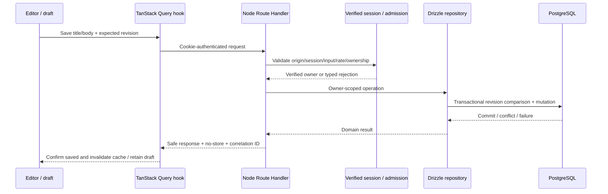

# Phase 01 — Full-Stack Foundation Execution Plan

**Status:** ✅ 1A; ✅ 1B auth code/local checks; ✅ 1B live Google/session/refresh/replay acceptance verified; ✅ 1C database/contracts/RLS verified locally and hosted; ✅ 1D HTTP/Pino/Redis implemented and locally verified; ✅ 1E note APIs locally verified; 1F–1H planned.
**Updated:** 2026-10-05 — 1E owner-scoped note APIs/reconciliation/local acceptance; stop before 1F.
**Goal:** Preserve the shared UI and deliver authenticated, server-authoritative note CRUD with validated APIs and observable, tested security boundaries.
**Architecture:** Next.js Node Route Handlers → verified Supabase identity → scoped Drizzle repositories → Supabase PostgreSQL. React uses temporary editor state and in-memory TanStack Query, with Zustand UI and nuqs URL state.
**Tech stack:** Existing React/Next.js/TypeScript/Tailwind/Radix; Zod/server-only configuration; Supabase auth SDK (1B code/live acceptance verified); PostgreSQL/Drizzle and shared note schemas (1C); Pino/Redis limits (1D); note API Zod (1E); planned TanStack Query, Zustand, nuqs and Swagger/Postman/generation; auth/note OpenAPI records exist.
**Spec:** [PRODUCT_SPEC](../../PRODUCT_SPEC.md) §§3–6, 14, 17–21.
**Standard:** [PLANS](../PLANS.md). Use the repository milestone/test-first execution workflow; implement only the requested milestone and stop. This plan does not authorize executing the whole phase or deploying infrastructure.

## 1. Goal

A Google-authenticated user can create/list/read/edit/rename/soft-delete server notes, reload and fetch the committed data, and access the same workspace on another device. Ownership/RLS prevent another user's access. Saved feedback requires confirmed PostgreSQL commit; stale edits produce a recoverable revision conflict. No durable offline notes or E2EE vault.

## 2. Current state

Before 1A, inspection on 2026-10-03 found: Next.js static export, strict TypeScript, Tailwind semantic tokens, Radix UI primitives, controlled MindMora specimens, session theme and `/dev/design-system`; existing package/lock files, Vitest/Playwright, static preview script and GitHub Actions UI checks. No Git repository was present in the earlier inspection; inspect again before any requested checkpoint.

Before 1A, no backend/auth/database/Drizzle/Zod/Pino/Redis integration, note feature, query/UI/URL providers, Swagger/Postman contract, Storage, queue or worker existed. Historical UI validation is in [design-system plan](design-system.md), not backend evidence. Existing `SaveStatus` still says “Saved on this device” and has a local-commit comment; `SyncStatus` has historical local-file wording. These are specimen labels scheduled for adaptation in 1G, not server-persistence evidence. That earlier docs revision left source/configuration static. Milestone 1A now runs Next Node build/preview, with Zod/server-only config and runtime test tooling; existing UI source is preserved. Continue tooling migration deliberately; do not re-scaffold shared components or assume proposed modules exist.

## 3. Scope

Runtime Node Next.js; configuration and server-only boundaries; Google/Supabase server-session flow; minimal profiles/notes schema/migrations and effective owner/RLS queries; validated CRUD API; redacted Pino and Redis admission checks; typed API errors; responsive protected workspace; TanStack Query memory cache, Zustand UI, nuqs note selection; OpenAPI/Swagger/generated Postman; unit/integration/browser checks, runtime dev/CI documentation and optional Docker verification.

Acceptance requires applicable SEC-01–08 evidence. Foundation functionality is local/development verification; hosted sensitive-data readiness separately requires actual HTTPS, provider encryption/backup and quota evidence. Do not mark production requirements satisfied by mocks.

## 4. Out of scope

CodeMirror/preview/autosave, links/search/folders, graph/canvas/tasks, file uploads/exports, BullMQ/worker/outbox, AI, plugins, PWA, payment provider, production deploy and Nginx configuration before host selection. Private Storage and BullMQ are Phase 4 targets, not reasons to pre-create empty services now.

No Dexie/IndexedDB knowledge, persistent browser caches, offline replay, Drive synchronization, E2EE/passphrase/recovery keys, MinIO, Aiven/Neon/second production DB. Use textarea and explicit Save. Public showcase remains sample-only; authenticated product screens reuse its components.

## 5. Architecture and global constraints

- Strict types, Zod at external boundaries; server-only database/Redis/logging/auth credentials.
- Supabase Auth manages identity; backend validates session/refresh/revocation and uses protected cookies with CSRF/origin checks. Resolve/test the exact supported backend-only cookie flow in 1B; stock browser SDK token persistence is not the target.
- Drizzle repositories use owner predicates, revision checks and transactions. Use a least-privilege request role with effective RLS and transaction-local verified claims; prove real role behavior rather than assuming policies constrain database-owner credentials.
- PostgreSQL owns notes/settings; query owns memory server-cache; UI store owns UI; URL owns note selection; editor owns draft. No persistent browser private data. Private responses bypass browser/Next/edge/ingress caches.
- Confirm commit before saved. Re-fetch uncertain outcomes; preserve drafts/conflicts. Clear private memory and stale async work on logout/account switch.
- Preserve semantic UI/accessibility/reduced-motion contracts. New workspace/auth screens require a design document before UI implementation.
- Free-tier target and service terms checked at exact dependency/resource introduction; no paid/deployment action from this plan. Conventional commits only when requested, without AI attribution.

## 6. Data flow

Google sign-in: start → code/PKCE/state exchange via Supabase/Google → backend callback → protected app-session cookie → safe `/session` projection. Logout clears provider/application session and browser cache, with no late response restoring private content. Normal CRUD has no queue dependency.

## 7. Phase file inventory

The 1A–1D runtime/auth/database/HTTP/admission/logging entries are implemented; later entries are proposed paths, not an implemented file map. Colocate feature code and meaningful tests.

| Create / modify | Responsibility | Milestone |
|---|---|---|
| `next.config.ts`, `package.json`, `package-lock.json` (modify) | Remove static-only target when backend starts; runtime scripts/dependencies | 1A and each relevant install |
| `scripts/preview.mjs`, `playwright.config.ts`, `.github/workflows/quality.yml` (modify) | Migrate static-only assumptions while preserving showcase coverage | 1A/1H |
| `.env.example`, `.gitignore` (inspect/modify) | Placeholders only, ignore real secrets/generated output, retain Markdown docs | 1A |
| `src/server/config.ts`, `src/server/config.test.ts` | Validated env config, server-only import boundary, safe config failures | 1A |
| `src/server/auth/provider.ts`, `session.ts`, `routes.ts`, `config.test.ts`, `routes.test.ts` | Provider exchange and backend cookie/session verification, refresh/logout and safe projection | 1B |
| `src/app/api/auth/start/route.ts`, `callback/route.ts`, `logout/route.ts`, `session/route.ts` under `src/app/api/auth/` | Supported Google flow and safe auth endpoints | 1B |
| `src/features/account/types.ts`, `src/features/account/api.ts` | Safe user-facing auth shapes and typed client access | 1B/1F |
| `src/server/db/client.ts`, `schema.ts`, `user-context.ts`, `drizzle.config.ts` | Bounded connections, minimal schemas and effective scoped RLS role/claims | 1C |
| `supabase/migrations/0000_profiles_notes.sql` | Versioned reviewed schema and owner RLS; reconcile actual generator numbering | 1C |
| `src/features/notes/types.ts`, `validation.ts`, `validation.test.ts` | Shared bounded note schemas and domain/API types | 1C |
| `src/server/http/errors.ts`, `responses.ts`, `csrf.ts`, `body.ts` and tests | Error envelope, private no-store responses, origin/CSRF rejection | 1D |
| `src/server/logging/logger.ts`, `logger.test.ts` | Pino safe fields and redaction | 1D |
| `src/server/rate-limit/client.ts`, `limiter.ts`, `limiter.test.ts` | Redis counter/window policy and outage behavior | 1D |
| `src/server/notes/repository.ts`, `service.ts` | Owner predicates, transaction/revision rules and public domain errors | 1E |
| `src/app/api/notes/route.ts`, `src/app/api/notes/[id]/route.ts` | Authenticated list/create/detail/update/delete | 1E |
| `tests/e2e/auth.spec.ts`, `tests/integration/rls.test.ts` (implemented); `tests/integration/notes-api.test.ts`, `rate-limit.test.ts` (planned) | Actual HTTP/session/DB/Redis isolation and failures | 1B–1E |
| `docs/design/phase-01-foundation.md` | Accessible auth/workspace/loading/conflict design contract | 1F before UI edits |
| `src/app/providers.tsx`, `src/lib/query-client/provider.tsx`, `src/lib/nuqs/provider.tsx` | Stable query/URL/session provider composition | 1F |
| `src/lib/api/client.ts`, `src/features/notes/api.ts`, `hooks.ts`, `use-note-selection.ts` | Safe validated API responses, scoped cache/mutations/URL selection | 1F/1G |
| `src/stores/ui-store.ts` | Transient layout/dialog state, no persistence middleware | 1F |
| `src/features/account/components/SignInGate.tsx`, `src/components/workspace/WorkspaceShell.tsx` | Safe auth/protected responsive UI, shared components | 1F |
| `src/features/notes/components/NoteList.tsx`, `NoteEditor.tsx`, `NotesWorkspace.tsx` | Bounded list, draft/save/delete/conflict states | 1G |
| `src/app/workspace/page.tsx` | Compose protected workspace with query URL selection | 1G |
| `src/components/mindmora/index.tsx` (modify), related showcase/tests/docs | Replace historical device-save/local-sync wording for server-save and refresh/job contracts | 1G |
| `tests/e2e/foundation.spec.ts`, `security.spec.ts` | Real auth/note flow, cache/logout/conflict/accessibility | 1G/1H |
| `docs/api/openapi.json`, `docs/api/mindmora.postman_collection.json`, `scripts/generate-api-docs.mjs` | Versioned generated contract, collection and drift checks | 1H |
| `src/app/dev/api-docs/page.tsx` | Swagger UI with safe production exposure policy | 1H |
| `Dockerfile`, `docker-compose.yml`, `.dockerignore` | Optional reproducible runtime/dev dependencies; no production second database | 1H |

Unit test paths otherwise colocated with their module. Update affected docs/file map/learning/phase record and this plan after every milestone. Do not populate the proposed source map until code exists.

## 8. Proposed contracts

- **Note:** `id`, verified `userId`, `title`, Markdown `content`, ISO UTC `createdAt`/`updatedAt`, integer `revision`, nullable `deletedAt`. Client never assigns owner/timestamps/revision. Phase 1 supports create/read/list/update/rename/soft-delete; restore/history awaits its phase.
- **Inputs:** create title/content bounded by documented limits; update allowed fields plus expected revision; delete requires expected revision; list cursor/limit validated and bounded. Unknown ownership/plan fields rejected. Choose/document title/body/limit bounds in 1C tests before exposing the API.
- **Session projection:** safe user ID/display fields only, no credential/provider token. API identity comes from validated cookie lifecycle, not this client projection.
- **Success:** validated domain shape with no private infrastructure details. Create 201; read/list/update 200; soft-delete documented 200 or 204 consistently with contract.
- **Errors:** stable code/message/correlation ID plus safe field errors/retry guidance; distinguish invalid input (400), unauthenticated (401), forbidden feature (403), inaccessible/missing (404), stale revision (409), throttled (429) and unavailable dependency (503). Internal SQL/credentials never serialized.
- **Repository interface:** operations take verified server context and validated input. Domain outcomes include not-found, revision-conflict, validation and persistence-unavailable. Exact signatures/schema are finalized in 1C/1E and cannot be independently invented by hooks.
- **Idempotency:** create uses a user-scoped client operation ID or equivalent server idempotency contract to reconcile uncertain retries; enforce uniqueness with ownership and test replay, rather than relying on UI button disabling. Finalize in 1E.

No local crypto envelopes, vault tables, Dexie version migrations or sync tombstones. Supabase Auth owns credentials; app database stores profile/knowledge. Server backup/restore plan is infrastructure, not passphrase recovery.

## 9. Milestones

### 1A — Runtime and server boundary

**Goal:** Node-compatible Next.js runtime without breaking the existing showcase.
**Files:** modify Next config/scripts/preview/Playwright/CI assumptions as needed; add validated `src/server/config.ts`, placeholders and server-only boundary tests. Preserve existing UI/tokens.
**Flow:** runtime server serves showcase; no real note/auth services yet.
**Steps:** inspect current scripts; verify exact Next/Node compatibility and new config dependency; write config secret/missing-env/client-import behavior tests and observe intended failures; migrate runtime build/preview; pass tests; verify `/dev/design-system` still loads and no required empty knowledge scaffold exists.
**Tests:** no privileged values in rendered/client output; missing server config fails safely; runtime showcase behavior/accessibility survives. Do not require all future cloud env variables merely to view the public specimen.
**Concepts/docs:** static files versus Node server; `server-only`; runtime configuration. Update README/ARCHITECTURE/FILE_MAP/LEARNING and tooling evidence.
**Stop:** no auth or note implementation beyond this milestone. Existing historical static checks stay historical.

### 1B — Google sign-in and backend-owned sessions

**Goal:** supported Google/Supabase code flow with safe session/refresh/logout behavior.
**Files:** server session helpers/tests, auth Route Handlers, safe account types/API and auth integration tests. Server UI screens are still planned for 1F; initial routes can be exercised through fixtures.
**Flow:** start → provider → callback → protected session cookie → verified `/session` → logout.
**Steps:** read official provider lifecycle/SSR cookie guidance; record exact backend-only cookie/refresh and redirect policy before code; failing tests for valid/invalid callback, expired/revoked session, refresh failure, foreign origin/logout and token-free projection; implement minimal helpers/routes; run disposable-user integration. Keep exposed auth routes non-production-ready until 1D admission controls are integrated.
**Tests:** PKCE/state misuse, redirect abuse, missing/expired/revoked cookies, cookie attributes, server verification and no browser token storage. Identity checks cannot trust a cached user projection. If the chosen supported flow can't meet protected-cookie requirements, resolve the design explicitly in docs before claiming completion.
**Concepts/docs:** identity versus authorization; cookies/CSRF/refresh; no custom passwords or provider token tables. Update Supabase/security docs and actual SEC-01/05 evidence.
**Stop:** no private note schema/CRUD yet.

### 1C — Note schemas, database and effective RLS

**Goal:** minimal profiles/notes with validated contracts and actual database owner isolation.
**Files:** shared types/Zod validation tests; Drizzle client/schema/config; user-context; versioned reviewed SQL migration; real `rls.test.ts`.
**Flow:** validated server identity → transaction-local least-privilege role/claim → owner-scoped database operation.
**Steps:** verify Drizzle/Supabase database role/pooler capabilities and selected versions; define bounds and migration; fail tests for two-user access/forged owner and pooled-claim leak; implement schema/RLS/context; run migration on disposable database; exercise actual driver. Migrations and RLS SQL are reviewed, not destructive production reset scripts.
**Tests:** user A cannot read/write user B; anonymous denied; actual request role can't bypass RLS; relation/owner policy works; migration applies to clean dev DB without secrets logged; timestamps/revision constraints and bounded payload validation.
**Concepts/docs:** Postgres schema/index/migration; parameterized ORM; RLS and role bypass; connection pooling. Update full-stack/state/security docs, model contracts and FILE_MAP.
**Stop:** storage/files and later knowledge tables remain uncreated.

### 1D — HTTP security, Redis admission and Pino

**Goal:** safe reusable request/error/logging/limiting boundary before CRUD routes expose real notes.
**Files:** HTTP errors/responses/CSRF; logging; rate-limit client/limiter; unit/integration tests; config extends actual needed Redis keys.
**Flow:** origin/session/validated request → trustworthy identity/IP budget → operation → safe error/log metadata.
**Steps:** document configured rate windows/budgets/body limits and proxy header trust; failing tests for malformed/body/CSRF/session rejection, 429/Retry-After and marker leaks; implement Pino redaction and Redis counters; connect auth routes to admission; test provider/Redis outage policy and counter expiry. No real credentials in fixtures.
**Tests:** request/response/error notes/tokens/cookies/keys/signed URLs never serialized; private response no-store; forged forwarded IP doesn't bypass budgets; auth/expensive admission fails closed on Redis outage; basic CRUD conservative fallback doesn't skip auth and advertises multi-instance limit constraints. Verify Redis TLS/provider access/configuration in deployment evidence, not assumed from passing local tests.
**Concepts/docs:** runtime validation isn't authorization; structured logs versus telemetry; counters/TTL and provider command budgets. Update services/security/budget docs with actual settings and SEC-05/07 evidence.
**Stop:** no queues/worker, no Redis plaintext knowledge cache or general session cache.

### 1E — Authenticated note API and repositories

**Goal:** durable owner-scoped CRUD with revision-safe writes and public typed errors.
**Files:** server notes repository/service/tests; list/detail/mutation routes; notes API integration tests; minimal endpoint contract records.
**Flow:** protected route → verified owner/validated input → Drizzle transaction → normalized response.
**Steps:** write behavior tests for create/list/detail/update/rename/soft-delete, two-user rejection, stale revision and idempotent replay; show intended failures; implement minimal repository/service/routes; test actual DB; align response/error contracts before hooks consume them. Apply no-store, Pino/admission and CSRF wrappers to every route.
**Tests:** two updates using one revision cannot both overwrite; soft-deleted/inaccessible notes unavailable; bounded pages/cursors; malformed fields; forged owner; DB outage leaves no false success; timeout-after-commit reconciliation does not duplicate create; race with deletion safe. Queues absent from ordinary save path.
**Concepts/docs:** transaction, optimistic concurrency, idempotency and uncertain outcomes. Add actual notes feature doc using spec §19.3; update API/security/model docs/file map/learning.
**Stop:** no autosave/CodeMirror or worker enqueue.

### 1F — Protected shell and memory-state boundaries

**Goal:** accessible signed-in shell using single-owner query/UI/URL state.
**Files:** first create `docs/design/phase-01-foundation.md`; then providers, API client, account gate, shell, UI store, URL selection/query hooks/tests. Modify root/layout composition only as needed.
**Flow:** safe session projection → signed-in query scope → memory note cache; nuqs ID selects; Zustand controls layout; shared theme remains consistent.
**Steps:** document screen states/responsive/focus behavior; fail tests for loading/logged-out/account switch/missing note states; install vetted query/Zustand/nuqs versions; implement stable query/client adapter composition with no persistence; test logout cancels/clears and invalidates stale callbacks.
**Tests:** no duplicate active ID in Zustand; no credential state; inaccessible/deleted URL states; one account's notes never render for another; late fetch after logout can't restore private UI; no private persistent browser entries or server shared cache. Public showcase still independent sample state.
**Concepts/docs:** provider lifetime, query keys/cache invalidation, URL state and auth rendering. Update state/design/security/file map/learning with actual components.
**Stop:** shell/query boundary only; full editing UI is 1G.

### 1G — CRUD workspace and conflicts

**Goal:** usable notes list/editor with explicit Save and recoverable errors.
**Files:** notes components/hooks/API client; `/workspace`; existing `src/components/mindmora/index.tsx` save/status labels and comments plus affected showcase tests/docs; component tests and foundation/security browser tests; update 1F design doc.
**Flow:** choose note URL → fetch → memory draft → save → confirmed DB commit → query invalidation/saved indicator.
**Steps:** red tests for empty/list/create/edit/rename/delete/failed save/conflict; compose existing shared components; preserve unsaved draft on refetch/outage; add confirmation for soft-delete; use revision contract and idempotency; update existing SaveStatus device/local-commit text to server-confirmed saved wording, and stop using old Drive/local-file SyncStatus for product job/refresh state; preserve controlled specimen behavior; browser-test real API with disposable users.
**Tests:** save/reload/server read; another device/context fetch; direct foreign note ID blocked; account switch cleanup; offline same-tab draft clearly unsaved; DB failure/uncertain response reconciliation; concurrent tabs conflict without draft loss; keyboard/focus/labels/mobile/reduced motion. No persistent offline save claim.
**Concepts/docs:** editor versus cached server record, mutation lifecycle and conflict UX. Record actual CRUD/security outcomes; update notes/design/file map/learning/phase record.
**Stop:** do not start Phase 2 or add background jobs.

### 1H — API contract, integration verification and handoff

**Goal:** inspectable documented API and consistent runtime verification.
**Files:** actual OpenAPI document/compatible Zod generation, Swagger UI route and generated Postman collection; drift/integration checks; runtime CI/tests/scripts; optional Docker dev verification and README. No Nginx deployment files before topology decision.
**Steps:** choose vetted Zod-to-OpenAPI/Swagger tooling; failing contract tests for real route mismatch; generate/review schemas/responses/auth/cursors/revisions/errors; generate secret-free collection; verify disposable-user requests and safe docs exposure; run required runtime checks/integration/E2E; document deployment requirements and unverified production gates honestly.
**Tests:** contract matches actual methods/payloads/statuses; collection contains no marker note/credentials; Swagger requests respect cookie/CSRF flow; runtime showcase and workspace pass; effective DB roles and Redis tests run; Docker if added starts reproducibly without secret values in image/build/client. Keep integration skips visible, never claim passing if a live dependency was unavailable.
**Concepts/docs:** schema/contract drift, API testing, runtime CI versus production readiness, free-tier limits. Update all affected docs and milestone progress. Record only observed results.
**Stop:** Phase 1 review; next Phase 2 plan only when requested. No cloud deploy or Phase 4 worker automatically.

## 10. Review focus and edge cases

| Condition | Expected behavior | Owner |
|---|---|---|
| Stale/revoked cookie or OAuth replay | Reject safely, no note access; no token in client/error | 1B/1D |
| Privileged/pool reused DB connection | Effective owner isolation, no prior-user claims | 1C/1E |
| Valid JSON referencing another user's record | Rejected despite schema validity | 1C/1E/1G |
| Commit succeeds but response lost | Reconcile with scoped idempotency/refetch; no duplicate/false failure | 1E/1G |
| Refetch while editing | Preserve unsaved draft, revision conflict explicit | 1F/1G |
| Logout/switch during request | Cancel and generation-invalidate; no stale private render | 1F/1G |
| Offline/tab close/refresh | Existing draft memory only; no saved/offline durability claim | 1G |
| Redis quota/outage | Defined auth fail-closed/basic fallback; session/ownership still required | 1D |
| Missing/deleted URL ID | Safe not-found UI, no account enumeration | 1F/1G |
| Pino/provider exceptions/contract examples | No note content/credential marker leak | 1D/1H |
| Pause/backup/hosting limitations | Report actual unavailable dependencies/limits; no uptime guarantee | 1H/deployment |

## 11. Test and verification matrix

| Layer | Required evidence |
|---|---|
| Unit | Zod bounds, config, safe error/log serializer, rate rules, session adapters |
| Component | Signed-in/loading/error UI, URL selection, draft/refetch/conflict, memory cleanup |
| Integration | Real provider test auth where needed; two-user DB/RLS via actual driver; migrations/revisions/idempotency; Redis expiry/outage; HTTP/CSRF/no-store |
| E2E | Disposable-user auth/CRUD/reload/cross-user/logout/late-response/conflict; persistent storage scans; accessibility/responsive showcase and workspace |
| Contract | OpenAPI route/response checks, generated Postman smoke requests/secret scan |
| Deployment | TLS, at-rest/backup/provider settings, no secret leakage, proxy IP trust, quotas and runtime availability; not automatically complete in development |

Required application commands: `npm run lint`, `npm run typecheck`, `npm run test`, `npm run build`; relevant Playwright and new non-watch integration/contract scripts added when their tooling exists. Per milestone: observe meaningful behavior-test failure, implement minimal behavior, pass targeted tests, refactor, run required checks, record exact outputs. Do not claim a mocked auth or an integration skip establishes real RLS/security.

## 12. Documentation updates

Each implementation updates this plan, Phase 1 record, FILE_MAP/LEARNING and affected architecture/integration/design/feature docs. README scripts track current tooling, not future targets. ADRs record actual implementation changes. UI showcase historical results remain distinct. Later phase plans are created at phase start; roadmap is enough today.

## 13. Decisions and open deployment choices

Accepted ADR-016/018/019; ADR-001/002/003/017 superseded. Google/Supabase server-managed full-stack, no E2EE/browser private persistence, Pino/Zod/Redis limits and documented APIs precede note completion. BullMQ/private Storage/worker are Phase 4; Nginx conditional on self-hosting. Exact host/provider/runtime, session-cookie integration, RLS request-role mechanics and limits must be verified in their assigned milestones. These are explicit planned checks, not silent assumptions. No always-on/free-host guarantee or paid resource authorization.

## 14. Progress

- [x] Inspect existing UI and documentation; preserve source evidence.
- [x] Update requirements/architecture/security/ADRs and full-stack milestone plan by user request.
- [x] 1A Runtime migration.
- [x] 1B Google/server sessions — code/local checks and live Google/session/refresh/reuse/replay/isolation acceptance verified; natural JWT expiry not awaited.
- [x] 1C Database/Zod/RLS — local + hosted actual-driver acceptance and review verified.
- [x] 1D HTTP security/Pino/Redis limits — local counter/expiry/outage/recovery, browser and regression checks; hosted deployment evidence pending.
- [x] 1E Notes API/repositories (local verification; hosted migration pending).
- [ ] 1F Protected shell/state.
- [ ] 1G CRUD/conflict UI.
- [ ] 1H Contract/runtime verification/documentation handoff.
- [ ] Applicable SEC-01–08 proven; separate deployment evidence recorded where applicable.

The earlier docs-only revision completed no implementation milestone. 1A was implemented and reviewed. 1B code/local/live acceptance is verified. User subsequently authorized 1C and then only 1D; their execution records follow below. Stop before 1E.

### Documentation revision verification — 2026-10-03

Checked 30 Markdown documents and 124 local links: no missing targets or unbalanced fences. Product specification retains 22 numbered sections and a 14-phase roadmap; agreed stack/features and exclusions were checked. Non-Markdown files matched the pre-edit SHA-256 baseline, with no added non-Markdown files. No application lint/typecheck/unit/E2E/build ran for this docs-only revision; source, dependency lockfile, static runtime config and CI remain unchanged. No Git checkpoint created because the directory is not a Git repository.

### Milestone 1A execution — 2026-10-03

Authorized scope: runtime and server boundary only; stop before 1B, no commit/deploy.
Inspection: Next 16.3.8 static export, preview serves `out/`, Node 22.22.3/npm 10.9.8,
existing six unit and nine showcase browser tests. No Git repository present.

Concrete files: `next.config.ts`, `package.json`/lock, `scripts/preview.mjs`,
`playwright.config.ts`, `.github/workflows/quality.yml`, `.env.example`,
`src/server/config.ts`/`config.test.ts`, `scripts/test-server-boundary.mjs`,
`tests/e2e/runtime.spec.ts`, and affected README/architecture/file-map/learning/phase/dependency docs.
No design or screen changes; no auth/database/Redis/queue scaffold.

Configuration contract: lazy `getServerConfig` validates only `APP_ORIGIN` with Zod;
HTTP is restricted to loopback local development/preview, HTTPS required for other hosts; no credentials,
query, fragment or non-root path. Fixed errors never serialize raw environment values or Zod issues.
No cloud credentials required to build/view public specimens. Add service config only when
its milestone introduces a consumer. Test env is injected; production defaults to `process.env`.

Test-first sequence: configuration failures/safe projection → minimal validation;
isolated real Next client-import build must reject config → `server-only` marker;
production preview/start behavior and marker-free HTTP/browser assets → runtime migration.
An isolated test-only dynamic Route Handler proves Node runtime support without adding an app API.
Boundary tooling uses disposable files and never edits production pages. Preserve UI/spec hashes.
Validation: lint, typecheck, test, build, boundary build checks, Playwright showcase/runtime,
dependency audit, Markdown links and unchanged-source check. Exact observations follow.

1A decisions/outcomes: exact Zod 4.6.5 and server-only 0.0.1 (MIT) installed;
Next 16.3.8 requires Node >=20.9.0, actual Node 22.22.3 meets project >=22.12.0.
No service/account/payment required. APP_ORIGIN is the only configured field;
service credentials are deferred. No page calls config, so no cloud setup is required.
No production route added; dynamic Node verification lives only in a disposable fixture.
Preview wraps the supported Next CLI and propagates signals/exit status. Playwright
rejects reusing an unrelated server, preserving meaningful marker/runtime checks.

RED evidence: config skeleton yielded 11 failed/5 passed (unsafe/missing origins accepted,
root slash not normalized); a corrected, tool-complete client-import fixture built successfully
without server-only and failed its assertion; the static preview returned plain 404 and failed
HTML 404 expectations (1 failed/1 passed runtime tests). Earlier missing NODE_ENV input type
and sandbox port errors were not counted as RED. Refinement initially threw raw `Invalid URL`
for two malformed inputs; Zod piping now short-circuits before URL-based refinements.
GREEN: 16/16 config tests; original six component tests preserved; actual Next client import
rejected and positive Node fixture compiled/responded using config changed after build.

Verification on 2026-10-03:
- `npm run lint`: exit 0, style contract passed.
- `npm run typecheck`: exit 0, strict tsc passed.
- `npm run test`: exit 0, 2 files / 22 tests passed.
- `SUPABASE_SERVICE_ROLE_KEY=mindmora-private-service-key-marker DATABASE_URL=postgresql://mindmora-private-database-marker npm run build`: exit 0;
  `/`, `/_not-found`, `/dev/design-system` prerendered in a Node-compatible `.next` build.
- `npm run test:boundary`: exit 0; both real Next compiler and request-time Node checks passed,
  using copied actual next.config.ts. Test fixture removed; production pages untouched.
- `npm audit --audit-level=high --fetch-retries=0 --fetch-timeout=15000`: exit 0, 0 vulnerabilities.
- Client build scan: 22 `.next/static` files, 0 fake credential marker leaks.
- Existing `src` files, PRODUCT_SPEC, AGENTS and tsconfig matched the SHA-256 baseline;
  only new server/config files exist, no app Route Handler/auth/database scaffold.

- `npm run test:e2e` against the final marker-injected production build: exit 0, 11/11 Chromium tests passed (7.7s); original nine showcase plus runtime404 and public HTML/loaded JS marker exclusion. Cosmetic NO_COLOR/FORCE_COLOR warnings only.
- Python Markdown validation: 30 documents, 125 local file links, 0 missing targets, 0 unbalanced fences. Changed documentation scope/status reviewed; existing spec/UI hash check passed.

All applicable 1A checks complete. Stop for user review; no 1B authorization.
Read-only independent review: no critical/important correctness issues. Actual Next config
was added to the fixture following its coverage observation. Minor deferred: build/route-fetch/
shutdown waits in the disposable boundary script lack their own deadlines; CI-level cancellation
may be needed if Next hangs. Loopback HTTP also works in local production preview by design;
no production-mode TLS guarantee. Safe config errors are not HTTP API error handling (1D).
Auth/RLS/private response security/Redis/services/TLS/provider readiness remain unverified.
Git repository absent; no commit, deploy or 1B work performed.

### Milestone 1B execution — 2026-10-04

Authorized: Google/Supabase backend sessions only; no 1C schema/database work, UI screen,
commit or deployment. 1A source inspected; no local Supabase project configuration present.
Uses exact @supabase/auth-js 2.117.2 (MIT, Node >=22; workspace 22.22.3). No service-role key.
Supabase Free social OAuth available, 50k MAU, 2 active projects, pauses after one week;
no project provision/payment authorized. Live Google/provider evidence requires user setup.

Concrete files: `src/server/auth/provider.ts`, `session.ts`, `routes.ts` and colocated tests;
`src/app/api/auth/{start,callback,session,logout}/route.ts`; account `types.ts`/`api.ts`;
config/auth config tests, .env.example, package/lock, auth E2E/integration tooling;
ADR-020 and affected README/architecture/auth/security/dependency/file-map/learning/phase docs.

Contract before code: per-request auth-only SDK; PKCE state kept only in short-lived HttpOnly
cookie; fixed configured-origin callback and post-login destination `/`; no user redirect input.
Start/logout POST require exact configured Origin; cross-site requests denied. Callback is GET
and relies on browser-bound PKCE rather than a cross-provider Origin header. SDK generates/verifies
PKCE; Supabase owns OAuth provider state. Application state checks/expiry protect the pending
flow. Host-only HttpOnly SameSite=Lax cookies; Secure for HTTPS, local loopback HTTP exemption;
HTTPS cookie names use __Host- prefix. Persist only Supabase app access/refresh credentials,
never Google provider tokens; no browser SDK/localStorage/sessionStorage/custom token DB.
Verify each request online with getUser; expired access refreshes server-side, then verifies user.
Failures emit fixed responses without raw provider errors. No-store all auth outcomes, including
redirects/errors/cookie refresh. Logout revokes current provider session and clears local cookies;
provider outage must be reported, never falsely claimed as successful global revocation.
No automatic browser cache/draft state to clear exists yet (1F/1G).

Test-first: actual SDK with fake HTTP transport fixtures; callback PKCE mismatch/replay/expiry,
redirect misuse, missing/expired/revoked user and refresh failure, cookie attributes and token-free
projection, logout/origin/outage; real Next HTTP/browser tests for routing/cookies/persistence.
Live Supabase/Google disposable-user integration remains pending if no provider is available;
fixture tests establish application behavior only. SEC-01/05 provider acceptance not falsely complete.
Rate limits/logging are 1D; auth routes are development verification, not production-ready admission.

1B implementation decisions: callback is fixed APP_ORIGIN `/api/auth/callback?state=<nonce>`;
configure only that host/path with state-query wildcard in Supabase. SDK flowId is passed to
exchange from protected pending cookie, not appended to callback query. Single active sign-in
flow per browser; start replaces pending cookie. Seven-day app cookie, ten-minute pending,
30-second refresh margin; online getUser always verifies identity. HTTP methods and no-store
apply also to unsupported method errors (Allow header). Session size capped at 3800 encoded
characters; oversized sessions fail safely, no silent truncation/chunking implementation.
A raw cookie expiry hint cannot grant access; provider verification is the identity authority.

Actual files added/updated match the 1B scope. An auth-only OpenAPI contract was added as
API documentation required by AGENTS; safe projection schema derived from implemented Zod.
No Swagger/Postman/generator runtime or 1H feature introduced. ADR-020 records cookie design.
User requested keys in `.env`: local ignored file created with placeholders, then user filled
URL/key; no values printed/tracked. Google credentials remain provider dashboard configuration.

Read-only live check on 2026-10-04: validated local config, `/auth/v1/settings` returned 200,
`external.google` false. No live Google login/callback/revocation/refresh/reuse proven; acceptance
remains pending user provider setup. A Git repository now exists, initial 1A commit 497e628;
current work is uncommitted. No Git history/branch changes or deploy/cloud provisioning performed.

RED evidence: config scaffold 6 failures; route scaffold 15 failures against actual SDK contract;
browser HTTP tests 2 failures before auth Route Handlers (missing routes); client helper scaffold
3 failures. A non-ASCII state regression exposed timingSafeEqual byte-length RangeError, fixed
by base64url state validation. Unsupported-method regression exposed missing Allow header,
fixed with non-cacheable 405/Allow. All then green. Initial browser request used a separate test
cookie jar, corrected to context.request; this was a test setup failure, not an application bug.

Independent read-only review found no blocking code defect; important fixture gap fixed:
independent session IDs and scope-aware revocation prove logout A preserves B. Added coverage
for duplicate/oversized cookies, oversized provider tokens, malformed JSON/transport errors with
safe output/console marker checks, concurrent refresh and revoked late-cookie replay. SDK fixture
models provider reuse behavior only; real timing/revocation policy remains pending live checks.
Fixture type inference initially narrowed randomUUID input too far; explicit string typing fixed it.

Fresh final local verification on 2026-10-04:

| Command/check | Observed result |
|---|---|
| `npm run lint` | Exit 0; ESLint and semantic style contract passed |
| `npm run typecheck` | Exit 0 |
| `npm run test` | Exit 0; 54/54 tests across 5 files (6.58s) |
| `npm run build` | Exit 0; public routes prerendered, four auth routes dynamic Node handlers |
| `npm run test:e2e` | Exit 0; 11/11 Chromium showcase/runtime tests (5.2s) |
| `npm run test:auth` | Exit 0; 2/2 Chromium/real Next auth tests with disposable provider (3.2s) |
| `npm run test:boundary` | Exit 0; real Next client import rejection and request-time server-config probes |
| `npm audit --audit-level=high --fetch-retries=0 --fetch-timeout=15000` | Exit 0; 0 vulnerabilities |
| Final client configuration scan | 26 `.next/static` files; both configured Supabase values checked; 0 leaks |
| SHA-256 baseline | Existing UI/design/spec/AGENTS unchanged; only existing `src/server/config.ts` changed as expected |
| `git diff --check` / `git check-ignore .env` | Exit 0 / `.env` confirmed ignored |
| Documentation validation | 31 Markdown documents, 148 local file links, 0 missing targets/unbalanced fences; OpenAPI JSON parses as 3.1.0 with four auth paths |

Boundary/audit checks ran during this milestone before the final formatting-only pass;
application checks above were rerun after formatting. CI was updated but no hosted run observed.
Browser FORCE_COLOR/NO_COLOR warnings were cosmetic. Live Google/provider tests remain pending;
this is local application evidence, not production SEC-01/05 or database/RLS acceptance.

Stop for user review; do not start 1C. No commit or deployment.

User-requested setup follow-up — 2026-10-04: added empty GOOGLE_CLIENT_ID and
GOOGLE_CLIENT_SECRET placeholders to ignored `.env` and tracked `.env.example`, preserving
existing values. These are local setup references only; Supabase provider settings must receive
the credentials. No runtime code or later milestone change; live acceptance remains pending.
Validation: both placeholder names present, existing values preserved, `.env` ignored and
`git diff --check` passed. Application tests were not rerun for this configuration/docs-only edit.

Live-provider follow-up — 2026-10-04: after user setup, `/auth/v1/settings` returned
HTTP 200 with Google enabled. Fresh `npm run test:auth` exited 0: 2/2 fixture browser
tests passed (3.9s). Started local Next dev at APP_ORIGIN and used a disposable native
POST form; start → live Supabase → Google account sign-in page succeeded. No Google
credentials entered by the agent. User sign-in/consent and subsequent callback/session/
refresh/logout checks remain pending. Temporary form route removed after starting the
flow; local dev remains running for the callback. No application code change, commit,
deployment or 1C work. This supersedes the earlier disabled-provider status, not the
historical evidence. 1B live acceptance remains open.

Documentation/learning follow-up — 2026-10-04: current README/architecture/security/
auth/dependency/ADR/learning statuses now reflect Google enabled and the verified live
entry redirect. Earlier disabled-provider observations remain historical. Live acceptance
stays unchecked until completed account/session lifecycle checks. Added a concrete auth
reading workflow and clarified Google-to-Supabase versus Supabase-to-app callbacks and
Google env-reference fields. No 1C or runtime edits in this documentation pass.

Observed tooling side effect from the preceding live check: `next dev` appended its
version-specific instructions block to AGENTS.md. Retained the generated instructions;
no manual change to project policy, commit or deployment. The earlier SHA-256 claim of
unchanged AGENTS applies to the implementation checkpoint before that dev run.

Documentation-pass validation: 31 Markdown documents, 148 local file links, 0 missing
targets/unbalanced fences; source/config/dependency/env SHA-256 baseline unchanged;
`git diff --check` passed and `.env` remains ignored. Application checks were not rerun
for this docs-only pass; implementation and live-entry results above retain their dates.

Live callback/session/logout follow-up — 2026-10-04: user completed Google sign-in.
The same in-app browser displayed `/api/auth/session/` with only user id/email/displayName
(no token fields). A disposable same-origin form called POST `/api/auth/logout`: observed
HTTP 204. GET `/api/auth/session` from the same browser afterward returned HTTP 401,
error code `unauthenticated`. JSON-page navigation was blocked by the in-app browser after
logout; a native page button calling the same API confirmed the 401 safely. The temporary
verification route was removed. No personal profile values/tokens copied into tracked docs.

Live sign-in/callback/session and current-cookie logout are now verified. Live refresh/reuse,
expired access, revoked-token replay and independent-session provider checks remain pending;
fixture tests cover those application paths but do not replace live evidence. Keep 1B live
acceptance open for those checks; no 1C, commit or deployment. No lasting runtime code change.

Follow-up validation: 31 Markdown documents/148 local file links, 0 missing targets or
unbalanced fences; existing source/config/dependency/env hashes unchanged; temporary route
absent; `git diff --check` passed, `.env` ignored. No application suite rerun for this
removed-harness/evidence-only follow-up; live HTTP results are recorded above.

Live refresh/replay execution started — 2026-10-04, explicitly authorized by user.
Prepared temporary development-only `src/app/auth-check/route.ts`: loopback host/Origin
checks; credentials captured only in module server memory; UI displays status/pass-fail
without personal/token values. Intended checks: distinct provider session IDs, real provider
refresh triggered by aged expiry hint, immediate parent reuse/concurrent refresh, current-
session logout, original/refreshed credential replay, revoked refresh rejection, independent
session survival and cleanup. This route must be removed after the checks and must not be
committed/deployed. No production auth change or 1C work.

Live start probe returned 303 with pending cookie and configured Supabase redirect host.
Awaiting user Google login for session A, then a second independent login for session B.
No refresh/replay result claimed yet. Forced expiry hint exercises actual live refresh but
is not a test of waiting until natural access JWT expiry; report that limit explicitly.

Live 1B acceptance completed — 2026-10-04

Two Google logins in the same browser created distinct Supabase session IDs. The temporary
local harness retained A/B app credentials only in server memory and called the real Next
HTTP auth endpoints, which used the real Supabase provider. Browser UI displayed only
status/pass-fail, no personal values or tokens. Observed results: 13/13 PASS.

| Live check | Observed result |
|---|---|
| Distinct A/B provider session IDs | PASS; separate sessions of the same test user |
| Initial A session | 200 |
| Forced expiry hint → real provider refresh | 200; refreshed protected-cookie payload returned |
| Refresh rotation | Refresh credential changed |
| Immediate parent refresh reuse | 200 |
| Concurrent refresh from the same parent | Both requests 200 |
| Initial B session | 200 |
| Current-session logout A | 204 |
| Replay original A cookie after logout | 401 |
| Replay refreshed A cookie after logout | 401 |
| Revoked refresh attempt | 401 |
| B survives logout A | 200 |
| Cleanup logout B | 204 |

Captured credentials were cleared; browser app cookies cleared after cleanup; temporary
`src/app/auth-check/route.ts` removed. No lasting runtime code or credentials were added.
Natural access JWT expiry was not awaited: changing only the app expiry hint triggered the
actual provider refresh path. Immediate reuse/two concurrent calls prove these bounded
cases, not every reuse interval/load/provider configuration. Independent sessions used
one Google account, not a two-user database/RLS test. HTTPS/production ingress/admission/
logging evidence remains later milestones. Test-only canonical paths included trailing
slashes to avoid redirect normalization. The first native sign-in form was Origin-rejected
in the in-app browser; same-origin fetch-based temporary adapter preserved Origin checks
and forwarded the app's pending cookie/authorize URL. No auth protection was relaxed.

Milestone 1B code/local/live acceptance is complete. Earlier pending/disabled observations
above are historical checkpoints, superseded by this evidence. Stop for review; no 1C,
commit, deployment or paid resource. Updated current plan/README/architecture/security/auth/
ADR/file-map/learning statuses to match these observations.

Final live-check cleanup validation: `npm run typecheck` passed during the harness and
after removal. Initial post-removal typecheck found only a stale Next-generated type
import for the removed route; removed that specific generated cache file, rerun exited 0.
31 Markdown documents, 148 local file links, 0 missing targets/unbalanced fences;
existing source/config/dependency/env hashes unchanged; temporary route absent;
`git diff --check` passed and `.env` remains ignored. No full application suite rerun:
production source was unchanged; earlier implementation-suite results retain their dates.

### Milestone 1C execution — 2026-10-04

Authorized only schemas/database/RLS; stop before 1D, no commit/deploy. Inspected clean
1B commit 2c2fef3; no existing DB code. Work branch feature/phase-01-1c. User authorized
current Supabase project as disposable development verification; URL and CA supplied by user.
Docker runtime started for ephemeral PostgreSQL tests; no production second database.

Expected additions: notes types/validation/tests; db config/client/schema/user-context;
Drizzle config and reviewed SQL migration; migration/provision/test scripts and real RLS
integration; .env placeholders, exact package/lock and CI; ADR-021 and affected docs.

Design before code: public profiles (auth-user keyed display name/timestamps) and notes
(UUID, owner/profile FK, title, Markdown content, UTC timestamps, positive revision, soft
delete). Title trimmed/nonempty <=200 Unicode code points; content <=1 MiB UTF-8; list
limit 1..100 default20, cursor UTC time+UUID; strict inputs reject owner/plan/timestamps.
Request role mindmora_request is NOLOGIN/NOBYPASSRLS; runtime mindmora_app is NOINHERIT
with no direct table grants. Connection/login privilege checks reject admin connections.
Per transaction SET LOCAL role + verified claims, bounded timeouts; FORCE RLS and owner
policies. Profiles/auth-user and notes/profile FKs enforce relation integrity: project
model requirements take precedence over generic toolkit no-FK advice. Revisions/conflict
service operations are 1E; only schema constraints/contracts land now. No APIs/screens.

Pinned verified drizzle-orm0.45.3 Apache-2.0, drizzle-kit0.31.11 MIT, postgres3.4.9 Unlicense
(Node>=12); smoke/checks will prove Node22/strict TS compatibility. Supabase pooler requires
prepare:false; remote TLS verification required. ORM/tooling free; hosted quotas checked
on official pricing; no paid upgrade/provisioning. Initial install reports 4 moderate dev
tooling advisories; inspect and record mitigation rather than force-upgrade production.

1C test-first ledger: forged owner accepted → strict create schema (RED/GREEN);
empty/oversized note input accepted → Unicode title/UTF-8 body bounds (RED/GREEN);
NUL accepted and malformed credential escape threw URIError → fixed text/config boundary
(2 RED → 4 GREEN); empty patch accepted → changed-field rule (RED → 5 GREEN);
boolean list limit coerced → numeric/digit-only union (RED → 8 schema/config GREEN).
Real PostgreSQL profile insert failed without claims → SET LOCAL verified claims (RED →
1 GREEN); privileged runtime URL admitted → actual role/grant/pool-state guard (RED →
2 GREEN). Expanded actual-driver isolation/constraint/reuse tests: 7/7 local PASS.
Setup failures (Docker access, PostgreSQL format parameter type, TLS CA filename) were
infrastructure diagnostics, not counted as TDD RED. Hosted migration now applied using
user-provided Supabase CA with certificate verification enabled; app provisioning and
hosted checks underway. The user supplied MIGRATION_DATABASE_URL and CA separately;
no credentials were printed. esbuild 0.28.2 global dev-tool override resolves the kit
transitive advisory; fresh install audit reports 0 vulnerabilities, generator drift check
reports no schema changes. Manual migration role/grant/FORCE clauses intentionally remain
outside generated snapshot; future migrations must review both.

Final review (fresh reviewer): two P2 provisioning findings fixed. Direct env write had
truncated the original and kept pre-existing permissions; regression observed RED, then
private fsynced pending file + unchanged-env check + atomic publish gave GREEN. Generated
login/membership now share a transaction; actual local missing-role GRANT test confirms
rollback removes the login. A pending ignored credential file survives failure/interruption
for manual verified recovery, without implicit rotation. Existing .env chmod0600. Profile
NUL input also observed RED then rejected. Reviewer Unicode-size concern did not reproduce:
pinned Zod counts code points; 200-emoji regression passed. Follow-up review clean, targeted
10/10; no source edits by reviewer. SQL/schema migration hash remains as applied.

Hosted first 6/7 result was a probe issue: request role lacks direct Auth schema USAGE
(Supabase migration login cannot effectively grant it). RLS's pre-resolved auth.uid policy
reference still enforces two-user ownership. Direct identity probe now reads LOCAL claims;
actual-policy access checks remain intact. No privilege broadening/disabled RLS/TLS. Hosted
7/7 subsequently passed. Schema grants requested in the initial migration can differ from
provider-effective privileges; effective behavior, not SQL text, is the acceptance evidence.

1C final acceptance: lint/typecheck/build Exit0; unit66/66(8files); boundary3PASS;
localDB7/7 plus failed-GRANT rollback/fresh+repeat migration probes; hostedDB7/7
(PostgreSQL17.11, verified-CA Session pooler5432); showcase/runtime browser11/11;
auth browser2/2; generator no drift; audit0vulnerabilities. Hosted migration re-run PASS,
profiles/notes0 after disposable cleanup. Client scan26files0credentialmatches. Original
source/AGENTS/spec hashes0changes. Markdown33files172links0missing/unbalanced; diffcheckPASS.
Exact results, scope and provider/provisioning limitations in docs/phases/phase-01-foundation.md.
No commit/deploy; stop for user review. 1D HTTP/Pino/Redis controls remain planned and
unauthorized until the user requests the next milestone.

### Documentation review — 2026-10-04 (no milestone advancement)

The current-implementation review refreshed setup, architecture, learning/navigation,
auth/database/security/state/model guides and ADR-016/018/019/020/021. Primary homes and
future authoring rules are retained in [documentation standard](../../docs/DOCUMENTATION.md)
and AGENTS. The [documentation review plan](documentation-current-implementation.md) owns
this review's checklist/results. Phase 1D remains planned; application work did not advance.

Source inspection clarified that no HTTP/page caller uses verifyDatabaseSession/getDatabase;
owner contexts do not expire/reverify on run, and the database verification helper does not
explicitly dispose its provider. Schema defaults do not advance revisions/update timestamps.
These are current limits to assess at the next integration, not newly implemented behavior.
OpenAPI's stale live-acceptance description was corrected without endpoint/schema changes.
Historical 1A/1B/1C evidence above remains dated; this pass performs documentation checks only.

### Milestone 1D execution — 2026-10-04

**Scope/outcome:** ✅ Reusable HTTP security/errors/body parsing, safe Pino metadata and
Redis auth admission implemented. Basic/expensive helpers exist, with no note/job callers.
Only 1D authorized; no 1E repository/CRUD route, deployment, commit or branch creation.
Worked on existing main and preserved the pre-existing AGENTS.md edit. PRODUCT_SPEC and
schema/migration sources remain unchanged.

**Pre-flight and decisions.** Inspected current runtime/auth/owner contracts, active plan,
PLANS, documentation standard, spec and ADR-016/018/019. Auth and counter modules share
AuthAction/config but never SQL operations; basic/expensive helpers consume actual issued
VerifiedOwner objects from 1C. Official Next Route Handler guide read before code. Exact
MIT Pino 10.4.0/redis 6.3.0 metadata verified; Node 22.22.3 supports both. Local BSD Valkey
8.1.10 image digest verified/pinned; no hosted resource/payment. See ADR-022 and services
for exact budgets, bodies, proxy trust, TTLs, failure policy and command budgeting.

**Ruling:** Execute the existing MindMora canonical milestone plan, without creating a
competing Superpowers plan workspace or commits. User's requested milestone/main/no-commit
workflow overrides generic skill task/branch/commit automation. Independent final review
was dispatched per the plan-execution skill and accepted the scoped code.

**Implementation:** `http/errors.ts`, `responses.ts`, `csrf.ts`, `body.ts`; Pino facade;
node-redis atomic counter/client/limiter; lazy REDIS_URL/trusted-header config. Auth generates
UUIDs, bounds requests, uses guards/state checks, admits before provider work and emits only
safe response/log fields. Unknown exceptions lose raw causes/messages. Error messages are
reconstructed even if a typed exception's message is modified. Basic outage fallback requires
issued owner, caps 1,000 identities and ten operations/minute/process; expensive/auth fail
closed. Auth budget remains shared by default. Admission rejection at logout retains cookies
and does not revoke the session. Correlation IDs/errors and retry headers update auth OpenAPI;
interactive docs/generation remain 1H. New integration config separates Redis from SQL tests.
CI runs real disposable rate-limit tests; auth browser runner uses the same Valkey fixture.

**Test-first evidence/process deviation:** Auth unexpected-body/correlation tests failed
before handler changes (303 instead of 400; missing ID). Auth admission test failed (303
instead of 503) before integration. Later safe-error-message and safe-log-code tests failed
before reconstruction/metadata fixes, then passed. Some new HTTP/logging/limiter helper
implementations were written before their unit tests; those tests passed on their first run.
This did not meet the full test-first rule and is explicitly recorded, not claimed as a
red/green cycle. Real integration tests were added after the initial counter implementation.

**Observed verification (all final passes, 2026-10-04):**

| Exact command | Result / evidence boundary |
|---|---|
| `npm run lint` | Exit 0; ESLint + style contract |
| `npm run typecheck` | Exit 0; strict TypeScript |
| `npm run test` | Exit 0; 11 files, 87 unit/component tests |
| `npm run build` | Exit 0; public pages prerendered, four dynamic auth routes; no note route |
| `npm run test:rate-limit` | Exit 0; 5 real TCP/Valkey integration tests: atomic parallel counts, expiry, TTL repair, HTTP 429, stalled socket and real timeout/circuit recovery |
| `npm run test:db` | Exit 0; 7 PostgreSQL/RLS tests, provisioning rollback and fresh/idempotent migration checks; disposable local container |
| `npm run test:auth` | Exit 0; 3 production-Next/Playwright tests against provider fixture + Valkey: session/refresh/logout, guards and forwarded-spoof throttling |
| `npm run test:e2e` | Exit 0; 11 runtime/showcase/accessibility/reflow checks |
| `npm run test:boundary` | Exit 0; three compiler/runtime boundary checks; initial sandbox EPERM loopback failure retried with socket access |
| `npm audit --audit-level=high` | Exit 0; zero reported vulnerabilities |
| `python3 /tmp/mindmora-1d-docs-check.py` | Exit 0; 37 Markdown files, 327 local links, 18 Mermaid fences and 16 referenced scripts; no missing targets/anchors/unbalanced fences |
| `git diff --check` | Exit 0; whitespace checks |

Initial added auth throttle browser test failed on 308 because maxRedirects=0 exposed the
configured trailingSlash redirect; corrected the test to `/api/auth/start/`, final 3/3 pass.
Independent reviewer accepted the code after 44 focused unit tests; required documenting
admission-rejected logout, now covered in services/auth/ADR/security. No required code finding.

**Documentation:** Updated architecture/current boundaries, README setup/commands, services,
auth/security/budget/dependency guides, FILE_MAP/LEARNING, auth OpenAPI, ADR-022 and phase
record. Live checklist remains here. Historical evidence above remains historical.

**Limits/next:** No fresh hosted Redis TLS/ACL/quota/ingress/log-retention verification or
live Google acceptance; existing provider acceptance remains historical. stdout/framework/
proxy logging require operational review. Default shared auth budget can be exhausted by
one caller; x-real-ip requires sanitizing ingress/direct-access restrictions. Local fallback
is per process, resets on restart and awaits 1E caller/degradation handling. No note API/body
caller, revision-safe CRUD, queues, worker, private workspace, production readiness or
completed SEC-01–08 claim. Docker Desktop was started for local tests; disposable containers
were removed. Stop for user review; 1E remains unchecked and unstarted.

Mermaid arrows/fences reviewed against source; no diagram parser/render check was run.

Final additional checks: 95 internal OpenAPI `$ref` targets resolved with a Node JSON walker;
no REDIS_URL/Pino/node-redis strings found in emitted `.next/static` JavaScript. No temporary
Redis/RLS containers remained on `docker ps` name filters. Prettier 3.9.9 formatted 1D source/
test scripts without adding a dependency; the first offline attempt lacked cache metadata,
then network-enabled execution succeeded. Final lint/type/unit checks rerun after formatting.

### Configured Upstash connectivity check — 2026-10-04

At the user's request, tested the updated ignored `.env` REDIS_URL through the actual
`getRateLimitConfig`/`createRedisCounter` implementation using a temporary Vitest fixture.
`node --env-file=.env node_modules/vitest/vitest.mjs run src/server/rate-limit/redis-live-check.test.ts`
passed 1/1 with network access: TLS/authentication, EVAL counter creation, concurrent counts
2/3 and reset to 1 after expiry. The isolated random counter had a two-second TTL; no
production admission keys were used. No credentials were printed or `.env` modified.
The initial sandbox-network attempt failed at connection; network-enabled retry passed.
The temporary test source was removed afterward. This verifies the configured endpoint
from this machine, not deployment ingress/ACL policies, quotas, retention or production
readiness. Previous unverified-hosted statements describe the earlier checkpoint. 1E remains
unstarted. Restart Next if it was running before the environment update.

### Authorized startup health follow-up — 2026-10-04

✅ Next Node startup now runs credential-free Redis PING and runtime PostgreSQL SELECT 1
once per process. Production dependency failure exits nonzero; development warns and
continues; build/Edge skip probes. [Dedicated execution record](startup-health.md) owns
implementation, red/green/debugging evidence and exact verification. [ADR-023](../../docs/decisions/ADR-023-startup-dependency-health.md)
records the decision; [services](../../docs/integrations/backend-services.md#server-startup-health--implemented-follow-up-to-1d)
owns behavior and limitations. Stop for review; no 1E work, commit or deployment.

## Milestone 1E execution — 2026-10-05

User approved 1D and authorized only 1E. References to 1B in the request are treated as
template typos against the explicit 1E scope and stop-before-1F instruction. Working on
main, clean task baseline, no commit/branch/deployment. Executing inline with TDD and a
final independent review; user restrictions override skill commit/worktree conventions.

### Pre-flight decisions / interfaces

- Ruling: create requires a UUID Idempotency-Key header; existing title/content input stays
  strict. Add immutable nullable createOperationId/createRequestHash fields for legacy-row
  compatibility and a unique owner/key index. Same key/payload returns current active note;
  changed payload conflicts; deleted record is not resurrected. Cost: clients must retain
  the key during uncertain retry and run the new migration before note requests.
- Ruling: list returns summaries without Markdown content plus a validated JSON cursor.
  Ordering is updatedAt/id descending with limit+1 lookahead. Cost: detail fetch required
  for editing; cursor pages are bounded but not snapshot-isolated across concurrent edits.
- Ruling: first authorized note operation inserts missing profile from verified projection
  with ON CONFLICT DO NOTHING; no SQL side effect in auth callback. Existing profile is
  preserved. Cost: profile creation awaits first admitted, validated note access.
- Repository outcomes are discriminated values, not business exceptions inside db.run,
  because the existing SQL wrapper intentionally sanitizes thrown exceptions. Service maps
  outcomes after commit to fixed HTTP codes, including idempotency_conflict.
- Guards/session refresh/no-store/Pino/admission reuse 1B–1D boundaries. Notes basic fallback
  advertises degraded admission; it never skips online session or RLS/owner checks.

### Files / scope / tasks

1. Real DB/HTTP behavior tests and bootstrap signatures: owner CRUD, replay/conflict,
   revision race/delete race, pagination, invalid inputs/CSRF, outage/refresh/no-store.
2. Repository/service/routes, response schemas, minimal idempotency migration/schema/meta.
   Adapter dynamic params are awaited per installed Next 16 guide. PostgreSQL commit must
   precede success. No queue/cache/editor/UI implementation.
3. Local notes integration runner reuses DB/Redis fixtures; production auth browser
   fixture gets reviewed migrations and disposable Auth rows for real note CRUD tests.
4. Required lint/typecheck/unit/build plus DB/RLS, notes/Redis/startup/boundary and browser
   regressions; independent code review and TDD fixes for material findings.
5. Notes feature doc, API/OpenAPI/model/security/database/services docs, ADR, all five primary
   docs, FILE_MAP six-field entries/ASCII flows and Code Understanding Summary; stop for review.

### Progress

- [x] Inspect source/docs/Next API and explain authorized scope/files/flow.
- [x] Meaningful behavior-test red observed.
- [x] Implement owner-scoped revision/idempotency-safe note APIs.
- [x] Required integration/browser/regression checks and final review; material finding fixed and verified.
- [x] Update docs/plan and stop before 1F for user review.

### Red → green / review rulings

- Before implementation, three HTTP guard tests failed meaningfully against the temporary
  safe503 handler (expected401/403/405). Real PostgreSQL note tests produced nine behavior
  failures and one pass (the outage503 case); the pass was not evidence of CRUD.
- Implemented repository/service/handlers and additive migration; real-driver CRUD/race/
  owner/pagination tests turned green. Drizzle's installed conflict option is `where`, not
  `targetWhere`; an initial type error was corrected, not counted as a behavior red.
- Four supplemental HTTP/refresh/throttle/availability tests and response-loss/browser
  extensions were added after implementation; they are regression evidence, not initial red.
- On integrating the DB identity helper, two provider cleanup tests first failed because
  actual disposal count was zero (success and revoked identity). Added finally disposal;
  both turned green and all regressions passed. The previous documented gap is closed.
- Fresh independent phase-reviewer found no material production defect, but correctly
  rejected concurrency evidence: pool1 serializes whole transactions. Ruling: accepted.
  Notes harness now uses pool3, original RLS suite stays pool1. Added a two-transaction
  barrier/backend-PID assertion; fresh notes suite passes 12, establishing actual overlap.
  Initial pool1 race passes remain sequential historical evidence, not concurrency proof.
  Reviewer independently passed 19 targeted HTTP/logger/note tests; no repeated review run
  was needed after this focused fix pass. No 1F code was introduced.

### Fresh verification — 2026-10-05

| Exact command | Observed result / boundary |
|---|---|
| `npm run db:generate` | Generated additive metadata/check/index migration and snapshot; reviewed/renamed to `0001_note_create_idempotency`; does not apply hosted SQL |
| `npm run lint` | PASS ESLint/style contract |
| `npm run typecheck` | PASS strict TypeScript |
| `npm run test` | PASS — 105 tests / 15 files, including seven note HTTP and two provider-disposal tests |
| `npm run build` | PASS; public pages prerendered, auth and two notes modules dynamic Node |
| `npm run test:notes` | PASS — 12 real-driver local PostgreSQL/Redis tests; pool3 and actual two-backend overlap; controlled Supabase transport |
| `npm run test:db` | PASS — 7 RLS/constraints/pool-reuse tests; provisioning rollback + migrations fresh/re-run verified |
| `npm run test:rate-limit` | PASS — 5 real local Valkey counter/deadline tests |
| `FORCE_COLOR=0 npm run test:auth` | PASS — 3 Chromium tests; existing PKCE case now exercises actual Next note create/replay/list/rename/stale/CSRF/delete/revoked access |
| `FORCE_COLOR=0 npm run test:e2e` | PASS — 11 showcase/runtime/credential-exclusion Chromium tests |
| `FORCE_COLOR=0 npm run test:startup` | PASS — 4 actual probe tests plus production restart/once/failure and developer-friendly warning checks |
| `npm run test:boundary` | PASS compiler rejects client auth/DB config imports and server route reads runtime config |
| `git diff --check` | PASS whitespace |

Final unit/build/browser runs followed provider cleanup; notes and original RLS suites
were rerun after the pool correction. Browser SDK responses are controlled fixtures; real
Next/PostgreSQL/Redis/Chromium are used. No newly executed live Google/hosted note acceptance,
production migration, deployment, load test or complete production security certification.

### Documentation review / primary homes

Updated all five required documents: README practical migration/test setup; PRODUCT_SPEC
factual implementation labels only (v3 requirements/scope unchanged); ARCHITECTURE current
HTTP/SQL/failure boundaries; LEARNING concepts and full per-file Code Understanding Summary;
FILE_MAP six fields/actual callers and runtime ASCII flows. No required primary document
was left unchanged. Added notes feature guide per §19.3 and ADR-024; updated model, auth/note
OpenAPI records, API/database/services/full-stack/security/state guides, docs index and
ADR-019/022 current-status facts. Phase record contains dated outcomes, not a duplicate
checklist. OpenAPI records remain manual; generation/Swagger/Postman/drift gate remain 1H.

Documentation checks: `python3 /tmp/mindmora-1d-docs-check.py` passed 43 Markdown files,
468 local links/anchors, balanced fences and 18 npm script references. A focused Python
JSON/reference check passed 209 OpenAPI local references, implemented note method/key records
and private-marker exclusion. FILE_MAP structural check passed 100 entries with six fields
each. Mermaid flows were reviewed against actual calls; no automated renderer was run.
`git diff --check` passed; all validation source/config remained unchanged by docs edits.

### Limits / handoff

Migration 0001 was applied only to disposable local fixtures. The configured development
Supabase still needs reviewed `npm run db:migrate` before note API use; no new provisioning
or password rotation is needed. `.env`/credentials were untouched, no new dependency or paid
resource was added, no commit/branch/deployment. Public showcase remains a demo. No protected
shell, query/store/hooks, editor/autosave/worker/storage code added. Cursor pages can move
under concurrent edits; response loss is uncertain; create retries need original input/key
and mutation retries require refetch/compare. Degraded admission is process-local. Provider/
ingress/hosted schema/backup/restore/quotas remain separate evidence gates.

Milestone 1E is complete for review. Stop here; do not begin 1F without user authorization.

### Handoff presentation clarification — 2026-10-05

The user requires the Code Understanding Summary directly in the final response, with
numbered file entries, named fields, 3–7 numbered flow steps and 2–5 verified source-line
links explaining important reading points. Saved the exact presentation in AGENTS.md;
a documentation link is supplementary, not a substitute. This is a documentation-only
instruction update, not new milestone implementation. README, PRODUCT_SPEC, ARCHITECTURE,
LEARNING and FILE_MAP retain their current 1E content: setup, product status, runtime,
teaching and file relationships are unchanged. No application/config changes or tests;
check documentation links/fences, whitespace and non-Markdown baseline integrity. 1F
remains unstarted.

Validation for this presentation update: documentation check passed 43 Markdown files,
468 local links/anchors and balanced fences; `git diff --check` passed; SHA-256 comparison
confirmed tracked/untracked non-Markdown application/config files were unchanged.
