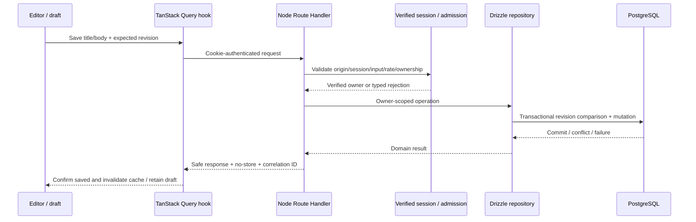

# Phase 01 — Full-Stack Foundation Execution Plan

**Status:** ✅ Milestone 1A implemented; remaining backend milestones planned.
**Updated:** 2026-10-03 — Milestone 1A runtime/config boundary implemented.
**Goal:** Preserve the shared UI and deliver authenticated, server-authoritative note CRUD with validated APIs and observable, tested security boundaries.
**Architecture:** Next.js Node Route Handlers → verified Supabase identity → scoped Drizzle repositories → Supabase PostgreSQL. React uses temporary editor state and in-memory TanStack Query, with Zustand UI and nuqs URL state.
**Tech stack:** Existing React/Next.js/TypeScript/Tailwind/Radix; Zod/server-only configuration; planned Supabase Auth/PostgreSQL, Drizzle, API Zod, Pino, Redis limits, TanStack Query, Zustand, nuqs, OpenAPI/Swagger/Postman.
**Spec:** [PRODUCT_SPEC](../../PRODUCT_SPEC.md) §§3–6, 14, 17–21.
**Standard:** [PLANS](../PLANS.md). Use the repository milestone/test-first execution workflow; implement only the requested milestone and stop. This plan does not authorize executing the whole phase or deploying infrastructure.

## 1. Goal

A Google-authenticated user can create/list/read/edit/rename/soft-delete server notes, reload and fetch the committed data, and access the same workspace on another device. Ownership/RLS prevent another user's access. Saved feedback requires confirmed PostgreSQL commit; stale edits produce a recoverable revision conflict. No durable offline notes or E2EE vault.

## 2. Current state

Before 1A, inspection on 2026-10-03 found: Next.js static export, strict TypeScript, Tailwind semantic tokens, Radix UI primitives, controlled MindMora specimens, session theme and `/dev/design-system`; existing package/lock files, Vitest/Playwright, static preview script and GitHub Actions UI checks. No Git repository was present in the earlier inspection; inspect again before any requested checkpoint.

Before 1A, no backend/auth/database/Drizzle/Zod/Pino/Redis integration, note feature, query/UI/URL providers, Swagger/Postman contract, Storage, queue or worker existed. Historical UI validation is in [design-system plan](design-system.md), not backend evidence. Existing `SaveStatus` still says “Saved on this device” and has a local-commit comment; `SyncStatus` has historical local-file wording. These are specimen labels scheduled for adaptation in 1G, not server-persistence evidence. That earlier docs revision left source/configuration static. Milestone 1A now runs Next Node build/preview, with Zod/server-only config and runtime test tooling; existing UI source is preserved. Continue tooling migration deliberately; do not re-scaffold shared components or assume proposed modules exist.

## 3. Scope

Runtime Node Next.js; configuration and server-only boundaries; Google/Supabase server-session flow; minimal profiles/notes schema/migrations and effective owner/RLS queries; validated CRUD API; redacted Pino and Redis admission checks; typed API errors; responsive protected workspace; TanStack Query memory cache, Zustand UI, nuqs note selection; OpenAPI/Swagger/generated Postman; unit/integration/browser checks, runtime dev/CI documentation and optional Docker verification.

Acceptance requires applicable SEC-01–08 evidence. Foundation functionality is local/development verification; hosted sensitive-data readiness separately requires actual HTTPS, provider encryption/backup and quota evidence. Do not mark production requirements satisfied by mocks.

## 4. Out of scope

CodeMirror/preview/autosave, links/search/folders, graph/canvas/tasks, file uploads/exports, BullMQ/worker/outbox, AI, plugins, PWA, payment provider, production deploy and Nginx configuration before host selection. Private Storage and BullMQ are Phase 4 targets, not reasons to pre-create empty services now.

No Dexie/IndexedDB knowledge, persistent browser caches, offline replay, Drive synchronization, E2EE/passphrase/recovery keys, MinIO, Aiven/Neon/second production DB. Use textarea and explicit Save. Public showcase remains sample-only; authenticated product screens reuse its components.

## 5. Architecture and global constraints

- Strict types, Zod at external boundaries; server-only database/Redis/logging/auth credentials.
- Supabase Auth manages identity; backend validates session/refresh/revocation and uses protected cookies with CSRF/origin checks. Resolve/test the exact supported backend-only cookie flow in 1B; stock browser SDK token persistence is not the target.
- Drizzle repositories use owner predicates, revision checks and transactions. Use a least-privilege request role with effective RLS and transaction-local verified claims; prove real role behavior rather than assuming policies constrain database-owner credentials.
- PostgreSQL owns notes/settings; query owns memory server-cache; UI store owns UI; URL owns note selection; editor owns draft. No persistent browser private data. Private responses bypass browser/Next/edge/ingress caches.
- Confirm commit before saved. Re-fetch uncertain outcomes; preserve drafts/conflicts. Clear private memory and stale async work on logout/account switch.
- Preserve semantic UI/accessibility/reduced-motion contracts. New workspace/auth screens require a design document before UI implementation.
- Free-tier target and service terms checked at exact dependency/resource introduction; no paid/deployment action from this plan. Conventional commits only when requested, without AI attribution.

## 6. Data flow

Google sign-in: start → code/PKCE/state exchange via Supabase/Google → backend callback → protected app-session cookie → safe `/session` projection. Logout clears provider/application session and browser cache, with no late response restoring private content. Normal CRUD has no queue dependency.

## 7. Phase file inventory

The 1A entries are now implemented; remaining entries are proposed paths, not an implemented file map. Colocate feature code and meaningful tests.

| Create / modify | Responsibility | Milestone |
|---|---|---|
| `next.config.ts`, `package.json`, `package-lock.json` (modify) | Remove static-only target when backend starts; runtime scripts/dependencies | 1A and each relevant install |
| `scripts/preview.mjs`, `playwright.config.ts`, `.github/workflows/quality.yml` (modify) | Migrate static-only assumptions while preserving showcase coverage | 1A/1H |
| `.env.example`, `.gitignore` (inspect/modify) | Placeholders only, ignore real secrets/generated output, retain Markdown docs | 1A |
| `src/server/config.ts`, `src/server/config.test.ts` | Validated env config, server-only import boundary, safe config failures | 1A |
| `src/server/auth/session.ts`, `src/server/auth/session.test.ts` | Backend cookie/session verification, refresh/logout and safe projection | 1B |
| `src/app/api/auth/start/route.ts`, `callback/route.ts`, `logout/route.ts`, `session/route.ts` under `src/app/api/auth/` | Supported Google flow and safe auth endpoints | 1B |
| `src/features/account/types.ts`, `src/features/account/api.ts` | Safe user-facing auth shapes and typed client access | 1B/1F |
| `src/server/db/client.ts`, `schema.ts`, `user-context.ts`, `drizzle.config.ts` | Bounded connections, minimal schemas and effective scoped RLS role/claims | 1C |
| `supabase/migrations/0001_profiles_notes.sql` | Versioned reviewed schema and owner RLS; reconcile actual generator numbering | 1C |
| `src/features/notes/types.ts`, `validation.ts`, `validation.test.ts` | Shared bounded note schemas and domain/API types | 1C |
| `src/server/http/errors.ts`, `responses.ts`, `csrf.ts` and tests | Error envelope, private no-store responses, origin/CSRF rejection | 1D |
| `src/server/logging/logger.ts`, `logger.test.ts` | Pino safe fields and redaction | 1D |
| `src/server/rate-limit/client.ts`, `limiter.ts`, `limiter.test.ts` | Redis counter/window policy and outage behavior | 1D |
| `src/server/notes/repository.ts`, `service.ts` | Owner predicates, transaction/revision rules and public domain errors | 1E |
| `src/app/api/notes/route.ts`, `src/app/api/notes/[id]/route.ts` | Authenticated list/create/detail/update/delete | 1E |
| `tests/integration/notes-api.test.ts`, `rls.test.ts`, `auth.test.ts`, `rate-limit.test.ts` | Actual HTTP/session/DB/Redis isolation and failures | 1B–1E |
| `docs/design/phase-01-foundation.md` | Accessible auth/workspace/loading/conflict design contract | 1F before UI edits |
| `src/app/providers.tsx`, `src/lib/query-client/provider.tsx`, `src/lib/nuqs/provider.tsx` | Stable query/URL/session provider composition | 1F |
| `src/lib/api/client.ts`, `src/features/notes/api.ts`, `hooks.ts`, `use-note-selection.ts` | Safe validated API responses, scoped cache/mutations/URL selection | 1F/1G |
| `src/stores/ui-store.ts` | Transient layout/dialog state, no persistence middleware | 1F |
| `src/features/account/components/SignInGate.tsx`, `src/components/workspace/WorkspaceShell.tsx` | Safe auth/protected responsive UI, shared components | 1F |
| `src/features/notes/components/NoteList.tsx`, `NoteEditor.tsx`, `NotesWorkspace.tsx` | Bounded list, draft/save/delete/conflict states | 1G |
| `src/app/workspace/page.tsx` | Compose protected workspace with query URL selection | 1G |
| `src/components/mindmora/index.tsx` (modify), related showcase/tests/docs | Replace historical device-save/local-sync wording for server-save and refresh/job contracts | 1G |
| `tests/e2e/foundation.spec.ts`, `security.spec.ts` | Real auth/note flow, cache/logout/conflict/accessibility | 1G/1H |
| `docs/api/openapi.json`, `docs/api/mindmora.postman_collection.json`, `scripts/generate-api-docs.mjs` | Versioned generated contract, collection and drift checks | 1H |
| `src/app/dev/api-docs/page.tsx` | Swagger UI with safe production exposure policy | 1H |
| `Dockerfile`, `docker-compose.yml`, `.dockerignore` | Optional reproducible runtime/dev dependencies; no production second database | 1H |

Unit test paths otherwise colocated with their module. Update affected docs/file map/learning/phase record and this plan after every milestone. Do not populate the proposed source map until code exists.

## 8. Proposed contracts

- **Note:** `id`, verified `userId`, `title`, Markdown `content`, ISO UTC `createdAt`/`updatedAt`, integer `revision`, nullable `deletedAt`. Client never assigns owner/timestamps/revision. Phase 1 supports create/read/list/update/rename/soft-delete; restore/history awaits its phase.
- **Inputs:** create title/content bounded by documented limits; update allowed fields plus expected revision; delete requires expected revision; list cursor/limit validated and bounded. Unknown ownership/plan fields rejected. Choose/document title/body/limit bounds in 1C tests before exposing the API.
- **Session projection:** safe user ID/display fields only, no credential/provider token. API identity comes from validated cookie lifecycle, not this client projection.
- **Success:** validated domain shape with no private infrastructure details. Create 201; read/list/update 200; soft-delete documented 200 or 204 consistently with contract.
- **Errors:** stable code/message/correlation ID plus safe field errors/retry guidance; distinguish invalid input (400), unauthenticated (401), forbidden feature (403), inaccessible/missing (404), stale revision (409), throttled (429) and unavailable dependency (503). Internal SQL/credentials never serialized.
- **Repository interface:** operations take verified server context and validated input. Domain outcomes include not-found, revision-conflict, validation and persistence-unavailable. Exact signatures/schema are finalized in 1C/1E and cannot be independently invented by hooks.
- **Idempotency:** create uses a user-scoped client operation ID or equivalent server idempotency contract to reconcile uncertain retries; enforce uniqueness with ownership and test replay, rather than relying on UI button disabling. Finalize in 1E.

No local crypto envelopes, vault tables, Dexie version migrations or sync tombstones. Supabase Auth owns credentials; app database stores profile/knowledge. Server backup/restore plan is infrastructure, not passphrase recovery.

## 9. Milestones

### 1A — Runtime and server boundary

**Goal:** Node-compatible Next.js runtime without breaking the existing showcase.
**Files:** modify Next config/scripts/preview/Playwright/CI assumptions as needed; add validated `src/server/config.ts`, placeholders and server-only boundary tests. Preserve existing UI/tokens.
**Flow:** runtime server serves showcase; no real note/auth services yet.
**Steps:** inspect current scripts; verify exact Next/Node compatibility and new config dependency; write config secret/missing-env/client-import behavior tests and observe intended failures; migrate runtime build/preview; pass tests; verify `/dev/design-system` still loads and no required empty knowledge scaffold exists.
**Tests:** no privileged values in rendered/client output; missing server config fails safely; runtime showcase behavior/accessibility survives. Do not require all future cloud env variables merely to view the public specimen.
**Concepts/docs:** static files versus Node server; `server-only`; runtime configuration. Update README/ARCHITECTURE/FILE_MAP/LEARNING and tooling evidence.
**Stop:** no auth or note implementation beyond this milestone. Existing historical static checks stay historical.

### 1B — Google sign-in and backend-owned sessions

**Goal:** supported Google/Supabase code flow with safe session/refresh/logout behavior.
**Files:** server session helpers/tests, auth Route Handlers, safe account types/API and auth integration tests. Server UI screens are still planned for 1F; initial routes can be exercised through fixtures.
**Flow:** start → provider → callback → protected session cookie → verified `/session` → logout.
**Steps:** read official provider lifecycle/SSR cookie guidance; record exact backend-only cookie/refresh and redirect policy before code; failing tests for valid/invalid callback, expired/revoked session, refresh failure, foreign origin/logout and token-free projection; implement minimal helpers/routes; run disposable-user integration. Keep exposed auth routes non-production-ready until 1D admission controls are integrated.
**Tests:** PKCE/state misuse, redirect abuse, missing/expired/revoked cookies, cookie attributes, server verification and no browser token storage. Identity checks cannot trust a cached user projection. If the chosen supported flow can't meet protected-cookie requirements, resolve the design explicitly in docs before claiming completion.
**Concepts/docs:** identity versus authorization; cookies/CSRF/refresh; no custom passwords or provider token tables. Update Supabase/security docs and actual SEC-01/05 evidence.
**Stop:** no private note schema/CRUD yet.

### 1C — Note schemas, database and effective RLS

**Goal:** minimal profiles/notes with validated contracts and actual database owner isolation.
**Files:** shared types/Zod validation tests; Drizzle client/schema/config; user-context; versioned reviewed SQL migration; real `rls.test.ts`.
**Flow:** validated server identity → transaction-local least-privilege role/claim → owner-scoped database operation.
**Steps:** verify Drizzle/Supabase database role/pooler capabilities and selected versions; define bounds and migration; fail tests for two-user access/forged owner and pooled-claim leak; implement schema/RLS/context; run migration on disposable database; exercise actual driver. Migrations and RLS SQL are reviewed, not destructive production reset scripts.
**Tests:** user A cannot read/write user B; anonymous denied; actual request role can't bypass RLS; relation/owner policy works; migration applies to clean dev DB without secrets logged; timestamps/revision constraints and bounded payload validation.
**Concepts/docs:** Postgres schema/index/migration; parameterized ORM; RLS and role bypass; connection pooling. Update full-stack/state/security docs, model contracts and FILE_MAP.
**Stop:** storage/files and later knowledge tables remain uncreated.

### 1D — HTTP security, Redis admission and Pino

**Goal:** safe reusable request/error/logging/limiting boundary before CRUD routes expose real notes.
**Files:** HTTP errors/responses/CSRF; logging; rate-limit client/limiter; unit/integration tests; config extends actual needed Redis keys.
**Flow:** origin/session/validated request → trustworthy identity/IP budget → operation → safe error/log metadata.
**Steps:** document configured rate windows/budgets/body limits and proxy header trust; failing tests for malformed/body/CSRF/session rejection, 429/Retry-After and marker leaks; implement Pino redaction and Redis counters; connect auth routes to admission; test provider/Redis outage policy and counter expiry. No real credentials in fixtures.
**Tests:** request/response/error notes/tokens/cookies/keys/signed URLs never serialized; private response no-store; forged forwarded IP doesn't bypass budgets; auth/expensive admission fails closed on Redis outage; basic CRUD conservative fallback doesn't skip auth and advertises multi-instance limit constraints. Verify Redis TLS/provider access/configuration in deployment evidence, not assumed from passing local tests.
**Concepts/docs:** runtime validation isn't authorization; structured logs versus telemetry; counters/TTL and provider command budgets. Update services/security/budget docs with actual settings and SEC-05/07 evidence.
**Stop:** no queues/worker, no Redis plaintext knowledge cache or general session cache.

### 1E — Authenticated note API and repositories

**Goal:** durable owner-scoped CRUD with revision-safe writes and public typed errors.
**Files:** server notes repository/service/tests; list/detail/mutation routes; notes API integration tests; minimal endpoint contract records.
**Flow:** protected route → verified owner/validated input → Drizzle transaction → normalized response.
**Steps:** write behavior tests for create/list/detail/update/rename/soft-delete, two-user rejection, stale revision and idempotent replay; show intended failures; implement minimal repository/service/routes; test actual DB; align response/error contracts before hooks consume them. Apply no-store, Pino/admission and CSRF wrappers to every route.
**Tests:** two updates using one revision cannot both overwrite; soft-deleted/inaccessible notes unavailable; bounded pages/cursors; malformed fields; forged owner; DB outage leaves no false success; timeout-after-commit reconciliation does not duplicate create; race with deletion safe. Queues absent from ordinary save path.
**Concepts/docs:** transaction, optimistic concurrency, idempotency and uncertain outcomes. Add actual notes feature doc using spec §19.3; update API/security/model docs/file map/learning.
**Stop:** no autosave/CodeMirror or worker enqueue.

### 1F — Protected shell and memory-state boundaries

**Goal:** accessible signed-in shell using single-owner query/UI/URL state.
**Files:** first create `docs/design/phase-01-foundation.md`; then providers, API client, account gate, shell, UI store, URL selection/query hooks/tests. Modify root/layout composition only as needed.
**Flow:** safe session projection → signed-in query scope → memory note cache; nuqs ID selects; Zustand controls layout; shared theme remains consistent.
**Steps:** document screen states/responsive/focus behavior; fail tests for loading/logged-out/account switch/missing note states; install vetted query/Zustand/nuqs versions; implement stable query/client adapter composition with no persistence; test logout cancels/clears and invalidates stale callbacks.
**Tests:** no duplicate active ID in Zustand; no credential state; inaccessible/deleted URL states; one account's notes never render for another; late fetch after logout can't restore private UI; no private persistent browser entries or server shared cache. Public showcase still independent sample state.
**Concepts/docs:** provider lifetime, query keys/cache invalidation, URL state and auth rendering. Update state/design/security/file map/learning with actual components.
**Stop:** shell/query boundary only; full editing UI is 1G.

### 1G — CRUD workspace and conflicts

**Goal:** usable notes list/editor with explicit Save and recoverable errors.
**Files:** notes components/hooks/API client; `/workspace`; existing `src/components/mindmora/index.tsx` save/status labels and comments plus affected showcase tests/docs; component tests and foundation/security browser tests; update 1F design doc.
**Flow:** choose note URL → fetch → memory draft → save → confirmed DB commit → query invalidation/saved indicator.
**Steps:** red tests for empty/list/create/edit/rename/delete/failed save/conflict; compose existing shared components; preserve unsaved draft on refetch/outage; add confirmation for soft-delete; use revision contract and idempotency; update existing SaveStatus device/local-commit text to server-confirmed saved wording, and stop using old Drive/local-file SyncStatus for product job/refresh state; preserve controlled specimen behavior; browser-test real API with disposable users.
**Tests:** save/reload/server read; another device/context fetch; direct foreign note ID blocked; account switch cleanup; offline same-tab draft clearly unsaved; DB failure/uncertain response reconciliation; concurrent tabs conflict without draft loss; keyboard/focus/labels/mobile/reduced motion. No persistent offline save claim.
**Concepts/docs:** editor versus cached server record, mutation lifecycle and conflict UX. Record actual CRUD/security outcomes; update notes/design/file map/learning/phase record.
**Stop:** do not start Phase 2 or add background jobs.

### 1H — API contract, integration verification and handoff

**Goal:** inspectable documented API and consistent runtime verification.
**Files:** actual OpenAPI document/compatible Zod generation, Swagger UI route and generated Postman collection; drift/integration checks; runtime CI/tests/scripts; optional Docker dev verification and README. No Nginx deployment files before topology decision.
**Steps:** choose vetted Zod-to-OpenAPI/Swagger tooling; failing contract tests for real route mismatch; generate/review schemas/responses/auth/cursors/revisions/errors; generate secret-free collection; verify disposable-user requests and safe docs exposure; run required runtime checks/integration/E2E; document deployment requirements and unverified production gates honestly.
**Tests:** contract matches actual methods/payloads/statuses; collection contains no marker note/credentials; Swagger requests respect cookie/CSRF flow; runtime showcase and workspace pass; effective DB roles and Redis tests run; Docker if added starts reproducibly without secret values in image/build/client. Keep integration skips visible, never claim passing if a live dependency was unavailable.
**Concepts/docs:** schema/contract drift, API testing, runtime CI versus production readiness, free-tier limits. Update all affected docs and milestone progress. Record only observed results.
**Stop:** Phase 1 review; next Phase 2 plan only when requested. No cloud deploy or Phase 4 worker automatically.

## 10. Review focus and edge cases

| Condition | Expected behavior | Owner |
|---|---|---|
| Stale/revoked cookie or OAuth replay | Reject safely, no note access; no token in client/error | 1B/1D |
| Privileged/pool reused DB connection | Effective owner isolation, no prior-user claims | 1C/1E |
| Valid JSON referencing another user's record | Rejected despite schema validity | 1C/1E/1G |
| Commit succeeds but response lost | Reconcile with scoped idempotency/refetch; no duplicate/false failure | 1E/1G |
| Refetch while editing | Preserve unsaved draft, revision conflict explicit | 1F/1G |
| Logout/switch during request | Cancel and generation-invalidate; no stale private render | 1F/1G |
| Offline/tab close/refresh | Existing draft memory only; no saved/offline durability claim | 1G |
| Redis quota/outage | Defined auth fail-closed/basic fallback; session/ownership still required | 1D |
| Missing/deleted URL ID | Safe not-found UI, no account enumeration | 1F/1G |
| Pino/provider exceptions/contract examples | No note content/credential marker leak | 1D/1H |
| Pause/backup/hosting limitations | Report actual unavailable dependencies/limits; no uptime guarantee | 1H/deployment |

## 11. Test and verification matrix

| Layer | Required evidence |
|---|---|
| Unit | Zod bounds, config, safe error/log serializer, rate rules, session adapters |
| Component | Signed-in/loading/error UI, URL selection, draft/refetch/conflict, memory cleanup |
| Integration | Real provider test auth where needed; two-user DB/RLS via actual driver; migrations/revisions/idempotency; Redis expiry/outage; HTTP/CSRF/no-store |
| E2E | Disposable-user auth/CRUD/reload/cross-user/logout/late-response/conflict; persistent storage scans; accessibility/responsive showcase and workspace |
| Contract | OpenAPI route/response checks, generated Postman smoke requests/secret scan |
| Deployment | TLS, at-rest/backup/provider settings, no secret leakage, proxy IP trust, quotas and runtime availability; not automatically complete in development |

Required application commands: `npm run lint`, `npm run typecheck`, `npm run test`, `npm run build`; relevant Playwright and new non-watch integration/contract scripts added when their tooling exists. Per milestone: observe meaningful behavior-test failure, implement minimal behavior, pass targeted tests, refactor, run required checks, record exact outputs. Do not claim a mocked auth or an integration skip establishes real RLS/security.

## 12. Documentation updates

Each implementation updates this plan, Phase 1 record, FILE_MAP/LEARNING and affected architecture/integration/design/feature docs. README scripts track current tooling, not future targets. ADRs record actual implementation changes. UI showcase historical results remain distinct. Later phase plans are created at phase start; roadmap is enough today.

## 13. Decisions and open deployment choices

Accepted ADR-016/018/019; ADR-001/002/003/017 superseded. Google/Supabase server-managed full-stack, no E2EE/browser private persistence, Pino/Zod/Redis limits and documented APIs precede note completion. BullMQ/private Storage/worker are Phase 4; Nginx conditional on self-hosting. Exact host/provider/runtime, session-cookie integration, RLS request-role mechanics and limits must be verified in their assigned milestones. These are explicit planned checks, not silent assumptions. No always-on/free-host guarantee or paid resource authorization.

## 14. Progress

- [x] Inspect existing UI and documentation; preserve source evidence.
- [x] Update requirements/architecture/security/ADRs and full-stack milestone plan by user request.
- [x] 1A Runtime migration.
- [ ] 1B Google/server sessions.
- [ ] 1C Database/Zod/RLS.
- [ ] 1D HTTP security/Pino/Redis limits.
- [ ] 1E Notes API/repositories.
- [ ] 1F Protected shell/state.
- [ ] 1G CRUD/conflict UI.
- [ ] 1H Contract/runtime verification/documentation handoff.
- [ ] Applicable SEC-01–08 proven; separate deployment evidence recorded where applicable.

The earlier docs-only revision completed no implementation milestone. 1A is now implemented; stop for user review. 1B is the next milestone and is not authorized to start.

### Documentation revision verification — 2026-10-03

Checked 30 Markdown documents and 124 local links: no missing targets or unbalanced fences. Product specification retains 22 numbered sections and a 14-phase roadmap; agreed stack/features and exclusions were checked. Non-Markdown files matched the pre-edit SHA-256 baseline, with no added non-Markdown files. No application lint/typecheck/unit/E2E/build ran for this docs-only revision; source, dependency lockfile, static runtime config and CI remain unchanged. No Git checkpoint created because the directory is not a Git repository.

### Milestone 1A execution — 2026-10-03

Authorized scope: runtime and server boundary only; stop before 1B, no commit/deploy.
Inspection: Next 16.3.8 static export, preview serves `out/`, Node 22.22.3/npm 10.9.8,
existing six unit and nine showcase browser tests. No Git repository present.

Concrete files: `next.config.ts`, `package.json`/lock, `scripts/preview.mjs`,
`playwright.config.ts`, `.github/workflows/quality.yml`, `.env.example`,
`src/server/config.ts`/`config.test.ts`, `scripts/test-server-boundary.mjs`,
`tests/e2e/runtime.spec.ts`, and affected README/architecture/file-map/learning/phase/dependency docs.
No design or screen changes; no auth/database/Redis/queue scaffold.

Configuration contract: lazy `getServerConfig` validates only `APP_ORIGIN` with Zod;
HTTP is restricted to loopback local development/preview, HTTPS required for other hosts; no credentials,
query, fragment or non-root path. Fixed errors never serialize raw environment values or Zod issues.
No cloud credentials required to build/view public specimens. Add service config only when
its milestone introduces a consumer. Test env is injected; production defaults to `process.env`.

Test-first sequence: configuration failures/safe projection → minimal validation;
isolated real Next client-import build must reject config → `server-only` marker;
production preview/start behavior and marker-free HTTP/browser assets → runtime migration.
An isolated test-only dynamic Route Handler proves Node runtime support without adding an app API.
Boundary tooling uses disposable files and never edits production pages. Preserve UI/spec hashes.
Validation: lint, typecheck, test, build, boundary build checks, Playwright showcase/runtime,
dependency audit, Markdown links and unchanged-source check. Exact observations follow.

1A decisions/outcomes: exact Zod 4.6.5 and server-only 0.0.1 (MIT) installed;
Next 16.3.8 requires Node >=20.9.0, actual Node 22.22.3 meets project >=22.12.0.
No service/account/payment required. APP_ORIGIN is the only configured field;
service credentials are deferred. No page calls config, so no cloud setup is required.
No production route added; dynamic Node verification lives only in a disposable fixture.
Preview wraps the supported Next CLI and propagates signals/exit status. Playwright
rejects reusing an unrelated server, preserving meaningful marker/runtime checks.

RED evidence: config skeleton yielded 11 failed/5 passed (unsafe/missing origins accepted,
root slash not normalized); a corrected, tool-complete client-import fixture built successfully
without server-only and failed its assertion; the static preview returned plain 404 and failed
HTML 404 expectations (1 failed/1 passed runtime tests). Earlier missing NODE_ENV input type
and sandbox port errors were not counted as RED. Refinement initially threw raw `Invalid URL`
for two malformed inputs; Zod piping now short-circuits before URL-based refinements.
GREEN: 16/16 config tests; original six component tests preserved; actual Next client import
rejected and positive Node fixture compiled/responded using config changed after build.

Verification on 2026-10-03:
- `npm run lint`: exit 0, style contract passed.
- `npm run typecheck`: exit 0, strict tsc passed.
- `npm run test`: exit 0, 2 files / 22 tests passed.
- `SUPABASE_SERVICE_ROLE_KEY=mindmora-private-service-key-marker DATABASE_URL=postgresql://mindmora-private-database-marker npm run build`: exit 0;
  `/`, `/_not-found`, `/dev/design-system` prerendered in a Node-compatible `.next` build.
- `npm run test:boundary`: exit 0; both real Next compiler and request-time Node checks passed,
  using copied actual next.config.ts. Test fixture removed; production pages untouched.
- `npm audit --audit-level=high --fetch-retries=0 --fetch-timeout=15000`: exit 0, 0 vulnerabilities.
- Client build scan: 22 `.next/static` files, 0 fake credential marker leaks.
- Existing `src` files, PRODUCT_SPEC, AGENTS and tsconfig matched the SHA-256 baseline;
  only new server/config files exist, no app Route Handler/auth/database scaffold.

- `npm run test:e2e` against the final marker-injected production build: exit 0, 11/11 Chromium tests passed (7.7s); original nine showcase plus runtime404 and public HTML/loaded JS marker exclusion. Cosmetic NO_COLOR/FORCE_COLOR warnings only.
- Python Markdown validation: 30 documents, 125 local file links, 0 missing targets, 0 unbalanced fences. Changed documentation scope/status reviewed; existing spec/UI hash check passed.

All applicable 1A checks complete. Stop for user review; no 1B authorization.
Read-only independent review: no critical/important correctness issues. Actual Next config
was added to the fixture following its coverage observation. Minor deferred: build/route-fetch/
shutdown waits in the disposable boundary script lack their own deadlines; CI-level cancellation
may be needed if Next hangs. Loopback HTTP also works in local production preview by design;
no production-mode TLS guarantee. Safe config errors are not HTTP API error handling (1D).
Auth/RLS/private response security/Redis/services/TLS/provider readiness remain unverified.
Git repository absent; no commit, deploy or 1B work performed.
