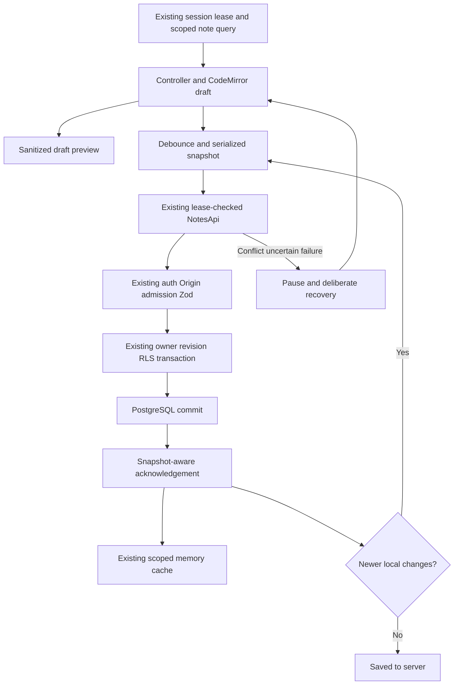

# Phase 2 — Complete Editor ExecPlan

**Status:** ✅ Complete; all Phase 2 local acceptance criteria passed 2026-10-05. Hosted/production evidence remains separate.  
**Inspection date:** 2026-10-05.  
**Goal:** Replace the protected workspace's plain textarea with a CodeMirror 6 Markdown editor, safe rich preview, and revision-safe autosave whose saved state is established by PostgreSQL acknowledgement.  
**Authority:** [PRODUCT_SPEC §17](../../PRODUCT_SPEC.md#17-development-phases), with §§2, 4.2–4.3, 5–6, 8, 18–21; [plan standard](../PLANS.md); [documentation standard](../../docs/DOCUMENTATION.md).  
**Execution:** User authorized the entire Phase 2 in one implementation pass on 2026-10-05. Execute Phase 2 as **one complete implementation phase**, with one final acceptance/review boundary. The ordered work sections below describe dependencies and test cycles, not separately authorized milestones. This explicitly overrides the plan standard's default small-milestone decomposition for this request. Keep work on the existing `main` checkout; do not commit, create branches, deploy, purchase services or mutate hosted data without separate authorization.

## 1. Current state: inspected source, not assumed capabilities

The task baseline is a clean working tree on `main`. Phase 1's dated checks are historical evidence, not fresh Phase 2 validation. Current source and `package.json` show:

| Existing area | Observed responsibility / Phase 2 implication |
|---|---|
| `src/features/notes/components/NoteEditor.tsx` | React title/content draft, explicit save/delete, acknowledged base revision, validation, frozen create key, uncertain-update refetch, conflict choices and clean-refetch adoption. Body is a textarea; input is disabled during writes. `accepted()` replaces the draft with the response. Both behaviors must change for typing during autosave. |
| `src/features/notes/components/NotesWorkspace.tsx` | List/detail queries, nuqs selection, draft-discard and beforeunload guards, cache updates/invalidation. `onSaved()` currently clears dirty state unconditionally; editor keys include the selected note ID. These are unsafe for an acknowledgement followed by newer local edits or a new note acquiring its ID. |
| `src/components/workspace/WorkspaceShell.tsx` | Per-mount memory QueryClient, safe session projection, owner/generation lease, abort controller, periodic/focus verification, account switch/logout cleanup. Drafts unmount on identity change. |
| `src/features/notes/api.ts`, `hooks.ts`, `validation.ts`, `types.ts` | Shared Zod schemas, active-lease checks before/after requests, online session verification before each private call, owner/ID/revision response checks; owner/generation query keys; retries disabled. |
| `src/server/notes/{routes,service,repository}.ts`, `src/server/db/{client,user-context,schema}.ts` | Bounded/Origin-checked requests, verified owner, admission, atomic owner/active/expected-revision SQL, scoped role/RLS, commit before normalized response, soft delete and owner-scoped create replay. Reuse these; no new save endpoint or table. |
| `src/server/rate-limit/limiter.ts` | Basic budget 60 requests/owner/minute, local degraded budget 10/minute; session budget 120/minute with default shared public identity. Autosave also incurs session verification, list invalidation and occasional detail reads. A debounce alone cannot protect these budgets. |
| `src/lib/api/client.ts` | Same-origin no-store fetch; typed `ApiError`, numeric `Retry-After`; fetch or successful-response parsing failures become uncertain outcomes. Abort does not prove a server write rolled back. |
| `src/components/{ui,mindmora}`, `src/design-system/{tokens,components}.css`, `src/stores/ui-store.ts` | Shared accessible primitives, controlled SaveStatus, semantic colors including recently refined neutral dark theme; Zustand currently stores only sidebar visibility. |
| `src/app/workspace/page.tsx`, `next.config.ts` | Suspense/nuqs shell; safe workspace shell currently prerenderable. No CSP configured in inspected Next config. CSP nonce adoption will deliberately make the workspace shell dynamic. Public pages should retain their existing rendering mode. |
| `package.json`, `package-lock.json` | Next 16.3.8, React 19.3.0, strict TS, Zod, Query/Zustand/nuqs already installed. CodeMirror, unified/remark/rehype, KaTeX and Mermaid are **not installed** despite being selected product technologies. |
| Tests and CI | Vitest/RTL tests beside modules; real SQL/Redis suites in `tests/integration/`; browser foundation/auth/contract suites under `tests/e2e/`; `scripts/test-auth-e2e.mjs` provisions disposable PG/Redis with controlled Supabase transport. `playwright.auth.config.ts` explicitly lists three spec filenames, so a new editor spec must be added. `.github/workflows/quality.yml` owns current CI. |

Read before execution: [current architecture](../../ARCHITECTURE.md), [Phase 1 execution/evidence](phase-01-foundation.md), [notes workspace](../../docs/features/notes-workspace.md), [note API](../../docs/features/notes-api.md), [state ownership](../../docs/architecture/state-management.md), [full-stack flows](../../docs/architecture/full-stack-architecture.md), [security](../../docs/architecture/security-architecture.md), ADR-[016](../../docs/decisions/ADR-016-supabase-auth-and-server-data.md)/[018](../../docs/decisions/ADR-018-full-stack-server-storage.md)/[019](../../docs/decisions/ADR-019-backend-services-and-api-tooling.md)/[024](../../docs/decisions/ADR-024-note-write-concurrency-and-reconciliation.md)/[025](../../docs/decisions/ADR-025-workspace-memory-and-contract-tooling.md)/[026](../../docs/decisions/ADR-026-neutral-dark-theme-and-document-surfaces.md). Several narrative paragraphs in existing architecture/security docs still describe earlier Phase 1 limitations; actual callers and the final Phase 1 evidence govern the baseline. Correct touched stale statements during the final documentation review, without claiming provider acceptance.

## 2. Scope and acceptance contract

Phase 2 delivers one integrated protected editor:

- CodeMirror 6 source editing: Markdown syntax highlighting, line wrapping, native selection/undo/redo, accessible label and standard editing behavior. Title remains a separate shared TextField. Paste is plain source, never executable HTML.
- Edit, Preview and Split presentations. Split shows the **current draft**, including unsaved text. Basic formatting actions insert/wrap Markdown for heading, bold, italic, list, checklist, quote, link and fenced code through editor transactions. These are editor controls, not a slash-command system or command palette.
- Core rich Markdown: headings, emphasis, lists/checklists, links, tables, fenced code and blockquotes; inline/display KaTeX math and explicitly rendered fenced Mermaid diagrams. Code remains escaped text; generic fenced-code syntax-highlighting packages are unnecessary. Preview checkboxes are noninteractive; cross-note task extraction belongs to Phase 7.
- Safe images as Markdown syntax with an alt/source placeholder and an explicit user action to open a permitted external HTTPS URL. **No automatic external image fetch**, attachment upload, signed URL, proxy or embedded arbitrary SVG/HTML. This preserves source portability without introducing tracking or Phase 4 Storage work. Document this Phase 2 limitation plainly.
- Debounced/coalesced server autosave for a valid changed draft, with serialized writes, minimum request spacing, exact snapshots, in-flight typing, explicit Save now / primary-modifier+S, visible state and deliberate recovery.
- Existing CRUD, selection guards, server refetch, create idempotency, conflict/uncertain-write recovery and identity cleanup continue working under autosave. The full security/test/documentation contract is part of this phase.

Acceptance is the complete checklist in §12. Internal work sections are not partial phase completion.

### Explicitly out of scope

Phase 3 wiki-link parsing/autocomplete/missing-note creation, backlink/link/tag models, corpus search and quick switcher; Phase 4 Storage/attachments, export/PDF/ZIP, queues/workers/outbox; graph/canvas; daily notes/templates/task aggregation/frontmatter properties; PWA/private caches/offline queues; version-history models/UI; AI/BYOK; plugins/MDX; billing/entitlements; Phase 12 palette, Vim/Emacs, Zen mode, custom themes and i18n. No CRDT/realtime collaboration, automatic merge, Drive sync, E2EE, browser knowledge persistence, new hosting or production certification. Do not create speculative tables, server routes or worker infrastructure for these features.

## 3. Architecture and state ownership

The editor is a feature layer under proposed `src/features/editor/`, composed by the existing notes feature. Server authority and note API contracts stay unchanged.

| Layer | Owner and responsibility |
|---|---|
| PostgreSQL | Existing canonical title/content, revision and timestamps. |
| Notes client/query | Validated owner-scoped API operations and acknowledged records. No optimistic saved record or query persister. |
| Editor controller | One acknowledged base, current draft, local edit sequence, immutable active operation, conflict candidate and bounded scheduler. All memory only, scoped to mounted editor/owner generation. |
| CodeMirror | Active source document, selection and undo history. React controller receives changes; it is the save coordinator, not a second authoritative note store. Programmatic server adoption uses annotated transactions to avoid feedback loops. |
| Preview | Derived sanitized AST/React output from current draft; disposable render generation, no persistent HTML or global private render cache. |
| UI modes | Local editor mode state for Edit/Preview/Split; existing sidebar state remains Zustand and note identity remains nuqs. Do not persist mode/content/preferences in browser storage. |
| Server | Existing auth/CSRF/admission/Zod/service/repository/RLS transaction path. Normal saves never enter Redis as jobs. |

Instantiate CodeMirror once per stable editor lease; destroy view/listeners on unmount, selection discard or identity invalidation. Reconfigure semantic theme/read-only/nonce extensions without replacing the view or undo history on every keystroke. Load editor and preview packages within the authenticated client feature. Math and Mermaid load only when needed. Loading or rendering failures never erase source or block saving.

**Stable identity handoff:** An initial POST acknowledgement binds the existing new-note controller to the returned ID and updates the URL without unmounting that controller. A genuine selection change creates a new editor lease after the discard decision. Replace the present ID-based remount behavior accordingly. If the first POST returns after local edits, preserve those edits and schedule a PATCH against the acknowledged revision. A replay returning changed server content requires explicit resolution.

**Cache callbacks:** `onSaved` means “a record was acknowledged,” not “the current draft is clean.” It updates scoped detail/list caches; `onDirty` remains the sole draft-dirty signal. Never clear the guard merely because an older snapshot committed. Query responses older than the acknowledged base must not roll back the editor or cache. Dirty refetches preserve draft and record a newer server candidate; clean refetches may adopt a strictly newer revision without triggering a save.

## 4. Data model and interfaces — proposed, not implemented

No SQL migration, new index, persistent HTML column or history table is needed. Existing `Note`, `CreateNoteInput`, `UpdateNoteInput`, UTC ISO timestamps and UUID IDs remain the transport model. Reuse existing schema normalization: trimmed nonempty title, maximum 200 Unicode code points, content at most 1,048,576 UTF-8 bytes, no NUL, bounded positive revisions. Empty content is valid. Whitespace-only title is a validation state, not an automatically generated title.

Proposed editor interfaces (final names may be refined together during implementation, with tests/docs kept consistent):

```typescript
type EditorDraft = { title: string; content: string };
type SavePhase =
  | "clean" | "dirty" | "saving" | "invalid" | "paused"
  | "reconciling" | "conflict" | "unavailable";
type SaveOperation =
  | { kind: "create"; sequence: number; input: EditorDraft; key: string }
  | { kind: "update"; sequence: number; input: EditorDraft;
      id: string; expectedRevision: number };
type EditorMode = "edit" | "preview" | "split";
```

`useNoteAutosave({ note, api, unavailable, onSaved, onDeleted, onDirty })` owns normalized draft/base/operation state and returns draft setters, phase/message, conflict candidate, `saveNow`, `retry`, `useServerVersion`, `keepDraft`, and `remove`. It adapts existing `NotesApi`; it does not own session credentials. A pure `save-machine.ts` defines snapshot/acknowledgement transitions, used by the hook and tested independently. All async completions check mounted lease identity and operation generation before touching state/callbacks. `CodeMirrorEditor({ value, onChange, nonce, onSave })` owns view lifecycle and editing commands. `MarkdownPreview({ content })` owns disposable derived rendering. Runtime inputs still use Zod at API boundaries; local TS types do not establish permission or sanitize content.

## 5. Runtime/data flow

### Read, edit and acknowledged save

1. WorkspaceShell verifies the session projection and issues the owner/generation lease; notes queries fetch through `createNotesApi`.
2. NoteEditor initializes a controller from the acknowledged record, then mounts CodeMirror with its content. An empty new note has no ID/base revision.
3. Source/title changes update the draft and edit sequence immediately. Preview derives from the draft independently of persistence.
4. Scheduler waits 1,500 ms after the latest change, validates the normalized snapshot and enforces at least 5,000 ms between automatic write starts. Only one write/reconciliation may be active per editor.
5. Capture `{sequence, input, expectedRevision}` or a new create key/input **before** awaiting verification/network. Later keystrokes cannot mutate this operation.
6. Existing client verifies the lease/session; existing server checks bounds/Origin/identity/admission/schema, then executes the owner/revision-scoped RLS transaction.
7. On a validated commit acknowledgement, advance base/revision and scoped query data. Adopt returned normalized text only if no newer local edits exist. Otherwise retain current draft and remain dirty.
8. If current draft differs from the new base, schedule one coalesced follow-up using that revision. “Saved to server” appears only when the normalized current draft matches the confirmed base and no unresolved operation remains.



### Scheduling, create and recovery rules

- No autosave on initial load, unchanged draft, clean refetch, mode/theme change or programmatic adoption. Title/content validity is checked before issuing a request. New notes autosave only after a user edit produces a valid title; body may be empty.
- Debounce and the spacing gate both apply to automatic writes. Five-second spacing bounds one editor to 12 automatic writes/minute before accompanying reads; it is not a guarantee across tabs/users. Do not increase server budgets just to hide client loops. Save now flushes pending debounce once, serializes/coalesces repeated clicks and respects an active cooldown. Editing is allowed while saving.
- No periodic autosave, unbounded exponential retry or automatic offline replay. A failed attempt pauses scheduling. Network restoration/focus may refetch/verify but does not replay a failed mutation; show Retry/Save now. No new durable queue is introduced.
- 429: pause writes, display the server Retry-After countdown, retain draft and permit deliberate retry after expiry. Use a monotonic local deadline; do not hammer the session endpoint. A degraded-admission header may be surfaced as a caution, but correctness does not rely on a header surviving adapters. The fallback's 10/minute is deliberately lower than normal autosave demand; throttling must work.
- 409 or dirty newer refetch: pause autosave, fetch/show the authorized server candidate as safe text. “Use server version” is a deliberate discard (confirm if dirty); “Keep draft with latest revision” changes the base and retains draft but stays paused until **explicit** Save now. Merely choosing this option must never automatically overwrite remote content. A further remote change produces another conflict.
- Uncertain PATCH/5xx or malformed acknowledgement: stop scheduling and refetch. If content/title exactly match the captured normalized snapshot and revision is newer than the operation's expected revision, accept that observed persisted state; keep edits newer than the snapshot. Otherwise show conflict/review. A failed reconciliation remains paused; explicit Retry first retries the read, not the uncertain write.
- Uncertain POST: retain the original key and normalized payload separately from the editable current draft. Deliberate retry reuses exactly that pair. If replay returns the original content, bind ID/base and preserve newer edits; if it returns a later differing record, show conflict. No new key until this operation is resolved/discarded deliberately. No `userId` is submitted.
- 404/deletion: stop writes; retain dirty source for copying, disable Save, show unavailable. A clean unavailable note shows the existing safe error. UUID/ownership information does not reveal foreign records.
- 401/confirmed account change: existing lease invalidation aborts work/unmounts drafts and preview; late acknowledgements/renders cannot repopulate memory. Transient verification outage retains same-tab draft, pauses writes and grants no offline authority.
- Delete: cancel pending debounce, await/reconcile any active write, then confirm deletion against the latest confirmed revision. Never race DELETE with PATCH/POST. Preserve existing uncertain-delete checks and conflict behavior. A changed draft after a write remains subject to the delete/discard confirmation.
- Navigation/sign-out: guards consult current dirty/unresolved-operation state. Declining navigation resumes only a previously healthy scheduler; it does not clear conflicts/cooldowns. Accepted discard cancels timers and invalidates the old controller; an already sent write can still commit. No unload beacon/keepalive-save guarantee. Refresh/close can lose unsaved text.

## 6. Safe Markdown and rich rendering

**Pipeline:** Markdown string → remark parser + GFM + math → remark-rehype with raw HTML execution disabled → rehype-sanitize with explicit schema → controlled React renderer. Do not add rehype-raw, MDX or arbitrary HTML evaluation. Raw HTML stays escaped/inert or omitted with documented behavior. Preserve the Markdown source unchanged in PostgreSQL; sanitization happens at the rendering boundary.

Allow semantic headings/paragraphs/emphasis/lists/quotes/table/code; restrict attributes, prevent DOM clobbering through generated/prefixed IDs, and recheck URLs in controlled link/image renderers. Permit absolute HTTPS links, safe relative links and fragment links; reject protocol-relative, javascript/data/vbscript/file/blob links, control-character/encoded scheme tricks and credential-bearing URLs. External navigation is a deliberate action with `noopener noreferrer` and no-referrer policy. Relative links must not turn into arbitrary iframe/embed/script resources. Images produce inert alt/source UI until explicit external navigation; source code blocks cannot produce live DOM.

Math nodes are handled by the controlled KaTeX component after the untrusted tree is sanitized. Set `trust: false`, `throwOnError: false`, bounded expansion and size (`maxExpand: 100`, `maxSize: 10`); cap each expression at 4 KiB and show escaped source/error for larger expressions. Do not enable unsafe URL/HTML commands or allow arbitrary style attributes in the Markdown schema to make KaTeX work. Bundle CSS/fonts locally. Trusted generated math output is an explicitly audited rendering boundary, with hostile macro/URL tests and accessible MathML retained.

Fenced `mermaid` nodes are handed to a lazy local component only when the user selects **Render diagram**. Use fixed application config: strict security, HTML labels/click handlers disabled, diagram text at most 10 KiB, at most 200 edges and at most three diagram renders per preview generation. Reject note-controlled init directives/config frontmatter; source cannot override the security config. Never load diagram/font/icon resources from note-supplied URLs. Render SVG through an SVG sanitizer (candidate DOMPurify), remove scripts/events/foreignObject/external URLs, and place the result in a scriptless sandboxed `srcDoc` iframe with a separate restrictive CSP and no same-origin permission. Do not install event-binding callbacks. The frame policy is `default-src 'none'; script-src 'none'; style-src 'unsafe-inline'; img-src 'none'; font-src 'none'; connect-src 'none'; object-src 'none'; base-uri 'none'; form-action 'none'`; only sanitized locally generated SVG/CSS enters it. Its `sandbox` has no permissions. Reject style resource URLs and active links before serialization. Provide title/text source fallback and scoped loading/error state. Diagram IDs and completed renders are tied to editor/preview generation; remove stale DOM on changes/logout.

Preview work debounces separately at 250 ms and never blocks saves on completion. Full Markdown parsing is bounded to 256 KiB of UTF-8 source and 20,000 AST nodes; beyond this show “Preview limit reached; source editing and saving remain available.” This is a **preview limit**, not a reduced 1 MiB note storage limit. Invalid math/diagram or lazy-load failure affects only that block. Bounded inputs reduce resource risk but do not prove a hard CPU timeout: ordinary Mermaid/parser calls cannot be preempted merely by racing a Promise. Record profiling evidence; do not claim a browser worker or deadline unless actually implemented. No server BullMQ/browser worker is planned by default.

Primary references consulted while planning: [CodeMirror configuration](https://codemirror.net/examples/config/), [CodeMirror lifecycle/reference](https://codemirror.net/docs/ref/), [rehype sanitization and math boundary](https://github.com/rehypejs/rehype-sanitize), [Mermaid strict security](https://mermaid.js.org/config/schema-docs/config-properties-securitylevel.html), [Mermaid config bounds](https://mermaid.js.org/config/schema-docs/config.html). These support the proposed design, not installed-version compatibility or completed security tests. Reverify selected release APIs during implementation.

## 7. Security, CSP and trust boundaries

- Preserve SEC-01–08: backend-owned cookies/session verification, exact mutation Origin, explicit owner filters/effective SQL role RLS, shared Zod bounds, no private persistence, safe logging, admission and atomic revisions. Autosave does not relax any control. Existing production TLS/at-rest/backup evidence remains a deployment gate.
- Activate the **rendering portion of SEC-10** now. AI consent/plugin permissions remain later scope; SEC-09 files/jobs remains Phase 4. Do not mark those broader controls complete after renderer tests.
- Never log title/body/HTML/SVG/math, cookies/tokens or render error objects. Renderer UI uses fixed safe errors; diagnostics use sizes/status at most. No third-party rendering/telemetry endpoint/CDN.
- Do not sanitize the stored source into a different canonical format. Treat even owner-authored or previously saved Markdown as untrusted when rendering. Validation controls shape/size, not execution safety.
- Use a workspace-only nonce CSP through proposed `src/proxy.ts` plus a small testable policy helper. Read the installed Next guide at `node_modules/next/dist/docs/01-app/02-guides/content-security-policy.md` and relevant Proxy/async-header/lazy-loading docs before coding. The inspected guide requires dynamic rendering for nonce scripts. Generate a fresh nonce server-side, overwrite any incoming nonce header, place the CSP on request and response, and pass the safe nonce to CodeMirror's CSP nonce extension.
- Proposed production policy: `default-src 'self'`; nonce-based `script-src` with `strict-dynamic`, no script `unsafe-inline`/`unsafe-eval`; `connect-src 'self'`; `img-src 'self'`; `font-src 'self'`; `object-src 'none'`; `base-uri 'none'`; `frame-ancestors 'none'`; `form-action 'self'`; restrict frames to the locally generated sandbox preview. Scope to workspace document and its client navigations; do not treat CSP as API authorization. Preserve public prerendering and the opt-in Swagger route's existing behavior.
- CodeMirror uses nonce-bearing generated style sheets; KaTeX/SVG positioning and shared Radix UI can use inline style attributes. Plan an explicit **style-only** allowance (`style-src-elem 'self' 'nonce-…'`; `style-src-attr 'unsafe-inline'`) where browser evidence requires it, while Markdown sanitizer rejects attacker-supplied style and iframe CSS/resources remain constrained. Do not relax script policy for compatibility. Record this trade-off in the ADR.
- Development Next debugging may require eval as the installed guide explains; any development-only exception must be scoped and absent from `npm run build`/production preview. Production browser evidence is the acceptance gate. A package that requires production eval/remote scripts is unacceptable; choose a compatible version/adapter and keep the security requirement.
- No private note data is prerendered/serialized in public HTML, exported docs or build artifacts. Nonce is not a credential or identity; dynamic workspace rendering adds no server note fetch by itself. Set workspace document no-store and verify proxy/RSC navigation headers and response caching behavior.

## 8. Main files and responsibilities

All new paths below are **proposed**. They must not appear as implemented entries in FILE_MAP until code exists. Existing paths were verified during inspection.

| Action | File / area | Responsibility |
|---|---|---|
| Create | `src/features/editor/save-machine.ts` | Pure snapshot/base/dirty/conflict transitions; no network/store globals. |
| Create | `src/features/editor/save-machine.test.ts` | Deterministic generation/revision/current-draft transition tests. |
| Create | `src/features/editor/use-note-autosave.ts` | Debounce/spacing, one active operation, reconciliation, retry/delete coordination and cleanup. |
| Create | `src/features/editor/use-note-autosave.test.tsx` | Fake clock/deferred promise behavior tests for the actual scheduler. |
| Create | `src/features/editor/components/CodeMirrorEditor.tsx` and `.test.tsx` | View lifecycle, transactions, theme/nonce and accessible source input. |
| Create | `src/features/editor/components/EditorToolbar.tsx` and `.test.tsx` | Shared controls/mode selection, selection-preserving formatting and Save now. |
| Create | `src/features/editor/markdown.ts` and `.test.ts` | Bounded parsing, explicit sanitize schema, URL policy, controlled AST preparation. |
| Create | `src/features/editor/components/MarkdownPreview.tsx` and `.test.tsx` | Controlled sanitized React rendering, math/image/diagram adapters and render-generation cleanup. |
| Create | `src/features/editor/components/MermaidBlock.tsx` and `.test.tsx` | Fixed config, explicit diagram render, SVG sanitation/sandbox and fallback. |
| Create | `src/server/http/content-security-policy.ts` and `.test.ts` | Testable production/development policies and generated nonce/header contract. |
| Create | `src/proxy.ts` | Workspace-scoped CSP request/response headers; no session authority or data retrieval. |
| Modify | `src/app/workspace/page.tsx`, `src/components/workspace/WorkspaceShell.tsx` | Dynamic workspace nonce propagation; preserve lease cleanup and dirty guards. |
| Modify | `src/features/notes/components/NoteEditor.tsx`, `.test.tsx` | Compose controller, CodeMirror, toolbar/preview/conflict UI; retire duplicated explicit-save state machine. |
| Modify | `src/features/notes/components/NotesWorkspace.tsx` | Stable new-to-ID binding, draft-correct callbacks, monotonic scoped cache update/invalidation. |
| Create | `src/features/notes/components/NotesWorkspace.test.tsx` | Integration of binding, cache acknowledgements, dirty guards, selection and remote refetch. |
| Modify if needed | `src/components/mindmora/index.tsx`, shared component tests/showcase | Controlled accessible status/copy for paused/invalid/conflict states; preserve existing SaveStatus callers. Rich controller state may map to current status plus an adjacent message instead of expanding the shared union. |
| Modify | `src/design-system/components.css` | Semantic editor/preview/toolbar/conflict/sandbox layout; reuse tokens, no new palette. |
| Modify | `package.json`, `package-lock.json`, `docs/design/dependencies.md` | Exact audited compatible local dependencies and metadata; no new hosted services. |
| Create | `tests/e2e/editor.spec.ts` | Real CodeMirror, autosave, XSS/CSP/resource/network/identity and accessibility acceptance. |
| Modify | `tests/e2e/foundation.spec.ts`, `playwright.auth.config.ts`, `.github/workflows/quality.yml` | Adapt textarea selectors/explicit-save assumptions; include editor spec in the existing real PG/Redis browser harness/CI. |
| Reuse / regression only | `src/features/notes/{api,hooks,validation,types}.ts`, `src/server/notes/*`, `supabase/migrations/*`, existing SQL/HTTP/security tests | No planned transport/schema/security changes. If inspection reveals a necessary follow-up, document why and its test before editing; do not add unrelated infrastructure. |

Candidate dependencies: direct `@codemirror/state`, `@codemirror/view`, `@codemirror/commands`, `@codemirror/lang-markdown`/language packages needed by selected extensions; `unified`, `remark-parse`, `remark-gfm`, `remark-math`, `remark-rehype`, `rehype-sanitize`, `hast-util-to-jsx-runtime`, KaTeX and Mermaid, DOMPurify for generated SVG (and types only where needed). Prefer direct CodeMirror integration over an unnecessary React wrapper. Inspect actual dependency graph before adding redundant packages. Exact versions/licenses/Node and React compatibility are an execution gate, not invented values here. Record official registry/release/license evidence, current audit and exact lockfile versions before adding; local libraries introduce no selected service/credit-card requirement. Do not install anything during this planning request.

## 9. One complete implementation phase: ordered work, no milestone gates

The following sequence runs through to §12 after implementation authorization. Each behavioral change has a meaningful red → minimal green → refactor cycle. Bootstrap tooling/dependencies first; missing packages are not proof of a behavior failure. Stop only for a genuine blocker, user steering or the complete-phase review; these sections are not separate handoffs.

### A. Establish design and dependency/security contract

Create `docs/design/phase-02-editor.md` before UI code: desktop Split, mobile single-pane mode tabs, keyboard/focus/IME behavior, conflict comparison, image placeholders, loading/error states, save copy and both themes. Use existing primitives/tokens and ADR-026. Record dependencies and an editor architecture ADR (proposed next free number `ADR-027`; recheck availability before assigning). Cover snapshot autosave, source rendering, CSP/dynamic shell, sandbox diagrams and alternatives. Review installed Next docs. Validate the smallest compatible set against the runtime/security requirements; fail visibly if production CSP cannot be met.

### B. Specify save transitions before replacing the editor

Test the state-machine/controller contract with fake clocks and controllable API promises. Demonstrate failures for in-flight edits, stale acknowledgements, overlapping writes, dirty refetch and uncertain results using the existing behavior or a minimal controller scaffold. Implement pure transitions then the scheduler. Integrate actual NotesApi lease checks, original create key/input and save/delete sequencing. Do not add retry machinery to TanStack Query.

Example mandatory acceptance scenario (test intent, not production implementation): base revision 1/body `A`; edit to `B`; start PATCH(1, `B`); edit to `C` before it resolves; acknowledge revision 2/body `B`; assert body `C`, dirty=true, no “Saved”; after idle/spacing assert one PATCH(2, `C`); acknowledge revision 3; only now show saved. A second scenario loses the first response after commit and reconciles revision 2 while keeping `C`.

### C. Compose CodeMirror and safe preview

Test accessible source/undo/selection/programmatic adoption, then install the view adapter and formatting transactions. Test the sanitize/URL/math/diagram boundaries with concrete hostile fixtures before exposing rich DOM. Build the controlled renderer and isolated SVG path. Implement production CSP/nonce propagation and dynamic workspace alongside the renderer, not after release. Unit mocks cannot substitute for browser CSP or real CodeMirror layout/input tests.

### D. Integrate all workspace behavior

Replace NoteEditor internals with the controller, preserve explicit Save now/delete/recovery affordances, and fix NotesWorkspace callbacks/new-ID binding. Test unchanged clean refetch, dirty newer refetch, invalid IDs, deleted notes, discard-declined navigation, accepted navigation with late response, session outage, account switch and pending render cleanup. Update existing test selectors to CodeMirror's labelled editable textbox without weakening the original ownership/conflict assertions. Preview never supplies persistence status.

### E. Verify complete phase, document and hand off

Run targeted suites while building; after final changes run all applicable full checks in §11. Review design across responsive/themes/keyboard and hostile rich content under production CSP. Update documentation in §13 and record actual evidence here plus the phase outcome record. Report the complete phase with important-file Code Understanding Summaries and one overall runtime diagram. Stop for review; do not start Phase 3 or commit.

## 10. Edge cases and test matrix

All rows belong to the **same Phase 2 acceptance**, with implementation ownership indicated instead of small milestones.

| Scenario / concrete fixture | Required outcome | Owning tests |
|---|---|---|
| Idle/initial note; edit then undo to base | No write, no artificial revision increment | save-machine / autosave |
| Rapid edits and continuous typing | Debounce latest snapshot; 5-second automatic spacing; one operation only | autosave fake clock + browser request counts |
| In-flight `B` save followed by local `C` | Commit `B` advances base only; `C` stays dirty and follow-up uses new revision | state machine / autosave / browser |
| Valid new note; type during POST; URL acquires ID | Original controller/undo/draft survive; no duplicate POST; subsequent PATCH uses ID | NotesWorkspace / browser |
| Whitespace/201-code-point title; NUL; >1 MiB UTF-8 body | Shared validation blocks writes; visible errors; body retained; multibyte limits tested | autosave / existing schemas / browser paste |
| Remote edit, remote delete, stale query completion | No draft overwrite; paused conflict or unavailable; no stale revision rollback | controller / workspace / two-context browser |
| Keep draft/latest base chosen | No automatic write; explicit Save now required; next race still yields conflict | autosave / browser |
| Lost PATCH response; failed GET; changed content on GET | Pause, retain draft, reconcile before write; acknowledge matching snapshot only | autosave / actual HTTP browser fault injection |
| Lost POST response; replay returns remotely modified record | Reuse original key/input, preserve newer draft, show conflict if differing replay | autosave / browser; existing real SQL replay tests |
| 429 Retry-After; Redis degraded budget | Cooldown with no request storm; no budget increase; deliberate retry | autosave clock / real limiter regression / browser |
| Offline/5xx/auth-provider outage | Draft stays same tab, writes pause, reconnect grants no blind replay; no false saved | hook / browser offline/provider fixtures |
| Confirmed 401/logout/account switch with scheduled/in-flight work | Timers cancelled, async generations invalidated, preview/editor/cache removed; no old markers return | shell / API / browser |
| Delete during save; navigation/refresh while dirty | Serialized revision handling, explicit discard guard, no unload-save promise | hook / workspace / browser |
| Raw `<script>`, ``, iframe/object/foreignObject, event attributes | Inert output; no code/requests; server source round-trips unchanged | markdown / preview / browser |
| `javascript:`, entity/control-obfuscated scheme, protocol-relative/credential URL, CSS URL, SVG external href | No executable/resource navigation or automatic external network request | markdown / SVG / browser request interception |
| Hostile math `\\href`, HTML commands, expanding macros; Mermaid init/click/HTML/config payload | Trust/config cannot be overridden, bounded fallback, no unsafe DOM/script | preview / Mermaid / production browser |
| Broken fence/math/diagram; lazy import failure; excessive AST/text | Local safe error/source fallback; edit/save continue; stale render discarded | preview / browser |
| IME composition, selection formatting, undo/redo, long code/table | Save only coherent composition result; no selection/focus loss; internal overflow | CodeMirror / real browser |
| Keyboard/mobile/themes/reduced motion | No keyboard trap; source reachable; labelled modes; preserved caret; accessible live status | RTL / Playwright + Axe |
| Browser storage/private markers/bundle/public shell | No local/session/IndexedDB/Cache Storage private persistence; no note/credential artifacts | existing boundary suites + editor browser scans |

## 11. Verification commands and evidence boundary

The following is the complete-phase command contract. Dated execution results are recorded in §15; planned commands alone are not evidence. All proposed test modules now exist and editor browser tests are included in the protected harness.

During TDD:

```bash
npm run test -- src/features/editor/save-machine.test.ts src/features/editor/use-note-autosave.test.tsx
npm run test -- src/features/editor src/features/notes/components src/components/workspace src/server/http
```

Use a failing user-visible assertion first; run it to observe the failure; implement; rerun/refactor. Record meaningful failures and fixes, not module-resolution/setup failures. Fake timers test scheduler correctness, deferred promises test races, real CodeMirror/browser tests validate composition/layout.

Complete-phase checks after final code:

```bash
npm run lint
npm run typecheck
npm run test
npm run api:check
npm run test:contract
npm run test:db
npm run test:notes
npm run test:rate-limit
npm run test:boundary
npm run build
npm run test:startup
FORCE_COLOR=0 npm run test:auth
FORCE_COLOR=0 npm run test:e2e
npm audit --audit-level=high --fetch-retries=0 --fetch-timeout=15000
git diff --check
```

Focused browser diagnostic after production build and config inclusion: `FORCE_COLOR=0 npm run test:auth -- editor.spec.ts`. Existing full `test:auth` must also exercise adapted foundation/auth/contracts tests. Run production CSP/header tests, console violation checks, request interception and hostile content in that harness, not only `next dev`. Verify workspace rendering is dynamic while homepage/showcase stay prerendered. Check document/RSC no-store, nonce uniqueness/header spoof rejection, CodeMirror styles, KaTeX fonts, isolated diagrams and no production eval. `api:generate` should be unnecessary because no API shape changes are planned; `api:check` proves generated records stay aligned.

PG/Redis tests use disposable existing harnesses, with actual SQL roles/RLS and HTTP notes. Supabase transport is controlled; this is not fresh live Google, hosted migration, TLS/backup/restore/load or production deployment acceptance. If local tooling is blocked, record exact blocked command, reason and remaining action; do not declare complete phase acceptance. No hosted write is needed for Phase 2 validation.

## 12. Complete-phase acceptance criteria

- [x] CodeMirror replaces the source textarea with labelled keyboard/IME/selection/undo behavior; editing stays available during saves.
- [x] Edit/Preview/Split and formatting actions preserve the draft/caret/history; 375/768/1440 layouts and light/dark/reduced-motion behavior meet the design doc with no page-level overflow or serious Axe violations.
- [x] Core Markdown, bounded math and controlled Mermaid work; HTML/URLs/SVG/config directives cannot execute or fetch remote resources automatically. Images have an explicit, documented inert placeholder/open-source behavior.
- [x] Normal valid edits autosave after idle with bounded request frequency; unchanged/invalid drafts never write. Save now and primary-modifier+S use the same controller; repeated actions cannot overlap.
- [x] Saved means current normalized draft is acknowledged by PostgreSQL. Newer in-flight edits, server normalization, dirty refetch and stale responses cannot erase draft or falsely clear guards.
- [x] New-note autosave binds ID/URL without remounting/losing new edits; create replay reuses frozen key/payload and never silently accepts remotely changed content.
- [x] 409/429/uncertain/outage/unavailable paths preserve draft and pause appropriately; keep-draft resolution requires explicit save; uncertain update is read-reconciled before further writes.
- [x] Delete, navigation and logout serialize/cancel correctly; confirmed account change removes pending private source/preview/cache and rejects late completions.
- [x] Existing session/CSRF/owner/RLS/revision/logging/no-store/server-only/limiter gates remain effective; no new API/schema/cache/worker/service authority is introduced.
- [x] Workspace production CSP is enforced without script unsafe-inline/eval, nonce propagation works and public pages retain their rendering mode. Style compatibility trade-offs and diagram sandbox are tested/documented.
- [x] All applicable §11 checks have fresh observed evidence; real browser and SQL/Redis results remain distinguished from live provider/production evidence.
- [x] Feature/design/ADR/state/security/learning/file-map/phase docs reflect actual implementation; important-file Code Understanding Summary and overall flow are included in handoff.
- [x] No later-phase feature, paid resource, hosted mutation, deployment, branch or commit occurs as part of this phase.

## 13. Documentation work and learning

During implementation create the following **planned** docs, with implemented status only after corresponding code/verification:

- `docs/design/phase-02-editor.md`: required UI behavior/design before components.
- `docs/features/editor.md`: spec §19.3's ten sections, including source/preview/save flows, failures, technologies, trade-offs and interview explanation.
- `docs/decisions/ADR-027-editor-autosave-and-safe-rendering.md`: use next free ADR number after rechecking. Context, decision, alternatives, rationale, trade-offs and consequences for snapshot saves, render boundaries and CSP.
- `docs/phases/phase-02-editor.md`: dated observed outcomes, test evidence and limitations; link here rather than duplicating live checkboxes.

Update affected `docs/features/notes-workspace.md`, `docs/architecture/{state-management,full-stack-architecture,security-architecture}.md`, `docs/design/{component-api,dependencies}.md`, `docs/README.md`, `docs/phases/README.md`. Update `docs/integrations/api-tooling.md` only if its existing browser/contract behavior actually changes; no contract rewrite for a frontend feature.

At final implementation handoff review all five primary homes against current source: README practical implemented editor/setup; PRODUCT_SPEC implementation status only, requirements unchanged; ARCHITECTURE actual controller/CSP/render/save/trust paths; LEARNING concept-first explanation/read order; FILE_MAP significant existing files with six separate fields (path, purpose, exports, called by, dependencies, runtime flow) and ASCII subsystem flows. Record unchanged documents and reasons here. Do not add future paths to FILE_MAP or agent workflow prompts to README.

Important concepts, taught in the plan now and tied to code in LEARNING during implementation:

1. **Acknowledged base versus live draft:** a response confirms one snapshot, not all text currently visible. Local edit sequence and server revision solve different ordering problems.
2. **Debounce, spacing and single flight:** idle batching reduces traffic; spacing caps frequency; serialization prevents this editor racing itself. None replaces server admission or multi-device revision checks.
3. **Optimistic concurrency:** PATCH compares the expected revision atomically; 409 is a useful conflict signal, not permission to overwrite.
4. **Idempotency versus reconciliation:** a stable create key avoids duplicate inserts; a read after an uncertain update observes what persisted. Cancelling fetch is not rolling back SQL.
5. **CodeMirror transactions and React:** a long-lived view owns selection/history; controller owns draft/save coordination. Annotated external changes avoid loops and preserve editor behavior.
6. **Parse, sanitize, render:** AST parsing discovers structure; sanitization removes untrusted capabilities; controlled components manage URLs and trusted generated math/SVG. Zod and React escaping alone do not cover every rich-content path.
7. **CSP and sandbox:** nonces authorize intended scripts; policy reduces execution/resource capabilities; a scriptless sandbox isolates generated diagrams. These complement sanitization and auth rather than replace them.
8. **Leases and render generations:** session/editor/render identity invalidation prevents old asynchronous work entering a later account or note. Memory cleanup is lifecycle protection, not forensic erasure.

The final Code Understanding Summary applies to important implementation files after execution, with verified current line links, exports, 3–7 flow steps, dependencies/security, 2–5 reading points and necessary concepts. This planning-only request creates no implementation file to explain as completed code.

## 14. Decisions, alternatives and limits

| Decision | Alternative / consequence |
|---|---|
| One complete Phase 2 acceptance boundary | Small milestones are the repository default; explicitly overridden by this request. Internal ordered work remains testable but does not narrow the authorized complete phase. |
| Reuse Markdown note API/schema | New autosave endpoint/history/HTML columns would duplicate authority and expand scope. Existing atomic revisions and keyed create already meet persistence requirements. |
| Direct CodeMirror adapter | A React wrapper can simplify setup but adds compatibility and lifecycle dependencies; direct integration requires careful view cleanup and transaction tests. |
| Editable during one active write | Freezing input is simpler but interrupts autosave usage; snapshot comparison adds controller complexity and is required to retain new edits. |
| Paused deliberate recovery | Blind automatic retries or automatic keep-draft overwrite may lose remote changes; recovery is less seamless but observable and revision safe. |
| Raw HTML disabled, local rendering | Arbitrary HTML/MDX is flexible but adds execution authority. Source remains portable; unsupported embedded HTML stays inert. |
| No automatic remote images | Convenient embeds leak viewing/network information and require additional policy. Phase 2 supports Markdown source/placeholder; owned attachments wait for Phase 4. |
| Bounded preview, explicit diagrams | Full live rendering of every 1 MiB note may block input; preview limits do not reduce save capacity. No unsupported hard CPU deadline claim. |
| Workspace nonce CSP and dynamic shell | Static hash/SRI CSP has different build constraints; choose the installed documented nonce route now. Dynamic workspace increases render work; public prerendering remains. |
| Scriptless SVG sandbox plus sanitizer | Direct generated SVG is simpler, but a separate frame limits DOM/CSS authority. Loses interactive diagram links by design and adds sizing/accessibility work. |
| Style-only CSP exception | KaTeX/shared UI positioning needs styles; arbitrary Markdown style remains forbidden. Document the distinction instead of weakening script policy. |

No unresolved product decision blocks writing this plan. Package release compatibility, browser CSP behavior and performance remain implementation evidence gates. If a chosen renderer fails the no-eval/sanitization contract, resolve with a compatible release/adapter and record the deviation; do not silently weaken the security gate or mark a required feature complete. Large redesigns or features beyond §2 require user scope authorization.

## 15. Progress and evidence

### Planning request — 2026-10-05

- [x] Inspected product phase scope, current editor/workspace/client/server/admission source, installed dependencies, test harnesses and CI; read architecture/security/state/ADR/planning/documentation guidance and installed Next CSP guide.
- [x] Wrote one complete Phase 2 contract with proposed files, data flow, security, concrete race/failure tests, trade-offs, acceptance and concepts.
- [x] Self-reviewed against Phase 2 and cross-cutting product requirements; separated later-phase scope and current implementation from proposals.
- [x] Final documentation-only validation: Python checker passed 3 changed Markdown files, 65 local links/anchors, balanced fences, npm script names and allowed tracked paths; `git diff --check` passed. Only this new plan plus docs index/roadmap links changed. Application source/config/package lock/migrations and credential files remain unchanged; no application tests, dependency installation, hosted operation or implementation ran. Mermaid flow manually reviewed against the current API path and proposed controller; no diagram renderer was run.

### Implementation — live completion checklist

- [x] A: design/ADR/dependency/security contract established.
- [x] B: snapshot controller and scheduler behavior passes meaningful TDD cycles.
- [x] C: CodeMirror, safe Markdown/math/diagram and production CSP integrated.
- [x] D: complete workspace/identity/CRUD integration validated.
- [x] E: all acceptance/checks/docs and complete-phase handoff finished.

These are execution work items in **one phase**, not separate implementation milestones. Execution records exact commands/results/limitations below; no Phase 1 pass is reused as fresh evidence.

### Primary-home review for this planning-only request

README, PRODUCT_SPEC, ARCHITECTURE, LEARNING and FILE_MAP reviewed for baseline/scope: unchanged because no implementation, setup, canonical data flow, implemented concept or source navigation changed. PRODUCT_SPEC requirements/status remain untouched. Only the docs index and roadmap receive a link to this planned contract; neither claims editor implementation. Phase 1 plan/evidence remains preserved.

**Historical planning boundary:** The initial request authorized planning only. The subsequent implementation request below authorized complete Phase 2; Phase 3 remains unstarted.

### Implementation start — 2026-10-05

User authorized all Phase 2 work, validation and affected documentation, with one final review boundary and no Phase 3. Existing planning changes preserved; main/no commits. Applying execution/TDD/subagent-development/review skills. Independent controller and renderer ownership delegated; root integrates view/workspace/CSP and full validation. No paid services or hosted mutations.

### Implementation rulings and initial evidence — 2026-10-05

- Root integrated a stable editor key/new-ID binding, preserved dirty guard on old acknowledgements, source editable during save, primary shortcut/format transactions, and workspace nonce CSP. Pure machine, scheduler and renderer were built with failing behavior tests before green implementation. Logs `/tmp/phase2-*.log` retain initial red/green and diagnostic runs; final counts will be recorded below.
- Ruling: style-compatible Mermaid rendering uses an attached disposable measurement subtree, with **instance-only** insertion hooks adding nonce before generated style insertion, because the installed Mermaid12 looks up SVG in the document and generates style elements. No global prototype patch, public body fallback or CSP script relaxation. Output styles are stripped and geometry uses controlled attributes; only local existing arrow-marker references survive.
- Ruling: workspace Referrer-Policy is **same-origin**, not the initial no-referrer proposal. Fresh browser sign-in showed no-referrer native POST emitted Origin:null and failed the unchanged exact-Origin guard. External preview links retain explicit no-referrer. This fixes request compatibility without weakening CSRF.
- Ruling: preparse preview admission additionally limits 2,000 markup delimiters and 5,000 lines. Dense 10,000-emphasis fixture timed out before its postparse AST budget could run. New failing admission tests preceded the guard; dense inputs now reject before parse. Byte/AST limits remain, save capacity is unchanged and no hard CPU timeout is claimed.
- Independent review NEEDS CHANGES identified preview chunk/render isolation, Title IME, visible cooldown and lost SVG arrow markers. All have regression tests/fixes underway; final rereview pending. Corrected browser Title assertion to remain input toHaveValue; body asserts actual labelled CodeMirror text.
- Initial integration attempts were blocked by stopped Docker; started existing local Docker and reran. Fresh actual `test:db` passed 7 RLS/constraint/pool tests plus provisioning rollback/migration rerun; `test:notes` passed12 actual HTTP/PG/Redis tests; `test:rate-limit` passed5. No hosted schema/data mutation.
- Current API generation/drift and contract checks passed; actual Next server-boundary suite passed3. Build shows dynamic workspace, prerendered public pages. These are interim evidence; final changed-code suites remain pending.

- Ruling: browser CSP form-action also governs native sign-in redirect chains. A fresh production browser trace showed self-only form-action blocked the configured Supabase redirect. Added a tested narrowly configured Supabase origin plus Google accounts exception, preserving backend PKCE/redirect checks; no generic wildcard/form destination allowance. Signed-out session401 remains an expected denial, excluded from rich-render console assertions.

### Final CSP and browser recovery — 2026-10-05

- Mermaid serialization hid the nonce on generated measurement styles; its internal DOMPurify reparsed them and Chromium reported three stylesheet CSP violations. A new serialization regression failed before the fix, then passed. Scoped `innerHTML` getters serialize a style-free clone while live nonce CSS remains for sizing; insertion hooks and output sanitization remain. No CSP relaxation or global DOM patch. Installed Mermaid 12.1 behavior must be revalidated on upgrade.
- Independent scoped adapter review accepted the fix; five actual DOM/SVG tests passed. Earlier scoped review also accepted preview-error isolation, Title IME, cooldown and local arrow-marker fixes.
- Exact Chromium script-denied warnings from Playwright bootstrapping the empty-permission `about:srcdoc` frame are distinguished from application CSP failures. Tests assert empty sandbox, script-src none, no executable output and visible diagram geometry/text; all other console errors fail. Axe excludes only that opaque scriptless frame, whose title/source fallback are checked explicitly; no script permission is added for testing.
- Full browser run found a genuine duplicate preview landmark. A regression first failed with two regions; the inner preview wrapper is now an unlabelled div while NoteEditor owns the single labelled region. Targeted renderer tests passed after the fix. Keyboard assertions now traverse eight formatting and three presentation buttons before source, preserving the actual accessible Tab order.
- One unit run under concurrent compiler/browser load timed out waiting for the existing URL-selection fixture. Sequential rerun passed 176 tests; final renderer change adds one regression. A temporary browser test variable shadowed the DOM `document`, caught by build typecheck and corrected before final build.

### Complete-phase acceptance — 2026-10-05

All implementation work items A–E and §12 acceptance criteria are satisfied. Phase 2 is locally complete as one implementation pass. Phase 3 is unstarted. No branches, commits, paid resources, deployments or hosted writes were performed.

| Exact command | Fresh observed result |
|---|---|
| `npm run lint` | PASS ESLint and semantic style contract |
| `npm run typecheck` | PASS strict TypeScript |
| `npm run test` | PASS 31 files / 177 tests |
| `npm run build` | PASS production build; workspace dynamic with Proxy, public pages prerendered |
| `npm run api:check` | PASS generated OpenAPI/Postman drift |
| `npm run test:contract` | PASS route/schema/ref/collection boundaries and executor unit fixture |
| `npm run test:db` | PASS 7 actual PostgreSQL/RLS tests plus provisioning rollback and migration rerun |
| `npm run test:notes` | PASS 12 actual HTTP/PG/Redis tests |
| `npm run test:rate-limit` | PASS 5 actual Redis tests |
| `npm run test:boundary` | PASS 3 actual compiler/request-time boundary scenarios |
| `npm run test:startup` | PASS 4 health tests plus 4 production/development launch scenarios |
| `npm run test:auth` | PASS all 19 protected browser tests, including 6 editor cases and foundation/auth/contracts |
| `npm run test:e2e` | PASS all 14 public/showcase browser tests |
| `npm run test:auth -- --grep 'rich preview'` | PASS final screenshot/scroll assertion refinement; both themes / 375, 768, 1440, reduced motion, zero parent Axe violations, no unexpected CSP/resource errors |
| `npm audit --audit-level=high --fetch-retries=0 --fetch-timeout=15000` | PASS, 0 vulnerabilities |

Unit evidence covers IME/serialization, cooldown, immutable create replay, uncertain PATCH/DELETE reconciliation, stale leases, dirty refetch and preview failure without source loss. Actual browser composition uses synthetic CompositionEvents against CodeMirror; this does not certify every operating-system IME. Browser auth transport is controlled, SQL/RLS and Redis are actual disposable services. Empty-permission frame is excluded from Axe injection, with title/source/output/policy checked explicitly. Compiler/bundle marker and session/owner/boundary gates remain covered. No live Google/hosted migration, TLS/backups/restore/load or production deployment claim.

Final validation logs are `/tmp/phase2-final-*.log`; red/green logs include `/tmp/phase2-csp-{red,green}.log` and `/tmp/phase2-landmark-{red,green}.log`. Temporary logs/screenshots supplement this tracked record and are not permanent evidence storage. The earlier CSP/Axe/Tab/typecheck/time-load failures are retained above with their fixes, not relabelled as successful runs.

Primary-home audit: README setup/current behavior, ARCHITECTURE current flow/trust boundaries, LEARNING concepts and FILE_MAP six-field navigation updated. PRODUCT_SPEC changed only implementation status/roadmap timing, not requirements. Feature/design/state/security/full-stack/API-component/dependency docs and ADR-027 updated where affected. Phase 1 historical record and API contracts/migrations are unchanged because this phase adds no server API/schema authority. Independent read-only documentation audit identified and corrected stale Phase 1 autosave attribution, private-cache evidence, OAuth form/referrer rationale, serialization adapter and manual-save instructions. Handoff uses the user's latest concise 5–10 owner-understanding points; detailed reading/flows remain in LEARNING and FILE_MAP.

Final documentation/link/diagram/diff checks are recorded after this acceptance ledger. Stop for user review; no Phase 3 work.

Final documentation acceptance: Python check passed all 54 repository Markdown files, 675 local links/anchors, balanced fences and 22 npm script references. Installed Mermaid parsed all 13 affected-document diagrams; sequence-message semicolons in two pre-existing architecture diagrams were corrected after parse failures. Flows were also checked against current callers. `git diff --check` passed. PRODUCT_SPEC diff is status-only; API schemas/contracts/migrations and credential files are unchanged. Final branch remains main; changes are uncommitted for review.
