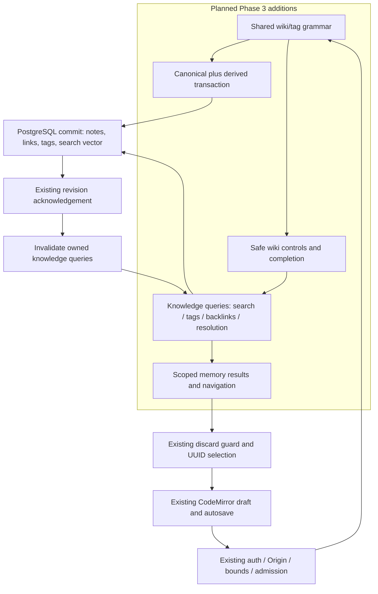

# Phase 3 ExecPlan — Knowledge features

**Status:** ✅ Complete locally; ready for user review. **Inspected:** 2026-10-07. **Authorization:** user authorized complete Phase 3 implementation, local validation and documentation on 2026-10-07. Initial scope excluded hosted writes; user separately authorized migration/backfill during the follow-up below. No commits, deployment or Phase 4 work.

**Goal:** Turn the existing private Markdown editor into a connected knowledge workspace: write/autocomplete/follow `[[Note]]`, explicitly create a missing target, inspect backlinks with counts/context, browse/filter inline tags, and search the complete authorized server corpus by title, content and tag.

**Spec:** [PRODUCT_SPEC.md](../../PRODUCT_SPEC.md), especially §§4.5, 5, 8, 17 (Phase 3), 18, 19 and 21. **Planning contract:** [.agent/PLANS.md](../PLANS.md). **Architecture:** owner-scoped PostgreSQL queries and transactionally maintained Markdown-derived records; existing Next Node API/session/RLS boundaries; memory-only client features composed into the current workspace. **Stack:** installed TypeScript, Next, React, Drizzle/postgres-js, Zod, unified/remark, CodeMirror, TanStack Query, Radix/Tailwind, Zustand and nuqs.

Execution is authorized. Follow the linked requirements and record red → green → refactor and validation evidence here. The user explicitly requested **one complete implementation phase**. The single completion/review boundary is all of Phase 3; the ordered work below is an internal dependency sequence, not separately shippable milestones. This intentionally overrides the planning standard/skill defaults for small milestones and task-by-task handoffs.

## 1. Current state — inspected facts

The repository is currently at `/Users/yuvrajsatyapal/Desktop/Projects/MindMora`; the chat workspace's older `/Users/yuvrajsatyapal/Desktop/MindMora` path does not exist. Resolve paths against the actual checkout during execution. Branch is `main`; the working tree was clean at inspection. No new branch is needed.

| Existing area | Current behavior and Phase 3 implication |
|---|---|
| [schema](../../src/server/db/schema.ts), `supabase/migrations/0000_profiles_notes.sql`, `0001_note_create_idempotency.sql` | Only profiles and notes. Notes have owner, title/content, revision, timestamps, soft deletion and immutable create-key/hash. No link/tag/search structures. Migration output is `supabase/migrations/`, not `drizzle/` or `db/migrations/`. |
| [database boundary](../../src/server/db/client.ts), [owner context](../../src/server/db/user-context.ts) | Issued VerifiedOwner, checked `mindmora_app` login, transaction-local `mindmora_request`/claims, effective RLS, 5s statement/2s lock/10s idle transaction timeouts. Privilege checks currently enumerate notes/profiles and must cover new derived tables too. |
| [note repository](../../src/server/notes/repository.ts), [service](../../src/server/notes/service.ts), [routes](../../src/server/notes/routes.ts) | Owner/active/revision predicates; create idempotency; profile creation within admitted knowledge operations; typed outcomes after transactions. No index derivation. Title duplicates are allowed. Preserve these contracts. |
| [note API](../../src/features/notes/api.ts), [hooks](../../src/features/notes/hooks.ts) | Session-lease checks before/after requests, generation-scoped memory keys, 401 invalidation, bounded list pages. Listing omits bodies and cannot implement complete corpus search in the browser. |
| [workspace](../../src/features/notes/components/NotesWorkspace.tsx), [editor](../../src/features/notes/components/NoteEditor.tsx) | UUID URL selection, discard guards, paginated list, acknowledgement-driven invalidation. New navigation must go through the same guard and preserve newer unsaved text. |
| [CodeMirror](../../src/features/editor/components/CodeMirrorEditor.tsx), [autosave](../../src/features/editor/use-note-autosave.ts), [save machine](../../src/features/editor/save-machine.ts) | Stable editor lease, annotated external changes, serialized revision-safe saves/recovery and composition handling. No wiki completion extension; do not create a competing save controller. |
| [Markdown parser](../../src/features/editor/markdown.ts), [preview](../../src/features/editor/components/MarkdownPreview.tsx) | Bounded sanitized draft preview, safe URL handling, local math/Mermaid, external-image placeholders. No wiki-link rendering. Preview-only caps are smaller than accepted note size and must not become persistence/indexing limits. |
| [API generator](../../scripts/generate-api-docs.mjs), [metadata](../../docs/api/operation-metadata.json), [logger](../../src/server/logging/logger.ts) | Generator hardcodes six route paths/schema inventory and scans actual adapters; logger allows only existing auth/note operation names. New routes require deliberate updates to both, generated OpenAPI/Postman and contract tests. |
| Tests/CI | Vitest/RTL, real PostgreSQL/RLS and Redis fixtures, Playwright auth/editor suites. `playwright.auth.config.ts` has explicit spec names; add the new browser suite. `.github/workflows/quality.yml` invokes existing fixture scripts. No queue/worker exists. |

Phase 1/2 local acceptance is historical evidence, not a fresh test run or hosted/production certification. Read [architecture](../../ARCHITECTURE.md), [security](../../docs/architecture/security-architecture.md), [full-stack flows](../../docs/architecture/full-stack-architecture.md), [state ownership](../../docs/architecture/state-management.md), [documentation rules](../../docs/DOCUMENTATION.md), and ADR-[016](../../docs/decisions/ADR-016-supabase-auth-and-server-data.md)/[018](../../docs/decisions/ADR-018-full-stack-server-storage.md)/[019](../../docs/decisions/ADR-019-backend-services-and-api-tooling.md)/[021](../../docs/decisions/ADR-021-scoped-database-role.md)/[024](../../docs/decisions/ADR-024-note-write-concurrency-and-reconciliation.md)/[027](../../docs/decisions/ADR-027-editor-autosave-and-safe-rendering.md).

## 2. Scope and global constraints

Deliver wiki syntax/autocomplete/navigation/missing-note creation; persisted outgoing references and live owner-scoped backlinks; inline tag extraction/browser/filtering; PostgreSQL basic full-text search; integrated accessible workspace UI; migrations/backfill, contracts, security, tests and documentation. Optional filtering of already fetched summaries is unnecessary for completion and is omitted to avoid competing search behavior.

Retain UUID identity, UTC millisecond timestamps, title maximum 200 Unicode code points, content maximum 1,048,576 UTF-8 bytes, no NUL, positive revision bounds, create Idempotency-Key and expectedRevision updates/deletes. Empty content remains valid. Canonical Markdown is never rewritten by parsing/indexing. Basic features require no Pro entitlement or AI provider.

PostgreSQL commits alone establish saved state. No private browser persistence, secret/content in URLs, queue dependency for saves, raw content logging, external content fetch, relaxed sanitization or client database access. Preserve existing public pages and semantic design tokens. No paid infrastructure/new hosting. Reuse installed packages; any unavoidable new dependency requires version/license/runtime verification and exact lockfile pinning before installation.

### Explicitly out of scope

Phase 4 Storage/uploads/exports, BullMQ/workers/job status/outbox and asynchronous indexing jobs; Phase 5 graph API/UI; Phase 6 canvas; Phase 7 folders/daily notes/templates/task aggregation/frontmatter properties; Phase 8 PWA/offline persistence; Phase 9 advanced search grammar/filters/views/history/entitlements; Phase 10 embeddings/AI/RAG; Phase 11 plugins; Phase 12 palette/quick switcher/import/export/keymaps/i18n; Phase 13 account/payment lifecycle; Phase 14 deployment/restore/operational hardening. No realtime/CRDT, automatic title-reference rewriting, folder-path references, heading/block references, embedded wiki transclusion, E2EE or Drive synchronization.

A synchronous PostgreSQL search vector/derived-record update is necessary Phase 3 basic search plumbing. It does not authorize Phase 4 indexing jobs or infrastructure.

## 3. Product semantics and decisions

These decisions fill details the product spec leaves open; record them in a Phase 3 ADR/design doc during implementation, without changing the spec's phase requirements.

**Wiki references:** Recognize `[[Target]]` and the small compatible extension `[[Target|Label]]` in ordinary Markdown text. Target is a title, never an arbitrary URL or trusted ID. Normalize lookup keys with one pure shared function: Unicode NFKC, trim, collapse whitespace, locale-independent lowercase. Preserve original source/display spelling. Reject empty/multiline/control-character targets and target lengths above the title bound; leave malformed syntax as inert text. Do not decode URL schemes or interpret headings, paths or scripts. A label is plain text, not nested Markdown/HTML.

Parse Markdown into an AST using installed remark parsing; extract only text in eligible prose. Exclude fenced/indented code, inline code, HTML, Markdown link/image destinations and existing links, math, Mermaid source, escaped wiki delimiters and `![[...]]` embed notation. Use source positions to distinguish escapes/syntax split across text nodes. Do not use a whole-document regex as the parser. Share grammar/normalization between server indexing and client preview/completion tests; rendering remains separately sanitized.

**Resolution and rename:** Resolve against active notes belonging to the verified owner. Zero matches is missing; one match is resolved; multiple normalized-title matches is ambiguous. Existing titles are not unique, and Phase 3 must not impose a new unique-title constraint. Never choose an arbitrary duplicate. Autocomplete can show duplicate titles as distinct UUID options, but inserted portable title syntax remains ambiguous until the user disambiguates titles. A rename does not rewrite other notes. Old references become missing or resolve to another uniquely matching title; show this consequence in the UI/help. A delete makes links missing; recreating a unique title restores resolution. Resolve at read time from target keys, avoiding a persisted target-ID binding that disagrees with Markdown.

**Missing-note creation:** A visible explicit action re-resolves first; if still missing, asks for confirmation with the proposed title and creates `{title: target, content: ""}` through existing NotesApi/create idempotency. Capture the key/input once in tab memory, disable duplicate submission, reconcile uncertain creates using the same pair. No creation on preview render, autocomplete fetch or ordinary link hover. Another device can create a duplicate between resolve and POST; after creation re-resolve and surface ambiguity rather than silently choosing a winner. This preserves allowed duplicate titles and existing mutation semantics; exactly-once creation is per operation key, not global per title. If source draft navigation is declined, keep the newly created target and remain in the source; creation must not clear its draft.

**Backlinks:** Unique incoming source notes, total source-note count, repeated-occurrence count and one escaped plain-text context per source/target. Include self-links. Only active sources and a uniquely resolved active target count. For an ambiguous target title show an explanation and no claimed incoming count; do not assign identical links to every duplicate. Counts/context represent committed source revisions, not unsaved drafts.

**Tags:** Inline `#tag` in eligible prose, with a boundary at start/whitespace/punctuation, Unicode letters/numbers plus `_`/`-`, at least one letter/number, maximum 64 code points. Ignore heading markers, numeric fragment-like tokens, URL fragments, escaped hashes and excluded Markdown regions. NFKC/lowercase normalized identity, preserve first spelling for display, deduplicate per note. Tags are flat; no hierarchy/frontmatter metadata. Clicking a tag performs exact normalized membership filtering and may combine with the ordinary basic text query. Explain that unsaved draft tag chips are provisional, while browser counts/search are committed.

**Search:** One plain text query over owned active titles, Markdown content and inline tags; optional exact tag selection. No `tag:`/`folder:`/property query language. PostgreSQL `simple` configuration avoids an English-only stemming assumption; use safe `websearch_to_tsquery('simple', query)` with SQL parameters, a weighted title/content vector, and an explicit exact-tag-match OR branch. Returned summaries omit whole content. Plain-text snippets are at most 240 code points and rendered as React text; no trusted `ts_headline` HTML. Rank deterministically, tie-break by UUID. Punctuation-only queries produce empty results; blank query lists owned active summaries with an optional tag filter. Search is the server corpus, including notes beyond loaded sidebar pages.

## 4. Architecture and proposed data model

All following new paths/models are **proposed**, not implemented.

| Layer | Responsibility |
|---|---|
| Pure knowledge grammar | Extract target/tag identities, display values, counts and bounded contexts from source; share normalization and syntax tests. No IO, HTML rendering or credentials. |
| Notes repository transaction | On successful create/update, write canonical note and replace its derived links/tags together. On soft delete remove its derived records within the same transaction. Title-only updates advance derived revision as well. Idempotent replay does not regenerate from stale original input. |
| Knowledge repository/service | Parameterized owner/active-scoped resolution, backlinks, tag counts and search; validate public response projections; no global title/tag visibility. |
| Next handlers | Reuse bounds/Origin, online identity, admission, safe cookies/error/no-store/logging contract. Never accept owner/derived records from the browser. |
| Knowledge client/hooks | Reuse NoteScope lease/abort discipline and QueryClient. Keys contain owner/generation plus operation and normalized inputs. Query/search/tag data exist only in memory. |
| Workspace/editor | Scoped search/sidebar/tags/backlink panel and wiki completion/preview links. Existing autosave owns draft/base; nuqs keeps UUID selection only. Search text/tag selection are transient React state. |

### Proposed PostgreSQL changes

- `notes.title_key TEXT`: shared normalized title, backfilled from actual title; B-tree `(user_id, md5(title_key), id)` restricted to active notes, with full-key equality checks (execution adjustment for NFKC expansion). Nonunique. Do not expose this internal field in the existing Note transport projection.
- `notes.search_vector TSVECTOR`: stored generated expression from weighted title and content using explicit `simple` configuration; GIN index restricted to active notes. Tags join separately, not into a generated cross-table expression.
- `notes.knowledge_revision INTEGER`: nullable during migration/backfill, then equal to note revision for indexed active records. Not a second concurrency version; do not increment canonical revision or updatedAt merely for backfill.
- `note_links`: `user_id UUID`, `source_note_id UUID`, `target_key TEXT`, `target_title TEXT`, `source_revision INTEGER`, `occurrence_count INTEGER > 0`, `context TEXT` capped at 240 code points, UTC `updated_at`. Generated SHA-256 `target_hash` plus composite primary key `(user_id, source_note_id, target_hash)`; lookup index `(user_id, target_hash, source_note_id)`. Full normalized target strings remain authoritative. Store one aggregate per distinct target, not a full AST or rendered HTML. No target ID, so missing/ambiguous references can persist honestly.
- `note_tags`: `user_id UUID`, `note_id UUID`, `tag_key TEXT`, `display_name TEXT`, `source_revision INTEGER`, UTC `updated_at`. Generated SHA-256 `tag_hash` plus composite primary key `(user_id, note_id, tag_hash)` and `(user_id, tag_hash, note_id)` index. Full tag strings remain authoritative. This association is the tag catalog; no speculative separate taxonomy table.

Use TEXT/check constraints and parameterized writes. No new foreign keys are required; privileged account cleanup must also delete derived rows in the same cleanup procedure because these new associations do not inherit existing canonical cascades, and fixtures must prove no orphan counts/results remain; source ownership/existence must instead be checked by repository and RLS WITH CHECK predicates against notes. Both new tables enable owner RLS, and request grants allow SELECT/INSERT/UPDATE/DELETE only for regenerable derived rows. Canonical note/profile hard-delete grants remain absent. Row policies require `auth.uid() = user_id` and a matching owned source note; insert/update additionally require active source/current revision. Repositories join active source notes and match source_revision so stale/corrupt records cannot present current data. Extend runtime privilege checks to reject direct login grants on every knowledge table. Test delete-policy behavior after note soft deletion so cleanup does not deadlock its own policies.

Parsing occurs after authentication/admission/validation and before holding the SQL transaction. For updates, repository applies expectedRevision and only replaces derivations if the canonical update succeeds. Update payloads may omit title or content: lock/read the owned base in the transaction, verify expectedRevision, merge the provided fields, and derive from the resulting canonical content; when parsing outside the transaction, obtain the owned base first and require the same revision in the write transaction. Never derive empty tags from an omitted content field. Prefer the pre-read plus compare-and-swap approach to keep CPU parsing outside row locks. Failed/stale operations change neither canonical nor derived state.

Derived DELETE+batched INSERT runs on the **existing transaction object**, not a second nested database.run. Batch at most 500 association rows per statement. Input size bounds, admitted request rate, aggregate records, SQL timeouts and pathological-input tests bound cost; do not silently truncate extraction or apply preview byte caps to accepted note content. If valid maximum-size inputs cannot complete safely, record measurements and revise the approach before claiming acceptance; do not introduce undocumented note-size restrictions.

### Migration and initial data

Create next migration `supabase/migrations/0002_knowledge_features.sql` and Drizzle snapshot/journal entries after reviewing generated SQL. Add a one-off `scripts/backfill-knowledge.mjs` that uses the shared server derivation path with explicit privileged CLI configuration. Process deterministic UUID pages of 50 notes and bounded inserts, log only safe counts/IDs, and close connections. Each note transaction rechecks revision under a lock; skip/retry changed records on a later bounded pass. Re-running repairs/upserts the same revision without duplicating records or changing canonical revisions/content. Deleted notes get no associations.

Add a server-only validated `KNOWLEDGE_FEATURES_ENABLED` boolean, default false, documented in `.env.example`. Keep Phase 3 read endpoints unavailable with safe 503 while disabled, and hide their client controls using a safe capability projection; note CRUD still maintains derivations under the new code. Enable it only after a controlled maintenance rollout completes backfill and consistency verification; do not silently omit old notes. Keep transitional columns nullable in the additive migration; the backfill verifier must prove every active note has a non-null title key and knowledge_revision equal to revision before the operator enables reads. Do not add an unfillable NOT NULL constraint before old rows are processed. Deployment/provider application is separately authorized. For local acceptance, migrate disposable fixtures containing Phase 2 notes, backfill, then enable the new code. No automatic privileged migrations or corpus scan during HTTP startup. A one-off CLI is not a durable worker/job subsystem. Retain additive changes on failure; repair/rerun forward rather than resetting the database. Document that rolling back to old note-writing code can make associations stale and requires disabling Phase 3 reads followed by a complete backfill before re-enabling.

## 5. Interfaces and runtime/data flow

Proposed pure interfaces: `normalizeTitleKey(title: string): string`, `normalizeTagKey(tag: string): string`, `extractKnowledge(content: string): { links: DerivedLink[]; tags: DerivedTag[] }`. `DerivedLink` contains targetKey/targetTitle/occurrenceCount/context; `DerivedTag` contains tagKey/displayName. Source/owner/revision/timestamps are attached by trusted server code, never by this parser or client input.

Proposed read contracts (strict Zod; reject unknown/duplicate parameters, malformed cursors, bodies on GET and unsupported methods):

| Endpoint | Input → result |
|---|---|
| `POST /api/knowledge/wiki-targets` | Discriminated `{kind:"complete",prefix,limit,cursor}` or `{kind:"resolve",targets}`. Prefix max 200 code points; original-title cursor max 200; limit default 20/max 50; resolve max 50 distinct valid targets per batch. Completion returns owned active id/title/revision summaries ordered title_key/id. Resolve returns `missing`, `resolved` with one summary, or `ambiguous` without arbitrary winner. |
| `GET /api/notes/{id}/backlinks` | Owned active UUID, limit default 20/max 100, source-UUID cursor → target revision/resolution status, total unique-source count, items `{sourceId,title,sourceRevision,occurrenceCount,context}`, nextCursor. Safe 404 for absent/foreign/deleted target. |
| `GET /api/tags` | Limit default 20/max 100, tag-key cursor → `{key,displayName,noteCount}` items and nextCursor. Counts are unique active owned notes. Stable representative spelling chosen by ordered source UUID. |
| `POST /api/search` | `{query,tag?,limit,cursor?}`; query max 256 code points, normalized tag key max 1,152 (source spelling max 64), limit default 20/max 100 → summary/snippet items and nextCursor. Body max 8KiB; reject overflow before parsing. |

No submitted userId, plan, SQL expression, vector, source revision or link metadata. Read-only POST endpoints still enforce same-origin cookie request policy. This avoids private search terms/target titles in request URLs/access logs. POST here changes no knowledge data and is safe to use in a query hook, with automatic retries disabled. Missing-note creation remains existing POST `/api/notes` with UUID Idempotency-Key.

Cursors are validated structured values: completion `{title,id}` (original bounded title, normalized by the server), backlinks `{sourceId}`, tags `{key}`, search `{rank,id}` for nonempty queries and `{updatedAt,id}` for blank queries. Include a normalized query/filter fingerprint in search cursors and reject mismatches. Serialize rank consistently with PostgreSQL real precision and compare with the same SQL expression; test ties and round trips. Pages are bounded live views, not snapshots across concurrent edits. Escape `%`, `_` and backslash in parameterized prefix LIKE patterns; an input is never a SQL fragment.

**Save and index:** draft → current immutable autosave snapshot → authenticated note handler → parse resulting content → checked owner transaction → atomic revision write and association replacement → COMMIT → existing acknowledged Note projection → invalidate scoped list, search, tags, target resolution and backlinks queries. Do not invalidate across accounts or mark a newer draft clean. On delete invalidate target resolutions and backlink counts even for other currently fetched notes of the same owner. Title changes affect all title resolutions of that owner; conservative owner-prefix invalidation is acceptable at this scale.

**Read and navigate:** draft preview parses wiki tokens → batch target-resolution query → safe internal controls → workspace selection/discard guard → existing UUID detail API. Resolve is rechecked at click; deleted/renamed/ambiguous targets display a recoverable state. Fetch bounded batches; prioritize visible tokens and do not flood endpoints for a large preview. Completion uses a 250ms debounce, aborts prior prefixes, checks cursor/lease generation, and inserts through a CodeMirror transaction. It does not recreate the editor view on every result or keypress.

**Backlinks/tags/search:** UI requests scoped bounded reads → handler verifies identity/admission → repositories join only active owned current-revision records → safe response → lease-checked memory cache → escaped accessible result rows → guarded selection. Tags/backlinks are labeled as committed data even while source preview displays a draft. Returning focus/refetch refreshes saved multi-device changes; no websocket or poll loop is needed.

## 6. Main files and responsibilities

**Existing files to modify:**

- `src/server/db/schema.ts`, `src/server/db/client.ts`: new columns/association tables/indexes/RLS and checked-role inventory. `src/server/config.ts`, its tests, `.env.example`, and `src/app/workspace/page.tsx` and its workspace composition: the explicit default-off knowledge-read rollout gate, without exposing server configuration or adding a new capability endpoint.
- `src/server/notes/repository.ts`: shared-transaction derivation for create/partial update/delete, preserve idempotency and conflicts. `service.ts` retains explicit public Note projection; extend `routes.test.ts` and repository integration to protect it.
- `src/features/editor/markdown.ts`, `components/MarkdownPreview.tsx`: safe wiki AST transformation/internal controls without widening arbitrary href permissions; keep math/Mermaid/image behavior and preview caps. Pass target callbacks through `PreviewBoundary` composition as necessary.
- `src/features/editor/components/CodeMirrorEditor.tsx`: reconfigurable wiki completion extension and lifecycle cleanup; existing save/composition/keymap/undo remain intact.
- `src/features/notes/components/NoteEditor.tsx`, `NotesWorkspace.tsx`, `hooks.ts`: compose knowledge UI, navigation and broad owner-scoped acknowledgement invalidation. Keep the current selection hook/autosave state machine unless a demonstrated integration need requires a small change.
- `src/server/logging/logger.ts` and test: allow fixed knowledge operation names only; terms/context/tag/title/body stay excluded.
- `scripts/generate-api-docs.mjs`, `docs/api/operation-metadata.json`, `docs/api/openapi.json`, `docs/api/mindmora.postman_collection.json`, `scripts/test-api-contract.mjs`, `scripts/test-api-collection.mjs`: new schema/path/method inventory, safe examples, pagination/error contracts and regenerated artifacts.
- `scripts/test-database.mjs`, `scripts/test-notes-api.mjs`, `scripts/test-auth-e2e.mjs`, `playwright.auth.config.ts`, `.github/workflows/quality.yml`: include knowledge DB/API/browser suites in actual runners, not merely files that CI never invokes. Extend `.mm-*` styles in `src/design-system/components.css` using existing tokens.

**Proposed new files:**

- `src/features/knowledge/syntax.ts`, `validation.ts`, `types.ts`: pure parser/key rules and transport schemas/types.
- `src/server/knowledge/derivation.ts`: trusted transaction-object association replacement shared by note mutations and backfill.
- `src/server/knowledge/repository.ts`, `service.ts`, `routes.ts`: SQL, public projections and injectable HTTP policy facade following existing patterns, without a global backend refactor.
- `src/features/knowledge/api.ts`, `hooks.ts`: NoteScope-aware API facade and memory query keys/reads.
- `src/features/knowledge/wiki-completion.ts`: CodeMirror completion adapter and transaction-safe insertion.
- `src/features/knowledge/components/KnowledgeSearch.tsx`, `TagBrowser.tsx`, `BacklinksPanel.tsx`, `WikiLink.tsx`: integrated presentation, semantic results and explicit create/navigation actions. Missing-target operation memory is owned by its mounted controller, not a global store.
- `src/app/api/knowledge/wiki-targets/route.ts`, `src/app/api/notes/[id]/backlinks/route.ts`, `src/app/api/tags/route.ts`, `src/app/api/search/route.ts`: Node/dynamic adapters with explicit methods/405 handling following existing route exports.
- `supabase/migrations/0002_knowledge_features.sql`, generated `supabase/migrations/meta` entries; `scripts/backfill-knowledge.mjs`: reviewed additive migration and bounded one-off compatibility work.

**Meaningful new tests:** colocated `syntax.test.ts`, `validation.test.ts`, `api.test.ts`, `wiki-completion.test.ts`, component `.test.tsx`; `src/server/knowledge/routes.test.ts`; `tests/integration/knowledge.test.ts`, `knowledge-api.test.ts`; `tests/e2e/knowledge.spec.ts`. Extend existing note/preview/CodeMirror/workspace/logger/contract/RLS tests rather than duplicating their established security fixtures.

## 7. Security and failure behavior

Authentication remains online Supabase verification; authorization separately means verified owner predicates, constrained role/claims and effective RLS on canonical **and derived** data. Completion, nonexistent-title checks, tag catalogs, counts, snippets and backlink source titles are private data. Same titles/tags for another account must neither resolve nor influence counts/ranking. Owner input is never accepted; foreign/deleted UUIDs return indistinguishable 404s. Backfill credentials stay in the privileged CLI and never appear in HTTP workers/client bundles.

Keep auth → basic Redis admission → bounded/schema-validated expensive work → scoped SQL ordering and existing degraded local fallback semantics. Prefix/resolve/search have bounded pages/batches/debounce, no unbounded library fetch. SQL parameterization is independent of LIKE escaping. Refresh cookies on later failures as current handlers do; handle 400/401/403/404/409/413/429/503 with safe typed responses, no-store/correlation IDs and Retry-After where applicable. Unsupported methods return appropriate Allow.

An internal link is an application action resolved to a validated UUID, never an attacker-controlled href. Allowlist any wiki AST markers deliberately through sanitization; do not globally allow arbitrary data attributes, protocols or HTML. All labels, tag values and contexts render as escaped text. Preserve CSP/nonces, external URL restrictions and math/diagram controls. No eval/new Function, innerHTML-based highlights or external provider requests. HTTP/proxy logs must not include read-only POST bodies; Pino metadata tests cover terms/titles/tags/snippets as sensitive values.

| Condition | Required integrated-phase behavior |
|---|---|
| Offline/DB unavailable/Redis degraded | Existing draft stays editable in tab; searches/completion/backlinks show unavailable, not empty-authoritative results. No cached-only saved claim or mutation replay. |
| Refresh/tab close | Acknowledged knowledge refetches; transient filters/operation keys/drafts disappear. Existing unsaved warning remains. |
| Save conflict/failed derivation/SQL timeout | No partial canonical/index change; typed conflict or safe failure; autosave retains exact draft and current recovery rules. |
| Lost response after commit | Existing create key reconciliation/update refetch; indexes reflect committed revision. Refetch and invalidate after reconciliation, no blind write retry. |
| Rename/delete/recreate/duplicate titles | Read-time missing/resolved/ambiguous semantics; scoped cache invalidation; no source rewrite or cross-owner resolution. |
| Partial/malformed syntax, code/math/URLs/escapes | Inert text/exclusion; extraction and preview agree. Ordinary Markdown stays usable. |
| Empty library/tags/search, invalid UUID/cursor | Accessible empty or typed invalid/not-found state; no crash and no hidden broad-query fallback. |
| Session expiry/account switch/late completion | Existing invalidation aborts and clears all knowledge queries, create state, drafts and results; old generation cannot insert/navigate/update the next account. |
| IME, rapid prefixes, preview rerender, selection discard | No premature save/completion insertion, stale suggestions, destroyed undo history or bypassed discard guard. |
| Backfill interruption/old-writer rollback | Rerunnable repair and consistency verification; reads disabled while incomplete; no silent dropped knowledge or destructive reset. |

These cases all belong to the **one Phase 3 acceptance boundary**.

## 8. Integrated UI design requirements

Before UI code create `docs/design/phase-03-knowledge.md` covering placement, existing tokens, responsive layouts, keyboard/focus, accessibility, empty/loading/error/ambiguity and draft-versus-committed states. Reuse shared primitives and the current neutral dark/document surfaces; no new brand system or screen route.

Search lives in the note sidebar, with tag browser/filter controls and paginated result rows. Backlinks belong beside/below the selected document: a secondary panel on wide screens and collapsible section below editor on narrow screens. Tags on the current note can be draft-derived chips with explicit provisional labeling. Do not replace source/save error controls with knowledge controls.

Use a labeled search field, explicit clear/retry/load-more buttons, accessible selected filter, status announcements and real list semantics. Completion supports arrows/Enter/Escape, appropriate listbox semantics, stable focus and composition; Escape does not discard source. Wiki actions are keyboard reachable with clear missing/ambiguous labels. Missing-target confirmation has focus restoration. All knowledge navigation delegates to the same workspace selection guard, including preview, search and backlinks. No forced auto-navigation from fetch completion. Verify 320px/768px/1280px, light/dark, zoom, contrast, axe and reduced motion; no hover-only essential action.

## 9. One implementation phase — execution sequence

**Single deliverable:** a complete tested knowledge workspace, including migration/backfill compatibility, secure APIs, editor/navigation integration, contracts and accurate documentation. **Stop boundary:** hand off only after the full acceptance matrix is satisfied or a concrete blocker is reported. Do not advance to Phase 4. Internal sequencing does not create Phase 3A/3B milestones.

1. Read requirements/source again, inspect installed Next docs for Route Handler/client guidance, confirm baseline and tooling. Write the Phase 3 UI design and ADR (proposed name `docs/decisions/ADR-028-knowledge-derivation-and-title-resolution.md`; check the next available number first).
2. Write failing syntax/normalization and partial-update/atomicity/security tests, demonstrate meaningful behavior failures, then add shared extraction and schema/migration/transaction replacement. Backfill preexisting Phase 2 fixtures; verify rerun/concurrent-write/deletion behavior and unchanged canonical revisions.
3. Test and implement owned resolution, completion, backlinks, tags and full-text search through actual constrained SQL. Pin duplicate-title, rename, exact-tag, corpus-pagination and deterministic-search semantics before adding HTTP facades.
4. Write failing route/client/contract cases; add the four dynamic API adapters, safe projections, refreshed cookies/admission/no-store/log metadata, generation-safe client/hooks, and generated API artifacts. Preserve existing Note API fields/status/idempotency.
5. Write failing component/browser cases; integrate CodeMirror completion, sanitized wiki preview, guarded missing-target creation/navigation, sidebar search/tags and backlinks. Confirm all acknowledgement/delete/reconciliation invalidations and dirty-draft preservation. Refactor only within this feature's needed boundaries.
6. Run targeted suites and all required application/security/contract checks, fix failures, review accessibility and source boundaries, update documentation, then record exact evidence and complete the single Phase 3 handoff. Do not commit unless requested.

Every behavior change follows red → minimal green → refactor; missing tools are setup failures, not red evidence. Record red command/assertion, green result and final check evidence during execution. The test matrix below defines expected behavior rather than implementation-mirroring tests.

## 10. Tests and acceptance evidence

| Layer | Behavior to pin |
|---|---|
| Pure unit | Wiki/alias/escape rules, malformed and hostile targets, Markdown region exclusions, Unicode/duplicate normalization, tag boundaries/dedup/count/context, maximum accepted source and dense markup. Preview and server share exact fixtures. |
| Transaction integration | Create/index atomicity, content/title-only partial updates, revisions, source removal/target re-resolution on delete, replay does not restore original derivation, injected replacement failure rolls back note, stale writes do nothing, concurrent writes/backfill produce one current revision. |
| Real role/RLS | Two owners with same titles/tags; own inserts/reads; foreign source association injection rejected; absent owner filters still isolated by effective policies; direct runtime grants/privileged credentials rejected; derived deletion authorized but canonical hard deletion denied; pool role/claim cleanup. |
| Search/reads integration | Beyond first 20-note list page; title/content/exact-tag matching; punctuation/blank/Unicode; active-note exclusions; snippets plain and bounded; rank ties/cursor precision/filter mismatch; bounded completion/resolve/tag/backlink pagination; ambiguous targets/no information leakage. Inspect EXPLAIN on representative disposable data for owner/selectivity/index behavior without inventing production benchmarks. |
| HTTP/contracts | Methods, Origin, online auth/refresh, malformed/repeated/unknown params, hostile cursor/body limits, admission/429/503, foreign/deleted 404, no-store, metadata-only logs, projections and OpenAPI/Postman drift/runtime conformance. |
| Client/components | Aborted/stale prefix/results; logout/account switch; draft/committed distinctions; safe labels/contexts; duplicate-title state; dirty guarded navigation; IME/undo/mode switching; uncertain/multiple missing-target clicks with frozen create key; tag filter clear and empty/error/retry states. |
| Browser | User A creates source and target, completes/follows wiki link, sees backlink/context/count/tag and full-corpus search; edit/remove reference, rename/delete/recreate target, missing creation and duplicates; two-user isolation, 409/lost response/401/429/outage, reload/no browser persistence, narrow layout/keyboard/axe/CSP safety. |

**Review focus:** rename while a dirty source preview is open; partial title-only saves retaining tags; a competing missing-target create on another device; stale backfill against a newer save; old account's resolve/search responses arriving after logout. Each has an explicit matrix test above and must be included in the corresponding integration/component/browser fixture.

Future targeted commands: `npx vitest run src/features/knowledge src/server/knowledge`, plus changed editor/workspace/logger tests. Include `knowledge.test.ts` in `npm run test:db`, `knowledge-api.test.ts` in the PG+Redis `npm run test:notes` runner, and `knowledge.spec.ts` in `npm run test:auth`. Confirm the runners actually select these files.

Future full checks: `npm run lint`, `npm run typecheck`, `npm run test`, `npm run api:generate`, `npm run api:check`, `npm run test:contract`, `npm run test:api-collection`, `npm run test:rate-limit`, `npm run test:notes`, `npm run test:db`, `npm run test:boundary`, `npm run build`, `npm run test:startup`, `npm run test:e2e`, `npm run test:auth`, and `npm audit --audit-level=high`. Expected: all checks pass, contracts match the ten actual adapter paths, existing public/editor behavior remains intact and new behaviors pass through real local SQL/RLS. The planning-only baseline is historical; execution checks are recorded below.

Hosted migration/backfill/provider/ingress verification is separate evidence and requires separately authorized application. Never infer it from local fixtures; no reset/provision/paid/deploy action is authorized here.

## 11. Acceptance criteria — one complete phase

- [x] Phase 3 complete: every criterion below has observed local evidence and the final documentation review is recorded.

1. `[[Note]]` completion, safe preview activation, deliberate missing-target creation and navigation work inside the protected editor without losing dirty text, undo history, save/conflict recovery or composition handling.
2. Duplicate normalized titles explicitly produce ambiguity; rename/delete/recreate behavior matches §3; no automatic source rewrite, UUID masquerading as title, hover creation or cross-owner resolution.
3. Backlinks show unique-source counts, repeated occurrences and escaped context from current committed active sources; self-links and removed references are correct.
4. Inline tags have one shared grammar, distinct-note counts and exact filters; code/math/URLs/headings/malformed text do not produce phantom tags.
5. Basic search covers owned active title/content/tag data beyond browser-loaded notes; server pagination/ranking/snippets are deterministic and bounded. Blank/punctuation inputs, tag-only queries and empty results behave as specified.
6. Canonical saves, derived records and search updates commit together. Replay/conflicts/failures never leave a successful note save with partial knowledge data. Old notes become searchable after verified rerunnable backfill without content/revision changes.
7. Effective RLS and repository ownership secure every new read/write/derived table; runtime role inventory, source WITH CHECK controls, no-store/log redaction/CSRF/session cleanup and client lease tests pass.
8. Four new routes are documented/generated and actually exercised by fixture/CI runners; existing APIs preserve their contract. No untracked private caches, queue/Storage/graph/AI/advanced-search infrastructure or later-phase feature is introduced.
9. Keyboard, focus, 320px responsive UI, theme tokens, reduced motion and accessibility checks pass; draft versus committed data and failure/ambiguity states are understandable.
10. Required tests/build/contracts pass with recorded local evidence and honest hosted limitations; affected architecture/feature/design/learning/file-map/phase documentation reflects implemented source.

## 12. Trade-offs, important concepts and documentation

**Synchronous derivation versus queues:** immediate read-your-save correctness and simpler failures cost extra parsing/SQL per save. Current small-user scale and coalesced autosave support this choice, subject to measurements at accepted size bounds. Phase 4 can revisit durable asynchronous work; no queue can be required for regular saves now.

**Title resolution versus permanent ID links:** portable Markdown needs no source migration or rename fan-out; title duplicates and rename breakage require visible states. Permanent bindings or automatic rewriting would add a different product contract. Dynamic indexed resolution prevents stale target bindings and graph-style repair work.

**Associations versus reparsing the corpus:** extra SQL rows/index storage and migration/backfill complexity give bounded indexed counts/backlinks/tags. Aggregate per source/target and source/tag avoids storing a complete AST. No separate tag taxonomy or alias/history models yet.

**PostgreSQL search versus client index:** searches complete authorized data without a browser cache or new service; network availability, configuration-dependent keyword matching and live-page shifts remain limitations. `simple` is multilingual-friendly token matching, not semantic search, fuzzy search or a promise of full CJK segmentation. Title autocomplete uses bounded escaped prefix matching rather than adding a fuzzy-index dependency.

**Transient POST search versus shareable URLs:** avoids titles/terms/tags in access-log URLs and browser history; filters reset on reload and are not bookmarkable. UUID note URLs remain available. Logs and no-store still matter; POST is not itself a confidentiality guarantee.

Concepts to teach in `docs/LEARNING.md`: syntax AST versus sanitized output; canonical Markdown versus derived indexes; owner authorization versus authentication/RLS; one SQL transaction and optimistic revision comparison; read-time title resolution/ambiguity; generated tsvector/GIN versus joins; idempotency versus globally unique titles; query generations/abort versus server rollback; keyset pagination versus snapshots; backfill compatibility versus durable jobs. Use actual source links only after implementation.

**Documentation during eventual execution:** create `docs/features/knowledge.md` as primary feature behavior/data/API/failure home, `docs/design/phase-03-knowledge.md`, the Phase 3 ADR, and `docs/phases/phase-03-knowledge.md` for dated observed evidence linking this sole live checklist. Update `docs/README.md`, `docs/features/editor.md`, `notes-api.md`, `notes-workspace.md`, `note-model.md`, `docs/integrations/supabase-database.md`, `api-tooling.md`, `docs/architecture/security-architecture.md` and `state-management.md` where new behavior affects their boundary. Review `docs/architecture/full-stack-architecture.md` for scope accuracy. Update root README only for implemented setup/status/backfill commands, ARCHITECTURE for actual components/flows, LEARNING for concepts and FILE_MAP for implemented important files with all six required fields and subsystem ASCII flows. PRODUCT_SPEC requirements stay unchanged; only its implementation status changes after Phase 3 verification. Record unchanged docs and reasons at handoff.

No further product decision blocks writing this plan. Execution must verify AST escape handling, maximum-size derivation cost, migration SQL/grants and backfill rollout before choosing implementation details; failures must be surfaced with evidence rather than silently reducing coverage.

## 13. Progress and planning verification

**2026-10-07 planning:** inspected PRODUCT_SPEC, AGENTS/plan/documentation standards, existing schema/migrations, SQL role/transaction code, note CRUD, client/query/selection/editor/preview/autosave boundaries, API generator/logging allowlists, fixture runners and CI. Phase 3 is unimplemented. Only this ExecPlan is produced; no production source/config/spec/status edits are required.

Planning verification observed on 2026-10-07: a Python pathlib/re check resolved all 31 existing Markdown document/source links, found no TODO/TBD placeholders, verified balanced code fences and the single integrated-phase execution boundary. Manual scope/source review confirmed proposed paths are labeled and later-phase infrastructure is excluded. `git status --short` reported only `?? .agent/active/phase-03-knowledge.md`; `git diff --stat` and `git diff --name-only` were empty, confirming tracked application/config/spec artifacts are unchanged from the clean baseline. Application tests/build/migrations/provider acceptance are unrun, as appropriate for plan-only work.

README, PRODUCT_SPEC, ARCHITECTURE, LEARNING and FILE_MAP were reviewed for the Phase 3 baseline; they need no changes in this planning task because no implementation/status has changed. Their execution-time review obligations remain in §12. Historical stale statements must not be treated as proof over current inspected source.

**Implementation evidence:** complete source, migration, API/UI, validation and documentation; see final evidence below. **Remaining:** user review and separately authorized hosted rollout. **Next phase:** Phase 4 remains outside this plan and is not started.

### Execution rulings and observed intermediate checks — 2026-10-07

- Exact NFKC normalization can expand a valid 200-code-point title to 3,600 code points and a 64-code-point tag to 1,152. A failing real-SQL fixture demonstrated the raw-key index/bound problem. Retain full strings but index bounded hashes; completion cursors carry the original title rather than expanded key. Hashes are index aids, not anonymization or permission. Full equality checks remain.
- The knowledge revision constraint permits NULL/older revisions for migration and old-writer rollback compatibility. Read queries require equality with the canonical revision; rollout stays disabled until verification.
- API/policy tests demonstrated red forged-input/default-limit/method/auth failures, then green (root targeted 11 tests at that point). Generated contract fixtures changed from six to ten paths and now pass with 13 supported operations; real PG+Redis notes/knowledge API fixtures passed 16 tests.
- The first full browser run had 19 passes / 5 failures: three heading-order axe failures, plus completion interaction-delay and preview-selection test timing. Tag heading hierarchy is corrected; tests respect actual editor interaction readiness. Full rebuild/revalidation remains required.
- Independent review identified HTML void-container exclusion, astral tag boundary, bounded duplicate resolution and explicit stale-backfill/late-lease test gaps. These are addressed before acceptance, with scoped re-review required.
- The installed MIT `@codemirror/autocomplete` 6.20.3 is now a direct pinned dependency; no package/service was added from the network. `npm audit --audit-level=high` returned 0 with 8 inherited low/moderate findings; no forced downgrade/fix was applied.
- Maximum-source parser measurement exposed whole-document GFM autolink cost. The grammar is being adjusted and retested without silently lowering the accepted note size or applying preview caps to persistence.
- Tests/startup initially needed Docker; the local app/daemon was started for disposable fixtures. No hosted migration, provider mutation, deployment or commit occurred.

- Final disposable database fixture passed 16 tests across 2 files, including deterministic stale-backfill interception, title-only tag retention, both association tables' owner isolation/injection rejection, and full 1 MiB unique-token/dense-wiki save/search. Native tsvector overflow now uses NULL plus a query-specific full-token fallback instead of rejecting valid saves. The fallback is slower and SQL-timeout bounded.
- Final lint initially caught one unnecessary regex escape in the parser repair; corrected without changing grammar and restarted the full check chain.
- Boundary fixture passed all three Client Component/server-only rejection and request-time Node configuration checks.

- Final scoped checks: lint/style contract, typecheck, unit suite (41 files / 219 tests), production build, API generation/drift/contracts all passed. PG+Redis API suite passed 17 tests / 2 files. Database suite passed 17 tests / 2 files after adding a disposable EXPLAIN inspection. Forced non-sequential preference establishes selected owner/title hash and exact tag hash indexes. Native search chooses the owner index on this small RLS fixture; it does not prove GIN selection in production or claim latency benchmarks.
- Exact standalone `API_SMOKE_BASE_URL=http://127.0.0.1:4173 npm run test:api-collection` passed all 13 unauthenticated admission operations. Authenticated collection execution is separately covered by the browser contracts fixture.
- An overlapping public/auth Playwright launch shared port4173 and artifact output: public startup rejected occupied port; auth23/24 had one ENOENT trace-artifact failure. This was a validation orchestration mistake, not a passing suite. Runners are now sequential; final results below supersede it.

- Measured current parser in one isolated Node run: 1,048,576 bytes of dense email-title wiki/tag prose, 29,959 occurrences, 1 distinct tag, 314 ms. This is a disposable local observation, not a production latency guarantee. Maximum-size real SQL saves/search also pass.
- Scoped independent Gate 3.5 re-review ACCEPT after test-first unmatched/void closing-HTML fix (red: 1 fail/6 pass; green: 7 pass). No unresolved findings. Final full unit suite now 220 tests / 41 files; lint and typecheck pass.
- Sequential browser/public/startup validation passed 24 authenticated scenarios, 14 public scenarios, and 4 startup unit/integration cases plus live-process readiness/failure checks. A final rebuild/auth rerun follows the last parser repair.

- A stronger EXPLAIN assertion expecting GIN selection failed: PostgreSQL chose `notes_owner_title_key` by owner and filtered the native vector on this small effective-RLS corpus. Corrected the check to inspect the actual owner-selective plan, preserving exact title/tag index assertions. No query change or invented GIN-performance claim followed.

### Final acceptance and documentation review — 2026-10-07

All required commands pass; exact counts/boundaries are in [dated Phase 3 record](../../docs/phases/phase-03-knowledge.md). Final post-parser rebuild and full auth browser rerun passed (24 scenarios); final DB17/API17/unit220/lint/typecheck passed. Public14/startup4 plus process checks, rate-limit5, server-boundary3, contracts/generation/collection and audit threshold passed. Audit retains four low/four moderate inherited findings. No remaining Phase 3 failure or independent-review finding.

| Acceptance | Observed coverage |
|---|---|
| 1 Editor/wiki safety | Completion/preview/creation browser tests, editor undo/IME/conflict tests, dirty navigation guard |
| 2 Dynamic title identity | Resolution SQL and duplicate/rename/delete browser scenarios; preserved portable source |
| 3 Committed backlinks | Repeated occurrence/source revision integration and context/count browser cases |
| 4 Shared inline tags | Shared parser exclusions/Unicode/malformed regression fixtures, catalog/exact-filter integration/browser cases |
| 5 Full-corpus search | Beyond first20 rows browser case, cursor/hash/mismatch SQL tests, punctuation/maximum-byte final-token search, plain bounded projections |
| 6 Atomic writes/backfill | Injected derived insertion rollback, replay/current derivation, partial title-only tags, deterministic stale backfill and deletion fixtures |
| 7 Security/leases | Both derived-table forged source RLS cases, unfiltered isolation, privilege inventory, Origin/session/admission/log tests, deferred old-account search/resolve fixtures |
| 8 API/runtime scope | Ten-path/thirteen-operation drift/runtime/collection fixtures, CI includes knowledge suites; no new storage/queue/AI/graph |
| 9 UI/accessibility | Browser320/768/1440 reflow, axe, keyboard completion/selection, public theme/reduced-motion suite, safe status/error controls |
| 10 Whole-phase validation/docs | Full commands above; scoped independent review ACCEPT; 598 changed-document local links resolved, balanced fences, final diff whitespace check |

Documentation reviewed against final source: README practical status/gate/backfill; PRODUCT_SPEC implementation status only (requirements/roadmap scopes unchanged); ARCHITECTURE actual transaction/client/server/search-overflow boundary; LEARNING concepts; FILE_MAP important actual exports/callers/dependencies and flows. Updated knowledge/design/ADR/phase primary homes, editor/model/API/workspace, database/API-tooling, full-stack/security/state and index docs. Historical Phase1/2 records/ADRs remain unchanged because their dated outcomes were not altered. No new runtime rules or memory-pattern update is needed. Local Markdown links/source paths resolve; no new Mermaid diagram was introduced.

The user may review all uncommitted work on main. Knowledge reads/UI are default-off pending separately authorized hosted migration/backfill verification; this is a rollout boundary, not unfinished local Phase 3 code. No hosted migration/provisioning, live provider verification, deployment, commit or Phase 4 work occurred.

### Hosted development follow-up diagnosis — 2026-10-07

User reported `GET /api/notes/?limit=20` returning 503. The app terminal confirms online sessions return 200 and startup PostgreSQL/Redis connectivity passes. Read-only probes against configured runtime/migration connections show `note_links`, `note_tags` and `knowledge_revision` absent; privilege lookup reproducibly fails with 42P01. The migration ledger contains only 0000/0001, and runtime/migration target host/database agree. Pending migration is precisely 0002; no hosted mutation was performed during diagnosis. README/database guide now explicitly state migration is mandatory even while knowledge reads/UI are disabled. ARCHITECTURE, PRODUCT_SPEC, LEARNING and FILE_MAP remain accurate because implementation/requirements/exports did not change; hosted application is still unverified.

A separate local problem is verified: PitchBorn owns port 3000; MindMora is on 3001 but APP_ORIGIN is 3000, explaining Origin rejection 403 on create. Do not kill the unrelated project or weaken Origin checks. Hosted migration/backfill and local origin/callback alignment are concrete proposed repairs, awaiting the separate hosted authorization required by §10. Local Phase 3 acceptance remains historical local evidence, not a claim that configured hosted schema is ready.

### Authorized hosted repair — 2026-10-07

User explicitly authorized “apply migration and backfill.” Ran `npm run db:migrate` successfully, applying pending 0002 to the configured Supabase database; then `npm run db:backfill:knowledge` succeeded with 4 records processed and 0 concurrent changes retried. No provisioning/reset/credential rotation occurred.

Read-only hosted verification passed: 0002 ledger/schema present; zero active notes with missing title keys or mismatched knowledge revisions; zero orphan/deleted/stale link/tag associations; runtime remains mindmora_app, NOINHERIT/NOBYPASSRLS, with request-role membership and no direct application-table/column privileges; SET LOCAL request role plus owner claim executes owned note-list SQL successfully. No note text/titles or credentials were printed. This confirms removal of the missing-schema cause; it is SQL evidence, not a browser session or full hosted two-user test.

Feature flag unchanged (default false); local APP_ORIGIN/port mismatch remains separately identified, not silently modified by hosted authorization. README and database guide retain the explicit schema prerequisite; phase record now distinguishes initial local acceptance from this later hosted application. PRODUCT_SPEC, ARCHITECTURE, LEARNING and FILE_MAP reviewed and unchanged for this repair: no requirements, architecture, exports or runtime flows changed. No code edits/new application tests were required; applied migration/backfill and read-only actual SQL checks are the relevant validation. No commit/deployment/Phase 4 work.

### Local Origin repair — 2026-10-07

User reported `notes.create` 403 `origin_rejected` despite auth.session 200. Existing evidence: MindMora listens on 3001; APP_ORIGIN still 3000, whose listener belongs to PitchBorn. Updated only ignored local `.env` APP_ORIGIN to `http://localhost:3001`; all other values preserved. Next dev picked up the env change without interrupting the user's draft. Real HTTP no-cookie probes: POST `/api/notes/` from localhost:3001 now 401 `unauthenticated` (Origin admitted); old localhost:3000 and foreign HTTPS both 403 `origin_rejected`. No cookie/token/draft was captured or fabricated and no note was created by probes. Authenticated browser save is not claimed; user should retry the existing save without reload. Origin policy/code was not weakened. Future OAuth callback allowlisting must match the selected app origin; no Supabase provider setting was changed.

This local configuration-only fix does not change requirements, architecture, exports or learning concepts. README, PRODUCT_SPEC, ARCHITECTURE, LEARNING and FILE_MAP reviewed; no additional edits needed. Updated active/phase evidence and database guide to distinguish the earlier mismatch from the repaired setting. HTTP probes plus documentation/whitespace checks are relevant validation; application suites were not rerun for an ignored `.env` value change.
