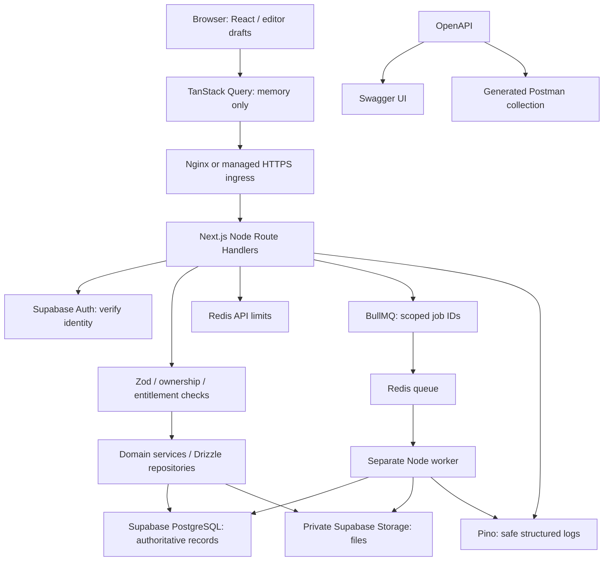

# MindMora Architecture

**Updated:** 2026-10-04. **Target:** accepted full-stack architecture; ✅ 1A runtime and 1B auth code; live Google sign-in/session/logout and refresh/replay acceptance verified; remaining data/features planned.
**Current implementation:** Next.js 16.3.8 Node runtime serving prerendered public pages and `/dev/design-system`, preserved Radix/React UI/Tailwind tokens/session theme, Vitest/Playwright and runtime CI. `src/server/config.ts` lazily validates APP_ORIGIN with Zod and rejects client imports through `server-only`. Four Node force-dynamic auth APIs now implement server PKCE/session/refresh/current-session logout with safe user projection. No sign-in screen, real notes/database, cache provider, Redis, workers or storage integrations. Public pages do not consume auth config; showcase preserved. Preview uses `next start`. Latest live settings returned HTTP 200 with Google enabled; the start flow reached Google’s sign-in page. Live callback/session succeeded; logout returned 204 and the same browser then received 401 unauthenticated. Subsequent live refresh/reuse/concurrency and revoked replay/isolation checks passed 13/13; natural JWT expiry was not awaited.

## Target flow

## Boundaries

PostgreSQL owns knowledge, account data and durable results; private Storage owns bytes. Server services/repositories validate ownership, transact writes and return normalized API results. Never trust browser-supplied owner or entitlement. Drizzle's actual request role must enforce RLS; table policies alone do not constrain a privileged connection.

TanStack Query caches API responses in memory; Zustand controls transient UI; nuqs controls selected IDs/views/filters; drafts belong to editor memory until save. No browser knowledge database or persisted query cache. Protected responses must bypass browser HTTP, Next server, edge/Nginx and service-worker caches. Clear user-specific memory and stale async work on logout/account switch.

Redis handles admission limits and queue coordination; no note-content cache or default general session cache. BullMQ workers are separate backend processes, not browser Web Workers or post-response serverless code. Worker jobs load owner-scoped records and produce private results. Outbox/reconciliation and idempotency arrive with jobs in Phase 4.

Nginx handles HTTPS/proxy routing for self-hosting; managed hosting can supply ingress. Hosting remains unselected; free software does not guarantee free always-on workers. Normal note writes are independent of job enqueue success.

## Security model

Google → Supabase Auth → tested backend-owned session cookies → verified request owner. Use CSRF/origin controls, Zod, ownership/RLS, secure secret handling and redacted Pino logs. Data uses TLS and verified infrastructure/provider encryption at rest. There is no E2EE vault/passphrase/recovery key. Authorized servers/operators can access readable content; notes necessarily exist in browser memory/DOM while being edited. This is a documented trust boundary, not an immunity guarantee.

## Phase 1 and later

Phase 1 migrates runtime Next.js and adds auth, PostgreSQL/Drizzle notes, validation/logging, rate limits, in-memory query/UI/URL boundaries, API docs and tests. It preserves the design system. Phase 2 adds CodeMirror/sanitized preview/autosave. Phase 4 adds Storage/BullMQ/worker jobs. Phase 8 caches public PWA assets only. Phase 10 distinguishes local AI and server jobs and requires provider consent. Phase 13 expands account/Pro lifecycle; initial auth already exists by Phase 1. Runtime/configuration and backend auth code are implemented; live provider checks and other details remain planned.

Retain the 14 phases in [spec §17](PRODUCT_SPEC.md). Automatic Drive sync, Dexie/IndexedDB knowledge, persistent offline editing and E2EE vault flows are superseded. MinIO is excluded; no separate Aiven/Neon database. Optional browser workers/Comlink/local models remain for computation, never persistence.

## Implemented UI foundation

`src/design-system/tokens.css` owns semantic visual values. Controlled UI in `src/components/ui` and `src/components/mindmora` has presentation behavior only; `/dev/design-system` uses sample state. Theme remains session-only. [Design contract](docs/design/design-system.md) and [completed milestone record](.agent/active/design-system.md) describe observed behavior. Historical static output/test claims refer only to that milestone. Milestone 1A reran all nine showcase checks on the Node preview without changing the UI source. The server-only boundary is a build restriction, not permission to serialize secrets into props or responses.

## Implemented auth flow (1B)

Same-origin POST start → official server SDK S256 PKCE + protected pending cookie → Supabase/Google → fixed callback state/code exchange → online getUser → HttpOnly app-session cookie → safe `/session` projection. Near-expiry credentials refresh server-side; local-scope logout revokes current session and clears cookies. Exact Origin protects mutations; all auth responses no-store. No browser auth SDK, Google-token persistence or session database. [ADR-020](docs/decisions/ADR-020-backend-owned-auth-cookies.md) records trade-offs; [auth setup](docs/integrations/supabase-auth.md) records live acceptance gaps. Admission limits/Pino are still 1D; endpoints are not production-ready.

## Details and decisions

- [Full-stack data flow](docs/architecture/full-stack-architecture.md)
- [State ownership](docs/architecture/state-management.md)
- [Security and acceptance tests](docs/architecture/security-architecture.md)
- [Backend services](docs/integrations/backend-services.md)
- [API tooling](docs/integrations/api-tooling.md)
- [Supabase auth](docs/integrations/supabase-auth.md)
- [Hosting budget](docs/integrations/hosting-and-costs.md)
- [ADR-016](docs/decisions/ADR-016-supabase-auth-and-server-data.md), [ADR-018](docs/decisions/ADR-018-full-stack-server-storage.md), [ADR-019](docs/decisions/ADR-019-backend-services-and-api-tooling.md)
- [Phase 1 plan](.agent/active/phase-01-foundation.md) and [roadmap](docs/phases/README.md)

Superseded history remains in ADR-001/002/003/017. No deployment or sensitive-data readiness is established by documentation.
