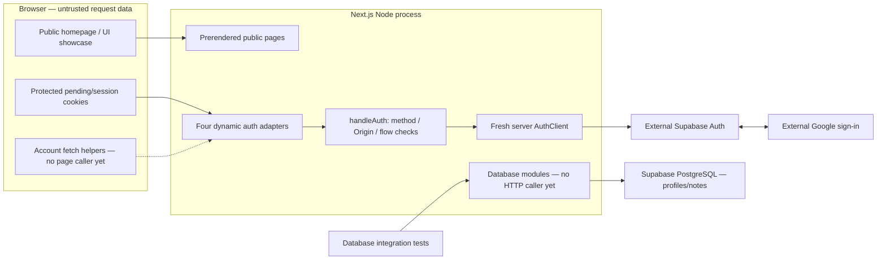
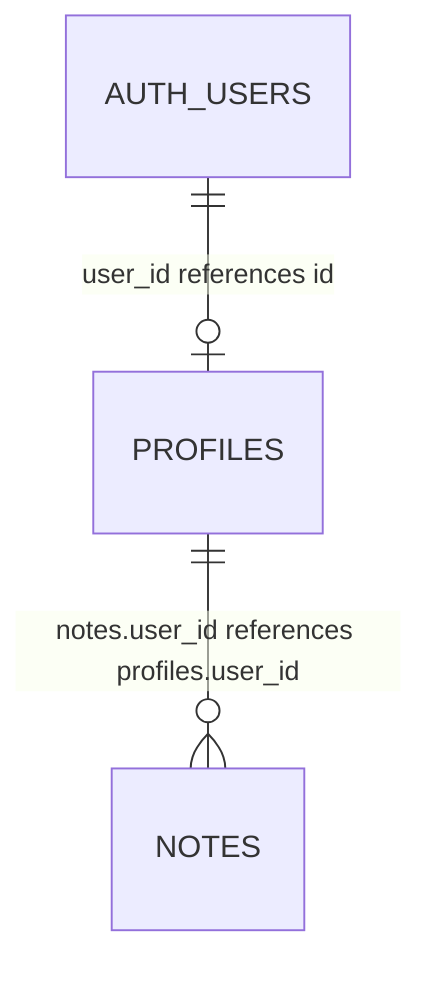

# MindMora Architecture

**Inspected:** 2026-10-04, current source after Milestone 1C. This document owns the technical
system overview. Detailed operating rules live in the linked integration/security guides;
validation evidence lives in the [phase record](docs/phases/phase-01-foundation.md).

## Current system and runtime boundaries

Next.js App Router serves prerendered public pages plus four Node, force-dynamic auth Route
Handlers. React/Tailwind/Radix provide the public UI. The auth-only Supabase SDK is server-side.
Drizzle/postgres-js provide an implemented database boundary, currently called by integration
tests rather than application routes. There is no private workspace, note route or worker.



Solid edges are existing flows; the dotted account-helper edge is an implemented API
helper that product pages do not call. The disconnected database path is deliberate:
`handleAuth` does not import database modules, create a profile or save a note.

| Boundary | Current responsibility | Excluded from that boundary |
|---|---|---|
| UI components/showcase | Controlled presentation and page-lifetime demo/theme state | Identity authority, DB clients, confirmed saves |
| Auth Route Handlers / `handleAuth` | HTTP policy, cookie lifecycle, redirects and safe responses | Profiles, note operations, general admission/logging |
| `provider.ts` / `session.ts` | Supabase protocol, token shape/refresh and online identity verification | Local JWT claims as authorization |
| Shared Zod feature contracts | Runtime data shapes and inferred types | Ownership permission or Markdown sanitization |
| `user-context.ts` | Issue a frozen verified-owner object after online verification | Expiring capability or per-operation revalidation |
| `client.ts` / `schema.ts` | Checked SQL role/transaction, typed queries and model definitions | Repository business rules and HTTP response serialization |
| Database CLI scripts | Privileged migration/login provisioning | Request-serving credentials or automatic credential rotation |

Runtime configuration/auth/database modules use `server-only`. Next rejects
Client Component imports of guarded server configuration. This compile-time restriction
cannot stop explicit secret serialization into a response; safe output remains a separate
boundary. Public pages do not call configuration loaders or open the database.

## Authentication flow

Browser POST start → method/Origin/query checks → PKCE challenge and pending cookie →
Supabase/Google → callback state/code checks → code exchange → online user verification →
app-session cookie → fixed homepage. Later session GETs validate/refresh credentials and
return only user id/email/displayName. Logout verifies the session, revokes its local scope
and clears cookies. [Auth guide](docs/integrations/supabase-auth.md) owns the sequence,
HTTP failures, cookies, configuration and setup; [ADR-020](docs/decisions/ADR-020-backend-owned-auth-cookies.md)
owns the rationale and alternatives.

The cookie is base64url JSON containing bearer credentials, not an application-encrypted
or signed envelope. Fields are untrusted; the server uses Supabase online verification
for identity. HttpOnly protects browser-JS access, not XSS-issued requests, server compromise
or stolen credentials. Cookie lifetime and provider validity are distinct.

## Database flow: implemented library, not a note request path

```mermaid
sequenceDiagram
  participant C as Server caller / integration test
  participant V as verifyDatabaseSession
  participant A as Supabase Auth / test transport
  participant D as Database run(owner, operation)
  participant P as PostgreSQL
  C->>V: Request with protected session cookie
  V->>A: Refresh if needed; getUser(accessToken)
  A-->>V: Verified user projection
  V-->>C: owner + projection + tokens + refreshed
  C->>D: Actual issued owner object + trusted callback
  D->>D: WeakSet membership assertion
  D->>P: BEGIN; inspect actual roles/grants/initial settings
  D->>P: SET LOCAL role and verified claims; set SQL timeouts
  D->>P: Parameterized callback queries
  P->>P: Constraints + auth.uid owner RLS
  alt Callback and commit succeed
    P-->>D: COMMIT; local settings end
    D-->>C: Callback result
  else SQL or callback fails
    P-->>D: ROLLBACK; local settings end
    D-->>C: Safe DatabaseFailure
  end
```

The caller supplies a trusted server callback, not a browser-submitted SQL operation.
Future HTTP adapters must verify every private request, propagate refreshed cookies and
normalize results. None exists yet. `getDatabase` lazily retains a process-local pool;
integration tests use `createDatabase` and explicitly close it. [Database guide](docs/integrations/supabase-database.md)
owns exact role grants, timeouts, failure categories and CLI recovery.

## Data architecture and ownership

Supabase Auth owns provider accounts/sessions. PostgreSQL owns the implemented `profiles`
and `notes` structures. No production page creates either. Profiles reference `auth.users`;
notes reference profiles, with deletion cascades for privileged account cleanup. The
request role has no hard DELETE grant; nullable `deleted_at` prepares soft deletion.



Zod note/profile projections use ISO UTC strings, while Drizzle rows use Date objects.
Schema defaults initialize revision/timestamps; updates do not automatically advance
either. Positive revisions alone do not prevent lost updates. The partial active-note
index prepares bounded cursor queries but implements no pagination operation.
[Note model](docs/features/note-model.md) is the primary field/constraint contract.

Theme/demo state lives in React memory and resets on reload. There is no browser knowledge
DB, query persister, session-token UI store or service worker. The accepted future Query/
Zustand/nuqs ownership model is explicitly [planned](docs/architecture/state-management.md).

## Trust and failure boundaries

Browser cookie fields, query parameters, Origin and all future note input are untrusted.
Auth configuration and runtime inputs are validated, followed by independent provider/
owner verification. Exact configured Origin protects start/logout. Callback intentionally
accepts an external navigation, with pending state/PKCE controls instead of the mutation
Origin rule. A browser-supplied user UUID cannot create a valid owner context.

PostgreSQL trusts the server to choose claims. A holder of runtime DB credentials can
SET ROLE and impersonate an owner; an administrator can bypass RLS. The WeakSet prevents
accidental fabricated objects, not malicious trusted server code. Runtime checks inspect
role flags/grants/clean settings; they do not continuously verify every live policy or
schema definition. [Security](docs/architecture/security-architecture.md) owns the threat
and SEC acceptance matrix; [ADR-021](docs/decisions/ADR-021-scoped-database-role.md) records the SQL choice.

| Failure boundary | Current observable behavior |
|---|---|
| Invalid auth config/provider unavailable | Auth route returns safe 503; auth never grants access |
| Bad flow, method, Origin or credentials | 400/405/403/401 according to auth policy; cookies cleared as specified in the guide |
| Browser session helper network/bad JSON/non-success | Fixed error; session HTTP 401 alone maps to null |
| Fabricated owner | AuthFailure before database transaction |
| SQL role/state failure, constraint, timeout or callback exception | Transaction rejects/rolls back; fixed DatabaseFailure with safe reason; no app HTTP mapping yet |
| Provisioning interrupted/ambiguous commit | Private pending credentials retained; operator reconciliation, no automatic rotation |

Auth SDK refresh can retry transient errors; per-fetch timeout is not a total deadline.
The DB wrapper has no explicit retry/reconciliation. A lost commit response can be ambiguous,
so a database exception is not universal proof that nothing committed. Production ingress,
provider encryption at rest/backups/restore and private cache lifecycle are not validated.

## Accepted target, separately from implementation

1D adds general HTTP policy/Pino/Redis admission; 1E adds profile creation and owner-filtered,
revision-safe note repositories/APIs; 1F/1G add protected UI, temporary cache/state and save
feedback; 1H completes contract tooling. Phase 4 adds private Storage/BullMQ/outbox/worker.
[Planned data flows](docs/architecture/full-stack-architecture.md) describe those future
save/conflict/file/job interactions without implying current callers. Google sign-in is
already Phase 1, while Phase 13 expands the account/entitlement lifecycle.

Architectural constraints: one canonical PostgreSQL database; no persistent browser
knowledge/offline queue, E2EE vault, automatic Drive sync, MinIO or second production DB.
Nginx is optional ingress if self-hosted; no host/always-on worker is selected. See
[ADR-016](docs/decisions/ADR-016-supabase-auth-and-server-data.md),
[ADR-018](docs/decisions/ADR-018-full-stack-server-storage.md),
[ADR-019](docs/decisions/ADR-019-backend-services-and-api-tooling.md) and
[PRODUCT_SPEC](PRODUCT_SPEC.md). Superseded ADRs remain historical, not current instructions.
