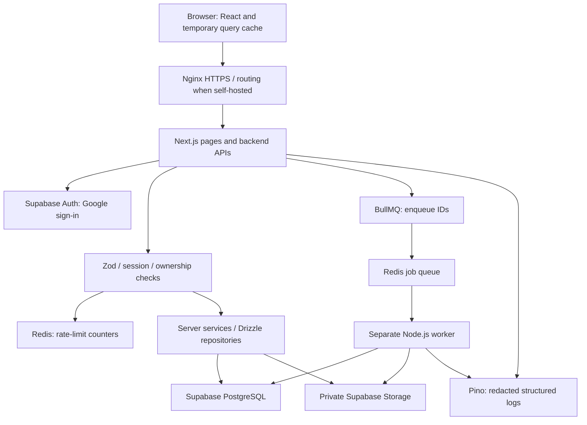
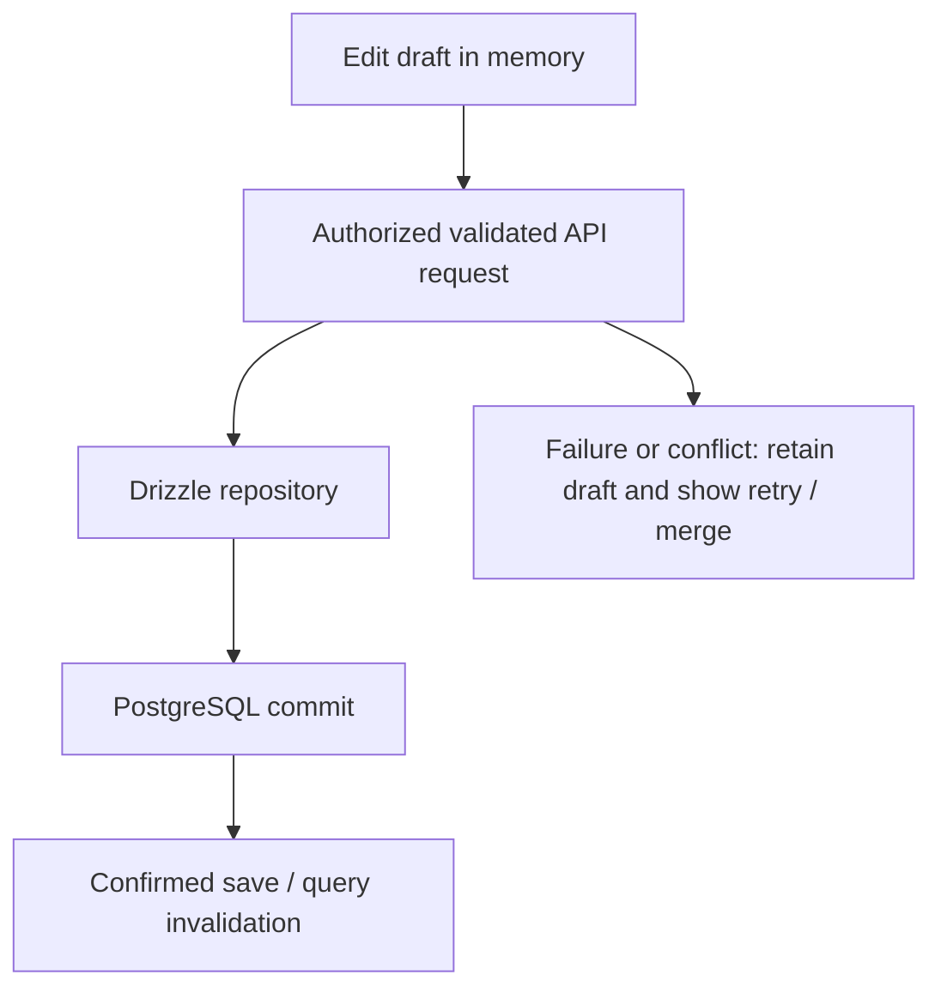

# MindMora — Product Specification (v3)

> **Your knowledge. Your files. Your control.**

**Target reader:** Codex and human contributors.
**Updated:** 2026-10-07 — implementation-status synchronization through Phase 3; v3 requirements remain unchanged.
**Implementation status:** ✅ Phase 1 code includes the shared UI, Next Node runtime, backend-owned Google/Supabase sessions, scoped PostgreSQL/RLS note CRUD, Redis admission/Pino/startup health, protected workspace with memory-only query/UI/URL state, generated OpenAPI/Postman plus opt-in Swagger. ✅ Phase 2 adds CodeMirror source/formatting, Edit/Preview/Split, safe local Markdown/math/Mermaid and revision-safe serialized autosave/recovery. ✅ Phase 3 adds portable wiki links/completion, guarded missing-note creation, committed backlinks, inline tags and owner-scoped keyword search with transactional derivation and revision-safe backfill. Knowledge reads/UI remain gated until operator migration/backfill verification. Private Storage and jobs/workers remain later phases. Hosted migration/application and production readiness remain separate from local fixture verification. [Current architecture](ARCHITECTURE.md) and [dated Phase 3 evidence](docs/phases/phase-03-knowledge.md) distinguish implementation from provider/production acceptance.
**Budget:** Target free tiers for approximately 3–4 daily users. Free software does not include free hosting, unlimited storage, uninterrupted availability or unlimited worker compute. Verify current limits before introducing services; no paid infrastructure or paid AI dependency without explicit user approval. Optional BYOK usage is paid by the user.

## Revision summary

The full-stack model supersedes the v2 local-first architecture: Supabase PostgreSQL becomes authoritative; Drizzle repositories and Next.js backend APIs handle knowledge data; Supabase Auth supplies Google sign-in; private Supabase Storage holds files. Remove Dexie/IndexedDB note persistence, E2EE vaults, passphrase/recovery-key flows and automatic Drive synchronization from active scope. Keep existing UI and product features, TanStack Query, Zustand, nuqs and optional on-device AI. Add Zod, Pino, Redis, BullMQ/workers, optional Nginx and OpenAPI/Swagger/Postman. Historical decisions remain marked superseded.

---

## 1. What MindMora Is

MindMora is a **full-stack personal knowledge workspace** combining Markdown notes, wiki links/backlinks, knowledge graphs, canvas, tasks, database views, and optional AI. One authenticated user accesses their workspace from several devices through a shared backend.

```text
Laptop / phone / tablet → HTTPS → Next.js frontend + backend
                                      ↓
                          Supabase PostgreSQL + private Storage
```

Team collaboration, real-time multi-user editing and CRDT sync remain outside v1. Users retain portable Markdown/JSON import/export. The application server and authorized infrastructure can process readable content; this product does not claim end-to-end encryption.

---

## 2. Core Principles

| Principle | Meaning |
|---|---|
| Server-authoritative | PostgreSQL commits establish durable saves; browser drafts/cache are temporary |
| Portable knowledge | Markdown/JSON import/export prevents format lock-in |
| Secure by design | Verified identity, ownership, RLS, validation, HTTPS, encryption at rest and redacted logs |
| Free-tier target | Small-scale deployment within verified quotas; capacity and availability are bounded |
| Open & extensible | Sandboxed, explicitly permissioned plugins |
| Privacy | Optional analytics off by default; never log note bodies or credentials |

```text
Edit in memory → API → validate/authenticate/authorize/rate-limit
→ Drizzle repository → PostgreSQL commit → success → TanStack Query refresh
```

Without connectivity, an existing in-memory draft may remain editable in the same tab, with an unsaved warning. No durable offline saves, persisted browser note cache or automatic offline mutation replay. Refresh/closing the tab can lose an unsaved draft. Do not present a cache-only update as a saved note.

---

## 3. Full-Stack Architecture

Next.js App Router runs as a Node.js application with backend Route Handlers. Milestone 1A completed the Node runtime migration; public homepage/showcase pages remain prerendered and auth/note routes are dynamic. Milestone 1E implemented note repositories/APIs. The diagram below describes the full target: private UI/state is implemented in 1F/1G; private Storage, queues/workers and optional ingress remain planned. Current implemented boundaries are documented in [ARCHITECTURE](ARCHITECTURE.md).



Request checks and their ordering are defined by the security design; expensive work follows admission checks. Nginx handles HTTPS/routing for self-hosted deployment and optional edge limits/load balancing. Managed hosting can supply these functions without a separate Nginx instance. Redis and workers are backend-only, never public browser connections. Regular note saves go directly to PostgreSQL, not through BullMQ.

No persistent knowledge in IndexedDB, localStorage, sessionStorage or service-worker Cache Storage. Browser memory is necessary to display/edit fetched notes. Database/storage encryption keys stay with the server/provider key-management system, not in a browser vault. No MinIO, Aiven, Neon, second database, or user-held vault secrets are part of the selected stack.

---

## 4. Tech Stack

### 4.1 Application and backend

| Layer | Choice | Responsibility |
|---|---|---|
| Framework | Next.js App Router + Node.js Route Handlers | Frontend and backend API |
| Language | Strict TypeScript | Compile-time types |
| Styling / UI | Tailwind + existing Radix-based shared design system | Accessible, responsive UI using semantic tokens |
| Identity | Supabase Auth with Google | Sign-in and session lifecycle |
| Database / ORM | Supabase PostgreSQL + Drizzle ORM/Kit | Knowledge records, profiles, entitlements, schema/migrations |
| Files | Private Supabase Storage | Attachments, generated exports, authorized downloads |
| Validation | Zod | Runtime form/API/job/config schemas |
| Logging | Pino | Structured JSON request/worker logs with redaction |
| Temporary backend state | Redis-compatible service (Upstash candidate) | Rate limiting and job coordination |
| Jobs | BullMQ OSS + separate Node.js worker | Durable queue, retries, exports/indexing/optional AI |
| Gateway | Nginx when self-hosted | HTTPS, proxy routing, optional edge limits/load balancing |
| API contract | OpenAPI + Swagger UI + Postman collection | Endpoint contracts, interactive docs and testing |

### 4.2 State ownership

| Owner | Scope |
|---|---|
| PostgreSQL / Drizzle server repositories | Authoritative persisted records and preferences |
| Supabase Storage | Private file bytes; database owns metadata |
| TanStack Query | API-fetched notes and other server state, **in-memory only**, mutations/invalidation |
| Zustand | Transient UI/panes/dialogs; no duplicated canonical notes/session tokens |
| nuqs | Shareable URL selection/filter/view; no secret or content in URLs |
| Editor state | Unsaved draft; explicit error/conflict handling |
| Redis | Expiring counters and job coordination, not canonical knowledge or session authority |

### 4.3 Editor and content

Retain CodeMirror 6; unified/remark/rehype with sanitization; remark-math/KaTeX; Mermaid; cmdk; react-hotkeys-hook; @dnd-kit/core. Library/version/license checks occur before installation. Existing shared components/tokens remain the UI contract.

### 4.4 Animation and visualization

Motion where justified; React Three Fiber/drei for an optional lazy-loaded 3D graph. Retain responsive, keyboard and reduced-motion requirements.

### 4.5 Search

PostgreSQL full-text search is the planned authoritative corpus search, scoped to the verified user. FlexSearch/MiniSearch/fuse.js may provide temporary on-device filtering over authorized fetched data. Do not rebuild the full library on every refresh or persist private search caches in the browser. Index/update work can use BullMQ in Phase 4.

### 4.6 Two different worker types

Server BullMQ workers process durable jobs independently of the browser. Browser Web Workers/Comlink remain optional for heavy graph/rendering/local AI while the tab is open. They do not replace server job workers. Workbox may cache public app assets in Phase 8; browser background-sync note queues and persisted offline notes are removed.

### 4.7 AI

Keep Transformers.js for optional local embeddings and WebLLM or a user-run Ollama endpoint for local generation. BYOK adapters for OpenRouter/Gemini/OpenAI/Anthropic remain optional. Server AI jobs require bounded runtime, ownership checks, explicit provider consent and quota validation; local AI remains available where hardware supports it.

---

## 5. Server Database and File Storage

PostgreSQL owns notes, folders, links/backlinks, tags, canvas, tasks, properties, preferences, versions, profiles, entitlements and persistent derived knowledge (chunks/embeddings when introduced). Private Supabase Storage owns attachment/export bytes; PostgreSQL records object references, owner, size, media type and lifecycle status.

Phase 1 minimum: profiles and notes. Note fields: UUID `id`, verified `userId`, title, Markdown content, UTC created/updated timestamps, integer revision and nullable deletion timestamp. Use a `(userId, updatedAt, id)` index with bounded pagination; repository filters always include verified ownership. Profile keys derive from Supabase Auth identity. Add other models only when their features begin.

Use versioned Drizzle migrations, bounded connections/pooling, transactions, owner isolation and RLS. Direct database credentials or service roles may bypass RLS: select/test a constrained request role and transaction-local verified claims before production CRUD. RLS cannot be assumed just because a table has policies. Test actual Drizzle connections with two users. Service credentials never enter client bundles.

Updates/deletes compare expected revision and ownership atomically. A stale revision yields a conflict response; preserve the user's draft rather than silently replacing another device's edit. Regular database writes do not depend on queue availability. No browser knowledge schema, ciphertext envelopes, Dexie tables or vault headers.

---

## 6. API, Multi-Device Access and Background Jobs

### 6.1 Identity and requests

Google sign-in through Supabase Auth establishes MindMora identity; the backend validates the session on every protected request. Use a server-owned secure cookie flow (§20), not custom password/token tables. Google sign-in does not grant Drive file access.

### 6.2 Multi-device access

All devices fetch the same server records. TanStack Query refetches on reconnect/focus as appropriate; use reasonable staleness and bounded requests. Saved changes appear on refetch. No Drive mirror, browser sync queue, CRDT or realtime collaboration required.

### 6.3 Queues

Use BullMQ OSS with Redis for exports, attachment processing, derived search indexing and optional server AI jobs. Worker runs as a separate Node process with its own hosting/lifecycle. Enqueue small references (`jobId`, verified owner, record/object IDs and expected revision), not note bodies, API keys or tokens. Workers reload authorized data from PostgreSQL, check cancellation/deletion/current revision, validate job schemas and write scoped results.

The server-side job plan must define idempotent handlers, bounded retries/backoff, timeouts, concurrency, cancellation, failure visibility, retention and cleanup. A PostgreSQL job/outbox record plus replay/reconciliation prevents a committed write from losing required background work if Redis enqueue fails. Add that pattern with queue features, not speculative Phase 1 tables. Redis must support BullMQ commands and `noeviction`; test the selected provider/configuration. Avoid storing note bodies in Redis caches.

### 6.4 Results

Backend returns an owned job ID. Frontend polls a bounded status endpoint through TanStack Query. Completion returns a short-lived authorized download or scoped result. Redis alone is not the durable authority for the user's exported files.

### 6.5 Conflicts and outages

Handle 401/session expiry, 403/ownership or entitlement denial, 404, 409/revision conflict, 429/rate limit, malformed requests and 5xx/dependency failures with typed errors. A timed-out write may have committed: re-fetch/reconcile before retrying; use idempotency keys where duplicate creation or job requests matter. Draft stays in memory while the tab is open; no persisted offline replay queue.

---

## 7. AI — Optional Local Models and BYOK

**Local AI requires no paid API key**, subject to model downloads and compatible user hardware. Server data still needs connectivity; local model execution does not make the workspace offline-first.

```text
                 ┌────────────────────────┐
                 │   AI Capability Tier    │
                 └────────────────────────┘
  Tier 0 (optional local retrieval, no paid API key)
    → Transformers.js local embeddings (MiniLM-class, ONNX, quantized)
    → Used for: semantic search, "Ask Your Notes" retrieval
    → No paid API key; model download and authorized note fetch require connectivity; runs in a Web Worker

  Tier 1 (optional local generation, no paid API key)
    → WebLLM (WebGPU) small model (e.g. Llama-3.2-1B / Phi-3-mini class)
      running entirely in-browser, OR a local Ollama server the user
      already has running on their machine
    → Used for: summaries, flashcards, quiz gen, chat answers
    → No paid API key; generation stays on-device after model/data loading

  Tier 2 (optional, user-paid)
    → BYOK: OpenRouter / Gemini / OpenAI / Anthropic
    → Used for: higher-quality generation when the user opts in
    → User supplies and pays for their own key; MindMora never subsidizes provider usage
```

### 7.1 Ask Your Notes (local RAG)

```text
Question
   ↓
Owner-scoped server retrieval + optional local embeddings/ranking
(or temporary FlexSearch over authorized fetched notes)
   ↓
Top-K relevant chunks
   ↓
Context assembly
   ↓
Tier 1 local generation OR Tier 2 BYOK model (user's choice); Tier 0 supplies retrieval only
   ↓
Answer + cited source notes
```

### 7.2 Advanced RAG (Phase 10C)

- Chunking (heading-aware, token-budgeted)
- Local embeddings via Transformers.js; persisted derived records go through authorized APIs to PostgreSQL, never IndexedDB
- Hybrid search: owner-scoped PostgreSQL keyword retrieval + semantic ranking; temporary local ranking is optional
- Metadata filtering (tags, folders, properties)
- Optional reranking (cross-encoder, only if user opts into a BYOK model for it)

### 7.3 AI feature list

These are planned capabilities, not implemented status. Generation needs Tier 1 or Tier 2; Tier 0 supports retrieval only.

| Feature | Tier 0/1 (free/local) | Tier 2 (BYOK) |
|---|---|---|
| Semantic search | Planned | Planned (better quality) |
| Ask Your Notes | Planned (small model) | Planned (larger model) |
| Summaries | Planned | Planned |
| Flashcard generation | Planned | Planned |
| Quiz generation | Planned | Planned |
| Action item extraction | Planned | Planned |
| AI note-connection suggestions | Planned | Planned |

---

## 8. Free Features (v1 core — unchanged from original, consolidated)

- **Markdown notes**: create/edit/delete/rename/move/organize; headings, bold/italic, lists, checklists, links, images, tables, code blocks, blockquotes, math (KaTeX), diagrams (Mermaid)
- **Wiki links**: `[[Note]]` with autocomplete, missing-note creation, navigation
- **Backlinks**: linking notes, counts, context previews
- **Knowledge graph**: global graph, zoom/pan/search, basic filters; server data, client visualization
- **Infinite canvas**: text/note/image/link cards, drag, resize, connect, multi-select, saved as JSON
- **Folders**: nested, create/rename/delete/move/collapse
- **Tags**: `#tag`, browser, filtering
- **Basic search**: titles, content, tags — authorized server search and optional in-memory filtering
- **PWA shell**: installable, public app assets cached; connection required for durable note access/saves
- **Daily notes**: today's note, prev/next nav, calendar picker
- **Templates**: `{{title}}`, `{{date}}`, `{{time}}`, `{{weekday}}`
- **Basic tasks**: `- [ ]` / `- [x]` detection, cross-note task view
- **Properties**: YAML frontmatter (`status`, `priority`, `category`, custom keys)

### 8.1 New free-tier additions

| Feature | Description |
|---|---|
| Command palette (⌘K) | Jump to note, run any action, switch views |
| Quick switcher | Fuzzy note search (`fuse.js`) |
| Vim / Emacs keymap toggle | Optional editing mode in CodeMirror |
| Focus / Zen mode | Distraction-free single-note editing |
| Theming | Light/dark + a few free accent themes; respects `prefers-color-scheme` |
| Import | From a local Markdown folder, or an Obsidian vault (`.md` + frontmatter) |
| Export | User-authorized Markdown/JSON/ZIP and PDF exports; private stored results with expiring downloads; exported plaintext is the user's responsibility |
| Version history (basic) | Owner-scoped snapshots/diffs in PostgreSQL with bounded retention |
| Account security foundation | Phase 1: Google sign-in, verified sessions, ownership/RLS, validation, redacted logs and protected server persistence |
| i18n scaffold | `next-intl` or similar, English first, structure ready for more languages |
| Plugin system (see §11) | Sandboxed, community-extensible; backend rechecks every data operation |

---

## 9. Pro Features

| Feature | Notes |
|---|---|
| Advanced search | `tag:`, `folder:`, `status:`, `priority:` query syntax |
| Advanced tasks | Due dates, recurrence, priorities, calendar, dashboard |
| Database views | Table, Kanban, Calendar, Gallery |
| Query engine | `FROM notes WHERE status = "active" AND priority = "high"` |
| Advanced graph | Depth control, filters, layouts, tag nodes |
| Advanced canvas | Groups, templates, advanced node types, embeds |
| Full version history UI | Compare/restore/review — server records with retention and ownership checks |
| Premium templates | Curated packs (student, dev, PM, journaling, interview prep, AI learning) |
| Plugin marketplace curation (new) | Highlighted/verified community plugins |

> Pro UI may run in the browser, but protected APIs and job requests enforce verified entitlements server-side. Pricing/payment-provider integration remains a later decision. Quotas apply to hosted storage and computation.

---

## 10. 3D Knowledge Graph (unchanged)

React Three Fiber, lazy-loaded, opt-in. Rotate/zoom/pan/select/focus/navigate. Never forced into the main UI path; 2D graph stays the performant default.

---

## 11. Plugin System (new)

A lightweight, sandboxed extension API so the community can add features without baking every extension into the core application.

```text
plugins/
├── manifest.json        (name, permissions requested, entry point)
├── index.ts              (registers commands, views, or note processors)
└── ui/ (optional custom panels)
```

Design constraints:
- Plugins run in a sandboxed context (e.g. an iframe or restricted worker) — never raw `eval` of untrusted code with full app access
- Permission model: a plugin must declare what it touches (read notes, write notes, network access, etc.) and the user approves it
- Plugin distribution: a static JSON index hosted on GitHub Pages (free) or the user manually loading a local plugin folder — no MindMora-run plugin backend required
- Browser permission approval never substitutes for backend ownership/entitlement checks
- Full sandbox mechanics, permission list, and threat model: §21.2

---

## 12. Docker and Runtime Deployment

Disposable Docker PostgreSQL/Redis-compatible fixtures are implemented for local integration and production-preview tests. Application container packaging and Compose remain planned. Compose may run Next.js Node, local PostgreSQL/Redis for development, a separate worker and optional Nginx. Supabase Auth/Storage integration needs an explicit dev/test project or supported local Supabase tooling; local PostgreSQL alone does not emulate those services.

Production architecture uses Supabase managed services; do not create a second production PostgreSQL just because Compose has a dev database. Server/worker secrets stay in server configuration or a managed secret store. Never embed secrets into images or client bundles. Static `out/` hosting is historical UI behavior, not the full-stack deployment target.

Files planned with the relevant milestone: `Dockerfile`, `docker-compose.yml`, `.dockerignore`, worker entrypoint, optional `infra/nginx/nginx.conf`. Application/worker runtime containers and Nginx configuration remain planned; disposable PostgreSQL/Redis test containers already exist.

---

## 13. CI/CD and Hosting

Existing GitHub Actions validates runtime Next.js and the UI: locked install → dependency audit → lint → typecheck → unit/component tests → generated API drift/contract checks → Redis and database/RLS integration → compiler/runtime boundaries → production build → startup connectivity/process checks → Playwright showcase/runtime and auth/workspace/Swagger/Postman fixtures. These local fixtures do not prove hosted-provider or production readiness. Queue integration checks arrive with Phase 4. Never use real user data in CI.

CD must deploy a Node-compatible Next.js runtime and, when queued work is introduced, a separate worker process. Self-hosting may use Nginx; managed ingress may replace it. Static-only hosts cannot run backend APIs or a persistent BullMQ worker. A serverless request handler cannot be assumed to execute work after returning a response.

Backend, worker and ingress hosting provider remain unselected. Verify current free-tier runtime limits, sleep behavior, acceptable use, credit-card requirements, Redis TCP connectivity and storage/compute quotas before committing to a host. No artificial keep-alive traffic to promise permanent free availability. Deployment, billing changes and paid resources need explicit authorization.

---

## 14. Testing & Quality Tooling (expanded — filled a gap in the original spec)

### 14.1 Testing

| Tool | Free? | Used for |
|---|---|---|
| Vitest | ✅ Free/open source | Unit tests |
| React Testing Library | ✅ Free/open source | Component tests |
| Playwright | ✅ Free/open source | E2E / browser tests |
| Postman | ✅ Free plan | Import generated OpenAPI collection; test MindMora auth, notes, files and job APIs with disposable users |

### 14.2 Code quality & type safety

| Tool | Free? | Used for |
|---|---|---|
| ESLint | ✅ Free/open source | Code quality, consistent style |
| TypeScript (`tsc --noEmit`) | ✅ Free/open source | Type checking |

### 14.3 Performance & accessibility auditing

| Tool | Free? | Used for |
|---|---|---|
| Lighthouse | ✅ Free/open source | Performance, accessibility, PWA audits |
| Web Vitals | ✅ Free/open source | Real-user performance metrics (CLS, LCP, INP) |

### 14.4 Operational logging and optional monitoring

Pino structured backend/worker logging is required. Sentry, PostHog and UptimeRobot are optional external monitoring/analytics, off by default with explicit opt-in:

| Tool | Free? | Used for |
|---|---|---|
| Sentry | ✅ Free tier | Error/crash tracking |
| PostHog | ✅ Free tier | Product analytics |
| UptimeRobot | ✅ Free tier | Optional uptime monitoring of deployed web/API services |
| Pino | ✅ Free/open source | Required backend/worker JSON logs; redacted, bounded and access-controlled |

External monitoring is optional and quota-bound. Pino operational logging is required when backend/worker features exist; it is not opt-in analytics. No request/response bodies, cookies, tokens, BYOK keys or note content in logs. Log storage/retention also consumes hosting resources.

### 14.5 Security testing

A dependency security audit (`npm audit`) and the security-specific test suite (sanitization, authentication, owner/RLS isolation, CSRF, validation, log redaction, plugin permissions and BYOK key handling) are required additions to CI — full list and pipeline placement in §21.9.

Run the §14.1 and §14.2 tools in the GitHub Actions CI pipeline before build/deploy; §14.3 runs in CI or locally pre-release; §14.4 Pino runs with backend/worker services; external monitoring runs only with opt-in; §14.5/§21.9 security checks run in CI on every PR/push.

---

## 15. Technology Responsibility and Cost Table

| Technology | Responsibility | Cost boundary |
|---|---|---|
| Next.js / React / TypeScript / Tailwind / Radix | Web UI and Node backend | Software free; runtime hosting separate |
| TanStack Query / Zustand / nuqs | API cache in memory / transient UI / URL state | Bundled libraries |
| Supabase Auth | Google sign-in and auth lifecycle | Hosted free-tier quotas |
| Supabase PostgreSQL + Drizzle | Canonical data, schema, migrations, owner-scoped queries | Hosted database quota; ORM free |
| Supabase Storage | Private attachments and exports | File size/storage/egress quotas |
| Zod | Runtime validation | MIT library |
| Pino | Redacted structured logs | MIT library; log hosting separate |
| Redis-compatible Upstash candidate | Counters and job coordination | Free quota; verify encryption/configuration/compatibility |
| BullMQ OSS + worker | Background processing | MIT library; Redis and worker hosting separate |
| Nginx OSS | Optional self-hosted HTTPS/reverse proxy | Software free; server/cert management separate |
| OpenAPI / Swagger UI / Postman | API spec, interactive docs, test collection | Use open tools/free Postman allowance |
| CodeMirror / unified / remark / rehype / KaTeX / Mermaid | Editing and safe rich rendering | Verify versions/licenses before introducing |
| Motion / R3F / drei | Optional animation/3D | Bundled libraries |
| FlexSearch / MiniSearch / fuse.js | Optional in-memory filtering | No persistent browser corpus |
| Transformers.js / WebLLM / Ollama | Optional local AI | User hardware and downloads |
| Comlink / browser workers / Workbox | Responsive client compute; public PWA shell | No private durable browser cache |
| BYOK adapters | Optional provider generation | User pays provider usage; explicit consent |
| Docker / GitHub Actions / Vitest / Playwright | Runtime development, CI, verification | Check hosted CI/container allowances |

Library freedom is not a guarantee of hosted availability. See [hosting budget](docs/integrations/hosting-and-costs.md).

---

## 16. Suggested Project Structure

Existing design-system modules stay in place. New paths below are proposals, not created files.

```text
src/
├── app/                         Next pages/layouts and api/ Route Handlers
├── components/ui/               Existing accessible primitives and theme
├── components/mindmora/          Existing controlled feature patterns
├── design-system/               Existing semantic tokens and component CSS
├── features/                    Domain types, schemas, client API hooks, feature UI
│   ├── notes/ account/ billing/ editor/ search/
│   └── graph/ canvas/ tasks/ properties/ ai/ plugins/ ...
├── server/                      Server-only auth/config/database/services
│   ├── auth/ db/ logging/ http/ rate-limit/
│   ├── notes/ storage/ jobs/ ai/
│   └── repositories/            Add shared repos only where useful
├── lib/                         Query provider, nuqs, validated API client
├── stores/                      Transient UI only
├── workers/                     Optional browser Web Workers
└── plugins/                     Sandboxed client capabilities
workers/                         Separate Node BullMQ worker entrypoints
supabase/migrations/             Versioned Drizzle-generated/reviewed SQL, RLS policies
infra/nginx/                     Optional self-hosted ingress configuration
docs/api/                       OpenAPI contract and generated Postman collection
.agent/active/                  Canonical execution plans
tests/                          Unit/integration/E2E boundary verification
```

Use `server-only` boundaries so client code cannot import database credentials, logging/queue clients or worker handlers. Frontend Zod schemas can be shared without importing server implementations.

---

## 17. Development Phases

Keep the 14-phase roadmap, with revised scopes and dependencies. Detailed plans for later phases are created as those phases begin; Phase 1, Phase 2 and Phase 3 execution records are complete locally; Phase 4 is unstarted.

| Phase | Scope |
|---|---|
| 1 — Full-stack foundation | Preserve UI; runtime Next.js; Google sign-in/session; PostgreSQL/Drizzle/RLS notes; Zod/Pino; Redis rate limits; TanStack Query/Zustand/nuqs; OpenAPI/Swagger/Postman; CRUD/tests/docs |
| 2 — Editor | CodeMirror, sanitized Markdown, server-confirmed autosave with revisions/conflicts |
| 3 — Knowledge features | Wiki links, backlinks, tags, owner-scoped basic search; optional in-memory quick filtering |
| 4 — Jobs and attachments | Private Storage; BullMQ/Redis worker; export/indexing/attachment jobs; outbox/reconciliation, retry/idempotency and status APIs |
| 5 — Graph | Owner-scoped graph API; client 2D and optional lazy 3D |
| 6 — Canvas | Server save/load, cards/connections, conflict handling and accessible interaction |
| 7 — Productivity | Daily notes, templates, tasks and properties in PostgreSQL |
| 8 — PWA shell | Installability/public asset caching; connectivity UI; no durable offline notes/private response caching |
| 9 — Pro features | Advanced search/tasks/views/query/graph/canvas/history/templates; enforce provisional entitlements on backend |
| 10 — AI + RAG | 10A optional local generation; 10B retrieval + cited answers; 10C chunks/embeddings/hybrid ranking; scoped server AI jobs where approved |
| 11 — Plugins | Sandbox/capabilities/static index; server-side access checks still required |
| 12 — Polish and portability | Command palette, keymaps, import/export, i18n, performance/accessibility and tests |
| 13 — Accounts and Pro lifecycle | Expand Phase 1 profiles; verified entitlement/upgrade lifecycle; payment provider only when explicitly scoped |
| 14 — Security and operational hardening | Review existing controls, restore drills, quotas/retention, deployment and job resilience; no postponed foundational controls |

Sign-in and ownership move from Phase 13 to Phase 1. Phase 4 replaces Drive sync; Phase 8 loses durable offline knowledge. E2EE milestones 1C.1–1C.3 are removed. Nginx runtime integration is conditional on hosting choice and planned with deployment verification. The existing static design-system milestone stays valid evidence for UI only.

---

## 18. Development Rules

1. Strict TypeScript; no `any`; validate external input with Zod.
2. Full-stack Next.js Node backend; isolate server-only modules and credentials.
3. Supabase PostgreSQL owns knowledge. Drizzle repositories enforce verified user ownership; test actual RLS roles.
4. No Dexie/IndexedDB or other persistent browser knowledge database, query-cache persister, offline mutation queue or private service-worker cache.
5. TanStack Query caches API data in memory, scoped to user/session; invalidate on writes and clear on logout/account switch.
6. Zustand owns transient UI only; nuqs owns URL selection/filter state; unsaved drafts belong to editor memory.
7. Google sign-in through Supabase Auth is required for private workspace access; provider tokens are not application authorization.
8. Keep routes/services/repositories/UI modular; preserve the shared design-system contract.
9. Handle loading, dependency outage, expiry, conflicts, throttling and failed saves; never silently overwrite revisions.
10. Show saved only after PostgreSQL confirms persistence. No offline-durability promise.
11. Sanitize Markdown/rich content; strict compatible CSP; no `eval()`/`new Function()`.
12. Worker jobs use verified owner/record IDs, bounded retries, idempotency and retention. Do not put secrets or note bodies in Redis/job logs.
13. Redis rate limiting and queues are independent from regular note persistence; queue failure cannot masquerade as a failed committed save.
14. Pino logs IDs/operation/status/duration and safe errors only; redact cookies/tokens/keys/note content.
15. Keep optional browser workers/local AI/lazy 3D; respect reduced motion and accessibility.
16. Verify dependency versions/licenses and hosted quotas before introducing them; no paid service without approval.
17. BYOK is optional; never require paid AI for core note features, or silently send content to a provider.
18. Plugins run sandboxed with approved capabilities; backend independently enforces authorization.
19. Version migrations and API contracts. OpenAPI/Swagger and generated Postman examples never contain real tokens or private notes.
20. Test-first application behavior, required checks and applicable integration/E2E tests. Documentation is part of done.
21. No end-to-end vault encryption, vault passphrase/recovery keys or MinIO. Enforce TLS and server/provider encryption at rest; disclose server-readable content.
22. Backend auth/session/security controls precede real note CRUD; follow current SEC-01–SEC-10 acceptance criteria.
23. Work milestone-by-milestone through `.agent/active/`; only implement the authorized milestone and stop for review.
24. Explain what changed, why, important files, runtime flow, concepts, verification and limitations after every milestone.
25. Maintain `docs/FILE_MAP.md` for significant existing files; do not claim proposed modules exist.
26. Maintain MindMora-specific `docs/LEARNING.md`; distinguish implemented examples from planned explanations.
27. Use conventional Git messages when commits are requested (e.g. `feat: add authenticated note API`, `docs: revise backend architecture`). No AI attribution or co-author trailers. Keep documentation in version control; do not ignore these Markdown files.
28. Never commit secrets, force-push or assume permission to deploy/pay. Docker/CI changes arrive with their authorized milestones.

---

## 19. Documentation-First Development Process

MindMora is also a learning and portfolio project. For every significant implementation — feature, architecture decision, or major piece of logic — maintain documentation that explains: what's being built, why it's needed, how it works, why this architecture was chosen, how data flows, which technologies are involved, important trade-offs/limitations, and how it connects to the rest of MindMora. The end goal: be able to confidently explain the architecture and major decisions in an interview from the docs alone.

Do not document trivial code. Focus on architecture, non-trivial features, decisions, and learning-relevant systems.

### 19.1 Docs folder structure

This is a growing target tree, not an inventory of implemented documents. See `docs/README.md` for actual files; create future feature/concept/phase docs when work begins.

```text
docs/
├── README.md
├── architecture/
│   ├── overview.md
│   ├── frontend-architecture.md
│   ├── data-flow.md
│   ├── state-management.md
│   ├── full-stack-architecture.md
│   ├── technology-decisions.md
│   └── security-architecture.md     (new — §21)
├── phases/
│   └── phase-01-foundation.md … phase-14-security.md (later records created when work begins)
├── features/
│   ├── notes.md · editor.md · wiki-links.md · backlinks.md
│   ├── search.md · sync.md · graph.md · graph-3d.md
│   ├── canvas.md · tasks.md · properties.md
│   ├── daily-notes.md · templates.md · pwa.md · plugins.md
│   └── attachments.md · jobs.md (created as implemented)
├── ai/
│   ├── ai-overview.md · local-ai.md · byok.md
│   ├── rag-overview.md · embeddings.md
│   └── semantic-search.md · hybrid-search.md
├── integrations/
│   └── supabase-auth.md · api-tooling.md · backend-services.md · hosting-and-costs.md
├── concepts/
│   ├── postgres.md · drizzle.md · zustand.md · tanstack-query.md
│   ├── nuqs.md · web-workers.md · service-workers.md · background-jobs.md
│   └── sessions.md · runtime-validation.md
├── decisions/
│   └── Historical ADRs plus ADR-016, ADR-018-full-stack-server-storage.md,
│       ADR-019-backend-services-and-api-tooling.md
├── diagrams/
│   └── architecture-diagrams.md
└── interview/
    ├── project-explanation.md
    ├── architecture-questions.md
    └── technical-questions.md
```

### 19.2 Workflow — before and during every phase

```text
Plan feature → Document architecture → Implement → Test
   → Update feature docs → Record decisions (ADR if significant)
   → Update README if needed → Add interview explanation
```

Before implementing a phase: read existing relevant docs, draft/update `docs/phases/phase-XX-*.md` with the plan, affected features, data models, state ownership, edge cases, network failure behavior, server/browser worker needs, security boundaries and testing requirements.

### 19.3 Feature documentation template

Every significant feature (under `docs/features/`, `docs/ai/`, or `docs/integrations/`) follows this structure:

| # | Section | Content |
|---|---|---|
| 1 | What problem does this solve? | Plain-language purpose |
| 2 | User experience | What the user sees/does, as a flow |
| 3 | Architecture | Which layers/services participate |
| 4 | Data flow | Step-by-step; Mermaid diagram where useful |
| 5 | Important files | Key files + their responsibility (not every file) |
| 6 | Technology used | What + why + problem it solves |
| 7 | Step-by-step implementation | Key logic, small snippets — not full source dumps |
| 8 | Edge cases | Offline, sync failure, refresh mid-op, concurrent edits, expired token, etc. |
| 9 | Trade-offs | What was deliberately not built, and why |
| 10 | Interview explanation | Short spoken-style summary + likely interview questions |

Data-flow diagrams use Mermaid, e.g.:



### 19.4 Architecture Decision Records (ADRs)

Every major technical decision gets an ADR in `docs/decisions/`:

```text
# ADR-XXX — Decision Title
## Context        — what problem required a decision
## Decision       — what was chosen
## Alternatives   — what else was considered
## Why            — reasoning
## Trade-offs     — downsides accepted
## Consequences   — effect on the rest of the system
```

ADR-001/002/003/017 retain superseded history. Current decisions: ADR-016 (Supabase auth/server data), ADR-018 (full-stack server storage, no persistent browser notes/E2EE), ADR-019 (backend services and API tooling). Add future ADRs when Zustand/nuqs, graph/search/RAG, model selection, BYOK or plugin mechanics require specific decisions. Never silently reuse a historical ADR number for an unrelated decision.

### 19.5 Mandatory deep-dive docs

The key architectural documents — keep current:

| Doc | Must explain |
|---|---|
| `architecture/full-stack-architecture.md` | API/save path, server authority, ownership, revision conflicts, file lifecycle, jobs and outages |
| `architecture/state-management.md` | PostgreSQL vs in-memory TanStack Query vs Zustand vs nuqs; logout/account-switch cleanup |
| `architecture/security-architecture.md` | Auth/CSRF/RLS/credentials/cache/log controls and measurable tests; server-readable trust boundary |
| `integrations/backend-services.md` | Redis/BullMQ/worker/Nginx/Pino responsibilities, failure handling and hosting |
| `integrations/api-tooling.md` | Zod/OpenAPI/Swagger/Postman contracts and auth/error/version behavior |
| `ai/rag-overview.md` (when AI starts) | Scoped retrieval/chunking/embeddings/ranking/context/LLM/citations; local vs server work and provider consent |

Document browser and server workers distinctly: input/output, sensitive data boundaries, lifecycle, retries/cancellation and tests. No feature document is evidence that implementation exists.

### 19.6 Code comments

Comment only when logic is complex, a decision is non-obvious, a workaround exists, or an algorithm needs explaining — not the obvious:

```typescript
// ❌ Don't
// Set loading to true
setLoading(true);

// ✅ Do
// Retry only idempotent requests after the provider's Retry-After delay.
```

### 19.7 README requirements

Root `README.md` stays current: what MindMora is, currently-implemented features only, a high-level architecture diagram, tech stack + responsibilities, local setup, Docker usage, how to run unit/component/E2E tests, CI/CD explanation, project structure, and a link into `docs/`.

### 19.8 Phase completion docs

When a phase finishes, `docs/phases/phase-XX-*.md` records: what was built, how it connects architecturally, key decisions, concepts learned, problems encountered and how they were solved, tests added, known limitations, and what the next phase builds on.

### 19.9 Status accuracy

Never document a feature as done before it is. Label everything:

```text
✅ Implemented   🚧 In progress   📋 Planned   ❌ Removed
```

If implementation diverges from this spec, update the doc, explain why, and add an ADR if the change is architecturally significant.

### 19.10 Depth of explanation

Assume the reader knows JS/TS/React/Next.js and basic backend concepts, but wants a from-first-principles explanation of: server authority, sessions/RLS, revisions, runtime validation, queues/workers, in-memory caching, Web Workers, browser-side AI, RAG, embeddings and semantic/hybrid search. Always tie theory back to MindMora's actual code — no generic textbook filler. A feature is not complete until: it works, tests pass, its documentation is updated, and significant decisions are recorded.

### 19.11 Removing a feature

Deleting a feature from the codebase is a documented event, not a silent one:

1. **Label it, don't vanish it.** Set the feature doc's status to `❌ Removed` (§19.9) at the top of the file. Only delete the doc file outright if the feature was `📋 Planned` and abandoned before ever being built.
2. **Record the removal.** Add a short note to the doc: when it was removed, why, and what (if anything) replaced it.
3. **ADR if it's architecturally significant.** If the removal touches a data model, a sync flow, a state-ownership boundary, or anything else in the §19.4 required-ADR list, write an ADR for the removal using the same Context/Decision/Alternatives/Why/Trade-offs/Consequences template.
4. **Clean up references.** Update anything in `docs/` that still points at the removed feature — cross-links, the README feature list, `architecture/overview.md` — so nothing references something that no longer exists.
5. **Update this spec only once removal is confirmed.** Don't drop a feature's row from this document's tables on a speculative or in-progress removal — only once it's actually gone.

---

## 20. Authentication, Accounts and Pro Entitlements

### 20.1 Scope

Supabase Auth manages Google sign-in and its supported auth/session lifecycle. Supabase PostgreSQL stores knowledge data **as well as** profiles/entitlements; private Storage holds files. Do not add passwords or raw Google tokens to app tables. No independent Aiven authentication database.

### 20.2 Backend session flow

```text
Browser → backend sign-in start → Google / Supabase Auth
→ backend OAuth callback validates state/PKCE and exchanges code
→ backend establishes protected application session cookie
→ each API validates session → derive verified user ID → ownership checks
```

Use official supported OAuth code/PKCE lifecycle, fixed/allowlisted redirects and verified identity. Proposed backend-owned cookies are HttpOnly, Secure in production and appropriately SameSite; handle refresh/logout server-side and protect cookie-authenticated mutations with origin/CSRF checks. This is a backend session design, not a claim that default Supabase browser SDK cookies are HttpOnly. Phase 1 must test the chosen flow and provider compatibility. Browser UI gets a safe session projection (user/profile), not raw access/refresh/provider tokens. No auth credentials in localStorage/sessionStorage.

No separate general session cache is required in Redis. If later caching verified session metadata, use expiry/revocation semantics; a cache never overrides provider validation or logout.

### 20.3 Permissions and persistence

Private workspace requires sign-in. Derive owner from validated session, never a submitted `userId`. Apply ownership to every read/write/list/search/file/job/version route and to related records. Enable and test RLS on relevant PostgreSQL tables and Storage policies; constrain Drizzle request roles so RLS is effective. Privileged maintenance/worker access still requires explicit owner predicates and access checks. Profiles allow safe self-edits; users cannot self-upgrade entitlement status.

### 20.4 Profile and entitlement models

Profile references the Supabase auth identity and contains display name/avatar and timestamps. Pro metadata contains verified owner, plan/status/expiry. Credentials remain in Auth, not duplicated into profile records. Centralize entitlement checks for protected endpoints and jobs; use client gates for UX only. Free core note CRUD remains available to authenticated free accounts.

### 20.5 Outages and account changes

Sign-in failure prevents access to private server data. Expired/revoked sessions fail closed. Logout/account switch clears query caches/drafts and cancels/invalidates in-flight responses before another user's UI renders. During an outage, same-tab cached data/drafts may remain visible to the same authenticated session, but server access and durability cannot be promised. Do not store last-known account/entitlement credentials in a persistent browser database.

### 20.6 Configuration

Server-only examples to add when used: `SUPABASE_URL`, supported Supabase client key, privileged Supabase credential only if needed for a server operation, `DATABASE_URL`, Redis connection/credentials, auth/session configuration. No actual values in docs or Git. Nothing named `NEXT_PUBLIC_` may contain database, Redis, privileged Supabase or session secrets. Public Supabase publishable keys are not privileged; their presence does not replace RLS.

### 20.7 Future payments

No payment provider is implemented or selected. A verified webhook can later update entitlements, with replay protection and server checks. Payments need their own plan/scope; the auth/CRUD foundation does not authorize payment integration.

### 20.8 Tests and docs

Test sign-in/callback/logout/refresh, invalid state/redirect, expired/revoked sessions, two-user isolation, forged owner/plan fields, CSRF rejection and account-switch cleanup. Read [security contract](docs/architecture/security-architecture.md), [Supabase design](docs/integrations/supabase-auth.md) and [ADR-016](docs/decisions/ADR-016-supabase-auth-and-server-data.md).

### 20.9 Cost

Auth, database, file storage, bandwidth and project activity all have hosted limits. Free projects can pause. Use the dated [hosting budget](docs/integrations/hosting-and-costs.md); do not promise that 3–4 users eliminate quotas, outages or pause conditions.

---

## 21. Security Architecture

### 21.1 Protection and trust model

Use HTTPS between browser/backend and encrypted connections to managed database/Redis/storage where supported. Require provider/server encryption at rest for canonical PostgreSQL records, files and backups, with verified configuration before sensitive-data readiness. Encryption is infrastructure-managed: authorized application services/operators can access readable data. **No E2EE vault, user passphrase, recovery key or device DEK** in active scope. Server-managed security still requires controls; no design guarantees immunity to compromise.

### 21.2 Identity, access and request admission

Validate sessions on protected endpoints, derive verified owner IDs, enforce permissions/entitlements, validate Zod schemas and bound request/query/upload sizes. Protect cookie-authenticated mutations against CSRF/origin abuse. Redis rate limits use trustworthy client-IP forwarding/session identity, separate public auth and authenticated API limits, expiry and 429/Retry-After. On Redis outage, public auth/expensive job admission fail closed; basic note APIs use a documented conservative local fallback limit while still enforcing authentication and ownership. Multi-instance fallback is not a global limit; return service unavailable where stronger admission guarantees are needed.

### 21.3 Browser cache and readable data

TanStack Query uses in-memory, user/session-scoped caches. Never persist notes/derived knowledge/tokens to IndexedDB, localStorage, sessionStorage or Cache Storage. Private API responses use `Cache-Control: no-store`; exclude them from Next server/edge/Nginx/service-worker caches. Clear drafts/queries on logout/account switch, cancel pending requests and invalidate stale response generations. Readable notes necessarily exist in browser memory/DOM for viewing/editing. XSS or a compromised device can expose them. Runtime cleanup is not forensic memory erasure.

### 21.4 Rendering and plugins

No `eval()`/`new Function()`. Sanitize Markdown-generated HTML, unsafe links and rich diagrams; choose a CSP compatible with runtime Next.js. Isolate plugins in capability-controlled sandboxes; never give them server credentials. Backend independently validates and authorizes every plugin-triggered operation.

### 21.5 Secrets and logging

Provider-managed storage keys and server configuration stay off client bundles. Pino redacts authorization headers, cookies, access/refresh/provider tokens, BYOK credentials, note bodies/titles, request/response payloads and signed URLs. Log correlation/job IDs, operation, status, duration and safe error codes; sanitize errors before serialization. Logs have restricted access and bounded retention. Swagger examples and Postman exports use placeholders/disposable data only.

### 21.6 Files and jobs

Private Storage buckets and authorized short-lived downloads. Validate file type/content/size, protect object paths from traversal/owner spoofing and clean failed multipart/staged uploads. Define content scanning and serving restrictions before accepting risky uploads. BullMQ validates references, workers recheck ownership/revision/deletion, retries are idempotent and bounded. No tokens/keys/note bodies in Redis; storage-result authorization persists after a job completes.

### 21.7 BYOK and external AI

No new vault is introduced for BYOK. Phase 10 starts with a key entered for an explicit request and not persisted in the browser, database, queue or logs. A server adapter may use it during the authenticated request after user consent, without enqueueing it. Local mode sends no note content to cloud providers. Saved cross-device BYOK credentials require a separately approved server-secret-management design/ADR, not a plaintext database field or a resurrection of E2EE. Bound provider cost/context and document what leaves the server.

### 21.8 Database and backups

Parameterized Drizzle queries, least-privilege roles, effective RLS and owner filters, transactional revisions, migrations and tested restore/export. Avoid broad privileged credentials in normal request code. Free-tier provider backup/restore features must be checked, not assumed. No production schema reset or destructive migration without explicit authorization.

### 21.9 Measurable verification

The current [security contract](docs/architecture/security-architecture.md) defines SEC-01–SEC-10 for authentication/CSRF, ownership/RLS, validation, browser cache, credentials/logs, transport/rest encryption, rate limits, revisions, files/jobs and sanitization. SEC-01–SEC-08 are foundation gates; SEC-09/10 activate as files/jobs/rich content appear. Old vault tests are superseded, not passed. CI includes audit, unit/integration/browser security tests and runtime build. RLS tests run through actual database roles, not only mocked repositories.

### 21.10 Budget and limits

Free-tier design is bounded by data size, egress, memory, connections and worker commands/runtime. Avoid heavy polling, retain only bounded histories/exports/logs, use short-lived counters and clean jobs. Nginx is a gateway, Redis a counter/queue store, BullMQ a job system; none replaces authentication or grants total protection.

---

## 22. Final Product Vision

MindMora combines the organization of a hosted workspace with Markdown portability, wiki links, graph/canvas exploration and optional local/BYOK AI. It uses authenticated server storage and a reusable accessible UI, with small reviewable milestones and implementation-based learning docs.

```text
Browser: React + Tailwind + TanStack Query (memory) + Zustand + nuqs
    ↓ HTTPS / optional Nginx
Next.js APIs: Supabase Auth + Zod + permissions + Redis limits + Pino
    ├→ Drizzle → Supabase PostgreSQL
    ├→ Private Supabase Storage
    └→ BullMQ → Redis queue → Node worker → scoped database/storage results

OpenAPI → Swagger UI + generated Postman collection
```

Retained: Markdown, links, graphs, canvas, tasks, database views, portability, plugins, optional local models, free-tier target, testing/docs and learning workflow.
Superseded: local-first knowledge storage, frontend-only/static-only target, Drive as sync authority, persistent offline note editing and E2EE vault/recovery mechanics. Current source implements the public UI, Node runtime, auth, scoped SQL/RLS, HTTP/Redis/Pino and note CRUD APIs through 1E; protected workspace/state/textarea editor and API tooling implemented through 1H; rich editor and later integrations remain planned.

---
