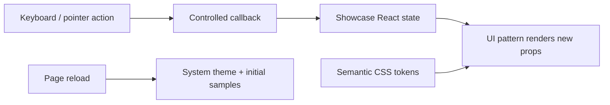
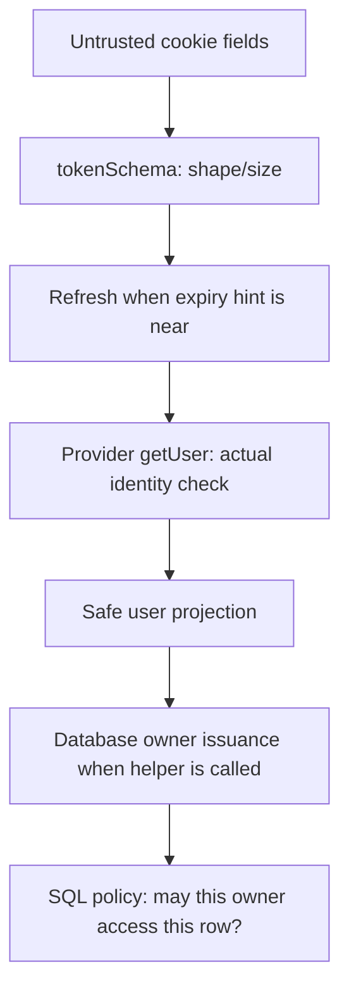
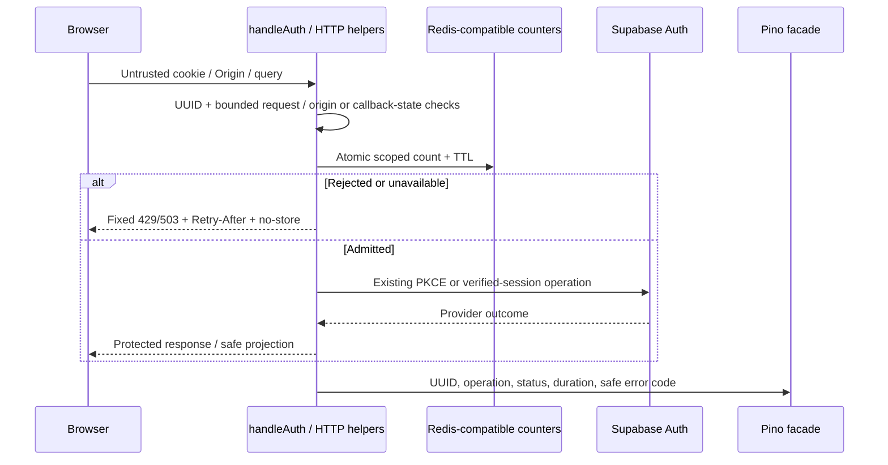

# Learning MindMora

**Source inspected:** 2026-10-07, through Phase 3 knowledge implementation; see its execution record for local validation. Study the system that exists first: public UI,
backend auth, shared contracts, scoped PostgreSQL note APIs, HTTP/admission/logging and startup probes. Protected workspace/editor and API tooling are implemented. [Architecture](../ARCHITECTURE.md) owns the system overview,
[FILE_MAP](FILE_MAP.md) owns navigation, and subsystem guides own exact operating rules.

## A progressive source-reading path

Use each question to check understanding before moving on. All links below are existing
files, not proposed examples.

| Order | Read | Question to answer |
|---|---|---|
| 1 | [homepage](../src/app/page.tsx), [layout](../src/app/layout.tsx), [showcase](../src/app/dev/design-system/showcase.tsx) | What does a user actually see, and which interactions are only samples? |
| 2 | [tokens](../src/design-system/tokens.css), [UI exports](../src/components/ui/index.ts), [theme](../src/components/ui/theme.tsx), [product patterns](../src/components/mindmora/index.tsx) | Which layer owns appearance, state and callbacks? |
| 3 | [account projection](../src/features/account/types.ts), [browser helpers](../src/features/account/api.ts), [server config](../src/server/config.ts) | What data is allowed to cross the browser/server boundary? |
| 4 | [auth adapters](../src/app/api/auth/), [auth routes](../src/server/auth/routes.ts) | Where are methods, Origin, redirects and cookies controlled? |
| 5 | [session](../src/server/auth/session.ts), [provider](../src/server/auth/provider.ts), [auth tests](../src/server/auth/routes.test.ts) | How is a token-shaped cookie different from verified identity? |
| 6 | [note inputs](../src/features/notes/validation.ts), [domain types](../src/features/notes/types.ts), [model contract](features/note-model.md) | Which constraints describe data, and which would require authorization? |
| 7 | [Drizzle schema](../src/server/db/schema.ts), [migration](../supabase/migrations/0000_profiles_notes.sql) | What exists in PostgreSQL beyond the TypeScript model? |
| 8 | [verified owner](../src/server/db/user-context.ts), [DB client](../src/server/db/client.ts), [DB config](../src/server/db/config.ts) | Why do identity, login role and LOCAL claims all matter? |
| 9 | [role provision](../scripts/provision-role.ts), [credential staging](../scripts/provision-files.ts), [CLI coordinator](../scripts/provision-database.mjs) | What happens when database setup and file publication cannot commit together? |
| 10 | [RLS tests](../tests/integration/rls.test.ts), [Docker harness](../scripts/test-database.mjs), [browser tests](../tests/e2e/) | Which guarantees are exercised with real systems, and which services are fixtures? |
| 11 | [HTTP policy](../src/server/http/), [admission](../src/server/rate-limit/), [logging facade](../src/server/logging/) | Why are validation, admission and safe observability distinct from authentication? |
| 12 | [instrumentation](../src/instrumentation.ts), [startup coordinator](../src/server/startup/health.ts), [probes](../src/server/startup/probes.ts), [color/once tests](../src/server/startup/health.test.ts) | What runs once at startup, what runs per request, and what does connectivity fail to prove? |
| 13 | [Note handler](../src/server/notes/routes.ts), [service](../src/server/notes/service.ts), [repository](../src/server/notes/repository.ts), [note API](features/notes-api.md) | Why do commit, revision and create identity solve different problems? |
| 14 | [save machine](../src/features/editor/save-machine.ts), [autosave](../src/features/editor/use-note-autosave.ts), [source adapter](../src/features/editor/components/CodeMirrorEditor.tsx) | Why can an older acknowledgement advance the base while current typing remains unsaved? |
| 15 | [Markdown boundary](../src/features/editor/markdown.ts), [preview](../src/features/editor/components/MarkdownPreview.tsx), [SVG boundary](../src/features/editor/svg.ts), [workspace Proxy](../src/proxy.ts) | Why are parsing, sanitization, controlled URLs and CSP distinct controls? |

## 1. Presentation, state and persistence are different things

**Concept.** Rendering a note row or a “saved” badge does not save data. A controlled
component receives values and callbacks; its parent chooses the state and side effects.
This keeps visual behavior reusable without turning UI into storage authority.

**MindMora implementation and flow.** The layout installs ThemeProvider and CSS. The
showcase holds demo React state and passes it to reusable controls/product patterns.
Clicks/keyboard callbacks update that state, causing a new render. CSS semantic tokens
provide light/dark colors and motion rules; changing theme projects a document data
attribute, while system mode leaves CSS to follow OS preference.



**Security and trade-offs.** Components contain no DB credentials or real note ownership.
Page-lifetime state is simple and easy to test, but disappears on reload; “session-only”
here does not mean sessionStorage. Shared CSS/Radix reduce duplicated visual/focus logic,
while callers still must provide meaningful labels and valid controlled state. Existing
save/sync labels and metadata contain historical local-first wording; that wording is a
presentation limitation, not an implemented sync mechanism.

**Read next:** [design contract](design/design-system.md), [component API](design/component-api.md),
then [runtime config](../src/server/config.ts).

## 2. A runtime boundary protects imports, not every output

**Concept.** Browser code and server code have different access: only the server should
read credentials or use a database connection. A backend does not require every page to
render anew on each request; static public content and dynamic APIs can coexist.

**MindMora implementation and flow.** Next builds the public pages ahead of time; Node
serves them and dispatches dynamic auth requests. `server-only` rejects guarded modules
in Client Component imports. Config loaders read selected environment variables only when
called, validate them with Zod and emit fixed errors. Public pages do not call those loaders.

**Security and trade-offs.** Lazy config lets someone run the showcase without cloud
setup. The compiler guard prevents accidental imports, but cannot protect a secret manually
copied into JSON/React props. Runtime validation cannot prove a hosted service is reachable.
The real compiler fixture tests the import restriction rather than assuming a mocked
unit environment reproduces Next's boundary.

**Read next:** [boundary harness](../scripts/test-server-boundary.mjs), then account projection
and [auth guide](integrations/supabase-auth.md).

## 3. Authentication tells us who; authorization tells us what they may access

**Concept.** A credential is evidence to verify, not a trustworthy user object. A valid
account still cannot read another account's note. Input validation, identity verification
and row authorization solve different problems.

**MindMora implementation and flow.** Supabase Auth owns Google identity and sessions.
The server accepts a cookie containing token fields, validates their shape, refreshes
near expiry, then asks the provider for the user. Only id/email/displayName cross back to
browser JSON. The database boundary separately uses this verified identity for owner RLS.



**Security and trade-offs.** Editing cookie expiry does not forge a verified account.
Base64url is encoding, not encryption/signing. HttpOnly keeps JS from reading the cookie
but does not stop JS issuing authenticated requests. Online verification costs a provider
round trip and fails closed on outages. The database helper is not called by an HTTP route
yet, so this diagram shows composition of implemented functions, not a current note API.

**Read next:** [session.ts](../src/server/auth/session.ts), [provider.ts](../src/server/auth/provider.ts),
[ADR-020](decisions/ADR-020-backend-owned-auth-cookies.md).

## 4. PKCE and app state bind the returning sign-in to its browser flow

**Concept.** A sign-in callback arrives from outside the app. PKCE ties code exchange to
possession of a verifier; the app's random state ties the callback to its pending browser
flow. Those checks allow an external redirect without treating arbitrary callback input
as authenticated.

**MindMora implementation and flow.** POST start creates a fresh SDK client and verifier
storage, asks for the provider URL, validates that URL and sets a short-lived pending
cookie. Google returns to Supabase; Supabase returns to the configured app callback.
The app checks permitted query fields, state/expiry and code before SDK exchange and
online verification. It sets the app session and redirects to the fixed homepage.

**Security and trade-offs.** Supabase owns Google OAuth state; MindMora's app state is an
additional boundary. Start/logout require exact Origin, while callback uses state/PKCE.
One pending cookie means one active sign-in flow per browser. Beginning another flow
replaces the earlier one. Configuration of Google consent/callbacks is external to source,
so a successful fixture does not prove a real project's settings.

**Read next:** [auth sequence/setup/failures](integrations/supabase-auth.md), route tests and
[historical live evidence](phases/phase-01-foundation.md).

## 5. Refresh, revocation and browser lifetime are separate clocks

**Concept.** Browser cookie expiry, access-token expiry and provider revocation are not
the same event. A cookie may exist after its provider session has been revoked. Refresh
can succeed concurrently within a provider's reuse rules; that is not an unlimited replay
promise.

**MindMora implementation and flow.** Session verification uses the expiry hint to decide
whether to refresh, verifies the resulting access token and returns `refreshed` metadata.
Auth routes write the new cookie when needed. Logout verifies/refreshes, asks for local
session revocation and clears cookies. Missing/corrupt decoded cookie follows idempotent
local cleanup; invalid structured credentials can produce 401.

**Failures/security/trade-offs.** A provider outage yields 503 instead of access. Ordinary
session failure of that kind preserves the cookie; logout failure inside the provider
branch clears local cookies but cannot confirm remote revocation. Earlier config/Origin
rejection does not execute that cleanup. There is no automatic browser retry or cache-
cleanup mechanism in account helpers. SDK retries make a ten-second fetch timeout distinct
from a ten-second whole operation. See the auth guide for the exact error matrix.

**Read next:** [account helpers](../src/features/account/api.ts), auth tests, then note inputs.

## 6. Types, validators and database constraints overlap without replacing one another

**Concept.** TypeScript checks code before execution; Zod checks actual values; PostgreSQL
constraints protect persisted rows. Permission is separate from all three. Sharing input
schemas reduces drift, but only a caller that parses data actually enforces them.

**MindMora implementation and flow.** Shared note schemas reject unknown owner/plan fields,
trim/bound titles, bound UTF-8 content, require meaningful updates and constrain revisions/
cursors. Domain schemas describe output shape. Drizzle defines SQL columns and migration
constraints. No note route or serializer consumes these contracts yet.

**Security and trade-offs.** Unicode code points differ from UTF-8 bytes; 200 emoji need
more than 200 bytes. NUL cannot reach PostgreSQL TEXT. Zod title trim is broader than SQL
space trim; a stored value valid under SQL can fail the stricter domain schema. Parsing a
note's Markdown does not sanitize HTML. Current output schemas validate timestamp shape,
not cross-field chronology; SQL checks protect persisted timestamp order.

**Read next:** [note model](features/note-model.md), validation tests and schema/migration.

## 7. Migrations turn code descriptions into real database structure

**Concept.** A schema file describes intended structure; a migration is versioned SQL
applied to a database. A journal records application; a snapshot supports later model diffs.
Neither a TypeScript definition nor successful generation proves a hosted role is effective.

**MindMora implementation and flow.** Drizzle generation reads `schema.ts`; the reviewed
initial migration adds tables, foreign keys, checks, index and policies, plus manual
role/grant/FORCE clauses. The CLI migrator applies that journaled SQL. Auth user deletion
cascades through profile to notes. The request role cannot perform normal hard deletion.

**Security and trade-offs.** FKs prevent orphaned ownership records. Defaults initialize
UUID/revision/timestamps; no trigger advances revision/updatedAt later. The partial index
supports the 1E cursor repository. The repository, rather than a trigger, advances revision/time. Manual privilege SQL
requires review beyond generator snapshots; applied migration edits do not update an
existing database. Hosted Auth schema permissions differed from requested GRANT text,
which is why real role/query evidence matters.

**Read next:** [database guide](integrations/supabase-database.md), then verified context/client.

## 8. A verified owner is a capability inside the server process

**Concept.** A capability is something possession of which admits a specific operation.
Here an object identity carries evidence that the app ran its verification helper. A UUID
string alone supplies no such evidence.

**MindMora implementation and flow.** `verifyDatabaseSession` uses the existing online
verification, freezes `{userId}`, registers that actual object in a module-private WeakSet
and returns it with session/refresh metadata. `run` asserts membership before opening a
transaction. Copying/spreading the owner creates a different object and is rejected.

**Security and trade-offs.** The object has no built-in expiry/revocation check; it must
remain request-scoped; note routes now reverify each request. Its properties
are readonly, but trusted server code still chooses callbacks and holds credentials. The
helper now disposes its provider in finally on success/failure, like `handleAuth`. The
note handler exercises it on every private request; capability issuance is still not
durable session authority.

**Read next:** [user-context.ts](../src/server/db/user-context.ts), [client.ts](../src/server/db/client.ts),
[ADR-021](decisions/ADR-021-scoped-database-role.md).

## 9. Connection pooling makes identity scope a security issue

**Concept.** A pool reuses connections to avoid opening one for every operation. A session-
level identity setting could remain for the next user. Transaction-local settings end
with commit/rollback, keeping scope aligned with a single operation.

**MindMora implementation and flow.** The app login is NOINHERIT with no direct table/
column grants. The wrapper inspects actual flags/membership/initial claims, then SET LOCAL
switches to the non-login request role and verified claims. Parameterized Drizzle queries
run through `auth.uid() = user_id` policies. Callback success commits; failure rejects and
rolls back. The factory's pool is bounded; the optional singleton is lazy.

**Security and trade-offs.** NOBYPASSRLS and FORCE RLS are important, but not proof against
administrators or stolen server credentials. RLS trusts server-supplied claims. Role
checks/SQL setup introduce round trips and are not a total-duration deadline. No explicit
DB retry/reconciliation exists; an ambiguous commit cannot safely be equated with “unsaved.”
Real tests check two users, no claims, privileged login and reused connections. Fixture
Auth responses are distinct from real PostgreSQL/provider role behavior.

**Read next:** [exact grants, timeouts and failures](integrations/supabase-database.md), RLS tests.

## 10. Provisioning crosses two systems that cannot commit together

**Concept.** PostgreSQL can atomically create a role and grant its membership. It cannot
atomically commit a credential file on the developer's disk in the same transaction.
The recovery plan must preserve the generated password before SQL can leave a login behind.

**MindMora implementation and flow.** First-time provisioning refuses an existing login/
nonempty runtime URL, generates a password and fsyncs private pending env content. CREATE
ROLE/GRANT share a DB transaction. After commit, `publish` compares the original env and
atomically renames the pending file into place. Failures retain recovery material.

**Security and trade-offs.** Staging prevents credential loss during process interruption
and avoids truncating env, but leaves a second secret file needing protection. No automatic
resume/password rotation exists; a failed or ambiguous setup needs state verification.
The unchanged-env check is not a cross-process locking protocol; it cannot guarantee
against every simultaneous editor write. Power-loss/backup durability is unproven.

**Read next:** [provisioning state diagram/recovery](integrations/supabase-database.md#migration-and-provisioning-flow)
and the credential-file tests.

## What to study later

The following are accepted plans, not installed runtime systems: Query in-memory cache,
Zustand UI state, nuqs URL state, revision-safe repositories/HTTP saves,
private Storage, BullMQ/outbox/worker, Swagger/Postman. Their reasoning belongs in
[planned data architecture](architecture/full-stack-architecture.md), [state ownership](architecture/state-management.md),
[backend services](integrations/backend-services.md) and [API tooling](integrations/api-tooling.md).
Automatic Drive-authoritative sync and the browser E2EE vault are superseded, not future
features under the current scope. Deployment/provider encryption/restore guarantees
remain open. Do not use a roadmap diagram as evidence that those systems exist.

## Request admission and safe observability — implemented 1D

**Concept.** Authentication answers who a caller is; validation checks shape/size; admission
limits how much work a caller can request. None replaces ownership checks. Logs explain
what happened operationally without collecting the caller’s content or credentials.

**Why needed.** Public auth and authenticated note routes perform provider/network work.
Malformed bodies, forged forwarding and dependency failures need predictable rejection.
Stable error codes help future UI handle failures, and correlation IDs connect an error
response to a safe server log without echoing caller-supplied markers.

**Current flow.** Auth starts with a new server UUID. The handler checks request/config/method,
Origin or callback state, query/body bounds, then Redis admission. Only admitted requests
reach the existing Supabase session/PKCE work. Responses apply no-store and fixed errors;
Pino receives only approved metadata. Auth remains independent of SQL; the separate note flow below reuses these controls.



**Counters and failure behavior.** A Lua script runs increment and expiry checks atomically,
so concurrent requests do not create immortal counters. Windows begin on first hit.
Remaining TTL supplies Retry-After. The client has bounded network work and a short outage
circuit; later requests reconnect. Redis contains counts and hashed identities, never notes
or sessions. Public auth uses a shared budget until real ingress IP trust is configured.

**Fallback and trust.** The note caller obtains a fresh online-verified owner
before using the helper; arbitrary user-ID objects are refused. Redis outage permits a
small per-process budget and returns degradation. Process-local state disappears on restart
and does not coordinate instances. Authentication/DB ownership remain mandatory. This
helper is now used by the note handler, which advertises degraded admission. Auth/expensive requests instead fail closed;
rejected logout leaves its cookies and must not be presented as success.

**Logging and trade-offs.** An allowlist prevents unknown fields from reaching Pino, while
static redaction adds another layer. Fixed messages prevent raw exception serialization.
Request IDs are diagnostic, not authentication secrets. Stdout, framework/proxy logs and
host retention still need deployment controls; tests do not prove every external log safe.
Local Valkey demonstrates Redis-compatible behavior without selecting a hosted provider.

**Read next.** Start at `src/server/auth/routes.ts`, then `http/errors.ts`/`responses.ts`,
`http/body.ts`/`csrf.ts`, `rate-limit/limiter.ts`/`client.ts`, and `logging/logger.ts`.
[Services](integrations/backend-services.md) owns exact budgets/config/body limits;
[security](architecture/security-architecture.md) distinguishes local evidence from
remaining production controls. Revision-safe notes/repositories are now implemented in 1E; the protected shell is planned for 1F.

## Startup health versus request security — implemented follow-up

**Concept and purpose.** A startup probe establishes that a server process can reach a
required service now. It is useful before admitting production traffic and gives a clear
local diagnostic, but it cannot establish the caller’s identity, future availability or RLS.

**Current flow.** Next Node register dynamically imports startup health. A global promise
runs Redis PING and PostgreSQL SELECT 1 concurrently with deadlines, closes both dedicated
clients and prints fixed safe results. Repeated registrations/HMR in that process reuse the
promise; restarting creates fresh checks. Production failure exits nonzero. Local development
warns and continues, while request-level auth/admission remains mandatory. Build/Edge skip it.

**Terminal styling.** `styleText("green", "✓")` and `styleText("red", "✗")` from Node
`node:util` color only the status glyph and reset the foreground before the service text.
ANSI sequences control terminal appearance; they do not change probe outcomes or admission.
Node detects color support: ordinary redirected logs remain plain, NO_COLOR can disable
styling and FORCE_COLOR can explicitly override detection. Read the output branch in
[health.ts](../src/server/startup/health.ts) and the controlled color tests in
[health.test.ts](../src/server/startup/health.test.ts). Exact environment behavior lives in
the [services guide](integrations/backend-services.md#server-startup-health--implemented-follow-up-to-1d).

**Trade-offs and security.** PING does not test EVAL permissions, and SELECT 1 does not inspect
notes, RLS or migrations. Later failures still need request-level handling. Startup latency
and provider cold starts can cause failure even after an earlier successful check. Restricting
errors to known messages protects credentials but loses root-cause detail. Next's early Ready
banner is not a dependable readiness signal; actual health logs/process behavior matter.

**Read next.** `src/instrumentation.ts` → `server/startup/health.ts` → `probes.ts` → existing
Redis/database config. [Services](integrations/backend-services.md#server-startup-health--implemented-follow-up-to-1d)
owns deadlines and operational rules; [ADR-023](decisions/ADR-023-startup-dependency-health.md)
owns the decision. Production browser tests use disposable dependencies, not a bypass flag.

## Durable note requests — implemented 1E

**Concept.** A transaction makes database changes commit together. It cannot make the
network response arrive. Optimistic concurrency checks the revision the caller actually
read; idempotency gives a repeated create the same operation identity.

**Why needed.** Reading then unconditionally writing can lose a competing edit. Retrying
an unkeyed create after response loss can duplicate it. A failure response therefore means
“not confirmed,” not always “nothing committed.” Identity verification answers who called;
owner predicates and effective RLS answer which rows they may access.

**Current implementation.** Every request verifies identity and receives an issued owner.
The repository uses the constrained SQL transaction, seeds a missing profile, then queries
owner/active rows. Update/delete compare revision in the UPDATE itself. Create inserts an
owner-scoped UUID key and original input digest; a matching retry returns the active record.
The service validates explicit JSON projections after commit. No note content enters Redis,
Pino or jobs. A bounded list returns summaries, then detail fetch supplies Markdown.

**Security/trade-offs.** SQL trusts the verified claims chosen by trusted server code;
provider verification and RLS are separate controls. Key metadata is immutable to the
request role and hidden from JSON, but its digest is not anonymization. A stale mutation409
requires refetch/compare. Deleted retries404 cannot resurrect a row. Cursor pagination is
not a snapshot under edits. Refresh cookies survive later errors. The Phase 2 controller retains keys/original input for uncertain creates and uses deliberate
refetch for uncertain mutations. Milestone 1E itself added no draft/cache/workspace UX; those
arrived in 1F/1G and Phase 2. Hosted migration evidence remains in the dated Phase 1 record.

Read the [API guide](features/notes-api.md) for exact contracts and
[ADR-024](decisions/ADR-024-note-write-concurrency-and-reconciliation.md) for alternatives.

## Milestone 1E Code Understanding Summary

This is the per-file reading guide for this implementation, not a line-by-line tutorial.
Tests/harnesses are marked test-only; documentation files own explanations and export no
runtime API. Their responsibilities are indexed in [docs/README](README.md).

### src/app/api/notes/route.ts

- **File:** [src/app/api/notes/route.ts](../src/app/api/notes/route.ts)
- **Purpose:** Adapt collection HTTP requests to the server policy.
- **Main exports:** GET, POST, runtime, dynamic; rejected-method adapters.
- **Flow:** Next receives request → Node adapter forwards without id → handler returns list/create or rejection.
- **Dependencies:** server/notes/routes.ts.
- **Security:** Node-only, force-dynamic; policy owns verification/no-store.
- **What I should understand:** `runtime = "nodejs"`; `dynamic = "force-dynamic"`; handler forwarding.
- **Concepts to learn:** Route adapters; dynamic server execution.

### src/app/api/notes/[id]/route.ts

- **File:** [src/app/api/notes/[id]/route.ts](../src/app/api/notes/[id]/route.ts)
- **Purpose:** Adapt detail/mutation requests with Next dynamic params.
- **Main exports:** GET, PATCH, DELETE, runtime, dynamic; rejected-method adapters.
- **Flow:** Next receives request → await params → pass id to handler → return safe response.
- **Dependencies:** server/notes/routes.ts; Next params API.
- **Security:** Raw id is untrusted; handler validates UUID/ownership; Node-only.
- **What I should understand:** `params: Promise<{ id: string }>`; `(await params).id`; exported method aliases.
- **Concepts to learn:** Async route params; HTTP method routing.

### src/server/notes/routes.ts

- **File:** [src/server/notes/routes.ts](../src/server/notes/routes.ts)
- **Purpose:** Compose guarded note HTTP operations and their safe responses.
- **Main exports:** handleNotes; NotesDependencies.
- **Flow:** Bounds/method/Origin → verify session → basic admission → parse input → service → cookie/no-store/log response.
- **Dependencies:** Config; user-context; HTTP helpers; limiter/logger; note schemas/service/repository.
- **Security:** Fresh online auth, exact mutation Origin, bounded strict input, no-store; secrets only in protected cookies; fixed errors/logs.
- **What I should understand:** `assertOrigin`; `verifyDatabaseSession`; discriminated `parsed.action` switch; refreshed-cookie block; `logRequest` metadata.
- **Concepts to learn:** Authentication vs authorization; trust boundaries; refresh propagation; discriminated outcomes.

### src/server/notes/service.ts

- **File:** [src/server/notes/service.ts](../src/server/notes/service.ts)
- **Purpose:** Translate committed outcomes into validated public note/page projections.
- **Main exports:** createNoteService; normalizeNote; resolveNote; profileName.
- **Flow:** Validate provider name → call repository → resolve business outcome after commit → serialize dates → validate projection/page.
- **Dependencies:** Repository; note/page/profile schemas; HttpFailure.
- **Security:** Explicit note projection excludes key/hash; invalid names become null; only fixed business codes are public.
- **What I should understand:** `profileName`; `normalizeNote` field list; `resolveNote`; `rows.slice(0,input.limit)` and nextCursor.
- **Concepts to learn:** Serialization; runtime response validation; service boundaries; pagination lookahead.

### src/server/notes/repository.ts

- **File:** [src/server/notes/repository.ts](../src/server/notes/repository.ts)
- **Purpose:** Persist notes with owner/active filters and atomic revision/replay rules.
- **Main exports:** createNoteRepository; NoteRepository; NoteDatabase; NoteRow; NoteOutcome.
- **Flow:** Enter checked transaction → seed missing profile → owner-scoped query → atomic key/revision operation → return outcome → commit → service.
- **Dependencies:** DB client/schema; VerifiedOwner; Drizzle; Node SHA-256.
- **Security:** Explicit owner filters plus effective RLS; parameters; immutable keys; soft-delete filtering; atomic expectedRevision; no queue.
- **What I should understand:** `active`; profile `onConflictDoNothing`; create owner/key conflict and hash comparison; revision predicate/increment; descending cursor predicate.
- **Concepts to learn:** Transactions; optimistic concurrency; unique-index idempotency; uncertain commits; keyset pagination.

### src/server/db/user-context.ts

- **File:** [src/server/db/user-context.ts](../src/server/db/user-context.ts)
- **Purpose:** Issue a verified request owner and clean up its auth provider.
- **Main exports:** verifyDatabaseSession; assertVerifiedOwner; VerifiedOwner.
- **Flow:** Decode cookie → verify/refresh through provider → freeze/register owner → return session metadata → finally dispose provider.
- **Dependencies:** Auth config/provider/session; private WeakSet.
- **Security:** Cookie claims cannot choose owner; object identity gates SQL/fallback; requests reverify; no durable capability cache.
- **What I should understand:** `const provider`; `verifySession`; `verified.add(owner)`; `finally`; membership assertion.
- **Concepts to learn:** Capabilities; online verification; resource ownership/finally cleanup.

### src/features/notes/types.ts

- **File:** [src/features/notes/types.ts](../src/features/notes/types.ts)
- **Purpose:** Define runtime note, summary and page response contracts.
- **Main exports:** noteSchema; noteSummarySchema; notePageSchema; profileSchema; Note/NoteSummary/NotePage/Profile; input types.
- **Flow:** Reuse input constraints → define full projection → omit content for summary → validate bounded page/cursor → infer shared types.
- **Dependencies:** Zod; notes/validation.ts.
- **Security:** Strict output shape and bounded values; types alone neither authenticate nor sanitize Markdown.
- **What I should understand:** `noteSchema`; `.omit({ content: true })`; `notePageSchema`; UTC millisecond date schemas.
- **Concepts to learn:** Runtime schemas vs types; projections; server/browser representation.

### src/server/db/schema.ts

- **File:** [src/server/db/schema.ts](../src/server/db/schema.ts)
- **Purpose:** Describe persistent constraints including internal create identity.
- **Main exports:** profiles; notes.
- **Flow:** Declare columns → check metadata pair/hash → declare owner/key unique index → ORM queries or migration diff.
- **Dependencies:** Drizzle pg-core/sql; PostgreSQL/Auth table relationships.
- **Security:** Legacy nullable metadata; ownership constraints; immutable metadata protected by existing SQL column grants.
- **What I should understand:** `createOperationId`; `createRequestHash`; paired metadata check; partial unique index.
- **Concepts to learn:** Schema vs migration; partial indexes; constraints vs permissions.

### supabase/migrations/0001_note_create_idempotency.sql

- **File:** [supabase/migrations/0001_note_create_idempotency.sql](../supabase/migrations/0001_note_create_idempotency.sql)
- **Purpose:** Apply nullable create metadata and uniqueness without rewriting old notes.
- **Main exports:** None; versioned SQL.
- **Flow:** Migrator reads journal → add columns → add pair/hash constraint → build partial unique owner/key index.
- **Dependencies:** Existing notes table; PostgreSQL; migration journal/snapshot.
- **Security:** No credential or new runtime privilege; request role cannot update metadata; deleted rows retain key reservation.
- **What I should understand:** Both ADD COLUMN statements; metadata CHECK; CREATE UNIQUE INDEX WHERE key IS NOT NULL.
- **Concepts to learn:** Additive migrations; legacy compatibility; uniqueness under concurrency.

### src/server/http/errors.ts

- **File:** [src/server/http/errors.ts](../src/server/http/errors.ts)
- **Purpose:** Provide fixed typed public failure codes including create-key conflict.
- **Main exports:** HttpFailure; ErrorCode; safeFailure.
- **Flow:** Define fixed code/status/message → construct failure → sanitize unknown error → safe response.
- **Dependencies:** Static definitions; response helpers and callers.
- **Security:** Unknown exceptions never expose raw messages; fixed idempotency_conflict409.
- **What I should understand:** `idempotency_conflict`; HttpFailure constructor; `safeFailure` unknown-error fallback.
- **Concepts to learn:** Safe error taxonomy; public vs internal errors.

### src/server/logging/logger.ts

- **File:** [src/server/logging/logger.ts](../src/server/logging/logger.ts)
- **Purpose:** Restrict request logs to fixed validated metadata including note actions.
- **Main exports:** createRequestLogger; logRequest.
- **Flow:** Receive metadata → strict schema/operation/code allowlists → redaction/fixed Pino logging → terminal.
- **Dependencies:** Pino; Zod; HTTP error types.
- **Security:** No bodies/titles/keys/hashes/cookies/tokens/error payloads accepted; safe codes only.
- **What I should understand:** Note operation enum; safe error-code enum; metadata schema; logger facade.
- **Concepts to learn:** Structured metadata; allowlisting and redaction.

### src/server/notes/routes.test.ts

- **File:** [src/server/notes/routes.test.ts](../src/server/notes/routes.test.ts)
- **Purpose:** Verify HTTP boundaries with controlled SDK transport and injected downstream work.
- **Main exports:** None; test suite.
- **Flow:** Build controlled credentials → call actual handler → inspect rejection/refresh/safe response → clean fixture.
- **Dependencies:** Handler; real Supabase SDK fixture; test admission/database.
- **Security:** Checks unauthenticated/Origin/method rejection, refreshed errors, throttle and safe failures before SQL.
- **What I should understand:** Initial rejection cases; authenticatedRequest helper; refresh400 assertion; unavailableDB503 assertion.
- **Concepts to learn:** Behavior tests; fixture transport vs production provider evidence.

### src/server/db/user-context.test.ts

- **File:** [src/server/db/user-context.test.ts](../src/server/db/user-context.test.ts)
- **Purpose:** Verify real provider disposal on successful and rejected identity checks.
- **Main exports:** None; test suite.
- **Flow:** Issue/revoke fixture credential → spy actual provider disposal → verify owner or rejection → assert disposal once.
- **Dependencies:** user-context; real provider/auth fixture; Vitest.
- **Security:** No fake verification acceptance; observes cleanup in both auth outcomes.
- **What I should understand:** `it.each([false,true])`; original factory wrapper; success/rejection assertions; disposal count.
- **Concepts to learn:** Test-first cleanup; real implementation with controlled transport.

### tests/integration/notes-api.test.ts

- **File:** [tests/integration/notes-api.test.ts](../tests/integration/notes-api.test.ts)
- **Purpose:** Verify real SQL/HTTP isolation, concurrent writes and reconciliation.
- **Main exports:** None; integration suite.
- **Flow:** Seed two Auth IDs → create real scoped database → prove overlapping connections → call handler operations/races → inspect committed rows → clean.
- **Dependencies:** Actual PostgreSQL/Redis; SDK controlled fetcher; handler/repository; database config.
- **Security:** Two-owner checks; RLS role; no foreign data; conflicts/deletes; lost-response retry; safe outage.
- **What I should understand:** Backend PID/barrier test; concurrent create/update/delete tests; foreign-owner404 checks; after-commit response-loss test.
- **Concepts to learn:** Integration vs unit coverage; transaction races; uncertain outcome reconciliation.

### scripts/test-database.mjs

- **File:** [scripts/test-database.mjs](../scripts/test-database.mjs)
- **Purpose:** Provision disposable SQL and select the RLS or note integration suite.
- **Main exports:** None; CLI entry.
- **Flow:** Start fixture → verify provisioning rollback → migrate twice → provision runtime role → select config/pool → run suite → cleanup.
- **Dependencies:** Docker/PostgreSQL; migration/provision helpers; Vitest database/notes configs.
- **Security:** Generated disposable credentials; no hosted writes; pool3 tests races, pool1 tests reuse.
- **What I should understand:** `--notes` config selection; `DATABASE_POOL_MAX` conditional; migration/reprovision checks; finally cleanup.
- **Concepts to learn:** Test fixture lifecycle; pool concurrency vs connection reuse.

### scripts/test-notes-api.mjs

- **File:** [scripts/test-notes-api.mjs](../scripts/test-notes-api.mjs)
- **Purpose:** Wrap note SQL checks with disposable Redis admission.
- **Main exports:** None; CLI entry.
- **Flow:** Start Redis fixture → pass local URL to child → run test-database --notes → propagate exit → cleanup.
- **Dependencies:** local-test-redis.mjs; test-database.mjs; Node child process.
- **Security:** Test-only services/credentials; no hosted endpoint or persistent counter volume.
- **What I should understand:** withTestRedis callback; child arguments; exit handling.
- **Concepts to learn:** Integration orchestration; process environment boundaries.

### vitest.notes.config.ts

- **File:** [vitest.notes.config.ts](../vitest.notes.config.ts)
- **Purpose:** Select actual-driver note tests and bounded execution settings.
- **Main exports:** Default Vitest config.
- **Flow:** Runner loads config → Node environment → notes suite → sequential files/bounded timeout → results.
- **Dependencies:** Vitest; tests/integration/notes-api.test.ts.
- **Security:** Test-only; no skipped service claim; Node dependencies stay out of browser.
- **What I should understand:** `include`; `environment`; `testTimeout`; fileParallelism.
- **Concepts to learn:** Test isolation; runtime selection; timeouts.

### scripts/local-test-postgres.mjs

- **File:** [scripts/local-test-postgres.mjs](../scripts/local-test-postgres.mjs)
- **Purpose:** Supply local PostgreSQL with optional migrated auth/note fixtures.
- **Main exports:** withTestPostgres.
- **Flow:** Start pinned Docker PG → wait → constrained login → optional Auth schema/migrations/fixture → callback → close/remove.
- **Dependencies:** Docker; postgres-js; Drizzle migrator; existing migrations.
- **Security:** Random local credentials; emulated auth.uid; no hosted reset; default startup fixture remains minimal.
- **What I should understand:** `{ schema = false }`; schema branch; migrate call; finally cleanup.
- **Concepts to learn:** Disposable environments; fixture vs hosted policy; migration bootstrapping.

### scripts/test-auth-e2e.mjs

- **File:** [scripts/test-auth-e2e.mjs](../scripts/test-auth-e2e.mjs)
- **Purpose:** Start controlled auth/services for production browser auth and note checks.
- **Main exports:** None; CLI entry.
- **Flow:** Start provider/Redis → PostgreSQL schema fixture → production preview/Playwright → tests → cleanup.
- **Dependencies:** Auth provider fixture; Redis/PG harnesses; Playwright auth config.
- **Security:** Test-only credentials/records, actual protected cookies and Node routes.
- **What I should understand:** withTestPostgres schema option; child environment; fixture cleanup.
- **Concepts to learn:** Browser integration boundaries; service orchestration.

### tests/e2e/auth.spec.ts

- **File:** [tests/e2e/auth.spec.ts](../tests/e2e/auth.spec.ts)
- **Purpose:** Exercise real Next auth and note operations through browser requests.
- **Main exports:** None; Playwright suite.
- **Flow:** Sign in with PKCE fixture → create/replay/list → rename/conflict/CSRF → delete/detail404 → refresh/logout/replay401.
- **Dependencies:** Actual Next server; browser cookies; disposable provider/SQL/Redis.
- **Security:** Checks real cookie/Origin boundary and post-logout rejection; not live Google acceptance.
- **What I should understand:** Create201/replay200 assertions; stale409/foreign403; delete404; logout-replay401.
- **Concepts to learn:** End-to-end cookies; API verification; fixture acceptance limits.

### supabase/migrations/meta/_journal.json

- **File:** [supabase/migrations/meta/_journal.json](../supabase/migrations/meta/_journal.json)
- **Purpose:** Order applied schema migrations.
- **Main exports:** None; Drizzle metadata.
- **Flow:** Generator adds entry → migrator reads order → unapplied SQL runs.
- **Dependencies:** Versioned SQL files; Drizzle migrator.
- **Security:** No credentials or request execution; migration order must match reviewed SQL.
- **What I should understand:** 0001 entry/tag; increasing idx; breakpoint flag.
- **Concepts to learn:** Versioned migrations; applied vs generated state.

### supabase/migrations/meta/0001_snapshot.json

- **File:** [supabase/migrations/meta/0001_snapshot.json](../supabase/migrations/meta/0001_snapshot.json)
- **Purpose:** Record generated schema after idempotency metadata.
- **Main exports:** None; Drizzle metadata.
- **Flow:** Read prior snapshot → compare current schema → generate next reviewed diff.
- **Dependencies:** Drizzle Kit; db/schema.ts.
- **Security:** Tooling-only; not a record of live grants or hosted application.
- **What I should understand:** notes creation columns; partial unique index; paired check.
- **Concepts to learn:** Schema snapshots vs effective database state.

### package.json

- **File:** [package.json](../package.json)
- **Purpose:** Expose the notes integration verification command.
- **Main exports:** None; npm scripts/config.
- **Flow:** npm test:notes → dedicated Redis/SQL runner → integration result.
- **Dependencies:** scripts/test-notes-api.mjs; existing exact dependencies.
- **Security:** No new dependency or service provisioning; credentials remain server/test-only.
- **What I should understand:** test:notes command; existing test:db and test:auth commands.
- **Concepts to learn:** Script entry points; repeatable verification.

### .github/workflows/quality.yml

- **File:** [.github/workflows/quality.yml](../.github/workflows/quality.yml)
- **Purpose:** Include notes SQL behavior in the existing CI quality pipeline.
- **Main exports:** None; GitHub Actions workflow.
- **Flow:** Install dependencies → unit/service/notes/DB checks → build → browser regressions.
- **Dependencies:** package scripts; Docker; Chromium; GitHub Actions.
- **Security:** Disposable local fixtures; existing credential marker scans; no hosted deployment.
- **What I should understand:** test:notes step; test:db step; build marker environment.
- **Concepts to learn:** CI verification vs production readiness.

Migration journal/snapshot are generated ordering/diff metadata; they export no runtime
functions and are consumed only by Drizzle tooling. `package.json` and CI add `test:notes`
to the existing verification path; no new dependency was installed. Documentation changes
update implemented status, contracts, trust boundaries and navigation without changing
product requirements. [FILE_MAP](FILE_MAP.md) covers these supporting files.

```text
Client cookie + input
        |
Next Node note adapter
        |
handleNotes -> verifyDatabaseSession -> Supabase Auth
        |
verified owner -> Redis admission -> strict input
        |
service -> repository -> checked DB transaction
        |
profile + owner/active/key/revision query -> PostgreSQL / RLS
        |
COMMIT -> service projection -> no-store JSON + cookie
        |
Client                         safe Pino metadata
```

## Phase 1 browser workspace and inspectable API

Server authority means an editable draft and a fetched record are different things. The
editor can retain an unsaved idea during a failure without claiming it is durable. An
acknowledged PostgreSQL commit establishes saved; a query refetch only refreshes the
browser's snapshot. This separation prevents cache updates from masquerading as persistence.

Identity also has a lifetime. The backend verifies every request, while the browser's
owner/generation lease prevents a response started earlier from updating a new account's
screen. Cancellation alone is insufficient: an operation can finish just before cancellation,
so the browser checks the lease again after awaiting its response. Scope keys separate
cached data; logout clears it and unmounts draft owners. Transient connectivity failures
preserve existing drafts; confirmed unauthenticated/switch outcomes clear private memory.

```text
Verified session -> owner/generation -> memory QueryClient
                                      |
URL note ID -> validated API -> list/detail -> editor base + separate draft
                                      |
Captured save snapshot -> Origin/auth/admission/Zod -> repository -> RLS transaction
                                      |
                         PostgreSQL COMMIT -> acknowledgement
                                      |
                 advance editor base/cache; retain any newer typing
Conflict/uncertainty -> keep draft -> read current -> explicit decision
Logout/switch -> abort + invalidate lease + clear queries -> unmount editor
```

Read the important implementation in this order:

1. [WorkspaceShell](../src/components/workspace/WorkspaceShell.tsx) owns session verification,
   cache construction, generation invalidation and logout. Understand `clear`, `check` and
   `scope.verify`: UI identity is a display boundary, never backend permission.
2. [Notes API adapter](../src/features/notes/api.ts) checks the lease before/after each request,
   shares cancellation, validates JSON and checks owner/record identity. The server still
   verifies cookies and applies owner/RLS filters independently.
3. [Scoped query hooks](../src/features/notes/hooks.ts) keep bounded list/detail data in memory
   under owner/generation keys. No persister or mutation retry queue is configured.
4. [NotesWorkspace](../src/features/notes/components/NotesWorkspace.tsx) coordinates URL
   selection, guarded draft navigation and confirmed-write invalidation. Zustand owns only
   sidebar visibility; a temporary navigation guard retains the editor until selection is
   deliberately accepted or restored.
5. [NoteEditor](../src/features/notes/components/NoteEditor.tsx) composes the Phase 2
   controller, CodeMirror source and bounded preview. [useNoteAutosave](../src/features/editor/use-note-autosave.ts)
   separates acknowledged base from draft and tracks captured operations/create keys. A clean refetch can adopt a newer commit; a
   dirty refetch cannot silently replace the draft. A confirmed deletion disables further
   writes while permitting retained draft text to be recovered.
6. [Contract generator](../scripts/generate-api-docs.mjs) derives JSON Schema from shared
   Zod and combines reviewed HTTP metadata. Schema conversion cannot infer ownership,
   statuses, UTF-8 refinements or every semantic rule; drift checks and actual requests remain
   necessary. [Metadata](api/operation-metadata.json) owns those reviewed HTTP details.
7. [Console policy](../src/app/dev/api-docs/policy.ts) gates production exposure and limits
   requests to same-origin APIs. [Swagger wrapper](../src/app/dev/api-docs/swagger.tsx) loads
   only on the client, disables remote validation and avoids authorization persistence.
8. [Generated collection runner](../scripts/test-api-collection.mjs) executes disposable
   requests, carries committed IDs/revisions forward and checks actual status/no-store
   behavior. Browser fixtures exercise real Next/SQL/Redis with controlled identity transport.

Create idempotency is narrower than general write replay. The original create key and exact
input can recover an uncertain acknowledgement without duplication. If another tab has
changed the created record, replay returns its current version: the editor preserves the
original draft and treats the difference as a conflict. Update/delete use expectedRevision
and reconciliation, never automatic overwrite. Comparing an attempted write with a newer
read confirms the visible state, not which request caused it.

The costs are extra online session checks, network dependence and deliberate user decisions
on conflicts. Drafts vanish on approved reload/close; no durable offline promise or forensic
RAM-erasure guarantee exists. Phase 2 adds rich preview/autosave below; files and jobs remain later
phases. [Workspace guide](features/notes-workspace.md), [state ownership](architecture/state-management.md)
and [ADR-025](decisions/ADR-025-workspace-memory-and-contract-tooling.md) own detailed rules;
[Phase 1 record](phases/phase-01-foundation.md) keeps historical evidence; [Phase 2 plan](../.agent/active/phase-02-editor.md) owns current checks and deployment limits.

## Visual refinement: change presentation without changing authority

A semantic token describes a role (surface, text, focus), rather than a fixed color.
`src/design-system/tokens.css` maps those roles to the unchanged light palette and the
user-approved neutral dark palette. ThemeProvider projects only a temporary document attribute;
CSS handles system preference before JavaScript. This choice avoids browser preference storage.

The homepage is a Server Component with authored public example text; it renders Lucide
icons directly because passing glyph functions into a client Icon wrapper crosses the RSC
serialization boundary. Only ThemeSelect needs client context. WorkspaceShell and the note
components remain client components with their existing session/lease/draft responsibilities.
Their wrappers and CSS change layout, while acknowledged PostgreSQL commits still determine
Saved to server. Switching theme must retain a dirty draft.

```
ThemeSelect -> temporary context -> html data-theme -> semantic CSS -> appearance
Note editor -> existing verified API -> PostgreSQL commit -> existing saved feedback
```

Read [design contract](design/visual-refinement.md) for responsive/focus decisions and
[ADR-026](decisions/ADR-026-neutral-dark-theme-and-document-surfaces.md) for trade-offs.


## Phase 2: a response confirms a snapshot, not all current typing

**Concept.** Local edit sequence and server revision answer different questions. Sequence
says whether this tab changed after it sent an operation; revision says whether the server
changed since its acknowledged base. If revision1 stores `A`, a captured PATCH saves `B`,
and the user types `C` before response, revision2 confirms `B`. The visible `C` must stay
dirty and the next PATCH must compare revision2. Neither cache invalidation nor an HTTP200
proves that newer typing is saved.

**Why needed.** Autosave overlaps user input with network latency. Freezing the input would
interrupt writing; replacing it with every response would lose later work. The pure
[acknowledge rule](../src/features/editor/save-machine.ts) advances base and adopts returned
text only when captured/live sequences still match. The
[coordinator](../src/features/editor/use-note-autosave.ts) validates normalized snapshots,
serializes operations and publishes separate draft/base/phase state. Dirty compares the
current normalized draft with committed base and includes unresolved operations.

```text
base rev1 A -> edit B / seq1 -> PATCH rev1 B -----> response rev2 B
                            -> type C / seq2          |
                                   ^                  |
                                   +-- retain C; base becomes rev2 B
                                          |
                                next PATCH rev2 C -> response rev3 C -> clean
```

**Scheduling and recovery.** A 1,500 ms idle debounce coalesces typing; 5,000 ms automatic
spacing controls normal write rate; single-flight prevents this editor racing itself. They
do not replace admission across tabs. Explicit save flushes delay but still respects a
cooldown/active operation. IME composition pauses scheduling until a coherent result.
Invalid input and failures pause rather than spin/replay. Uncertain PATCH reads first;
uncertain POST retries the frozen original key/input while retaining newer typing. Keeping
a conflict draft adopts the latest revision but remains paused for explicit save. Delete
awaits/reconciles active work before comparing its latest confirmed revision.

**Ownership and security.** [NotesWorkspace](../src/features/notes/components/NotesWorkspace.tsx)
receives acknowledged records for scoped cache updates without clearing dirty guards. First
creation binds ID/URL while keeping its editor lease; a real accepted selection replaces that
lease. Every operation still passes the existing client session check and server cookie,
Origin, admission, owner/revision and RLS path. A local sequence is ordering evidence, never
permission. Navigation/logout removes local owners but cannot roll back an already sent
SQL write. Drafts/recovery keys survive only while mounted.

**Read next.** Start with the small `save-machine.ts`, then the hook's `accept`, `execute`,
`reconcile`, scheduling effect, conflict choices and `remove`. Read
[NoteEditor](../src/features/notes/components/NoteEditor.tsx) for composition and
[CodeMirrorEditor](../src/features/editor/components/CodeMirrorEditor.tsx) for view lifecycle,
annotated external adoption and selection-preserving formatting. The source view owns
selection/history, while the hook decides whether current draft is acknowledged.
[Feature](features/editor.md) owns exact behavior; [ADR-027](decisions/ADR-027-editor-autosave-and-safe-rendering.md)
owns alternatives and limits.

## Phase 2: Markdown structure is different from execution authority

**Concept.** Parsing discovers structure; sanitization removes capabilities; controlled
components decide how permitted structure behaves. React escaping protects plain text but
is not sufficient for every URL/SVG/generated-HTML path. Owner-authored text is still
untrusted when it crosses a rendering boundary. Save schemas validate size/shape, not scripts.

**Current implementation.** [MarkdownPreview](../src/features/editor/components/MarkdownPreview.tsx)
follows the draft after a separate 250 ms debounce. Source change immediately retires the
old render generation. [markdown.ts](../src/features/editor/markdown.ts) first caps UTF-8
source, markup delimiters and lines, then parses GFM/math, checks AST size, converts to HAST
without raw HTML and runs an explicit sanitizer schema. Raw HTML is omitted; generic code
stays escaped text. Controlled React links recheck schemes/controls/credentials and use
protected explicit external navigation. Images are placeholders, never automatic fetches.
The dense-source admission follows an observed adversarial-fixture timeout under concurrent
service startup; it reduces expensive inputs before parse rather than claiming a CPU deadline.

**Rich blocks.** [MathBlock](../src/features/editor/components/MathBlock.tsx) lazy-loads local
KaTeX with trust disabled and expression/expansion/size limits; locally generated HTML/MathML
is the only audited HTML sink. [MermaidBlock](../src/features/editor/components/MermaidBlock.tsx)
loads only on Render diagram, rejects source configuration/resources/styles and uses fixed
strict configuration. Installed Mermaid needs connected DOM sizing, so
[svg.ts](../src/features/editor/svg.ts) supplies a disposable measurement subtree that nonces
its generated styles through subtree-only insertion hooks. Instance-only serialization removes measurement styles before Mermaid’s internal sanitizer reparses SVG, avoiding hidden-nonce CSP violations without changing the live sizing DOM. Its sanitizer strips active and
resource SVG capabilities while preserving validated local marker arrows. The final SVG
enters an empty-permissions scriptless sandbox. Source/unmount cleanup removes measurement
DOM and rejects late results. [PreviewBoundary](../src/features/editor/components/PreviewBoundary.tsx)
keeps chunk/render failures from unmounting source or the save coordinator.

```text
Current draft -> preparse admission -> parsed AST -> explicit sanitize schema
  -> controlled React -> safe text/links/placeholders
                     -> bounded lazy KaTeX -> trusted generated HTML + MathML
                     -> explicit bounded Mermaid -> nonce measurement
                          -> SVG sanitation -> scriptless sandbox frame
```

**CSP and trade-offs.** [Proxy](../src/proxy.ts) generates a nonce independent of browser
headers and passes the request policy to Next; the
[dynamic page](../src/app/workspace/page.tsx) forwards it to local rendering. Production
scripts require nonce/strict-dynamic and have no unsafe-inline/eval. Stylesheets require
self/nonce; generated style attributes have a deliberate compatibility allowance while
Markdown styles remain forbidden. CSP form navigation permits self plus configured
Supabase/Google OAuth origins so native sign-in redirects work; it grants no new API access.
External preview links still use no-referrer even though the workspace uses same-origin
referrer policy for native auth POST Origin behavior.

Bounds are smaller than storage because preview cost and save capacity differ. There is no
worker/preemptive deadline, persistent preview cache, custom Mermaid theme, arbitrary HTML,
attachment proxy or automatic external image fetch. Sanitization/CSP/sandbox complement
backend authorization; they do not replace it or establish exhaustive production security.
Read [security](architecture/security-architecture.md#rich-content-and-workspace-csp-boundary--phase-2)
for the exact trust boundary, [FILE_MAP](FILE_MAP.md#editor-source-autosave-and-safe-preview--phase-2)
for callers and [active plan](../.agent/active/phase-02-editor.md) for fresh acceptance.

## Phase 3: connecting knowledge without changing save authority

### Canonical source and derived indexes

A wiki link or tag is syntax inside Markdown, not a separate editable authority. The
source is portable; extracted associations let SQL answer backlink/tag queries without
loading/reparsing the library. `syntax.ts` parses Markdown regions and source positions,
so a code example containing `[[Note]]` does not become a real reference. Sanitized preview
is a different boundary: extracting a target does not grant permission to navigate to it.
Read [syntax](../src/features/knowledge/syntax.ts), then
[derivation](../src/server/knowledge/derivation.ts).

### One commit versus two independently successful writes

Saving a note and later writing its tags would let a failed second write leave search
behind the saved source. The [note repository](../src/server/notes/repository.ts) uses the
same transaction for both. It derives from the merged final content, protects any
pre-read with expectedRevision compare-and-swap, and only publishes success after commit.
A stale device loses the comparison and changes neither side. A missing PATCH content
field means preserve existing content, not erase derived tags. `knowledge_revision` records
which source revision the associations describe; it is not another editing version.

### UUID identity versus a portable title reference

The note's UUID persists through rename. `[[Title]]` instead asks for a currently unique
owned title. Zero matches is missing and two matches are ambiguous. Dynamic resolution
avoids silently attaching the same text to a permanent UUID or rewriting the user's
source. This costs visible rename breakage. Inspect `resolve`/`backlinks` in the
[knowledge repository](../src/server/knowledge/repository.ts). Self-links count; repeated
references contribute an occurrence count, not multiple incoming-source rows.

### Indexing versus semantic understanding

PostgreSQL builds a weighted `simple` tsvector from title/content and a GIN index for
keyword matching. Exact tag membership is a separate scoped join. This searches notes
outside the loaded sidebar without a private browser corpus. It is not fuzzy/AI search
or a universal language segmenter. Ranked cursor pages use the same numeric precision and
query fingerprint, but are live pages, not a snapshot under concurrent editing.

### Identity scope versus stale UI work

The [knowledge client](../src/features/knowledge/api.ts) checks the current NoteScope before
and after a request; [hooks](../src/features/knowledge/hooks.ts) put owner/generation in
query keys. Logout/account change clears and aborts these reads. Abort cannot undo a
committed SQL save; it prevents an obsolete response entering a new user's screen.
[Wiki navigation](../src/features/knowledge/components/WikiLink.tsx) re-resolves before an
explicit create, retains one original create key/input for uncertain retry and uses the
existing source-discard guard for navigation. A new target can exist even if navigation
is declined; the source must remain dirty.

### Trust and compatibility

HTTP authentication establishes who is requesting. Repository filters and SQL RLS then
limit which notes/associations/counts are visible. A missing-title lookup and a tag count
are private data too. Internal wiki buttons are not arbitrary raw hrefs, and snippets
remain escaped text. New association RLS checks source ownership/revision; canonical
hard DELETE remains forbidden. The privileged backfill is a distinct administrative
boundary, never a runtime endpoint. It repairs old rows before the read gate is enabled
and does not increment canonical revisions. Read [ADR-028](decisions/ADR-028-knowledge-derivation-and-title-resolution.md)
and [rollout](integrations/supabase-database.md#phase-3-knowledge-rollout--implementation-hosted-application-separate).

```text
Markdown snapshot -> eligible syntax -> atomic canonical/derived commit
 -> owner-scoped query -> plain projection -> memory-only result
 -> dirty-guarded UUID selection -> existing editor/autosave
```

Exact Phase 3 evidence/limits: [active plan](../.agent/active/phase-03-knowledge.md).

A stored search vector is a derived acceleration structure, not the note itself. A valid large note can exceed PostgreSQL's vector limit. Read the two SQL functions in [migration 0002](../supabase/migrations/0002_knowledge_features.sql): the ordinary path stores weighted tokens; the overflow path computes only query-relevant tokens from the full source. This preserves saves/search coverage at the cost of slower exceptional reads. SQL timeouts still apply.
