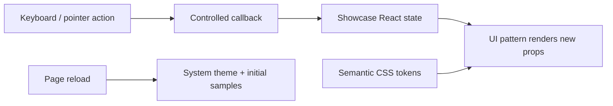
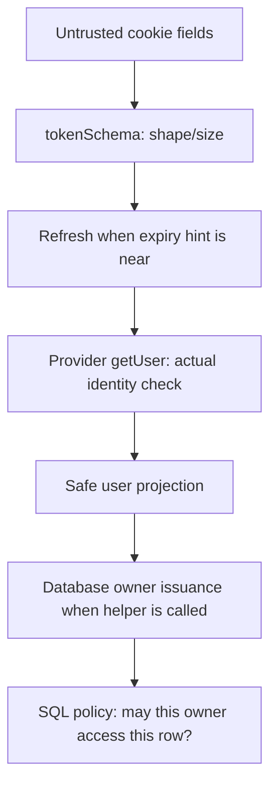

# Learning MindMora

**Source inspected:** 2026-10-04, through 1C. Study the system that exists first: public UI,
backend auth, shared contracts and a database library boundary. There is no note-save
request flow yet. [Architecture](../ARCHITECTURE.md) owns the system overview,
[FILE_MAP](FILE_MAP.md) owns navigation, and subsystem guides own exact operating rules.

## A progressive source-reading path

Use each question to check understanding before moving on. All links below are existing
files, not proposed examples.

| Order | Read | Question to answer |
|---|---|---|
| 1 | [homepage](../src/app/page.tsx), [layout](../src/app/layout.tsx), [showcase](../src/app/dev/design-system/showcase.tsx) | What does a user actually see, and which interactions are only samples? |
| 2 | [tokens](../src/design-system/tokens.css), [UI exports](../src/components/ui/index.ts), [theme](../src/components/ui/theme.tsx), [product patterns](../src/components/mindmora/index.tsx) | Which layer owns appearance, state and callbacks? |
| 3 | [account projection](../src/features/account/types.ts), [browser helpers](../src/features/account/api.ts), [server config](../src/server/config.ts) | What data is allowed to cross the browser/server boundary? |
| 4 | [auth adapters](../src/app/api/auth/), [auth routes](../src/server/auth/routes.ts) | Where are methods, Origin, redirects and cookies controlled? |
| 5 | [session](../src/server/auth/session.ts), [provider](../src/server/auth/provider.ts), [auth tests](../src/server/auth/routes.test.ts) | How is a token-shaped cookie different from verified identity? |
| 6 | [note inputs](../src/features/notes/validation.ts), [domain types](../src/features/notes/types.ts), [model contract](features/note-model.md) | Which constraints describe data, and which would require authorization? |
| 7 | [Drizzle schema](../src/server/db/schema.ts), [migration](../supabase/migrations/0000_profiles_notes.sql) | What exists in PostgreSQL beyond the TypeScript model? |
| 8 | [verified owner](../src/server/db/user-context.ts), [DB client](../src/server/db/client.ts), [DB config](../src/server/db/config.ts) | Why do identity, login role and LOCAL claims all matter? |
| 9 | [role provision](../scripts/provision-role.ts), [credential staging](../scripts/provision-files.ts), [CLI coordinator](../scripts/provision-database.mjs) | What happens when database setup and file publication cannot commit together? |
| 10 | [RLS tests](../tests/integration/rls.test.ts), [Docker harness](../scripts/test-database.mjs), [browser tests](../tests/e2e/) | Which guarantees are exercised with real systems, and which services are fixtures? |

## 1. Presentation, state and persistence are different things

**Concept.** Rendering a note row or a “saved” badge does not save data. A controlled
component receives values and callbacks; its parent chooses the state and side effects.
This keeps visual behavior reusable without turning UI into storage authority.

**MindMora implementation and flow.** The layout installs ThemeProvider and CSS. The
showcase holds demo React state and passes it to reusable controls/product patterns.
Clicks/keyboard callbacks update that state, causing a new render. CSS semantic tokens
provide light/dark colors and motion rules; changing theme projects a document data
attribute, while system mode leaves CSS to follow OS preference.

**Security and trade-offs.** Components contain no DB credentials or real note ownership.
Page-lifetime state is simple and easy to test, but disappears on reload; “session-only”
here does not mean sessionStorage. Shared CSS/Radix reduce duplicated visual/focus logic,
while callers still must provide meaningful labels and valid controlled state. Existing
save/sync labels and metadata contain historical local-first wording; that wording is a
presentation limitation, not an implemented sync mechanism.

**Read next:** [design contract](design/design-system.md), [component API](design/component-api.md),
then [runtime config](../src/server/config.ts).

## 2. A runtime boundary protects imports, not every output

**Concept.** Browser code and server code have different access: only the server should
read credentials or use a database connection. A backend does not require every page to
render anew on each request; static public content and dynamic APIs can coexist.

**MindMora implementation and flow.** Next builds the public pages ahead of time; Node
serves them and dispatches dynamic auth requests. `server-only` rejects guarded modules
in Client Component imports. Config loaders read selected environment variables only when
called, validate them with Zod and emit fixed errors. Public pages do not call those loaders.

**Security and trade-offs.** Lazy config lets someone run the showcase without cloud
setup. The compiler guard prevents accidental imports, but cannot protect a secret manually
copied into JSON/React props. Runtime validation cannot prove a hosted service is reachable.
The real compiler fixture tests the import restriction rather than assuming a mocked
unit environment reproduces Next's boundary.

**Read next:** [boundary harness](../scripts/test-server-boundary.mjs), then account projection
and [auth guide](integrations/supabase-auth.md).

## 3. Authentication tells us who; authorization tells us what they may access

**Concept.** A credential is evidence to verify, not a trustworthy user object. A valid
account still cannot read another account's note. Input validation, identity verification
and row authorization solve different problems.

**MindMora implementation and flow.** Supabase Auth owns Google identity and sessions.
The server accepts a cookie containing token fields, validates their shape, refreshes
near expiry, then asks the provider for the user. Only id/email/displayName cross back to
browser JSON. The database boundary separately uses this verified identity for owner RLS.

**Security and trade-offs.** Editing cookie expiry does not forge a verified account.
Base64url is encoding, not encryption/signing. HttpOnly keeps JS from reading the cookie
but does not stop JS issuing authenticated requests. Online verification costs a provider
round trip and fails closed on outages. The database helper is not called by an HTTP route
yet, so this diagram shows composition of implemented functions, not a current note API.

**Read next:** [session.ts](../src/server/auth/session.ts), [provider.ts](../src/server/auth/provider.ts),
[ADR-020](decisions/ADR-020-backend-owned-auth-cookies.md).

## 4. PKCE and app state bind the returning sign-in to its browser flow

**Concept.** A sign-in callback arrives from outside the app. PKCE ties code exchange to
possession of a verifier; the app's random state ties the callback to its pending browser
flow. Those checks allow an external redirect without treating arbitrary callback input
as authenticated.

**MindMora implementation and flow.** POST start creates a fresh SDK client and verifier
storage, asks for the provider URL, validates that URL and sets a short-lived pending
cookie. Google returns to Supabase; Supabase returns to the configured app callback.
The app checks permitted query fields, state/expiry and code before SDK exchange and
online verification. It sets the app session and redirects to the fixed homepage.

**Security and trade-offs.** Supabase owns Google OAuth state; MindMora's app state is an
additional boundary. Start/logout require exact Origin, while callback uses state/PKCE.
One pending cookie means one active sign-in flow per browser. Beginning another flow
replaces the earlier one. Configuration of Google consent/callbacks is external to source,
so a successful fixture does not prove a real project's settings.

**Read next:** [auth sequence/setup/failures](integrations/supabase-auth.md), route tests and
[historical live evidence](phases/phase-01-foundation.md).

## 5. Refresh, revocation and browser lifetime are separate clocks

**Concept.** Browser cookie expiry, access-token expiry and provider revocation are not
the same event. A cookie may exist after its provider session has been revoked. Refresh
can succeed concurrently within a provider's reuse rules; that is not an unlimited replay
promise.

**MindMora implementation and flow.** Session verification uses the expiry hint to decide
whether to refresh, verifies the resulting access token and returns `refreshed` metadata.
Auth routes write the new cookie when needed. Logout verifies/refreshes, asks for local
session revocation and clears cookies. Missing/corrupt decoded cookie follows idempotent
local cleanup; invalid structured credentials can produce 401.

**Failures/security/trade-offs.** A provider outage yields 503 instead of access. Ordinary
session failure of that kind preserves the cookie; logout failure inside the provider
branch clears local cookies but cannot confirm remote revocation. Earlier config/Origin
rejection does not execute that cleanup. There is no automatic browser retry or cache-
cleanup mechanism in account helpers. SDK retries make a ten-second fetch timeout distinct
from a ten-second whole operation. See the auth guide for the exact error matrix.

**Read next:** [account helpers](../src/features/account/api.ts), auth tests, then note inputs.

## 6. Types, validators and database constraints overlap without replacing one another

**Concept.** TypeScript checks code before execution; Zod checks actual values; PostgreSQL
constraints protect persisted rows. Permission is separate from all three. Sharing input
schemas reduces drift, but only a caller that parses data actually enforces them.

**MindMora implementation and flow.** Shared note schemas reject unknown owner/plan fields,
trim/bound titles, bound UTF-8 content, require meaningful updates and constrain revisions/
cursors. Domain schemas describe output shape. Drizzle defines SQL columns and migration
constraints. No note route or serializer consumes these contracts yet.

**Security and trade-offs.** Unicode code points differ from UTF-8 bytes; 200 emoji need
more than 200 bytes. NUL cannot reach PostgreSQL TEXT. Zod title trim is broader than SQL
space trim; a stored value valid under SQL can fail the stricter domain schema. Parsing a
note's Markdown does not sanitize HTML. Current output schemas validate timestamp shape,
not cross-field chronology; SQL checks protect persisted timestamp order.

**Read next:** [note model](features/note-model.md), validation tests and schema/migration.

## 7. Migrations turn code descriptions into real database structure

**Concept.** A schema file describes intended structure; a migration is versioned SQL
applied to a database. A journal records application; a snapshot supports later model diffs.
Neither a TypeScript definition nor successful generation proves a hosted role is effective.

**MindMora implementation and flow.** Drizzle generation reads `schema.ts`; the reviewed
initial migration adds tables, foreign keys, checks, index and policies, plus manual
role/grant/FORCE clauses. The CLI migrator applies that journaled SQL. Auth user deletion
cascades through profile to notes. The request role cannot perform normal hard deletion.

**Security and trade-offs.** FKs prevent orphaned ownership records. Defaults initialize
UUID/revision/timestamps; no trigger advances revision/updatedAt later. The partial index
is useful for future cursor queries but does not implement them. Manual privilege SQL
requires review beyond generator snapshots; applied migration edits do not update an
existing database. Hosted Auth schema permissions differed from requested GRANT text,
which is why real role/query evidence matters.

**Read next:** [database guide](integrations/supabase-database.md), then verified context/client.

## 8. A verified owner is a capability inside the server process

**Concept.** A capability is something possession of which admits a specific operation.
Here an object identity carries evidence that the app ran its verification helper. A UUID
string alone supplies no such evidence.

**MindMora implementation and flow.** `verifyDatabaseSession` uses the existing online
verification, freezes `{userId}`, registers that actual object in a module-private WeakSet
and returns it with session/refresh metadata. `run` asserts membership before opening a
transaction. Copying/spreading the owner creates a different object and is rejected.

**Security and trade-offs.** The object has no built-in expiry/revocation check; it must
remain request-scoped and future private routes must reverify each request. Its properties
are readonly, but trusted server code still chooses callbacks and holds credentials. The
helper currently does not explicitly call provider disposal, unlike `handleAuth`'s finally
block. No app route currently exercises that helper. These are implementation limits,
not hidden assumptions about automatic lifecycle behavior.

**Read next:** [user-context.ts](../src/server/db/user-context.ts), [client.ts](../src/server/db/client.ts),
[ADR-021](decisions/ADR-021-scoped-database-role.md).

## 9. Connection pooling makes identity scope a security issue

**Concept.** A pool reuses connections to avoid opening one for every operation. A session-
level identity setting could remain for the next user. Transaction-local settings end
with commit/rollback, keeping scope aligned with a single operation.

**MindMora implementation and flow.** The app login is NOINHERIT with no direct table/
column grants. The wrapper inspects actual flags/membership/initial claims, then SET LOCAL
switches to the non-login request role and verified claims. Parameterized Drizzle queries
run through `auth.uid() = user_id` policies. Callback success commits; failure rejects and
rolls back. The factory's pool is bounded; the optional singleton is lazy.

**Security and trade-offs.** NOBYPASSRLS and FORCE RLS are important, but not proof against
administrators or stolen server credentials. RLS trusts server-supplied claims. Role
checks/SQL setup introduce round trips and are not a total-duration deadline. No explicit
DB retry/reconciliation exists; an ambiguous commit cannot safely be equated with “unsaved.”
Real tests check two users, no claims, privileged login and reused connections. Fixture
Auth responses are distinct from real PostgreSQL/provider role behavior.

**Read next:** [exact grants, timeouts and failures](integrations/supabase-database.md), RLS tests.

## 10. Provisioning crosses two systems that cannot commit together

**Concept.** PostgreSQL can atomically create a role and grant its membership. It cannot
atomically commit a credential file on the developer's disk in the same transaction.
The recovery plan must preserve the generated password before SQL can leave a login behind.

**MindMora implementation and flow.** First-time provisioning refuses an existing login/
nonempty runtime URL, generates a password and fsyncs private pending env content. CREATE
ROLE/GRANT share a DB transaction. After commit, `publish` compares the original env and
atomically renames the pending file into place. Failures retain recovery material.

**Security and trade-offs.** Staging prevents credential loss during process interruption
and avoids truncating env, but leaves a second secret file needing protection. No automatic
resume/password rotation exists; a failed or ambiguous setup needs state verification.
The unchanged-env check is not a cross-process locking protocol; it cannot guarantee
against every simultaneous editor write. Power-loss/backup durability is unproven.

**Read next:** [provisioning state diagram/recovery](integrations/supabase-database.md#migration-and-provisioning-flow)
and the credential-file tests.

## What to study later

The following are accepted plans, not installed runtime systems: Query in-memory cache,
Zustand UI state, nuqs URL state, revision-safe repositories/HTTP saves, Redis limits,
Pino, private Storage, BullMQ/outbox/worker, Swagger/Postman. Their reasoning belongs in
[planned data architecture](architecture/full-stack-architecture.md), [state ownership](architecture/state-management.md),
[backend services](integrations/backend-services.md) and [API tooling](integrations/api-tooling.md).
Automatic Drive-authoritative sync and the browser E2EE vault are superseded, not future
features under the current scope. Deployment/provider encryption/restore guarantees
remain open. Do not use a roadmap diagram as evidence that those systems exist.
