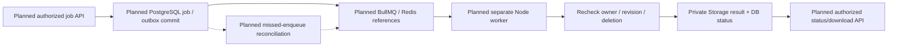

# Data Flows: Current Foundation and Planned Features

**Current:** 1A–1C runtime/auth/contracts/scoped SQL boundary. **Planned below:** repositories,
note requests/UI, file storage and jobs. [ARCHITECTURE](../../ARCHITECTURE.md) is the primary
current system architecture; this companion owns future data-flow constraints and failure
scenarios. [Model](../features/note-model.md), [database](../integrations/supabase-database.md)
and [state](state-management.md) own existing model/SQL and planned state details.

## Existing foundation

The public UI is a showcase. Auth HTTP routes verify sessions without SQL. A separate
library composes verified-owner issuance and constrained transactions, exercised by real
database integration tests; it has no private HTTP caller. Shared mutation/list/domain
schemas exist, but no service applies them to a note operation. Profiles are not created
at login. Database defaults are initialization, not automatic revision/time updates.

## Planned note request and save flow — 1D–1G

```mermaid
sequenceDiagram
  participant E as Planned editor / memory draft
  participant Q as Planned account-scoped Query cache
  participant H as Planned note HTTP adapter
  participant S as Planned service/repository
  participant P as Existing SQL boundary / PostgreSQL
  E->>Q: Save draft with expected revision
  Q->>H: Authenticated mutation
  H->>H: HTTP limits/origin/input validation + session verification
  H->>S: Verified owner + parsed input
  S->>P: Owner/revision-scoped transaction
  alt Revision matches and commit is confirmed
    P-->>S: Updated record / revision
    S-->>H: Normalized domain result
    H-->>Q: Typed response
    Q-->>E: Update/invalidate cache; show saved
  else Conflict or failure
    H-->>E: Typed outcome; retain draft
  end
```

Routes own HTTP/config/admission, services own business outcomes, repositories own owner
predicates and atomic writes. Future update/delete compares owner/id/expected revision,
then advances revision atomically. Zero matches need safe not-found/conflict handling that
does not reveal another user's record. RLS supplies an additional row boundary; it does
not supply these business rules. Normal save writes directly to PostgreSQL, not a queue.

A failed response after commit creates uncertainty, not proof of failure. Future reconciliation/
idempotency must resolve that outcome before blindly retrying. A conflict preserves draft
and fetched version for deliberate compare/retry. These rules are not present in a save
service/UI yet, and source cannot establish their exact API signatures beyond shared inputs.

## Planned files and jobs — Phase 4

Private Supabase Storage will own bytes; PostgreSQL will own authorized metadata/status.
Database/object operations cannot share one atomic transaction: staged uploads and dangling
objects need bounded cleanup. Signed URLs are credentials requiring expiry/owner checks.
No Storage bucket/policy/client or upload/download route exists in current source.



Reference-only jobs avoid putting note bodies/secrets into queue infrastructure. At-least-once
processing requires idempotency, bounded retries/concurrency, cleanup and stale/deleted
record protection. A worker is a separate Node process, distinct from a browser Web Worker
and from unawaited work after a serverless response. No implementation/topology/uptime claim
follows from this diagram; [service design](../integrations/backend-services.md) owns those plans.

## Integrations and excluded history

Google OAuth is identity-only (openid/email/profile), not Drive permission. There is no
Google Drive client, refresh-token table, automatic sync queue or remote conflict algorithm.
The former Drive-authoritative/browser-vault model is superseded. Import/export portability
remains a product target; a future external integration needs its own specification, owner
checks, secret handling and failure semantics. No second production database or MinIO.

Nginx/managed ingress and worker hosting remain unselected. [Hosting constraints](../integrations/hosting-and-costs.md)
are dated research, not current deployment guarantees. Encryption-at-rest/backups/restore
and production cache/transport controls must be verified with actual provider configuration.
