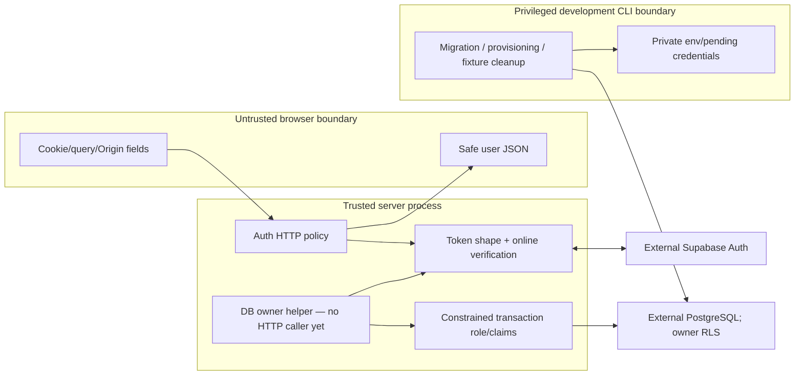

# Security Boundaries and Acceptance

**Current inspection:** 2026-10-04, through 1D. Auth/cookie validation, server-only configuration,
scoped SQL controls and HTTP/Pino/Redis admission are implemented. Private UI/cache lifecycle,
revision-safe writes, rendering/files/jobs and deployment controls remain planned. This is
not a complete security certification. Exact historical checks live in the [phase record](../phases/phase-01-foundation.md).

## Assets, threat model and trust

Current protected assets are app session credentials, provider identity and the SQL models/
credentials prepared for private records. Future notes/files/jobs expand that surface.
The accepted model is server-readable storage with verified transport and access controls,
not E2EE. Provider encryption-at-rest/backup/restore settings have not been established
by repository source or this documentation review.

Auth routes and the database helper are separate callers of session verification. The
current HTTP path does not reach SQL. The privileged CLI can do things the request role
cannot; local secret-file protection is a separate boundary from SQL transactions.

| Trusted element | What it is trusted to do | Limit |
|---|---|---|
| Server configuration | Choose exact origin/provider and DB credentials | Zod shape validation does not validate dashboard state or network reachability |
| Supabase online identity response | Establish user identity from access credential | Availability/revocation/reuse behavior is provider-dependent |
| Owner helper / actual issued object | Show the server verified that session during issuance | No built-in expiry or recheck; not safe to cache as durable authority |
| Trusted SQL callback/server credential holder | Supply verified claims and parameterized operations | Can impersonate another owner if compromised; not a plugin sandbox |
| Migration/admin/operator | Change schema/grants and clean records | Can bypass RLS; protect these credentials separately |
| Browser-supplied UUID/plan/cookie expiry | None as identity or permission authority | Validate shape, then independently authenticate/authorize |

## Implemented controls and misuse cases

| Misuse | Current protection | Residual boundary |
|---|---|---|
| Foreign-origin cookie mutation | Exact APP_ORIGIN for start/logout; cross-site fetch check outside callback | Does not prevent same-origin XSS requests |
| Forged/replayed callback | App state/expiry/query checks, provider one-use code exchange with PKCE | Provider configuration and cookie/server compromise are separate risks |
| Cookie claims treated as identity | Strict token tuple + online getUser; no decoded JWT/getSession authority | Cookie JSON is encoded, not app-signed/encrypted |
| Arbitrary owner object | WeakSet issuance/membership before SQL | Object may outlive session if trusted caller retains it |
| Foreign note access in scoped query | USING/WITH CHECK owner policy, constrained role and column grants | RLS trusts supplied claims; admins bypass; future repo filters still needed |
| Cross-request claim leakage | Clean initial role/settings check and LOCAL role/claims | Rejects observed dirty state; not universal session-setting audit |
| Orphan/invalid SQL records | Foreign keys and length/revision/time checks | No automatic revision advancement, safe save reconciliation or input HTTP route |
| Private SQL error serialization | Fixed DatabaseFailure and safe reason, raw cause omitted | Business exceptions also wrapped; future HTTP mapping not implemented |
| Credential loss on setup failure | Private fsynced pending file, transactional role/grant, atomic publication | Manual recovery, race/power-loss/backup limits remain |
| Server imports in browser | server-only compiler guard + fixture/output tests | Explicit serialization and framework/deployment logs need independent review |

Exact rules and error cleanup are owned by the [auth guide](../integrations/supabase-auth.md)
and [database guide](../integrations/supabase-database.md), not duplicated here. Note bounds
are owned by the [model contract](../features/note-model.md). Validation is not permission
and does not sanitize Markdown. Current shared schemas are not yet a note API/form pipeline.

## Failure and availability posture

Authentication rejects unavailable identity verification; it does not authorize from an
old browser projection. Cookie cleanup depends on branch/guard order—early config/Origin
rejection is different from provider failure inside logout. The SQL wrapper refuses unsafe
roles/pooled state and rejects transaction failures without exposing private values. It does
not automatically retry mutations; uncertain commit outcomes need future reconciliation.
Credential setup retains pending secrets rather than overwriting/rotating blindly.

Current auth handlers use bounded HTTP input, Redis admission and an allowlisted Pino facade.
Body/Redis deadlines are bounded, but no total-provider-operation deadline or proven
framework/access-log scrubber exists. In particular,
callback URLs contain code/state and logging exposure must be assessed in future deployment/
HTTP work. Auth SDK per-fetch and DB per-statement limits are not total-operation deadlines.

No permanent private page renders notes or holds an account cache yet. Existing public
showcase stores only memory samples. Future private data in browser memory/DOM is still
exposed to XSS/device compromise even without IndexedDB. No forensic memory-erasure,
DDoS immunity or provider-compromise protection is promised.

## SEC acceptance matrix: evidence versus remaining work

These are the current IDs; historical vault-specific SEC checks are superseded.
“Partial evidence” identifies the exercised layer, not completion of the whole requirement.

| ID | Required outcome | Current evidence / remaining work |
|---|---|---|
| SEC-01 | Invalid/revoked sessions denied; callback/origin misuse rejected; logout revokes session | Auth fixtures/browser plus bounded live provider checks recorded; full private API/UI lifecycle still planned |
| SEC-02 | Foreign-owner list/read/update/delete and spoofed ownership rejected; actual roles/pool isolation | 1C actual SQL two-user/anonymous/privileged/reuse checks; note HTTP/repository owner filters remain 1E |
| SEC-03 | Bounded validated input before work; matching form/API contracts | Shared model/config tests and SQL constraints; HTTP body helper/auth bounds verified in 1D; note route/form enforcement remains 1E/1G |
| SEC-04 | No private persistent browser cache; logout/switch clears memory/late results | Auth fixture browser checks and public memory-only UI; private cache/draft lifecycle remains 1F/1G |
| SEC-05 | No private markers in logs/bundles/errors/exported contracts | Safe response/DB error/compiler/bundle evidence; Pino marker scans verified in 1D; external access logs/Swagger/Postman remain open |
| SEC-06 | Encrypted production transport and verified storage/backup encryption | Server boundary and development DB verified-CA TLS evidence; production ingress, at-rest/backups/restore/Storage remain open |
| SEC-07 | Rate limits/Retry-After, trusted IP handling and outage policy | 1D auth/default-forwarding/outage and local real Redis count/TTL/recovery verified; basic fallback helper tested; hosted ingress/TLS/quota evidence and note callers remain open |
| SEC-08 | Concurrent revisions cannot silently overwrite; uncertain writes/drafts reconcile | Positive revision/schema exists; atomic operations and UI evidence remain 1E/1G |
| SEC-09 | Owner-scoped private files/jobs/results, retries/outbox and safe payloads | Planned Phase 4; no Storage/BullMQ runtime |
| SEC-10 | Sanitized rendering/plugin permissions/provider consent | Planned with editor/AI/plugins; no renderer/BYOK integration |

Passing 1D does not complete SEC-01–08 or authorize production deployment. Local HTTP and
loopback PostgreSQL TLS exceptions are deliberate; production evidence must be real.
Hosted SQL tests exercise Session pooler, not every provider topology. The database's
controlled Auth transport is not live Google consent.

## HTTP/admission evidence — 1D

Auth now applies byte/deadline bounds, no-store errors with correlation IDs, Redis admission
and allowlisted Pino metadata. Forwarded addresses are ignored unless configured ingress
trust is proven. Auth/expensive outage rejects admission; the basic helper demands issued
verified ownership and returns a bounded degraded local budget. No note route consumes it
yet. Admission-rejected logout retains cookies and is unsuccessful. [Services](../integrations/backend-services.md)
owns exact windows, budgets, guard ordering and TLS/timeout configuration. Local Valkey,
provider-fixture/browser and marker tests are layer-specific evidence, not a completed
SEC-01–08 or production gate. External framework/proxy logs remain to be controlled.

## Planned constraints when features arrive

- Private APIs/SSR must remain no-store through browser/Next/edge/ingress/service-worker
  layers. Clear account-scoped caches/drafts and invalidate late async results on switch/logout.
- Existing Pino facade allowlists metadata and excludes payloads, note titles/bodies, credential fields,
  signed URLs and private SQL parameters. Framework/proxy logs need compatible controls.
- Redis holds counters/reference jobs, not knowledge/session authority. Auth/expensive work
  fails closed on limiter outage; basic API fallback must keep unchanged authentication/ownership.
- Storage URLs and worker references need independent authorization, bounded expiry/input,
  revision/deletion rechecks, idempotency and durable reconciliation.
- Markdown/HTML/link/plugin rendering needs explicit controls before rendering arrives.
  Cloud AI needs explicit consent; saved BYOK needs a separate approved secret-management design.

[Architecture](../../ARCHITECTURE.md) · [State](state-management.md) ·
[ADR-018](../decisions/ADR-018-full-stack-server-storage.md) ·
[ADR-020](../decisions/ADR-020-backend-owned-auth-cookies.md) ·
[ADR-021](../decisions/ADR-021-scoped-database-role.md) · [Dated hosting constraints](../integrations/hosting-and-costs.md).

## Startup checks — authorized 1D follow-up

Node startup probes use existing verified remote TLS and runtime-only credentials, finite
deadlines, dedicated clients and allowlisted terminal errors. Production failures terminate;
development warnings never authorize a failed session/admission request. Startup does not
validate RLS/schema or ongoing availability. No credential/raw-exception logging is added.
[Services](../integrations/backend-services.md#server-startup-health--implemented-follow-up-to-1d)
owns behavior and limits; [ADR-023](../decisions/ADR-023-startup-dependency-health.md) records
production/development/readiness trade-offs. This is not a completed security/deployment gate.
