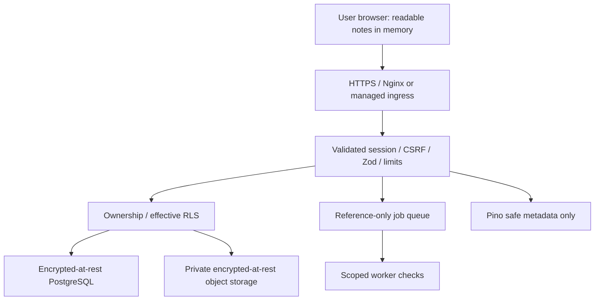

# Security Architecture and Acceptance Contract

**Status:** 📋 Planned; revised by user authorization on 2026-10-03. Milestone 1A implements lazy Zod configuration and a compiler-enforced server-only boundary. 1B implements PKCE/state, protected cookies, online identity verification, auth Origin/no-store and safe errors; live Google sign-in/session/logout and refresh/replay checks are verified. Storage/general HTTP/Pino/Redis controls remain planned. The old encrypted-vault SEC tests are superseded, not implemented or passing.

## What is protected

Private notes, related knowledge, files, account identity, credentials and job results. Use server-managed encrypted storage and encrypted transport, authenticated/authorized API access, effective RLS, validated inputs, constrained jobs and sanitized rendering. No end-to-end encryption or user-held vault/passphrase/recovery key. Providers and authorized application services/operators can access readable content. Verify each provider's storage/backup encryption and access policy before sensitive-data claims.

## Threats and limits

Protect against unauthenticated access, cross-user access, forged ownership, malformed requests, secret leakage via logs/client bundles, persistent browser cache leakage, CSRF, stale concurrent saves and unsafe rendered content. Rate limits reduce abuse but do not guarantee DDoS resistance. A compromised application/provider/administrator can read server-managed content. XSS or a compromised device can read notes while displayed; avoiding IndexedDB does not eliminate runtime exposure. No forensic RAM-erasure promise or total-protection claim.

## Concrete controls

- Server-owned tested Google/Supabase code/PKCE flow, fixed callback/redirect allowlist, protected session cookies with server refresh/logout, session expiry/revocation and origin/CSRF protection. Do not claim stock browser SDK cookies are HttpOnly.
- Verified owner derived on the server. Authorization on every list/detail/mutation/search/file/job/result/version endpoint. RLS/Storage policies tested with actual roles; Drizzle service-role/database-owner connections may bypass RLS. Constrain request role and transaction-local verified claims; no cross-request pool leakage.
- Parameterized Drizzle, versioned migrations, bounded connections, pagination, request limits, transactional expected-revision comparison, typed conflict errors and uncertain-write reconciliation.
- Zod validates APIs/forms/job/config payloads; reject unknown sensitive/owner fields; bound lengths/sizes. Validation does not grant permission or sanitize rendered HTML.
- Pino redaction/allowlisted safe errors. Never log payloads, note bodies/titles, headers/cookies/tokens, signed URLs, credentials, BYOK keys or SQL bound values containing private content. Restrict retention/access.
- No persistent browser knowledge or auth secrets in IndexedDB/localStorage/sessionStorage/Cache Storage; private HTTP responses `no-store`; no Next/edge/Nginx shared private cache. Scope memory by user/session; clear drafts/query cache and invalidate async results on logout/switch. Protected SSR output is also private/no-store.
- Redis TLS/ACL/expiry and provider checks, only counters and reference jobs. Public auth and expensive job admission fail closed on limiter outage. Basic note APIs use conservative local fallback plus unchanged auth/ownership; multi-instance fallback cannot promise a global rate limit.
- Private files, size/content controls, safe paths, owner-only signed downloads, private retention and staged upload cleanup. Plan file scanning/serving restrictions with attachments.
- Idempotent workers, bounded retries/backoff/concurrency, revision/cancellation/deletion recheck, durable outbox/status reconciliation, reference-only queue payloads and no secrets in failure traces.
- CSP, no unsafe dynamic eval, sanitized Markdown/links/diagrams and sandboxed plugin capabilities. Cookie auth requires CSRF even when input is valid. Restrict API docs exposure in production; use placeholders, never saved real auth in exported Postman collections.
- BYOK defaults to ephemeral explicit request-only use; no browser/database/queue persistence. Saved provider keys need a separate approved server-secret-management design. Explicit consent before sending notes to a cloud model.

## Measurable requirements

Use these current IDs; the earlier vault-only use of SEC-01–08 is historical.

| ID | Acceptance | Phase / evidence |
|---|---|---|
| SEC-01 | Invalid/expired/revoked sessions denied; callback state/redirect abuse and foreign-origin cookie mutations rejected; logout invalidates session | 1B/1E: auth integration + browser |
| SEC-02 | User A cannot list/read/update/delete User B notes or spoof owner/plan; actual Drizzle role enforces RLS; pooled claims do not leak | 1C/1E: two-user database integration |
| SEC-03 | Malformed/oversized inputs rejected before work; form/API Zod contracts agree; no unexpected owner assignment | 1C/1E: schema and HTTP tests |
| SEC-04 | Private notes/tokens absent from browser persistent stores/service-worker cache; private responses no-store; logout/account switch clears memory and late responses | 1F/1G: browser + header tests |
| SEC-05 | Marker note text/token/key/signed URL never appears in Pino output, client bundles, errors, OpenAPI examples or Postman exports | 1D/1H: redaction/bundle/fixture scans |
| SEC-06 | Production transport encrypted; server secrets inaccessible to browser; canonical DB/files/backups encryption settings verified and documented | 1A config/import/output evidence recorded; 1C/provider/production TLS and Phase 4 file evidence still planned |
| SEC-07 | Limits return 429/Retry-After; expiry works; forwarded IP trust tested; Redis outage obeys defined fail-closed/fallback rules | 1D: limiter integration |
| SEC-08 | Two concurrent mutations with one revision cannot both overwrite; uncertain write reconciles; failure retains draft and never displays saved | 1E/1G: transaction + E2E |
| SEC-09 | Private file/job/result inaccessible to other owner; enqueue/worker revalidate; retries idempotent; outbox recovers enqueue outage; secrets/bodies never enter Redis | 4: storage/Redis/worker integration |
| SEC-10 | Script/unsafe URL Markdown payloads blocked; plugin permissions can't bypass server owner checks; AI requires explicit provider consent | 2/10/11: rendering and capability tests |

Foundation cannot complete without applicable SEC-01–08 evidence. SEC-06 local test TLS exemptions must be documented; production readiness needs actual ingress/provider evidence, not a mocked checkbox. SEC-09/10 activate with their features; mark unrun checks planned.

## Data placement

| Data | Location |
|---|---|
| Canonical notes and derived records | Supabase PostgreSQL, server-readable, infrastructure encryption |
| Attachment/export bytes | Private Supabase Storage with authorized downloads |
| Fetched notes/drafts | Browser memory/DOM; clear on logout/switch; no durable browser storage |
| Identity/session | Supabase Auth and tested backend-owned cookie lifecycle; no app password/token tables |
| Rate counters/job references | Redis with TTL/retention; no note content |
| Encryption keys | Provider/server key-management system; no browser vault keys |
| Optional BYOK key | Ephemeral request runtime only until separate saved-secret design approved |
| Logs | Pino safe metadata, restricted and bounded |

## Verification and documentation

Audit/lint/typecheck/unit tests/runtime build and applicable auth/database/Redis/Storage/browser tests. Two-user RLS checks use real database connections; mocks alone cannot show policy enforcement. Restore drills and quota/retention evidence precede deployment claims. Read [ADR-018](../decisions/ADR-018-full-stack-server-storage.md), [Supabase session design](../integrations/supabase-auth.md) and [hosting budget](../integrations/hosting-and-costs.md).

## Milestone 1B evidence — 2026-10-04

Auth tests exercise the official SDK and real Next/browser cookies using a test-only provider fixture. Config/PKCE/state misuse, malformed callbacks, exact Origin, expired/refreshed/revoked sessions, independent-device local logout, late refresh replay, cookie size/duplication, safe output and provider failures are covered. HTTPS cookie attributes are tested in route responses; actual production TLS/ingress remains unproven. No credentials appear in safe JSON or JS persistent stores during browser tests. SEC-01/05 remain partially evidenced overall: 1B live refresh/reuse/replay and independent-session tests passed 13/13, while general HTTP/admission/logging and deployment controls remain later work. The latest read-only live settings check returned HTTP 200 with Google enabled, and start redirected through Supabase to Google’s sign-in page. Live account/callback/session succeeded; logout returned 204, followed by same-browser session 401. Subsequent original/refreshed cookie replay and revoked refresh attempts returned 401; logout A preserved B (200). Refresh was forced by aging the expiry hint, without waiting for natural access JWT expiry. SDK network fetch timeout is ten seconds per attempt; whole refresh timing depends on retries.

1D owns general admission/Pino/correlation; 1C/1E own effective RLS/data access; 1F/1G own memory-cache/draft cleanup. Auth routes are not production-ready before admission controls. [ADR-020](../decisions/ADR-020-backend-owned-auth-cookies.md) and [setup/live checklist](../integrations/supabase-auth.md) record the actual boundary and remaining evidence.
