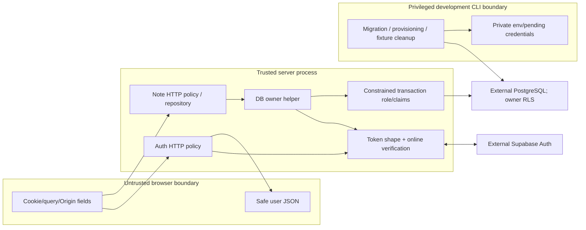

# Security Boundaries and Acceptance

**Current inspection:** 2026-10-05, through Phase 2 implementation; complete Phase 2 local acceptance passed. Auth/cookie validation, server-only configuration,
scoped SQL controls and HTTP/Pino/Redis admission are implemented. Private UI/cache lifecycle and revision-safe note APIs are implemented.
Bounded Markdown/math/diagram rendering and workspace CSP are implemented; files/jobs and deployment controls remain planned. This is
not a complete security certification. Exact historical checks live in the [phase record](../phases/phase-01-foundation.md).

## Assets, threat model and trust

Current protected assets are app session credentials, provider identity and the SQL models/
credentials prepared for private records. Note APIs protect private title/content; future files/jobs expand that surface.
The accepted model is server-readable storage with verified transport and access controls,
not E2EE. Provider encryption-at-rest/backup/restore settings have not been established
by repository source or this documentation review.

Auth routes and the database helper are separate callers of session verification. The
auth HTTP path does not reach SQL; note HTTP routes do. The privileged CLI can do things the request role
cannot; local secret-file protection is a separate boundary from SQL transactions.

| Trusted element | What it is trusted to do | Limit |
|---|---|---|
| Server configuration | Choose exact origin/provider and DB credentials | Zod shape validation does not validate dashboard state or network reachability |
| Supabase online identity response | Establish user identity from access credential | Availability/revocation/reuse behavior is provider-dependent |
| Owner helper / actual issued object | Show the server verified that session during issuance | No built-in expiry or recheck; not safe to cache as durable authority |
| Trusted SQL callback/server credential holder | Supply verified claims and parameterized operations | Can impersonate another owner if compromised; not a plugin sandbox |
| Migration/admin/operator | Change schema/grants and clean records | Can bypass RLS; protect these credentials separately |
| Browser-supplied UUID/plan/cookie expiry | None as identity or permission authority | Validate shape, then independently authenticate/authorize |

## Implemented controls and misuse cases

| Misuse | Current protection | Residual boundary |
|---|---|---|
| Foreign-origin cookie mutation | Exact APP_ORIGIN for start/logout/note mutations; cross-site fetch check outside callback | Does not prevent same-origin XSS requests |
| Forged/replayed callback | App state/expiry/query checks, provider one-use code exchange with PKCE | Provider configuration and cookie/server compromise are separate risks |
| Cookie claims treated as identity | Strict token tuple + online getUser; no decoded JWT/getSession authority | Cookie JSON is encoded, not app-signed/encrypted |
| Arbitrary owner object | WeakSet issuance/membership before SQL | Object may outlive session if trusted caller retains it |
| Foreign note access in scoped query | USING/WITH CHECK owner policy, constrained role and column grants | RLS trusts supplied claims; admins bypass; repository also filters owner/active rows |
| Cross-request claim leakage | Clean initial role/settings check and LOCAL role/claims | Rejects observed dirty state; not universal session-setting audit |
| Orphan/invalid SQL records | Foreign keys and length/revision/time checks | Atomic revisions/keyed create replay implemented; UI drafts/conflicts and generation-scoped cleanup implemented |
| Private SQL error serialization | Fixed DatabaseFailure and safe reason, raw cause omitted | Business exceptions are mapped to fixed HTTP outcomes; raw SQL causes are not exposed |
| Credential loss on setup failure | Private fsynced pending file, transactional role/grant, atomic publication | Manual recovery, race/power-loss/backup limits remain |
| Server imports in browser | server-only compiler guard + fixture/output tests | Explicit serialization and framework/deployment logs need independent review |

Exact rules and error cleanup are owned by the [auth guide](../integrations/supabase-auth.md)
and [database guide](../integrations/supabase-database.md), not duplicated here. Note bounds
are owned by the [model contract](../features/note-model.md). Validation is not permission
and does not sanitize Markdown. The note API and editor controller use the shared schemas; renderer sanitization is a separate boundary.

## Failure and availability posture

Authentication rejects unavailable identity verification; it does not authorize from an
old browser projection. Cookie cleanup depends on branch/guard order—early config/Origin
rejection is different from provider failure inside logout. The SQL wrapper refuses unsafe
roles/pooled state and rejects transaction failures without exposing private values. It does
not automatically retry mutations; current client reconciliation reads uncertain persisted outcomes before another update/delete.
Credential setup retains pending secrets rather than overwriting/rotating blindly.

Current auth handlers use bounded HTTP input, Redis admission and an allowlisted Pino facade.
Body/Redis deadlines are bounded, but no total-provider-operation deadline or proven
framework/access-log scrubber exists. In particular,
callback URLs contain code/state and logging exposure must be assessed in future deployment/
HTTP work. Auth SDK per-fetch and DB per-statement limits are not total-operation deadlines.

The protected workspace renders private notes with memory-only query/draft/preview state.
The public showcase stores only samples. Private data in browser memory/DOM remains
exposed to XSS/device compromise even without IndexedDB. No forensic memory-erasure,
DDoS immunity or provider-compromise protection is promised.

## SEC acceptance matrix: evidence versus remaining work

These are the current IDs; historical vault-specific SEC checks are superseded.
“Partial evidence” identifies the exercised layer, not completion of the whole requirement.

| ID | Required outcome | Current evidence / remaining work |
|---|---|---|
| SEC-01 | Invalid/revoked sessions denied; callback/origin misuse rejected; logout revokes session | Auth fixtures/browser plus bounded live provider checks recorded; private API/UI lifecycle locally exercised; production/provider evidence separate |
| SEC-02 | Foreign-owner list/read/update/delete and spoofed ownership rejected; actual roles/pool isolation | 1C actual SQL two-user/anonymous/privileged/reuse checks; 1E actual-driver note owner filters and foreign 404 responses verified locally |
| SEC-03 | Bounded validated input before work; matching form/API contracts | Shared model/config tests and SQL constraints; HTTP body helper/auth bounds verified in 1D; 1E note route enforcement verified; form enforcement uses the same create/update schemas in 1G |
| SEC-04 | No private persistent browser cache; logout/switch clears memory/late results | Auth fixture browser checks and public memory-only UI; private owner/generation cache/draft lifecycle implemented in 1F/1G; browser evidence in active plan |
| SEC-05 | No private markers in logs/bundles/errors/exported contracts | Safe response/DB error/compiler/bundle evidence; Pino marker scans verified in 1D; Swagger/Postman marker/credential exclusion checked in 1H; external access logs remain deployment work |
| SEC-06 | Encrypted production transport and verified storage/backup encryption | Server boundary and development DB verified-CA TLS evidence; production ingress, at-rest/backups/restore/Storage remain open |
| SEC-07 | Rate limits/Retry-After, trusted IP handling and outage policy | 1D auth/default-forwarding/outage and local real Redis count/TTL/recovery verified; basic fallback helper tested; 1E note basic caller/degraded header verified; hosted ingress/TLS/quota evidence remains open |
| SEC-08 | Concurrent revisions cannot silently overwrite; uncertain writes/drafts reconcile | 1E multi-connection atomic revision/delete races and lost-response create reconciliation verified; UI conflicts/uncertainty implemented in 1G; browser evidence in active plan |
| SEC-09 | Owner-scoped private files/jobs/results, retries/outbox and safe payloads | Planned Phase 4; no Storage/BullMQ runtime |
| SEC-10 | Sanitized rendering/plugin permissions/provider consent | Rendering portion implemented in Phase 2 with bounded AST, controlled URLs/images, trusted bounded math, SVG sanitation/scriptless sandbox and nonce CSP; complete-phase local browser evidence passed on 2026-10-05; see the Phase 2 record. AI consent/BYOK/plugins remain planned |

Passing 1E does not complete SEC-01–08 or authorize production deployment. Local HTTP and
loopback PostgreSQL TLS exceptions are deliberate; production evidence must be real.
Hosted SQL tests exercise Session pooler, not every provider topology. The database's
controlled Auth transport is not live Google consent.

## HTTP/admission evidence — 1D

Auth now applies byte/deadline bounds, no-store errors with correlation IDs, Redis admission
and allowlisted Pino metadata. Forwarded addresses are ignored unless configured ingress
trust is proven. Auth/expensive outage rejects admission; the basic helper demands issued
verified ownership and returns a bounded degraded local budget. Note routes consume the verified-owner fallback. Admission-rejected logout retains cookies and is unsuccessful. [Services](../integrations/backend-services.md)
owns exact windows, budgets, guard ordering and TLS/timeout configuration. Local Valkey,
provider-fixture/browser and marker tests are layer-specific evidence, not a completed
SEC-01–08 or production gate. External framework/proxy logs remain to be controlled.

## Planned constraints when features arrive

- Private APIs/SSR must remain no-store through browser/Next/edge/ingress/service-worker
  layers. Clear account-scoped caches/drafts and invalidate late async results on switch/logout.
- Existing Pino facade allowlists metadata and excludes payloads, note titles/bodies, credential fields,
  signed URLs and private SQL parameters. Framework/proxy logs need compatible controls.
- Redis holds counters/reference jobs, not knowledge/session authority. Auth/expensive work
  fails closed on limiter outage; basic API fallback must keep unchanged authentication/ownership.
- Storage URLs and worker references need independent authorization, bounded expiry/input,
  revision/deletion rechecks, idempotency and durable reconciliation.
- Markdown rendering now follows the implemented boundary below. Future plugin execution needs independent permissions;
  cloud AI requires explicit consent, and saved BYOK a separate approved secret-management design.

[Architecture](../../ARCHITECTURE.md) · [State](state-management.md) ·
[ADR-018](../decisions/ADR-018-full-stack-server-storage.md) ·
[ADR-020](../decisions/ADR-020-backend-owned-auth-cookies.md) ·
[ADR-021](../decisions/ADR-021-scoped-database-role.md) · [Dated hosting constraints](../integrations/hosting-and-costs.md).

## Startup checks — authorized 1D follow-up

Node startup probes use existing verified remote TLS and runtime-only credentials, finite
deadlines, dedicated clients and allowlisted terminal errors. Production failures terminate;
development warnings never authorize a failed session/admission request. Startup does not
validate RLS/schema or ongoing availability. No credential/raw-exception logging is added.
[Services](../integrations/backend-services.md#server-startup-health--implemented-follow-up-to-1d)
owns behavior and limits; [ADR-023](../decisions/ADR-023-startup-dependency-health.md) records
production/development/readiness trade-offs. This is not a completed security/deployment gate.

## Note API security boundary — 1E

Bounded input/method/Origin precede online verification; verified-owner basic admission
precedes body/schema parsing and SQL. Mutation bodies never choose owner, revision output
or plan. Every query filters owner and active rows; SQL enforces effective owner RLS too.
Foreign, absent and deleted detail/mutation IDs all return safe 404. Stale active records
return 409; no overwrite occurs without a matching revision. Create metadata is immutable
and excluded from responses/logs. No Markdown is rendered or sanitized by this API.

All responses are no-store with correlation IDs; refreshed credentials are written only to
protected cookies. Redis fallback still verifies identity and advertises degraded admission.
DB outage returns fixed 503; a lost response can still follow a commit. Keys/refetch resolve
uncertainty, not an automatic rollback promise. Local SDK/provider/browser fixtures are
not a newly executed live Google or hosted note acceptance check.
[Exact API/security rules](../features/notes-api.md) · [Evidence](../phases/phase-01-foundation.md).

## Protected browser and API console boundaries — 1F–1H

The browser receives safe session projections, never raw auth credentials. Its display
lease is not authorization: the backend still verifies each API request. Lease checks,
abort signals and owner-scoped keys prevent late results entering another identity's UI.
Logout and confirmed identity changes clear memory and unmount drafts; transient network
failures keep existing same-tab drafts while new operations must reverify online.
No persister, service-worker private cache or mutation replay queue is installed.

Note input uses shared Zod validation; stored Markdown remains unchanged and the Phase 2
renderer independently sanitizes its derived preview. Revision conflicts and uncertain acknowledgements cannot silently
overwrite. The API console is production-disabled by default and rejects foreign origins
and OAuth redirect requests, including trailing-slash forms. Its actual configuration
disables remote validation and saved authorization. Generated examples contain placeholders,
not credentials or real private note records. Actual runtime tests and remaining hosting
evidence are recorded in the [active plan](../../.agent/active/phase-01-foundation.md).

## Rich-content and workspace CSP boundary — Phase 2

Treat every fetched/current Markdown draft as untrusted, including owner-authored notes.
Zod controls save shape/size; it does not establish execution safety. Parse/GFM/math →
remark-rehype without raw HTML → explicit rehype-sanitize → controlled React components.
Raw HTML is omitted. Code fences remain text. Link/image adapters independently reject
unsafe/obfuscated schemes, controls, protocol-relative and credential-bearing URLs.
Permitted external navigation uses noopener/noreferrer and no-referrer. Images never
become resource-loading `img` elements; only an explicit permitted HTTPS source action exists.

Preview admits at most 256 KiB UTF-8, 2,000 markup delimiters and 5,000 lines before parsing,
then at most 20,000 AST nodes. Dense-markup admission was added after the adversarial AST
fixture exceeded a unit timeout during concurrent service startup. These are preview-only
bounds: note saves retain the existing 1 MiB capacity. They reduce input work but do not
preempt parser CPU or establish a hard deadline.

KaTeX is lazy and local, capped at 4 KiB/expression with trust disabled, maxExpand100 and
maxSize10. Its trusted generated HTML/MathML is the sole audited HTML sink; arbitrary note
HTML/styles never reach it. CSS/fonts ship locally. Errors show escaped source/fixed copy,
without logging expression or renderer exceptions.

Mermaid starts only on explicit action, with fixed strict config, HTML labels disabled,
10 KiB/200-edge limits and three admitted attempts per preview generation. Note init,
frontmatter, custom style, click/HTML/resource/icon/image input is rejected before connecting
a measurement subtree. Its generated stylesheet receives the workspace nonce through
subtree-only insertion hooks. Instance-only serialization omits styles from a clone before Mermaid’s internal sanitizer reparses nonce-hidden HTML; live CSS remains for sizing. No global DOM override or binding callbacks are used.
DOMPurify's SVG profile plus explicit stripping removes scripts/events/foreignObject,
styles, animation/images, external URLs and active hrefs. Only marker-start/mid/end's
canonical local fragment references to an existing marker are retained for arrow direction.
Fixed geometry/text presentation attributes replace custom diagram CSS.

The sanitized SVG enters an empty-permissions sandbox iframe with no same-origin access.
Its separate policy denies default resources, scripts, connections, images/fonts, objects,
base and forms; only fixed inline layout styles are used. Source changes/unmount remove old
rich output and connected measurement DOM immediately; generation checks discard late results.
The Mermaid measurement adapter is tied to installed renderer behavior and requires actual
browser checks on upgrades. No raw source/SVG/error object is logged or permanently cached.

Workspace Proxy overwrites incoming nonce/CSP headers with a fresh nonce, passes the policy
to Next and sets response CSP plus private no-store. Async workspace headers make that
shell dynamic; no private note data is server-fetched/embedded merely by nonce propagation.
Production script policy has nonce/strict-dynamic without unsafe-inline/eval. Stylesheets
use self/nonce and style attributes have the explicit unsafe-inline compatibility allowance
for locally generated UI/KaTeX layout; Markdown styles remain forbidden. Development-only
eval is absent in production. Native OAuth redirect chains permit form-action only to self, the configured Supabase origin and Google accounts. Same-origin Referrer-Policy preserves the native POST Origin required by the unchanged exact-Origin guard; external preview links and diagram frames use no-referrer. Public routes and opt-in Swagger retain their own boundaries.

Sanitization, CSP and sandbox limit rendering capability; they do not replace backend
session/Origin/owner/RLS checks or protect against every same-origin XSS/device compromise.
Complete browser CSP/network/identity acceptance is tracked in the
[Phase 2 plan](../../.agent/active/phase-02-editor.md), separate from historical Phase 1,
live Google and hosted/production evidence. Files/jobs SEC-09 and AI/plugin portions of
SEC-10 remain outside this implementation. [Editor](../features/editor.md) and
[ADR-027](../decisions/ADR-027-editor-autosave-and-safe-rendering.md) own behavior/decisions.
