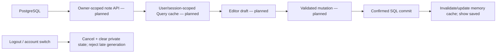

# State Ownership

**Current:** React state for public showcase samples and theme; backend auth cookies;
implemented PostgreSQL schema/boundary without an app caller. **Planned:** Query/Zustand/
nuqs, editor drafts and private cache lifecycle. This guide owns state ownership rules,
not a claim that planned state libraries are installed.

## Existing ownership

| Owner | Current state | Reset / limit |
|---|---|---|
| React components/context | Showcase controlled samples and theme preference | Page reload resets; no sessionStorage/localStorage persistence |
| Protected browser cookie | App access/refresh tuple and expiry hint; pending sign-in state | Server cookie lifecycle; provider verification determines identity |
| Request-local auth SDK Map | PKCE/session protocol state | Auth route finally disposes it; DB helper lacks explicit disposal |
| WeakSet-backed owner object | Evidence of identity verification at issuance | In-process object identity, not expiring/cached session authority |
| PostgreSQL | Profiles/notes model and database truth for SQL callers | Real persistence; no HTTP save path yet |

Account fetch helpers return values/errors; they own no store. Product component props
are presentation inputs, not canonical note records. For detailed auth/context rules see
[auth](../integrations/supabase-auth.md) and [database](../integrations/supabase-database.md).

## Accepted future ownership

| Owner | Planned responsibility | Must not own |
|---|---|---|
| PostgreSQL / server repository | Knowledge, profiles/settings/entitlements | Modal/pane interaction state |
| Private Storage | Attachment/export bytes; DB owns metadata | Account/session authority |
| TanStack Query memory | Fetched API records and confirmed mutation result | Durable/offline knowledge or auth/BYOK credentials |
| Editor/component state | Unsaved draft and save/conflict feedback | “Saved” status before confirmed commit |
| Zustand | Sidebar/pane/modal state | Duplicate note body, URL-selected ID or session tokens |
| nuqs | Selected IDs/views/filters in URL | Private content or permission authority |
| Redis | Expiring rate counters/queue coordination | Canonical notes or default general session authority |

## Planned save and account-switch flow

Keep unsaved drafts separate from refetches. Cancellation alone is insufficient if late
callbacks can still update state; session-generation checks must accompany cleanup.
Network failures should preserve same-tab drafts; reload/close can lose them. No durable
offline queue or browser knowledge cache is authorized. Theme's future durable preference
belongs in authenticated server data, not automatic local persistence.

These lifecycle tests remain planned: private account separation, stale result suppression,
failed-save draft retention, refetch not clobbering a draft and persistent-store/cache scans.
Their existing public/auth fixture counterparts do not complete the private-workspace gates.
See [SEC-04/08](security-architecture.md#sec-acceptance-matrix-evidence-versus-remaining-work)
and the [active plan](../../.agent/active/phase-01-foundation.md).
