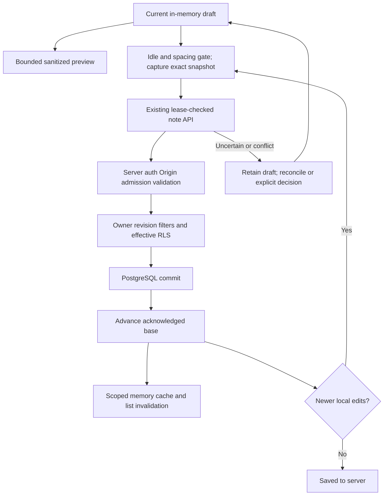

# Markdown editor and revision-safe autosave

**Status:** ✅ Phase 2 implemented and locally accepted on 2026-10-05. The [active ExecPlan](../../.agent/active/phase-02-editor.md) owns fresh checks
and acceptance evidence; [design](../design/phase-02-editor.md) owns intended interaction
behavior. Implementation is not hosted-provider or production-deployment acceptance.

## 1. What problem does this solve?

Writing a note should preserve current typing while an earlier snapshot saves. The editor
also needs a useful Markdown preview without letting note content execute scripts, fetch
tracking images or configure a renderer. PostgreSQL owns saved notes; preview and unsaved
drafts are disposable browser memory.

## 2. User experience

Select or create a note, edit its title and labelled Markdown source, then choose Edit,
Preview or Split. Formatting controls wrap the selection with heading, emphasis, list,
checklist, quote, link or fenced-code syntax. CodeMirror provides wrapping, highlighting,
undo/redo and primary-modifier+S. The source view stays mounted across presentation modes.

Valid changed drafts autosave after 1,500 ms of idle, with at least 5,000 ms between
automatic write starts. “Save note” deliberately flushes a pending draft; it uses the same
controller as the shortcut. Typing remains available during a write. “Saved to server”
requires the current normalized draft to match a confirmed base, rather than merely having
received a response for older text.

Preview follows the current draft after a separate 250 ms debounce. Markdown tables and
checklists are supported; checkboxes are read-only. Math loads KaTeX locally. Images show
alt/source placeholders and an explicit “Open image source” link for permitted absolute
HTTPS URLs. Mermaid source stays visible until “Render diagram” is selected. These local
preview operations never change persistence status.

## 3. Architecture

[NoteEditor](../../src/features/notes/components/NoteEditor.tsx) composes the autosave hook,
CodeMirror, toolbar, client-only preview and recovery controls. The hook calls existing
`NotesApi` operations; no new endpoint, table, Redis job or optimistic canonical note store
is introduced. [NotesWorkspace](../../src/features/notes/components/NotesWorkspace.tsx)
coordinates URL selection, stable new-note binding, scoped cache updates and draft guards.

CodeMirror owns source document/selection/history. The hook owns acknowledged base, draft,
local edit sequence and immutable operation snapshot. Preview owns a sanitized derived AST
and a disposable render generation. Session/owner leases come from WorkspaceShell; backend
cookie verification, Origin, admission, Zod, owner filters and effective SQL RLS remain the
actual persistence trust boundary. [State ownership](../architecture/state-management.md)
and [security](../architecture/security-architecture.md) own those detailed boundaries.

## 4. Data flow

1. An owner/generation lease fetches an acknowledged note through existing scoped queries.
2. Typing changes the live draft and local sequence immediately; source is not persisted locally.
3. The scheduler validates and captures an exact title/content plus key or expected revision.
4. The existing API rechecks the session and commits an authorized revision-scoped transaction.
5. Acknowledgement advances the base; only an unchanged local sequence adopts returned text.
6. Newer typing remains dirty and a coalesced follow-up uses the newly confirmed revision.
7. Failures/conflicts retain the draft and expose deliberate recovery instead of blind replay.

Auth refresh, admission, SQL commit and response delivery do not form one distributed
transaction. Losing a response can follow a successful commit.

## 5. Important files

[FILE_MAP](../FILE_MAP.md#editor-source-autosave-and-safe-preview--phase-2) provides the
implemented navigation map. Read `save-machine.ts` for snapshot acknowledgement;
`use-note-autosave.ts` for scheduling/recovery; `CodeMirrorEditor.tsx` for transactions;
`markdown.ts` and `MarkdownPreview.tsx` for parse/sanitize/controlled React output;
`MathBlock.tsx`, `MermaidBlock.tsx` and `svg.ts` for the rich-content boundaries. Workspace
CSP is built in `content-security-policy.ts`, applied by `src/proxy.ts` and passed from the
dynamic workspace page to the editor.

## 6. Technology used

Direct CodeMirror 6 supplies source editing without another React wrapper. Existing React
owns the controller lifecycle; TanStack Query remains fetched server data in memory.
Unified with remark parse/GFM/math and remark-rehype builds an AST. An explicit
rehype-sanitize schema removes HTML capabilities before hast-util-to-jsx-runtime maps it
to controlled components. There is no rehype-raw, MDX or code-fence execution.

Lazy local KaTeX renders trusted generated math with `trust:false`, `maxExpand:100` and
`maxSize:10`. Lazy local Mermaid uses a fixed strict config, disabled HTML labels and no
binding callbacks. DOMPurify plus explicit SVG stripping precedes a scriptless sandbox
frame. CSS/fonts are bundled locally. Exact versions/licenses/runtime declarations belong
in the [dependency record](../design/dependencies.md#phase-2-editor-dependencies--2026-10-05).

## 7. Step-by-step implementation

The pure acknowledgement rule compares the operation's captured sequence with the live
sequence. When an operation saved `B` while typing advanced to `C`, it advances the server
base to `B` and retains `C`; the next update uses the new revision.

The hook serializes writes and reconciliation, debounces edits, pauses invalid input and
tracks Retry-After using a monotonic deadline. Manual save may bypass automatic spacing,
but cannot overlap an active operation or bypass an admission cooldown. IME composition
pauses scheduling until the coherent composition result is available.

The controlled renderer rechecks links; it permits HTTPS without credentials, relative
links and fragments, while rejecting schemes, protocol-relative links, controls and
obfuscation. Images never become `img` elements. Raw HTML is omitted; source is retained
unchanged in PostgreSQL. Generic code remains escaped text.

Preview pre-admits 256 KiB UTF-8, 2,000 markup delimiters and 5,000 lines, then applies a 20,000 AST-node limit; each math expression is at most 4 KiB.
Mermaid admission caps source at 10 KiB and approximate edges at 200, with Mermaid's own
`maxEdges` also fixed at 200. At most three render attempts are admitted per preview
generation. Init/frontmatter/config, HTML, resource/icon/image/click and custom style inputs
are rejected. A nonce-bearing disposable measurement subtree accommodates Mermaid 12.1's
DOM sizing; instance-scoped serialization omits measurement styles before Mermaid’s internal sanitizer reparses SVG. Live nonce-bearing styles remain available for sizing; generated SVG styles/events/resources/active references are stripped afterward.
Canonical local fragment references to existing marker definitions preserve arrow direction; all external references remain stripped. Only sanitized SVG plus fixed presentation attributes enters the sandbox frame.

## 8. Edge cases

- Invalid title/content blocks writes and preserves source. Preview limits do not reduce
  the existing 1 MiB note storage limit.
- A dirty newer refetch becomes a conflict; a clean strictly newer revision may be adopted.
  “Use server version” confirms discard; “Keep draft with latest revision” remains paused
  until an explicit save. A further race can still return another conflict.
- An uncertain PATCH reconciles by reading. Matching normalized snapshot plus newer revision
  acknowledges the observed persisted state; another value requires review. A failed read
  leaves retry as a read, rather than retransmitting the uncertain update.
- An uncertain POST freezes its original UUID key and input separately from editable current
  typing. Explicit retry replays that pair. A differing replay binds identity but shows conflict.
- 429 retains drafts, displays the server message and disables save/retry until cooldown
  expires. Network recovery grants no automatic replay of paused mutations.
- Delete cancels scheduling, awaits an active operation and confirms against the latest
  acknowledged revision. Uncertain deletion reads before another mutation.
- Navigation guards track changed drafts and unresolved operations. Confirmed identity
  changes/logout unmount private source/preview, invalidate async generations and clear cache.
  Removing a view does not undo an already sent SQL write.
- Math/diagram parse/import failure uses fixed safe block errors with source fallback.
  Preview replacement/unmount removes old rich output and pending measurement DOM.
  Dense-markup admission was added after the adversarial AST fixture exceeded a unit timeout during concurrent service startup. Bounds are not a hard CPU timeout; Mermaid/parser work is not preempted by a worker.

## 9. Trade-offs

No durable offline queue, browser knowledge storage, automatic merge, attachments/export,
wiki-link resolution, graph/AI/plugin execution, custom Mermaid CSS or arbitrary embedded
HTML is added. Explicit images/diagrams reduce tracking and execution capabilities at the
cost of a less automatic preview. Fixed sanitized SVG presentation is simpler than full
Mermaid theme fidelity. The version-coupled measurement adapter requires browser checks
when Mermaid changes.

Nonce CSP makes the workspace dynamic; public pages retain their separate rendering mode.
A style-attribute allowance supports CodeMirror/KaTeX/shared UI positioning, while note
styles are forbidden and script policy has no production unsafe-inline/eval exception.
Unsaved text and create recovery keys disappear on reload/close. Neither local tests nor
these controls establish production security or provider uptime.

## 10. Interview explanation

“The server confirms one immutable save snapshot. My controller advances the acknowledged
revision while keeping any typing that occurred afterward, so an older response cannot
make newer text look saved. Conflict and uncertain writes pause until reconciliation or
an explicit decision. Preview is a separate derived state: I parse and sanitize Markdown,
control navigation/images, bound math and isolate explicitly rendered diagrams.”

Useful follow-up questions: Why do local sequence and server revision solve different
problems? Why does aborting fetch not roll back a commit? Why is create idempotency different
from update reconciliation? Why are sanitization and CSP complementary? Why does preview
have smaller bounds than storage?

## Phase 3 integration — 2026-10-07

Phase 3 composes shared wiki grammar, safe internal preview actions and CodeMirror completion into this editor without changing autosave/recovery authority. Wiki navigation uses the existing dirty guard. Source labels stay plain text and the sanitizer allowlist remains unchanged. [Knowledge behavior](knowledge.md) owns resolution, tags/backlinks and explicit missing-target creation.
