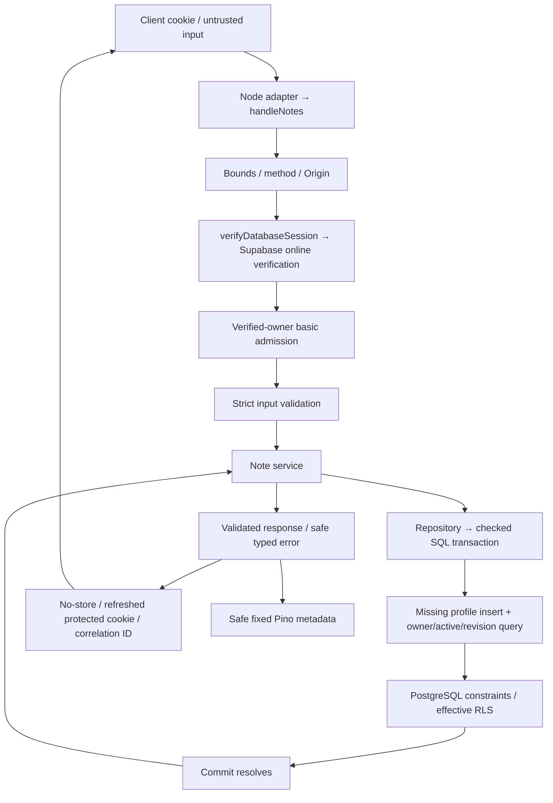

# Authenticated Note API — Milestone 1E

**Status:** ✅ Implemented; verified against disposable local PostgreSQL/Redis and the
production Next server with a controlled Supabase provider. Hosted 1E migration and live
provider note acceptance have not been executed. The [protected workspace](notes-workspace.md) now consumes these APIs with memory-only cache/drafts.
[Model](note-model.md) owns fields/bounds; [database](../integrations/supabase-database.md)
owns SQL roles; [ADR-024](../decisions/ADR-024-note-write-concurrency-and-reconciliation.md)
owns concurrency/reconciliation decisions; [phase record](../phases/phase-01-foundation.md)
owns dated verification.

## 1. What problem does this solve?

A signed-in client needs durable private notes and explicit outcomes when two requests
edit the same record or a successful create response is lost. PostgreSQL is authoritative;
a request only reports success after the transaction resolves its commit.

## 2. User experience

This milestone exposes APIs, not a new screen. A future client signs in, fetches summaries,
reads a full note, and submits its expected revision when changing title/content or deleting.
A stale revision returns 409 so the client can refetch/compare. An uncertain create retries
with the same UUID operation key and original normalized input, returning the existing note.
No UI draft retention, conflict dialog or offline save behavior is implemented here.

| Endpoint               | Request                                                                   | Successful response                                                       |
| ---------------------- | ------------------------------------------------------------------------- | ------------------------------------------------------------------------- |
| GET /api/notes         | Optional limit1–100 (default20), cursor URL-encoded JSON `{updatedAt,id}` | 200 `{items: NoteSummary[], nextCursor: cursor or null}`; content omitted |
| POST /api/notes        | JSON `{title,content}`; required UUID Idempotency-Key                     | 201 Note after new commit; 200 current active Note on matching replay     |
| GET /api/notes/{id}    | UUID id, empty body/no query                                              | 200 full Note                                                             |
| PATCH /api/notes/{id}  | JSON `{expectedRevision,title?,content?}`; at least one changed field     | 200 full Note with revision+1; title-only implements rename               |
| DELETE /api/notes/{id} | JSON `{expectedRevision}`                                                 | 200 soft-deleted Note with revision+1/deletedAt; later reads return404    |

Mutations require exact APP_ORIGIN and application/json. GET allows absent Origin but
rejects a supplied foreign Origin. Unknown/duplicate query keys and unknown JSON fields
are rejected. IDs/owner/timestamps/plan cannot be set by mutation bodies. No token examples.

## 3. Architecture

Next adapters select Node/force-dynamic execution. `handleNotes` owns HTTP/auth/admission;
the service owns public projections and business-error translation; the repository owns
queries and atomic writes. Existing `database.run` checks actual roles, installs LOCAL
verified claims and commits or safely rejects. Redis supplies temporary counters only.

## 4. Data flow

The diagram's PostgreSQL commit is not atomic with Auth refresh, Redis counting or response
delivery. SQL errors roll back the active transaction; communication loss after commit
can still leave an uncertain outcome.

## 5. Important files

[FILE_MAP](../FILE_MAP.md#authenticated-note-api) identifies each implemented file, caller,
dependency and runtime step. Read [handler](../../src/server/notes/routes.ts),
[service](../../src/server/notes/service.ts), then [repository](../../src/server/notes/repository.ts).
The two Next adapters contain only Node routing glue. The additive migration reserves
create keys across soft deletion and excludes legacy rows with null metadata from uniqueness.

## 6. Technology used

Existing Zod validates runtime shapes; Drizzle emits parameterized PostgreSQL queries;
postgres-js runs checked transactions. Node SHA-256 records the original normalized title/
content tuple for replay comparison. Existing Supabase Auth verifies identity; Redis and
Pino reuse 1D controls. No new package, queue, worker or client state library was introduced.

## 7. Step-by-step implementation

1. Bound request headers/URL, load config and reject unsupported methods/foreign Origin.
2. Online-verify/refresh the protected session; dispose the provider on success/failure.
3. Admit its issued owner; then validate id/query/body/key before constructing a SQL pool.
4. Insert missing profile with ON CONFLICT DO NOTHING inside the note transaction. Existing
   profile presentation data is preserved; invalid provider names become null.
5. Query owner+active rows. Update/delete compare `revision = expectedRevision` in the same
   UPDATE that increments revision, rather than reading then unconditionally writing.
6. Return business outcomes as values from `run`; throw typed HTTP failures afterward.
7. Explicitly serialize UTC millisecond dates and omit create metadata; send safe no-store
   response/cookie and fixed log metadata. Do not send a saved response before commit.

Creation's unique `(user_id, create_operation_id)` index plus ON CONFLICT prevents duplicate
rows across races. A replay reads the original metadata: different normalized input409;
deleted record404; matching active record200, possibly reflecting subsequent edits. The
original hash stays unchanged when the note changes. It is internal data, not anonymization.

## 8. Edge cases, security and failures

- Missing/revoked credentials401; provider/config failure503. Refresh cookies survive later
  validation/conflict/SQL errors. No provider errors, cookies or payloads enter public errors.
- Missing/foreign/deleted IDs404 without foreign existence disclosure. Stale owned active
  revision409 `revision_conflict`; reused key with changed input409 `idempotency_conflict`.
- Limits/media/malformed requests413/415/400, method405+Allow, throttling429+Retry-After.
  Unexpected errors500; SQL availability errors503 `service_unavailable`.
- Redis outage uses bounded per-process basic fallback and X-RateLimit-Degraded: true.
  Online verification, ownership, SQL roles and RLS still apply. This is not a global limit
  across instances; public auth remains fail-closed.
- Soft delete sets deletedAt/updatedAt and increments revision; the key remains reserved.
  Repeating DELETE returns404. Update/delete racing on one revision cannot both succeed.
- Cursors use updatedAt/id descending with a one-row lookahead. Editing between pages may
  move records; this is not a snapshot. List summaries avoid loading Markdown bodies.
- SQL INT revision is bounded; mutation input leaves room for increment. Millisecond SQL
  update times never precede creation or prior update even with clock movement.
- After an uncertain create, retry the same key/original input. After an uncertain update/
  delete, refetch before deciding whether to retry. No automatic client retry/reconciliation
  UI exists yet. No Markdown rendering/sanitization is performed by these storage APIs.

## 9. Trade-offs and deferred work

Lazy profile initialization keeps auth independent of SQL but means even first list/detail
access may write a profile. Keys occupy note metadata until privileged record cleanup;
there is no independent expiring receipt table. Response validation happens after commit,
so an invalid internal projection can produce an error after persistence. Basic auth
verification happens before owner admission; deployment-level pre-auth abuse controls are
still necessary. Hosted migration/ingress/provider quotas/backup/restore remain unverified.
1F protected shell/state, 1G editor/save UX, 1H full tooling are intentionally unstarted.

## 10. Interview explanation

“We verify identity on every note request, apply bounded input and owner admission, and
run parameterized queries under a constrained RLS role. Revision predicates prevent lost
updates. Owner-scoped creation keys reconcile lost responses without duplication. The
response is normalized after commit; no queue or browser database owns the record.”

Be ready to explain why authentication differs from RLS, why read-then-write is unsafe,
why failure does not always mean rollback, and why keyed retries need the original input.

## Phase 3 integration — 2026-10-07

Phase 3 keeps these canonical Note/create/update/delete response contracts unchanged. The repository now writes current title/index revision and derived link/tag associations inside the same checked canonical transaction. Partial updates derive from merged content; uncertain creates replay the original key/input and preserve current derivations. [Knowledge API](knowledge.md) owns the four new private read routes.
