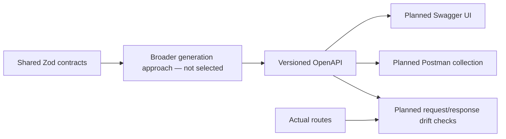

# API Contracts and Tooling

**Current:** Four auth and two note Route Handler modules, safe projections, shared
Zod contracts and auth/note `openapi.json` records. **Planned:** broader schema/
route generation and drift enforcement, Swagger UI and generated Postman collections.

## Existing contract boundary

The auth provider validates a shared projection before routes return it. Browser account
helpers validate successful JSON again; TypeScript alone does not validate a fetch response.
Auth and note HTTP policies own methods/origins/cookies/errors. Note handlers parse
strict inputs and services validate normalized output. [Model](../features/note-model.md) owns their exact rules.

[openapi.json](../api/openapi.json) describes auth and note routes without real credentials. Its
projection schema was derived from Zod during implementation; there is no current npm
script automatically regenerating the whole contract or failing on route drift. A machine-
readable file is not the same as Swagger/Postman integration or an executed acceptance test.
Its description now links the recorded live acceptance; that status is historical evidence,
not a freshly executed provider check.
[Auth guide](supabase-auth.md#http-contract-and-guard-order) owns exact guard/error behavior.

## Planned contract flow — 1H

The selected generation library/version, interactive route/exposure policy and automated
collection runner are unresolved implementation choices. Proposed errors/admission helpers
and file/job APIs belong in their milestone plans, not as current source references.

## Constraints, failure and trade-offs

Contracts must describe supported methods, cookie/Origin controls, error envelope and
actual response/status schemas. Note APIs use validated cursors, expected revisions and a required create key; they
reject submitted owner/plan inputs. Swagger Try It must respect cookie/CSRF
policy; exported Postman examples use placeholders/disposable fixtures, never copied tokens,
private note data or signed URLs. Production exposure/CSP/provider pricing needs review.

Sharing schemas reduces drift but generated output still needs route verification and
review. Input validity does not authorize access or sanitize content. A contract cannot
establish provider reachability, RLS effectiveness or production security. No runtime
failure of Swagger/collection generation can be described yet because those systems do
not exist. Historical API/projection evidence is in the [phase record](../phases/phase-01-foundation.md).

## Minimal note contract records — 1E

GET/POST `/api/notes` and GET/PATCH/DELETE `/api/notes/{id}` are recorded with public
response shapes, UUID create keys, JSON cursor query, expectedRevision, Origin, cookie
authentication, no-store, correlation IDs, degraded admission and safe errors. These are
reviewed records, not an automated generator or route-drift gate. Schema descriptions
include Unicode/UTF-8/NUL rules that JSON Schema cannot fully express here.
[Exact behavior](../features/notes-api.md) remains the subsystem guide. 1H is unstarted.
