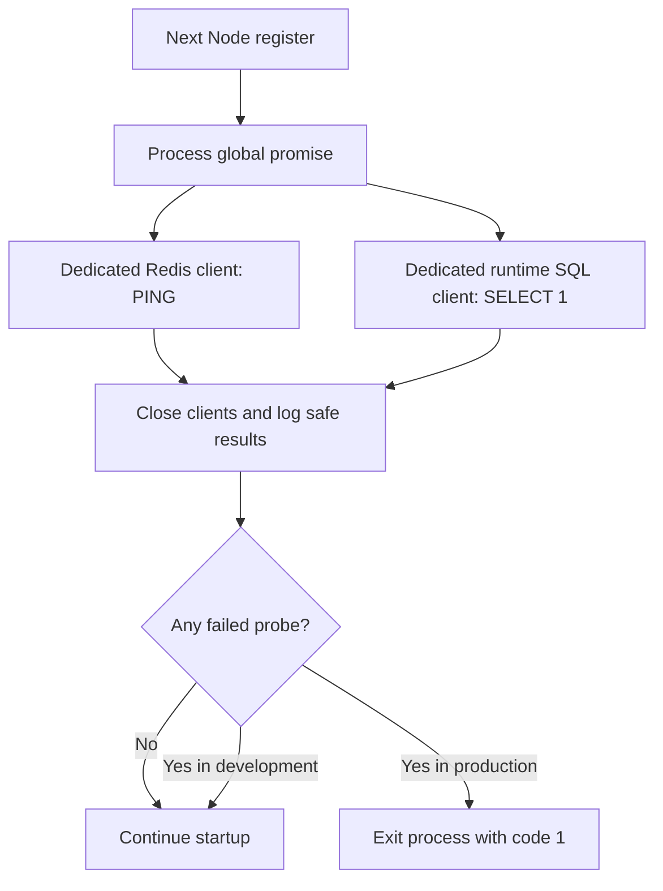

# Redis, Jobs, Ingress and Logging

**Status:** ✅ Milestone 1D HTTP/auth admission and Pino implemented on 2026-10-04; local Redis-compatible integration verified. 📋 BullMQ, worker, Nginx and hosted Redis deployment. Supabase Auth/database are separate implemented integrations. [Evidence](../phases/phase-01-foundation.md) · [Admission decision](../decisions/ADR-022-http-admission-and-safe-logging.md).

## Roles

| Tool | MindMora responsibility | Scope |
|---|---|---|
| Redis-compatible service | Expiring API rate counters and BullMQ queue coordination | Phase 1 limits; Phase 4 queue |
| BullMQ OSS | Enqueue, retry and coordinate exports/indexing/attachment/optional AI tasks | Phase 4 onward |
| Node worker | Executes queued work, loads authorized source data and writes scoped results | Separate hosted process, Phase 4 |
| Nginx OSS | HTTPS/reverse proxy when self-hosted; optional edge limits/load balancing | Deployment-dependent; managed ingress can replace |
| Pino | Structured JSON backend/worker logs | Phase 1 onward, safe metadata only |

```text
Browser → HTTPS ingress → Next.js API → session/validation/ownership/admission
                                      ├→ Drizzle → PostgreSQL (ordinary saves)
                                      └→ job/outbox → BullMQ → Redis → Node worker
                                                                         ↓
                                                         private result + DB status
Pino records safe metadata from API and worker; no payloads or credentials.
```

## Server startup health — implemented follow-up to 1D

Next's `src/instrumentation.ts` loads the server-only startup module inside an explicit
`NEXT_RUNTIME === "nodejs"` branch so Next excludes Node clients from its Edge bundle.
A global promise runs the probes once per Node process, including concurrent registrations
or HMR module reloads. A new process runs fresh checks; requests never trigger repeat probes.
Edge and production-build contexts skip these checks. The build remains independent of
live services. This is startup connectivity, not a health endpoint or periodic monitor.



Dedicated short-lived clients run in parallel: Redis PING must return PONG; PostgreSQL uses
runtime DATABASE_URL and SELECT 1. Both retain the existing remote TLS/certificate settings.
Each has a 3-second connection timeout and 5-second overall deadline; probe sockets close
on success/failure. Redis has no reconnect/offline queue. PostgreSQL probes never use migration
credentials or enter note/RLS transactions. No payloads or knowledge rows are read/written.

Success ticks use Node `styleText("green", "✓")` and failure ticks use
`styleText("red", "✗")`: only the glyph is colored, with the foreground reset before
the service name. Node detects terminal color support and honors
color environment settings. Ordinary redirected logs remain plain; `NO_COLOR=1` disables
color when no FORCE_COLOR override is set, and `FORCE_COLOR=1` explicitly enables it.
No additional styling library is used.

Terminal output uses only fixed service names and allowlisted messages:
`✓ Redis connected`, `✓ PostgreSQL connected`, or
`✗ <service> connection failed: Configuration is missing or invalid.`,
`Connection check timed out.`, or `Connection could not be established.`
No provider exception, URL/hostname, token/password, raw cause or error stack is printed by
this check. These short controlled startup lines are separate from Pino request metadata.

Production requires both services and exits with code 1 after a failed check. Development
prints failures but keeps the public UI available; existing request authentication/admission
still fail closed independently. Recovery requires restarting the server process. No bypass
flag was added. Next 16.3.8 prints its Ready banner before config/instrumentation and can
retain a listening process after an instrumentation rejection; explicit termination ensures
production stops. The banner alone is not proof that dependency checks passed.

PING/SELECT 1 do not prove Redis EVAL ACLs, SQL schema/RLS, session validity, available quotas
or ongoing health. Actual 1D/1C acceptance tests remain separate. Startup consumes one PING
and one SELECT 1 per process plus protocol handshakes, not per request. Cold provider startup
exceeding the deadline fails the check; this does not identify the provider's root cause.

`npm run test:startup` exercises real local probes, stalled handshakes and actual Next
healthy restarts/production exits/development continuation. Browser test runners now use
disposable Redis and PostgreSQL because production previews enforce this boundary too.
[Startup plan/evidence](../../.agent/active/startup-health.md) ·
[Readiness decision](../decisions/ADR-023-startup-dependency-health.md).

## Implemented HTTP boundary

Auth adapters call `handleAuth`: generate a UUID correlation ID → bound headers/URL →
validate config/method/Origin/query or OAuth state → reject unexpected body → admission →
Supabase protocol/session work → protected response → allowlisted Pino metadata.
Callback retains browser-bound state/PKCE instead of an Origin check for external navigation.
All application auth responses include private no-store, no-cache/Expires, no-referrer,
nosniff and X-Request-ID. Typed errors include fixed code/message/correlationId; unknown
exceptions become safe 500 errors. Raw causes/Zod issues are not serialized.

Header names/values total at most 32,768 UTF-8 bytes; URL at most 8,192 bytes. Auth body
is bounded to 1,024 bytes but must be empty (400 otherwise; 413 above cap). Body streams
have a 2-second read deadline. The reusable JSON reader checks application/json, strict
UTF-8 and a supplied Zod schema. Its default cap is 6 MiB + 8 KiB, accommodating worst-case
JSON escaping of the 1 MiB note content contract. 1E applies it to actual note routes before parsing;
content-specific Zod bounds still apply after JSON decoding. Ingress/header/socket limits remain deployment responsibilities.

## Implemented Redis admission

| Scope | Redis budget / 60-second window | Outage behavior |
|---|---|---|
| Auth start | 10 | 503 admission_unavailable; retry in 5 seconds |
| Auth callback | 20 | Same fail-closed behavior; pending cookie removed |
| Auth session | 120 | Same fail-closed behavior |
| Auth logout | 30 | Same fail-closed behavior; cookies retained, logout unsuccessful |
| Basic API helper, per verified owner | 60 | 10 per 60 seconds per process; degraded result |
| Expensive helper, per verified owner | 5 | Fail closed; no job endpoint yet |

These conservative development defaults serve the 3–4 user target: login bursts stay small,
while session checks can occur more often. They are not measured production capacity or
DDoS protection. A first-hit window permits bursts at adjacent window boundaries. Auth
checks guard provider work even for absent/invalid sessions. Basic/expensive helpers demand
an actual online-verified owner issued by `verifyDatabaseSession`; plain user-ID objects
fail before admission. The owner object must be reissued for each future request, not cached.

`TRUSTED_CLIENT_IP_HEADER=none` ignores all forwarded headers and shares one budget per
auth action. This intentionally limits the whole development app until trusted ingress is
selected. Opting into `x-real-ip` requires ingress to overwrite that header and prevent direct
client access to Node. Single valid IPs are canonicalized; absent/malformed/chained values
share the default budget. Configuration alone cannot prove ingress is trustworthy.
No arbitrary X-Forwarded-For extraction or cookie/user-ID budget authority is used.

`REDIS_URL` is server-only and lazily validated: remote `rediss://` uses normal certificate
verification; plaintext `redis://` is allowed only on loopback. Paths select database zero;
query/hash values are rejected. The client uses no offline queue/automatic reconnect,
a 1-second connect timeout and 1.5-second total connect/command deadline. Failures destroy
the connection and open a 5-second circuit; a later request may reconnect. Errors stay safe.

One EVAL executes INCR/PTTL and sets or repairs PEXPIRE atomically. Keys contain namespace,
fixed scope and SHA-256 identity digest; values contain only counts and TTLs. Digests are
pseudonymous, not guaranteed anonymous. Each action/owner has an independent budget.
429 responses carry remaining-window Retry-After rounded up to at least one second.
The fallback map expires windows, caps 1,000 identities and rejects new identities at capacity.
It returns `{degraded: true}`; 1E note responses advertise X-RateLimit-Degraded: true; authentication and ownership still apply.
Multiple processes/restarts have separate fallback budgets, so this is not a global limit.
No fallback auth, note cache, token/session cache, BullMQ or worker was added.

`npm run test:rate-limit` starts a digest-pinned disposable BSD Valkey 8.1.10 server on a
random loopback port, verifies real TCP/Lua/count/expiry/timeout recovery and removes the
container. It uses no persistent volume or hosted account. `npm run test:auth` now uses
that same test-server runner beside its controlled Supabase provider. CI runs both.
Valkey is a Redis-compatible test dependency, not a selected production service.

Upstash remains a candidate. Before deployment verify ACL/access isolation, TLS/certificate
behavior, quota and command accounting. Future BullMQ also needs blocking-command support,
`noeviction`, capacity/namespace isolation and separate persistence/worker decisions.
See [budget](hosting-and-costs.md); local tests establish none of those hosted guarantees.

## Planned worker durability

Jobs contain `jobId`, owner ID, referenced records and revision. Validate job Zod schema and recheck ownership/deletion/revision at execution. Use bounded retries/backoff, idempotency, timeouts, concurrency, graceful shutdown, job/result retention and explicit failed status. PostgreSQL outbox/status reconciles committed work with failed enqueue. Poll status on bounded intervals through authenticated APIs; completed objects use private short-lived download access. Worker cannot perform a credential-bearing AI job by persisting a BYOK secret in Redis. AI worker scope must have an approved credential strategy.

A browser Web Worker serves tab-local computation; it is not this Node queue worker. Serverless handlers returning a response cannot be assumed to keep processing. Worker hosting is a separate capacity/cost decision; idle queue polling consumes Redis commands too.

## Planned ingress

Nginx terminates HTTPS and routes page/API traffic to Next.js. If upstream leaves the trusted host/network, use encrypted upstream transport. Configure bounded request bodies/timeouts, forwarded-header trust and no private caching. Nginx does not store notes or replace app auth/RLS. Managed hosting may already provide all required ingress functions. No custom Nginx file will be added until deployment topology is selected.

## Implemented logging

Pino 10.4.0 emits JSON through a narrow facade accepting only a UUID correlation ID, fixed
auth operation, status, nonnegative duration and known optional error code. Zod drops unknown
fields and rejects invalid metadata; the underlying Pino instance is private. Static Pino
redaction is defense in depth. No arbitrary message, URL/query, request/response/error,
note/title/content, cookie/token/key or signed URL enters this interface. Request markers
are never used as correlation IDs. Logging tests capture real Pino output and scan markers.

The sink is process stdout. Production log access, retention, aggregation and framework/
proxy/provider logging must be configured and checked separately; callback code/state URLs
must be excluded there too. This facade does not scrub logs emitted outside the application.
Logging is operational metadata, distinct from analytics; stdout has no built-in retention cap.

## Acceptance and trade-offs

SEC-05/07 test logging/limits in Phase 1. SEC-09 covers enqueue outages, duplicate retry, stale/deleted records, foreign-owner jobs/results, bounded retention and Redis payload scans in Phase 4. Reference IDs still leak metadata to infrastructure; secure credentials/network and restrict access. Redis/BullMQ improve throughput and reliability, not confidentiality by themselves.

[Redis/BullMQ integration](https://upstash.com/docs/redis/integrations/bullmq) · [BullMQ production](https://docs.bullmq.io/guide/going-to-production) · [Nginx proxy](https://docs.nginx.com/nginx/admin-guide/web-server/reverse-proxy/) · [Pino](https://github.com/pinojs/pino) · [budget](hosting-and-costs.md)

## Note admission and logging caller — 1E

The note handler calls basic admission after online session verification and before SQL.
The existing per-owner counter/fallback rules apply to all note operations. An outage
permits only the bounded local fallback and marks the response as degraded; owner/RLS
checks continue. Pino allowlists fixed notes.list/create/detail/update/delete/unsupported
operations and fixed business error codes; note payloads/internal create hashes never
enter the logging facade. [API guide](../features/notes-api.md) owns the full guard order.
