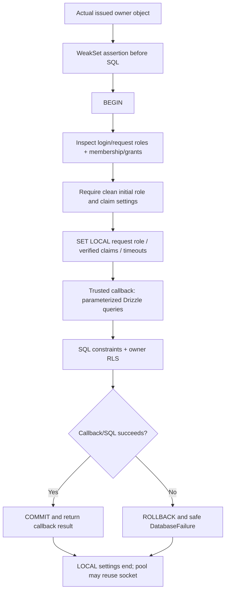
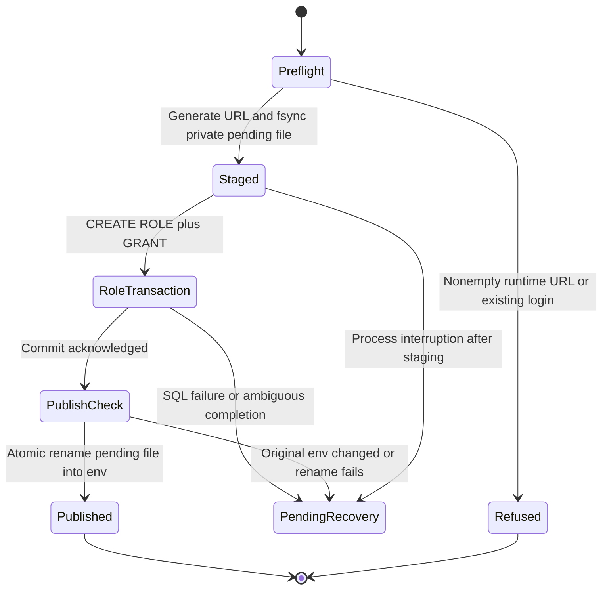

# Supabase PostgreSQL and Drizzle

**Current:** ✅ 1C SQL foundation and 1E note repositories/HTTP routes. **Callers:**
note repository, integration tests and CLI; no workspace page. This guide owns detailed SQL
behavior and recovery. [Model](../features/note-model.md) owns fields;
[ADR-021](../decisions/ADR-021-scoped-database-role.md) owns decisions;
[phase record](../phases/phase-01-foundation.md) owns dated validation.

## Purpose and dependencies

One authoritative server database prepares shared records across devices. Drizzle describes
and queries PostgreSQL through postgres-js, rather than Supabase's Data API. That choice
requires explicit role/identity scope: a default privileged login could bypass owner RLS.
The app does not send a provider JWT to SQL as proof; its trusted server verifies the
session and supplies transaction-local owner claims.

## Verified owner and trusted caller

`verifyDatabaseSession(request, options)` reads auth config, decodes the app session
cookie and calls existing `verifySession` with a fresh provider. That can refresh credentials
before online identity verification. It freezes/registers an actual `{userId}` object in a
module-private WeakSet and returns `{owner, projection, tokens, refreshed}`.

`assertVerifiedOwner` checks object identity, not just a valid UUID. A copied or fabricated
owner fails with AuthFailure before SQL. This is a guard against accidental server callers,
not protection from malicious trusted code or a stolen database credential. The owner has
no expiry and `run` does not recheck provider revocation. Note routes verify each
private request, keep owner contexts request-scoped and write refreshed tokens to the
response even when validation or SQL subsequently fails.

Like auth `handleAuth`, this helper now disposes its provider in a finally block on
success and failure. Unit tests exercise both paths through the real SDK transport.

## Roles, RLS and permissions

| Actor | Effective intended scope |
|---|---|
| Migration/provision login | Privileged CLI; applies schema/roles and seeds/cleans disposable test IDs |
| `mindmora_app` | LOGIN, NOINHERIT/NOBYPASSRLS, no super/create-role/create-db/replication; member of request role, no direct application table/column grants |
| `mindmora_request` | NOLOGIN/NOINHERIT/NOBYPASSRLS; SELECT/INSERT, only named UPDATE columns; neither application-table owner nor hard DELETE role |
| Browser / Data API anon/authenticated | No direct application table grants established by this migration; access is intended through server APIs |

Both tables ENABLE/FORCE RLS. Policies are permissive ALL policies for the request role,
with `auth.uid() = user_id` in both USING and WITH CHECK. USING hides foreign rows from
selection/modification; WITH CHECK rejects inserted/new values that violate ownership.
Grant scope still matters: policy ALL is not an independent DELETE or UPDATE-column grant.

Profile UPDATE allows display_name/updated_at; note UPDATE allows title/content/revision/
updated_at/deleted_at. IDs, owner and created timestamps cannot be updated by the request
role. Auth-user deletion cascades profile/notes under privileged cleanup; ordinary note
operations implement soft deletion. RLS does not hide the owner's deleted notes or
enforce expected revisions. The note repository adds active/owner/revision predicates.

The initial migration requests Auth schema/function grants. Hosted evidence found request
Auth schema USAGE absent and the migration login unable to grant it. Policies already
reference auth.uid; actual two-user policy queries worked. Direct `SELECT auth.uid()` was
not allowed there, so the test identity probe reads LOCAL claim settings. Do not equate
a GRANT statement in a file with an effective provider privilege.

Superuser/BYPASSRLS still bypass FORCE RLS. A runtime credential holder can SET ROLE and
supply an arbitrary owner. RLS protects against incorrect scoped queries within the
trusted server boundary; it is not cryptographic proof of an independently signed SQL identity.

## Transaction flow and isolation

The wrapper checks `session_user` is mindmora_app, disallows elevated role flags, requires
request-role membership, rejects direct table or column privileges, and checks current_user
matches session_user with empty initial claim settings. It separately checks request-role
flags. It does not inspect every other membership, function grant or live policy definition;
the reviewed migration and real catalog/query tests provide additional bounded evidence.

Inside the transaction it sets role, both request.jwt.claim.sub and request.jwt.claims
using verified userId, statement timeout 5s, lock timeout 2s, idle-in-transaction timeout
10s and search_path public/pg_catalog. Settings are LOCAL. Guard queries occur before those
SQL timeouts are installed; no end-to-end deadline surrounds the callback. Parameters
carry claim/body values without string-concatenating user SQL. The callback itself is trusted
server code and can execute raw SQL, so the wrapper is not a sandbox for arbitrary plugins.

Commit/rollback ends LOCAL settings. The callback result is returned only after transaction
completion; Date-to-ISO normalization is not automatic. An unavailable commit response may
be ambiguous. There is no explicit retry, idempotency or reconciliation layer in this module.

## Configuration and pooling

| Setting | Current contract |
|---|---|
| `DATABASE_URL` | Required only when runtime loader is called; postgres/postgresql URL with user/password/database, max 4096 chars; runtime user mindmora_app or pooler-suffixed equivalent |
| `MIGRATION_DATABASE_URL` | Same URL validation for CLI, without runtime username restriction; never read by request pool |
| `DATABASE_POOL_MAX` | Numeric integer 1–10, default 3; migration connection uses max 1 (same env bound is still validated) |
| `DATABASE_CA_CERT_PATH` | Optional local PEM certificate file read when loader is called; marker/length checked, driver verifies actual TLS |

URLs with search/hash or malformed escaped credentials are rejected; percent-encode
password characters rather than adding driver URL query options. Non-loopback hosts use
TLS with rejectUnauthorized=true. If no CA is configured, normal trusted-root verification
still applies; there is no silent insecure fallback. localhost/127.0.0.1/[::1] use the
explicit non-TLS test/dev exception. Fixed config errors omit raw env/Zod details.

postgres-js uses prepare:false, connection timeout 10s, idle socket timeout 20s and silent
notices. `getDatabase` caches a lazy process-local pool; `createDatabase` returns run/close
for an explicitly owned pool. Limits multiply across processes/instances. Hosted Session
pooler was exercised; transaction-pooler compatibility is configured but untested live.
No idle/background queue or query result cache exists here.

## Failure behavior

| Failure | Behavior |
|---|---|
| Config/CA invalid | Fixed config exception before useful connection work |
| Forged owner | AuthFailure unauthenticated before transaction; not DatabaseFailure |
| Request role / runtime role / prior pooled identity invalid | Safe DatabaseFailure reason request-role/runtime-role/pooled-identity; callback not run |
| SQL permission / statement or lock timeout / recognized connection error | Safe reason permission/timeout/connection; raw query/values/cause not retained |
| Constraint, other SQL or callback exception | Generic query reason, fixed `Database operation unavailable.` message |
| Transaction error | Reject; rollback where possible; no automatic mutation retry |

Error classification reads one possible cause layer and selected codes; it is deliberately
not a complete SQLSTATE/domain-error mapping. Business exceptions from callbacks are also
wrapped. Future APIs need explicit outcome contracts rather than assuming these errors
already map to HTTP validation/not-found/conflict. A role/state failure is refused, not
silently repaired by reusing a contaminated connection. The caller can close a factory pool.

## Development setup

The existing development project was already provisioned during 1C; do not rerun setup as
rotation. On a new **disposable** development database:

1. Set MIGRATION_DATABASE_URL in ignored `.env` from the provider Connect dialog. For IPv4
   development the exercised path was Session pooler. Encode password characters.
2. Download the database CA from Supabase SSL settings and set DATABASE_CA_CERT_PATH to
   its filename, e.g. prod-ca-2021.crt. Do not disable peer verification.
3. Review SQL/manual roles/grants/FORCE, then run `npm run db:migrate`.
4. Leave a single empty DATABASE_URL line and run `npm run db:provision` once.
5. The generated URL uses mindmora_app with the pooler project suffix when present; the
   password is written only to ignored local files. Protect/remove CLI admin credentials
   appropriately before deploying; production secret management is not implemented here.

`db:generate` uses drizzle.config.ts without credentials and creates model diffs. `db:migrate`
loads `.env` through Node, applies the Drizzle migration journal and closes its connection.
No auto migration at app startup or hosted reset script exists. Custom role/grant/FORCE
SQL is outside the generator snapshot; “no schema changes” does not prove policy/grant drift
is absent on a remote database. Add new reviewed migrations after application, not edits
to an already-applied file.

## Migration and provisioning flow

The pending path is `.env.database-pending`, opened exclusively with mode0600; existing
pending files are not overwritten. The role helper checks existence again inside the
transaction. PostgreSQL format safely produces a password literal for trusted DDL;
`.unsafe` executes that server-formatted statement, not browser input. CREATE ROLE/GRANT
commit together. Atomic rename publishes private file permissions and avoids truncation.

If pending credentials remain, protect them and verify whether the role transaction
committed and whether credentials/flags are correct before restoring or discarding anything.
The script does not implement automatic recovery or rotate existing roles. The original-env
comparison detects prior edits, not every racing write after comparison. SQL and filesystem
have no joint transaction. Process recovery design is not a power-loss/filesystem-backup
guarantee, and an already-provisioned `.env`'s permissions are not repaired by a refused run.

## Verification scope

`test:db` uses a pinned ephemeral PostgreSQL Docker image, minimal test-only auth schema/
roles/function, random password/loopback port and cleanup in finally. It deliberately fails
membership provisioning before migration to prove role rollback, applies migration twice,
then runs actual Drizzle/postgres-js queries. `test:db:hosted` uses configured real Supabase
Auth tables, auth.uid policies and pooler; it inserts two disposable Auth UUIDs and cleans
them by ID. This is a mutating development test, not a production health probe.

The database suite uses a controlled Auth transport to issue owner contexts, and a
one-connection pool to make backend reuse observable. It validates bounded cases, not
all connection poisoning, all role drift, load or a second production pooler topology.
Cleanup in afterAll/finally is ordinary completion behavior; process termination can
interrupt cleanup. Exact successful historical runs and limits are in the phase record.

## Startup connectivity — authorized 1D follow-up

Node startup now validates runtime DATABASE_URL/TLS config and runs SELECT 1 with a dedicated
short-lived connection. Production exits nonzero on failure; development warns and continues.
The request-scoped pool stays lazy. No note row/schema/RLS test runs at startup, and migration
credentials are not used. [Services](backend-services.md#server-startup-health--implemented-follow-up-to-1d)
owns exact deadlines, safe messages, once-per-process lifecycle and tests; SQL acceptance
remains separate. Builds do not require database connectivity.

## Note caller and migration — 1E

[Repository](../../src/server/notes/repository.ts) invokes run(owner, callback), seeds a
missing profile using ON CONFLICT DO NOTHING, then queries owner/active rows. Business
not-found/revision/idempotency outcomes return as values because exceptions inside run
are sanitized as DatabaseFailure. The service maps those values after commit.

`0001_note_create_idempotency.sql` adds nullable immutable metadata/checks and a partial
unique owner/key index. Existing INSERT/SELECT grants cover the columns; explicit UPDATE
grants do not. Legacy rows remain valid. Run reviewed `npm run db:migrate` before hosted
note access in a fresh environment. The configured development Supabase received this
migration on 2026-10-05 after a save failure exposed the missing columns. Do not rerun
provisioning to apply a schema migration.

`npm run test:notes` uses three pool connections; a barrier/PID assertion proves two
transactions overlap. The existing `test:db` suite keeps pool size one to verify socket
reuse and claim cleanup. Both use the actual driver/roles and emulated local auth.uid;
neither establishes production policy, hosted migration or live Google acceptance.
